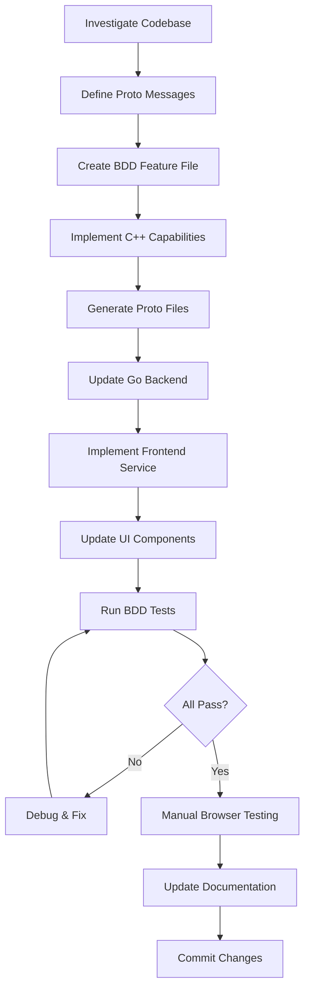

# Adding Dynamic Features End-to-End - Development Guide

## Metadata
- **Type**: Development workflow
- **Version**: 1.0.0
- **Date Created**: 2025-10-17
- **Last Updated**: 2025-10-17
- **Based on**: Dynamic Filter Capabilities implementation
- **Scope**: Full-stack feature addition with proto, C++, Go, and TypeScript

## Overview
This guide documents the systematic approach for adding new features that span from C++ library capabilities through the backend to the frontend UI. Follow this workflow when implementing features that need to be discovered dynamically by the application.

## Prerequisites
- Development environment set up with all dependencies
- Familiarity with protobuf, C++, Go, and TypeScript
- BDD testing framework configured
- Server running or ability to start it

---

## Phase 1: Investigation & Planning (Read-Only)

### 1.1 Understand Current Architecture
**Investigate these areas before making changes:**

```
Key questions to answer:
1. How is the feature currently implemented (if at all)?
2. Where are the proto definitions?
3. How does C++ expose capabilities?
4. How does Go backend consume them?
5. How does frontend display them?
6. Are there existing BDD tests to reference?
```

**Files to examine:**
- `proto/common.proto` - Shared messages and enums
- `proto/config_service.proto` - Configuration service definitions
- `proto/image_processor_service.proto` - Processing service definitions
- `cpp_accelerator/ports/shared_lib/processor_api.h` - C API definition
- `cpp_accelerator/ports/shared_lib/cuda_processor_impl.cpp` - Implementation
- `webserver/pkg/interfaces/connectrpc/*.go` - Backend handlers
- `webserver/web/src/components/*.ts` - Frontend components
- `integration/tests/acceptance/features/*.feature` - Existing BDD tests

**Search queries to run:**
```
codebase_search: "How are capabilities currently returned in GetConfig?"
codebase_search: "How does C++ library expose its capabilities?"
codebase_search: "Where is GetProcessorStatus implemented in backend?"
grep: Look for hardcoded values that should be dynamic
```

### 1.2 Clarify Requirements
**Questions to ask before implementing:**

1. **Data types**: What parameter types need support? (string, number, boolean, enum/select)
2. **Proto handling**: Direct proto import or generic JSON objects in frontend?
3. **Testing scope**: Mock library behavior vs real library?
4. **Versioning**: Breaking change (major bump) or additive (minor bump)?
5. **Backward compatibility**: Must old clients still work?

---

## Phase 2: Proto Definition (API Contract)

### 2.1 Design Proto Messages

**Pattern to follow:**
```protobuf
// Define parameter structure
message FeatureParameter {
  string id = 1;
  string name = 3;
  string type = 5;                  // "select", "number", "boolean", "text"
  repeated string options = 7;       // For select type
  string default_value = 9;
  // Add more fields as needed: min_value, max_value, step, etc.
}

// Define feature definition
message FeatureDefinition {
  string id = 1;
  string name = 3;
  repeated FeatureParameter parameters = 5;
  repeated AcceleratorType supported_accelerators = 7;
  // Add metadata: description, category, requires_gpu, etc.
}

// Update capabilities message
message LibraryCapabilities {
  repeated FeatureDefinition features = N;
  // Keep existing fields
}
```

### 2.2 Update Enums if Needed
```protobuf
enum FeatureType {
  FEATURE_TYPE_UNSPECIFIED = 0;
  FEATURE_TYPE_NEW_FEATURE = N;
}
```

### 2.3 Consider API Versioning
- **Breaking change**: Bump major version (2.0.0 → 3.0.0)
- **Additive change**: Bump minor version (2.0.0 → 2.1.0)
- **Bug fix**: Bump patch version (2.0.0 → 2.0.1)

**Files to update:**
- `proto/common.proto` (or relevant proto file)
- Update API_VERSION in multiple places if breaking

---

## Phase 3: BDD Tests (Define Expected Behavior)

### 3.1 Create Feature File
**Location**: `integration/tests/acceptance/features/your_feature.feature`

**Template:**
```gherkin
Feature: Your Feature Name
  As a client application
  I want to [capability description]
  So that I can [business value]

  Background:
    Given Flipt is running at "http://localhost:8081" with namespace "default"
    And the service is running at "https://localhost:8443"

  Scenario: Query feature capabilities
    When I call GetProcessorStatus
    Then the capabilities should include feature "feature_name"
    And the feature should have parameter "param_name"

  Scenario: Parameter has correct type
    When I call GetProcessorStatus
    Then the parameter "param_name" should be of type "select"
    And the parameter should have at least 2 options

  Scenario: Feature specifies supported accelerators
    When I call GetProcessorStatus
    Then the feature "feature_name" should support accelerator "CUDA"
```

### 3.2 Implement Step Definitions
**Location**: `integration/tests/acceptance/steps/bdd_context.go`

**Add to BDDContext struct:**
```go
featureCapabilities *pb.YourFeatureCapabilities
```

**Add step methods:**
```go
func (c *BDDContext) WhenICallYourEndpoint() error {
    // Implementation
}

func (c *BDDContext) ThenTheFeatureShouldExist(featureName string) error {
    // Validation logic
}
```

**Register in wrapper files:**
- `steps/when_steps.go` - Add when step wrappers
- `steps/then_steps.go` - Add then step wrappers

---

## Phase 4: C++ Library Implementation

### 4.1 Update VERSION File
```bash
# cpp_accelerator/VERSION
2.0.0  # or appropriate version
```

### 4.2 Update processor_api.h
```c
#define PROCESSOR_API_VERSION "2.0.0"
#define PROCESSOR_API_VERNUM 0x020000
```

### 4.3 Implement in cuda_processor_impl.cpp

**Pattern for processor_get_capabilities():**
```cpp
bool processor_get_capabilities(const uint8_t* request, int request_len, 
                                uint8_t** response, int* response_len) {
    cuda_learning::GetCapabilitiesResponse resp;
    resp.set_code(0);
    resp.set_message("OK");

    auto* caps = resp.mutable_capabilities();
    caps->set_api_version("2.0.0");
    caps->set_library_version("2.0.0");

    // Add your feature definition
    auto* feature = caps->add_features();
    feature->set_id("feature_id");
    feature->set_name("Feature Name");
    feature->add_supported_accelerators(cuda_learning::ACCELERATOR_TYPE_CUDA);
    
    // Add parameters
    auto* param = feature->add_parameters();
    param->set_id("param_id");
    param->set_name("Parameter Name");
    param->set_type("select");
    param->add_options("option1");
    param->add_options("option2");
    param->set_default_value("option1");

    *response = allocate_response(resp.SerializeAsString(), response_len);
    return true;
}
```

### 4.4 Update processor_api_version()
```cpp
processor_version_t processor_api_version(void) {
    processor_version_t version;
    version.major = (PROCESSOR_API_VERNUM >> 16) & 0xFF;
    version.minor = (PROCESSOR_API_VERNUM >> 8) & 0xFF;
    version.patch = PROCESSOR_API_VERNUM & 0xFF;
    return version;
}
```

### 4.5 Update Mock Library
Implement minimal version in `mock_processor.cpp` for testing without GPU.

### 4.6 Build and Install
```bash
bazel clean
bazel build //cpp_accelerator/ports/shared_lib:libcuda_processor.so
bazel build //cpp_accelerator/ports/shared_lib:libcuda_processor_mock.so

# Handled by start-dev.sh --build, or manually:
cp bazel-bin/cpp_accelerator/ports/shared_lib/libcuda_processor.so \
   .ignore/lib/cuda_learning/libcuda_processor_v2.0.0.so
```

---

## Phase 5: Proto Generation

### 5.1 Generate Backend (Go) Protos
```bash
docker run --rm \
  -v $(pwd):/workspace \
  -u $(id -u):$(id -g) \
  cuda-learning-bufgen:latest generate
```

### 5.2 Generate Frontend (TypeScript) Protos
```bash
# Included in above command if buf.gen.yaml configured correctly
# Verify files generated in:
# - proto/gen/*.pb.go
# - webserver/web/src/gen/*_pb.ts
```

### 5.3 Verify Generated Code
```bash
# Check for new types
grep -r "YourNewType" proto/gen/
grep -r "YourNewType" webserver/web/src/gen/
```

---

## Phase 6: Backend Implementation (Go)

### 6.1 Update Loader/Registry (if needed)
**File**: `webserver/pkg/infrastructure/processor/loader/loader.go`

Update CurrentAPIVersion if breaking change:
```go
const CurrentAPIVersion = "2.0.0"
```

### 6.2 Update Handlers
**File**: `webserver/pkg/interfaces/connectrpc/config_handler.go`

Verify GetProcessorStatus passes through new capabilities correctly.

### 6.3 Update Adapters (if needed)
**File**: `webserver/pkg/interfaces/adapters/protobuf_adapter.go`

Add conversion functions for new proto types to domain types.

### 6.4 Update Configuration
**File**: `config/config.yaml`

Update default_library version:
```yaml
processor:
  default_library: "2.0.0"
  fallback_chain:
    - "2.0.0"
    - "mock"
```

### 6.5 Update Build Scripts
**File**: `scripts/dev/start.sh`

Update api_version in JSON metadata generation:
```bash
"api_version": "2.0.0"
```

### 6.6 Build Backend
```bash
cd webserver && make build
```

---

## Phase 7: Frontend Implementation

### 7.1 Create/Update Type Definitions
**File**: `webserver/web/src/components/your-component.types.ts`

```typescript
import type { YourDefinition, YourParameter } from '../gen/common_pb';

export interface YourFeature {
    id: string;
    name: string;
    parameters: YourParameter[];
    parameterValues: Record<string, string>;
}

export function createFromDefinition(def: YourDefinition): YourFeature {
    const defaultValues: Record<string, string> = {};
    def.parameters.forEach(param => {
        defaultValues[param.id] = param.defaultValue;
    });
    return {
        id: def.id,
        name: def.name,
        parameters: def.parameters,
        parameterValues: defaultValues
    };
}
```

### 7.2 Create Service to Fetch Capabilities
**File**: `webserver/web/src/services/your-feature-service.ts`

```typescript
import { createPromiseClient } from '@connectrpc/connect';
import { createConnectTransport } from '@connectrpc/connect-web';
import { ConfigService } from '../gen/config_service_connect';

class YourFeatureService {
    private client;
    private features = [];

    async initialize() {
        const response = await this.client.getProcessorStatus({});
        if (response.capabilities?.features) {
            this.features = response.capabilities.features.map(createFromDefinition);
            console.log('Features loaded:', this.features);
        }
    }

    getFeatures() {
        return this.features;
    }
}

export const yourFeatureService = new YourFeatureService();
```

### 7.3 Update Component
**File**: `webserver/web/src/components/your-component.ts`

```typescript
@customElement('your-component')
export class YourComponent extends LitElement {
    @property({ type: Array }) features: YourFeature[] = [];
    
    // Render dynamically based on features
    private renderFeature(feature: YourFeature) {
        return html`
            <div>
                <h3>${feature.name}</h3>
                ${feature.parameters.map(param => this.renderParameter(param))}
            </div>
        `;
    }
    
    private renderParameter(param: YourParameter) {
        if (param.type === 'select') {
            return html`
                <select>
                    ${param.options.map(opt => html`<option value="${opt}">${opt}</option>`)}
                </select>
            `;
        }
        // Handle other types
    }
}
```

### 7.4 Initialize in main.ts
```typescript
import { yourFeatureService } from './services/your-feature-service';

async init() {
    await yourFeatureService.initialize();
    
    if (this.yourComponent && yourFeatureService.isInitialized()) {
        this.yourComponent.features = yourFeatureService.getFeatures();
    }
}
```

### 7.5 Build Frontend
```bash
cd webserver/web && npm run build
```

---

## Phase 8: Integration Testing

### 8.1 Start Development Environment
```bash
./scripts/dev/start.sh --build
```

This will:
- Build C++ libraries with new version
- Install to .ignore/lib/cuda_learning/
- Generate metadata JSON files
- Build Go backend
- Start Vite + Go server

### 8.2 Run BDD Integration Tests
```bash
cd integration/tests/acceptance
go test -v | tee /tmp/bdd-results.log
```

**Expected output:**
- All existing scenarios pass
- New feature scenarios pass
- Check for: "X scenarios (X passed)"

### 8.3 Manual API Testing
```bash
# Test capabilities endpoint
curl -sk -X POST https://localhost:8443/cuda_learning.ConfigService/GetProcessorStatus \
  -H "Content-Type: application/json" -d '{}' | jq .

# Verify your feature appears in response
```

---

## Phase 9: Manual Browser Testing

### 9.1 Access Application
```
https://localhost:8443
```

### 9.2 Test Checklist
- [ ] Open browser console (F12)
- [ ] Verify service initialization logs show your feature loaded
- [ ] Verify UI renders new feature/parameters
- [ ] Interact with UI controls
- [ ] Verify backend receives correct data
- [ ] Test with different parameter values
- [ ] Test edge cases (empty values, invalid input)
- [ ] Verify no console errors

### 9.3 If Using Playwright MCP
Execute manual testing prompts from `.prompts/testing/` directory.

---

## Phase 10: Documentation & Cleanup

### 10.1 Update Documentation Files
```
Files to update:
- README.md - Add new feature to description
- CHANGELOG.md - Add entry under current date
- docs/backlog/*.md - Mark items as completed
```

### 10.2 Update Backlog
Mark completed tasks with [x] in relevant backlog files.

### 10.3 Generate Commit Message

**Template:**
```
feat: implement dynamic [feature name] from library capabilities

Complete [area] integration with API X.Y.Z dynamic [feature] system.
[Component] now discovers [feature] definitions from backend instead of
hardcoded values.

Changes:
- Create [New Message] proto with [feature] metadata
- Add [parameters/fields] for dynamic discovery
- Implement processor_get_capabilities in C++ with [feature] definition
- Create [Service]Service to fetch from GetProcessorStatus
- Update [Component] to render [feature] dynamically
- Add BDD tests for [feature] validation

[Details about behavior]

Integration tests: X scenarios passed (Y new)
Frontend build: successful with no linter errors
```

---

## Common Pitfalls & Solutions

### Problem: API Version Mismatch
**Error**: `API version mismatch: loader=2.0.0, library=1.0.0`

**Solution:**
1. Update `PROCESSOR_API_VERSION` define in processor_api.h
2. Update `PROCESSOR_API_VERNUM` hex value
3. Ensure processor_api_version() uses the define:
   ```cpp
   version.major = (PROCESSOR_API_VERNUM >> 16) & 0xFF;
   ```
4. Rebuild with `bazel clean` then `bazel build`
5. Update CurrentAPIVersion in Go loader
6. Update config.yaml default_library version

### Problem: Proto Not Regenerating
**Solution:**
```bash
# Rebuild Docker image
docker build -f bufgen.dockerfile -t cuda-learning-bufgen:latest .

# Force regeneration
docker run --rm -v $(pwd):/workspace -u $(id -u):$(id -g) \
  cuda-learning-bufgen:latest generate
```

### Problem: Old Library Still Loading
**Solution:**
```bash
# Remove old libraries
rm -f .ignore/lib/cuda_learning/libcuda_processor_v*.so

# Fix permissions if needed
chmod +w .ignore/lib/cuda_learning/*.so

# Rebuild and reinstall
./scripts/dev/start.sh --build
```

### Problem: Frontend Not Showing Changes
**Solution:**
1. Hard refresh browser (Ctrl+Shift+R)
2. Check browser console for errors
3. Verify service initialized: check console logs
4. Verify proto files regenerated with new types
5. Rebuild frontend: `cd webserver/web && npm run build`

---

## Workflow Summary



---

## File Checklist

Use this checklist to ensure all necessary files are updated:

**Proto Layer:**
- [ ] proto/common.proto (or relevant proto)
- [ ] proto/config_service.proto (if adding new endpoint)

**C++ Library:**
- [ ] cpp_accelerator/VERSION
- [ ] cpp_accelerator/ports/shared_lib/processor_api.h
- [ ] cpp_accelerator/ports/shared_lib/cuda_processor_impl.cpp
- [ ] cpp_accelerator/ports/shared_lib/mock_processor.cpp

**Backend (Go):**
- [ ] webserver/pkg/infrastructure/processor/loader/loader.go (API version)
- [ ] webserver/pkg/interfaces/connectrpc/*_handler.go (if new endpoint)
- [ ] config/config.yaml (version updates)
- [ ] scripts/dev/start.sh (metadata generation)

**Frontend (TypeScript):**
- [ ] webserver/web/src/services/your-feature-service.ts (new)
- [ ] webserver/web/src/components/your-component.types.ts
- [ ] webserver/web/src/components/your-component.ts
- [ ] webserver/web/src/main.ts (initialization)

**Tests:**
- [ ] integration/tests/acceptance/features/your_feature.feature (new)
- [ ] integration/tests/acceptance/steps/bdd_context.go
- [ ] integration/tests/acceptance/steps/when_steps.go
- [ ] integration/tests/acceptance/steps/then_steps.go

**Documentation:**
- [ ] README.md
- [ ] CHANGELOG.md
- [ ] docs/backlog/infrastructure.md (or relevant backlog)

---

## Success Criteria

All of the following must be true before committing:

All items below must be confirmed manually:
- Proto files generated successfully (Go + TypeScript)  
- C++ libraries compile without errors  
- Go backend compiles without errors  
- Frontend builds with no linter errors  
- All BDD integration tests pass  
- Manual browser testing shows feature working  
- No console errors in browser  
- Documentation updated  
- Commit message follows conventional commits format

---

## Related Documentation

- Main project: `/README.md`
- Architecture decisions: `/docs/backlog/infrastructure.md`
- Testing guide: `/integration/tests/acceptance/README.md`
- Manual testing: `/.prompts/testing/`
- API documentation: `/proto/*.proto`

---

## Notes

- Always start with investigation (read codebase) before coding
- Write BDD tests before implementation when possible
- Test with real library, not just mock
- Keep backward compatibility unless justified breaking change
- Document reasoning for architectural decisions
- Use consistent naming across all layers
- Validate with actual browser testing, not just compilation

