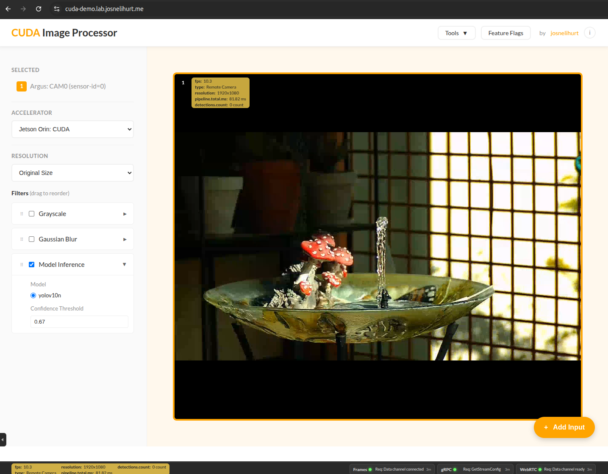

# CUDA Image Processor

Playing around with CUDA and real-time video processing. Mostly just wanted to see how fast I could get grayscale filters running on GPU vs CPU.



## What's this?

Webcam app that processes video through CUDA kernels. You pick filters, it runs them on your GPU (or CPU if you want to compare), shows you the FPS. That's it.

Built with Go web server that loads C++ accelerator libraries via dlopen. Filter definitions are discovered dynamically from the library capabilities. Probably overengineered but whatever, it works.

## Setup

### Development Mode

First, generate SSL certificates for HTTPS (required for webcam access):

```bash
# Install mkcert (first time only)
wget -O /tmp/mkcert https://github.com/FiloSottile/mkcert/releases/download/v1.4.4/mkcert-v1.4.4-linux-amd64
chmod +x /tmp/mkcert
sudo mv /tmp/mkcert /usr/local/bin/
mkcert -install

# Generate certificates
mkdir -p .secrets
cd .secrets
mkcert localhost 127.0.0.1 ::1
cd ..
```

Start the server:

```bash
# Option 1: Using the dev script (recommended)
./scripts/start-dev.sh --build  # First time or after changes
./scripts/start-dev.sh          # Subsequent runs

# Option 2: Manual start
bazel run //webserver/cmd/server:server

# Option 3: With Vite hot reload (manual)
cd webserver/web
npm install
npm run dev &
cd ../..
bazel run //webserver/cmd/server:server
```

Access the application:
- **HTTPS (recommended):** https://localhost:8443
- **HTTP:** http://localhost:8080

### Docker Deployment

Production deployment with GPU acceleration using Docker Compose and Traefik:

```bash
# Validate environment (checks SSL certs, Docker, NVIDIA Container Toolkit, GPU)
./scripts/validate-docker-env.sh

# Build and run
docker compose up --build

# Or run in detached mode
docker compose up -d --build

# View logs
docker compose logs -f app

# Stop containers
docker compose down
```

Access the application:
- **Application**: https://localhost
- **Traefik Dashboard**: http://localhost:8081

Requirements:
- Docker with NVIDIA Container Toolkit installed
- NVIDIA GPU with drivers
- SSL certificates in `.secrets/` directory (see Development Mode setup above)

The Docker setup uses:
- Multi-stage build (frontend → backend → runtime)
- NVIDIA CUDA 12.5 runtime
- Traefik for HTTPS termination
- Full GPU passthrough to container

## Tech

- Go server with native HTTPS support handling WebSocket
- C++/CUDA doing the processing via dynamic library plugins (dlopen)
- Protocol Buffers for C++/Go communication
- Bazel for C++/CUDA builds, Makefile for Go

Frontend: Lit Web Components + TypeScript with Vite bundler. No React, just native web components.

## Grayscale algorithms

Implemented a few different ones:
- **BT.601** (0.299R + 0.587G + 0.114B) - old TV standard
- **BT.709** (0.2126R + 0.7152G + 0.0722B) - HD standard  
- **Average** - simple (R+G+B)/3
- **Lightness** - (max+min)/2
- **Luminosity** - weighted average, similar to BT.601

Can switch between them in the UI. Honestly can't tell much difference except Average looks a bit off.

## Commands

```bash
./scripts/start-dev.sh --build  # start dev environment (first time)
./scripts/start-dev.sh          # start dev environment
./scripts/kill-services.sh      # kill all processes
```

Frontend hot reloads with Vite. For C++/Go you gotta rebuild.

## Code structure

```
cpp_accelerator/
  infrastructure/cuda/  - GPU kernels
  infrastructure/cpu/   - CPU versions
  ports/cgo/           - CGO bridge

webserver/
  cmd/server/          - main.go
  web/                 - static files

scripts/               - bash stuff
```

## How it works

1. Browser grabs webcam frames
2. Sends via WebSocket as base64 PNG
3. Go decodes, passes to C++ accelerator library via protobuf
4. CUDA kernel processes on GPU (or CPU fallback)
5. Result goes back as base64
6. Browser renders it

Filter definitions are loaded dynamically from the C++ library on startup,
enabling the frontend to adapt automatically when new filters are added.

Stats bar shows FPS and processing time per frame. Logs every 30 frames.

## Filters

Currently supports grayscale with 5 algorithms (BT.601, BT.709, Average, Lightness, Luminosity). The UI discovers available filters and their parameters dynamically from the C++ library capabilities. You can drag and drop to reorder filters. Might add blur or edge detection later if I feel like it.

## Known issues

- Camera needs user in `video` group on Linux
- SSL cert warnings if using self-signed certificates (use mkcert to avoid)

## Roadmap

Evolving this into a full CUDA learning platform. See `/docs/backlog/` for detailed plans.

## Notes

Started as a weekend project to learn CUDA. Now it's a full learning platform covering GPU programming, video processing, neural networks, and production infrastructure. Code quality varies. The plugin architecture makes it easy to add new accelerators (OpenCL coming soon).

### Generate docker 
docker run --rm -v $(pwd):/workspace -u $(id -u):$(id -g) cuda-learning-bufgen:latest generate