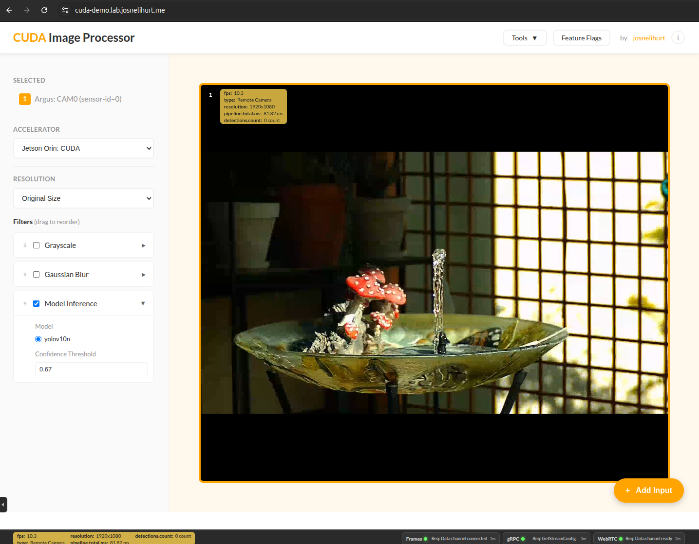
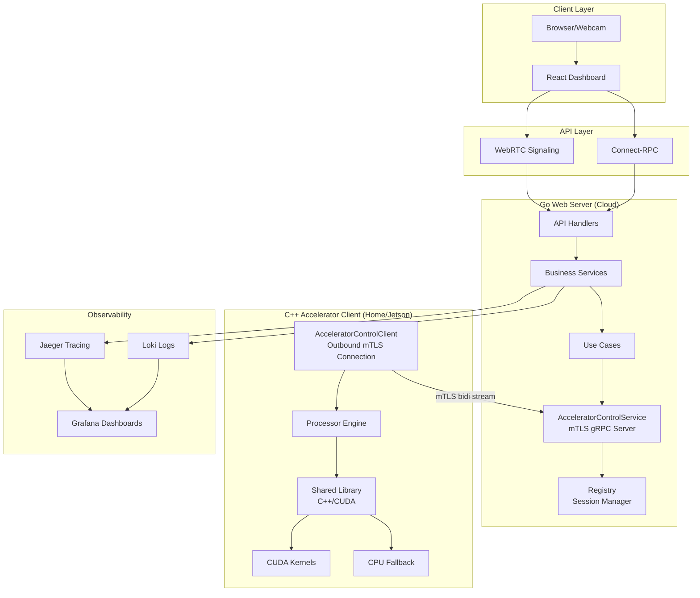
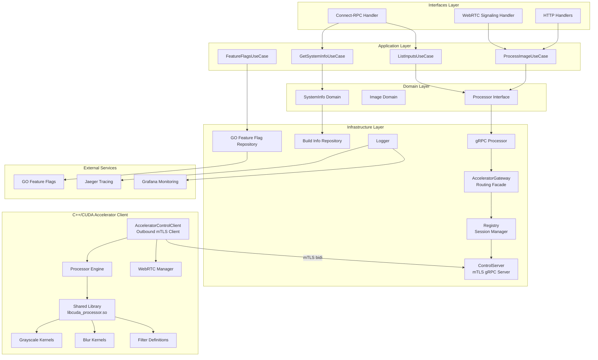

# CUDA Learning Platform

** Live Demo:** https://cuda-demo.lab.josnelihurt.me

Learning CUDA and GPU programming by building something real. Started with a simple question: "How fast can I get image filters running on GPU vs CPU?" and ended up with this project.

This isn't another tutorial project. It's my way of exploring CUDA, OpenCL, and other accelerators while applying the software engineering practices I actually use in production. Clean architecture, proper testing, observability, deployment automation—all while figuring out how to make GPUs do cool stuff.



## Table of Contents

- [What's this?](#whats-this)
- [Architecture](#architecture)
  - [High-Level Overview](#high-level-overview)
  - [Detailed Component Architecture](#detailed-component-architecture)
- [Setup](#setup)
  - [Development](#development)
  - [Staging](#staging)
  - [Production](#production)
- [Git Hooks](#git-hooks)
- [Tech](#tech)
- [Image Processing Filters](#image-processing-filters)
- [Commands](#commands)
- [Development Tools](#development-tools)
- [CI Workflows](#ci-workflows)
- [Testing & Code Quality](#testing-code-quality)
- [Code structure](#code-structure)
- [Filter System](#filter-system)
- [Known issues](#known-issues)
- [Roadmap](#roadmap)
- [Learning Journey](#learning-journey)
- [Future Vision](#future-vision)

## What's this?

Real-time image and video processing through CUDA kernels. Point your webcam at something, pick a filter (grayscale more to come), and watch it process on your GPU (or CPU for comparison). Shows FPS and processing time so you can actually see the performance difference.

The system supports multiple input sources—webcam, static images, video files—and processes them through a growing library of filters. Each filter has both GPU and CPU implementations, so you can compare performance and learn how different algorithms work.

**Why I built it this way**: Reading tutorials and doing lab exercises gets boring fast. I learn better by building something I'd actually want to use. So instead of following "CUDA 101" step-by-step, I built a real system with the same practices I use at work—clean architecture, proper testing, observability, the whole deal.

**How it works**: Go web server acts as a gRPC server that C++ accelerator clients dial into via mTLS for reverse-topology communication. This architecture enables distributed processing without inbound NAT requirements, allowing the Go server to run in the cloud while GPU processing happens on dedicated hardware (like Jetson Nano). The C++ client hosts the shared library containing CUDA kernels, CPU fallback implementations, and filter definitions. A single multiplexed bidirectional stream carries all commands (image processing, filter listing, version info, WebRTC signaling) over the AcceleratorControlService protocol. Everything's wired up with proper dependency injection, so testing is actually doable.

## Architecture

### High-Level Overview


```mermaid
graph TB
    subgraph "Client Layer"
        Browser[Browser/Webcam]
        UI[React Dashboard]
    end
    
    subgraph "API Layer"
        WebRTCSignaling[WebRTC Signaling]
        ConnectRPC[Connect-RPC]
    end
    
    subgraph "Go Web Server (Cloud)"
        API[API Handlers]
        Services[Business Services]
        UseCases[Use Cases]
        ControlServer[AcceleratorControlService<br/>mTLS gRPC Server]
        Registry[Registry<br/>Session Manager]
    end
    
    subgraph "C++ Accelerator Client (Home/Jetson)"
        AccelClient[AcceleratorControlClient<br/>Outbound mTLS Connection]
        SharedLib[Shared Library<br/>C++/CUDA]
        ProcessorEngine[Processor Engine]
        CudaKernels[CUDA Kernels]
        CpuFallback[CPU Fallback]
    end
    
    subgraph "Observability"
        Jaeger[Jaeger Tracing]
        Grafana[Grafana Dashboards]
        Loki[Loki Logs]
    end
    
    Browser --> UI
    UI --> WebRTCSignaling
    UI --> ConnectRPC
    WebRTCSignaling --> API
    ConnectRPC --> API
    API --> Services
    Services --> UseCases
    UseCases --> ControlServer
    ControlServer --> Registry
    
    AccelClient -->|mTLS bidi stream| ControlServer
    AccelClient --> ProcessorEngine
    ProcessorEngine --> SharedLib
    SharedLib --> CudaKernels
    SharedLib --> CpuFallback
    
    Services --> Jaeger
    Services --> Loki
    Jaeger --> Grafana
    Loki --> Grafana
```

### Detailed Component Architecture


```mermaid
graph TB
    subgraph "Interfaces Layer"
        HTTP[HTTP Handlers]
        WebRTC_Handler[WebRTC Signaling Handler]
        ConnectRPC_Handler[Connect-RPC Handler]
    end
    
    subgraph "Application Layer"
        ProcessImage[ProcessImageUseCase]
        ListInputs[ListInputsUseCase]
        GetSystemInfo[GetSystemInfoUseCase]
        FeatureFlags[FeatureFlagsUseCase]
    end
    
    subgraph "Domain Layer"
        Processor[Processor Interface]
        Image[Image Domain]
        SystemInfo[SystemInfo Domain]
    end
    
    subgraph "Infrastructure Layer"
        GRPCProcessor[gRPC Processor]
        AcceleratorGateway[AcceleratorGateway<br/>Routing Facade]
        ControlServer[ControlServer<br/>mTLS gRPC Server]
        Registry[Registry<br/>Session Manager]
        BuildInfo[Build Info Repository]
        GoFeatureFlagRepository[GO Feature Flag Repository]
        Logger[Logger]
    end

    subgraph "C++/CUDA Accelerator Client"
        AccelClient[AcceleratorControlClient<br/>Outbound mTLS Client]
        ProcessorEngine[Processor Engine]
        SharedLibrary[Shared Library<br/>libcuda_processor.so]
        GrayscaleKernel[Grayscale Kernels]
        BlurKernel[Blur Kernels]
        FilterDefs[Filter Definitions]
        WebRTCManager[WebRTC Manager]
    end

    subgraph "External Services"
        GOFeatureFlags[GO Feature Flags]
        Jaeger[Jaeger Tracing]
        Grafana[Grafana Monitoring]
    end

    HTTP --> ProcessImage
    WebRTC_Handler --> ProcessImage
    ConnectRPC_Handler --> ListInputs
    ConnectRPC_Handler --> GetSystemInfo

    ProcessImage --> Processor
    ListInputs --> Processor
    GetSystemInfo --> SystemInfo

    Processor --> GRPCProcessor
    SystemInfo --> BuildInfo
    FeatureFlags --> GoFeatureFlagRepository

    GRPCProcessor --> AcceleratorGateway
    AcceleratorGateway --> Registry
    Registry --> ControlServer
    
    AccelClient -->|mTLS bidi| ControlServer
    AccelClient --> ProcessorEngine
    AccelClient --> WebRTCManager
    ProcessorEngine --> SharedLibrary
    SharedLibrary --> GrayscaleKernel
    SharedLibrary --> BlurKernel
    SharedLibrary --> FilterDefs

    GoFeatureFlagRepository --> GOFeatureFlags
    Logger --> Jaeger
    Logger --> Grafana
```

### Processing Architecture: Reverse gRPC Topology

The system uses a reverse gRPC topology where C++ accelerator clients dial into the Go cloud server via mTLS:

**Accelerator Control Service (Go Server)**
- Go acts as the gRPC server hosting `AcceleratorControlService`
- Accepts inbound mTLS connections from registered accelerators
- Multiplexes all commands over a single bidirectional stream per accelerator
- Message types: Register, ProcessImage, ListFilters, GetVersionInfo, SignalingMessage, Keepalive, ErrorReport
- Implemented in: `src/go_api/pkg/infrastructure/processor/control_server.go`
- Registry: `src/go_api/pkg/infrastructure/processor/registry.go`
- Session management: `src/go_api/pkg/infrastructure/processor/session.go`

**Accelerator Gateway (Go Routing Layer)**
- Application-layer facade for routing commands to accelerators
- Correlates requests/responses via UUID v7 command IDs
- Handles WebRTC signaling fanout to accelerator sessions
- Implemented in: `src/go_api/pkg/infrastructure/processor/accelerator_gateway.go`

**Connection Flow:**
- **Reverse gRPC Path**: C++ Client → mTLS → Go Server → Registry → AcceleratorSession

**C++ Accelerator Client:**
- Outbound client that dials the Go control server
- Sends Register message with device_id, capabilities, version
- Processes commands received over the bidi stream locally
- Hosts the shared library (`libcuda_processor.so`) containing:
  - CUDA kernels for GPU processing
  - CPU fallback implementations
  - Filter definitions and metadata
  - Processor Engine for orchestrating filter pipelines
- Implemented in: `src/cpp_accelerator/ports/grpc/accelerator_control_client.cpp`

**Deployment Benefits:**
- No inbound NAT/port-forwarding required at accelerator site
- Go server runs without NVIDIA containers (cloud deployment)
- GPU processing isolated to dedicated hardware (Jetson Nano, GPU servers)
- Enables scaling processing independently from web server
- WebRTC signaling tunneled through the same bidi stream

## Setup

Three environments available: development for local coding, staging for production-like testing, and production for real deployment.

### Development

Local development with hot reload. Frontend runs on Vite dev server, backend handles requests directly.

**Start:**
```bash
# First time or after C++/Go changes
./scripts/dev/start.sh --build

# Subsequent runs (hot reload enabled)
./scripts/dev/start.sh
```

**Access:**
- HTTPS: https://localhost:8443

**Configuration:** `config/config.yaml` or `config/config.dev.yaml`
- Hot reload enabled
- Logs to stdout
- TLS with localhost certificates
- Services on direct localhost ports

### Staging

Production-like Docker deployment running locally using pre-built images from GitHub Container Registry. Useful for testing Docker images compiled in CI/CD and integration before production.

**Start:**
```bash
./scripts/deployment/staging_local/start.sh        # Run in background (uses cached image)
./scripts/deployment/staging_local/start.sh --pull # Pull latest image from GHCR
./scripts/deployment/staging_local/stop.sh         # Stop services
./scripts/deployment/staging_local/clean.sh        # Clean volumes
```

**Access:**
- Main app: https://app.localhost
- Grafana: https://grafana.localhost
- Jaeger: https://jaeger.localhost
- Reports: https://reports.localhost

**Configuration:** `config/config.staging.yaml`
- No hot reload (production build)
- Traefik reverse proxy with HTTPS
- Services via .localhost domains
- File logging
- Docker Compose stack

**Image Source:**
- Uses pre-built image: `ghcr.io/josnelihurt-code/learning-cuda:amd64-latest`
- Image compiled in GitHub Actions on push to `main`
- No local compilation required

**Requirements:**
- Docker with NVIDIA Container Toolkit
- NVIDIA GPU with drivers

### Production

Real deployment on Jetson Nano hardware with Traefik as the ingress layer.

**Production URL:** https://cuda-demo.lab.josnelihurt.me

**Services:**
- Main Application: https://cuda-demo.lab.josnelihurt.me
- Grafana Monitoring: https://grafana-cuda-demo.josnelihurt.me
- Distributed Tracing (Jaeger): https://jaeger-cuda-demo.josnelihurt.me
- Test Reports: https://reports-cuda-demo.josnelihurt.me

**Deployment:**
```bash
# Full deployment (init + sync + start)
./scripts/deployment/jetson-nano/deploy.sh

# Individual steps
./scripts/deployment/jetson-nano/init.sh    # Initialize environment
./scripts/deployment/jetson-nano/sync.sh     # Sync code changes
./scripts/deployment/jetson-nano/start.sh   # Start services
./scripts/deployment/jetson-nano/clean.sh    # Clean deployment
```

**Configuration:** `config/config.production.yaml`
- External access managed by deployment networking and DNS
- Ansible automation
- Production-optimized Docker configuration
- Unified logging configuration

## Git Hooks

Install validation hooks:

```bash
./scripts/hooks/install.sh
```

Hooks:
- pre-commit: Unit tests + linters
- pre-push: Full validation with all browsers

Skip when needed: `git commit --no-verify` or `git push --no-verify`

## Tech

- Go server with native HTTPS support with WebRTC signaling
- C++/CUDA doing the processing via gRPC service
- Protocol Buffers for C++/Go communication
- Bazel for C++/CUDA builds, Makefile for Go
- **Production**: Jetson Nano deployment with Traefik ingress
- **Deployment**: Ansible automation for infrastructure management

**Frontend**: React dashboard with TypeScript, Vite bundler.

**Observability**: Jaeger distributed tracing, Grafana dashboards, Loki log aggregation, Flipt feature flags.

## Image Processing Filters

Currently implemented a bunch of different filters to explore various GPU programming concepts:

**Grayscale algorithms** (learning color space conversions):
- **BT.601** (0.299R + 0.587G + 0.114B) - old TV standard
- **BT.709** (0.2126R + 0.7152G + 0.0722B) - HD standard  
- **Average** - simple (R+G+B)/3
- **Lightness** - (max+min)/2
- **Luminosity** - weighted average, similar to BT.601

**Blur algorithms** (learning convolution and shared memory):
- **Gaussian Blur** - configurable kernel size and sigma
- **Box Blur** - simple box blur with separable optimization

**Coming next** (exploring different GPU concepts):
- Edge detection (Sobel, Canny) - learning gradients and complex algorithms
- Color space conversions (RGB→HSV, RGB→LAB) - learning conditional operations
- Morphological operations - learning neighborhood processing

Each filter teaches different GPU programming concepts—memory management, shared memory optimization, atomic operations, or complex algorithms. The UI discovers available filters dynamically from the C++ library, so adding new ones is just a matter of implementing the kernel.

## Commands

```bash
./scripts/dev/start.sh --build  # start dev environment (first time)
./scripts/dev/start.sh          # start dev environment
./scripts/dev/stop.sh           # kill all processes
```

Frontend hot reloads with Vite. For C++/Go you gotta rebuild.

## Development Tools

The app includes a dynamic tools dropdown that adapts to your environment:

**Observability:**
- Jaeger Tracing - distributed tracing visualization
- Grafana Logs Dashboard - centralized log viewing
- Grafana Explore - ad-hoc query interface

**Feature Management:**
- GO Feature Flags - runtime configuration (YAML-based)

**Testing:**
- BDD Test Reports - Cucumber test results
- Code Coverage Reports - Unit test coverage dashboard

Add new tools by editing `config/config.yaml`, no code changes needed.

## CI Workflows

Continuous integration for ARM64 and AMD64 builds runs via GitHub Actions. Detailed triggers, job flow, and runner expectations live in [`docs/ci-workflows.md`](docs/ci-workflows.md).

## Testing & Code Quality

Comprehensive testing and quality assurance across all layers:

```bash
# Run all coverage tests (Frontend, Golang, C++)
./scripts/test/coverage.sh

# Run unit tests (all)
./scripts/test/unit-tests.sh

# Run unit tests (specific components)
./scripts/test/unit-tests.sh --skip-golang   # Frontend only
./scripts/test/unit-tests.sh --skip-frontend # Go only

# Run E2E tests
./scripts/test/e2e.sh --chromium   # Fast: Chromium only
./scripts/test/e2e.sh              # All browsers

# Run all linters (ESLint, golangci-lint, clang-tidy)
./scripts/test/linters.sh

# Auto-fix linting issues
./scripts/test/linters.sh --fix

# View coverage reports
docker-compose -f docker-compose.dev.yml --profile coverage up coverage-report-viewer
# Visit: http://localhost:5052
```

**Testing Stack:**
- **Frontend**: Vitest + ESLint + Prettier
- **Golang**: go test + golangci-lint
- **C++**: GoogleTest + Bazel + clang-tidy + clang-format

See [Testing & Coverage Documentation](docs/testing-and-coverage.md) for detailed information.

## Code structure

```
src/cpp_accelerator/
  application/         # Use cases, FilterPipeline, BufferPool, Commands
  domain/              # Interfaces (IFilter, ImageBuffer, IImageProcessor)
  infrastructure/
    cuda/              # GPU kernels
    cpu/               # CPU fallback implementations
    filters/           # Equivalence tests
    image/             # Image loader/writer
    config/            # Configuration management
  ports/
    grpc/              # gRPC service implementation
    shared_lib/        # Shared library exports
    cgo/               # CGO API
  core/                # Logger, Telemetry, Result type

src/go_api/
  cmd/server/          # main.go entry point
  pkg/
    app/               # Application bootstrap
    application/       # Use cases
    config/            # Configuration
    container/         # Dependency injection
    domain/            # Domain logic
    infrastructure/    # Repositories, gRPC client
    interfaces/        # HTTP/WebRTC signaling handlers
    telemetry/         # Observability

src/front-end/        # React (Vite)
  src/presentation/    # React dashboard (presentation layer)
  src/shared/          # Shared utilities

scripts/               # organized scripts (dev/, test/, docker/, tools/, hooks/)
proto/                 # Protocol Buffers definitions
config/                # Configuration files (dev, staging, production)
test/                  # Integration tests, coverage, manual tests
```

## Filter System

The system supports multiple input sources and a growing library of image processing filters. Each filter is designed to teach specific GPU programming concepts while being practically useful.

**Input Sources:**
- Webcam (real-time processing)
- Static images (upload or select from library)
- Video files (frame-by-frame processing)

**Filter Discovery:** The UI automatically discovers available filters and their parameters from the C++ library capabilities. You can drag and drop to reorder filters, adjust parameters in real-time, and compare GPU vs CPU performance.

**Learning Focus:** Each filter implementation explores different aspects of GPU programming—from simple pixel operations to complex algorithms requiring shared memory, atomic operations, or multi-pass processing.

## Known issues

- Camera needs user in `video` group on Linux
- SSL cert warnings if using self-signed certificates (use mkcert to avoid)

## Roadmap

Evolving this into a full CUDA learning platform. See [GitHub Issues](https://github.com/josnelihurt-code/learning-cuda/issues) for active project management and backlog. Historical backlog planning documents are archived in [docs/archive/](docs/archive/).

## Learning Journey

Started as a weekend project to learn CUDA. What began as a simple question—"How fast can I get image filters running on GPU vs CPU?"—has evolved into a full learning platform covering GPU programming, video processing, neural networks, and production infrastructure. Code quality varies—some parts are clean, others are "it works" territory, but that's part of the learning process.

**What I've learned so far**: CUDA kernels are fun once you get the hang of them. Memory management is tricky. Shared memory optimization makes a huge difference. And building a real system teaches you way more than following tutorials. The current architecture—with its gRPC-based distributed processing and shared library design—provides a solid foundation for exploring microservices, multi-accelerator support, and distributed processing.

**Current State**: The platform now uses gRPC for all processing communication, enabling the Go server to run in the cloud without NVIDIA dependencies while GPU processing happens on dedicated hardware. The system supports dynamic filter discovery, comprehensive observability, and production deployment. The shared library architecture allows remote processing while maintaining the same filter implementations.

**Philosophy**: Learn by building something you'd actually use. Every feature should teach you something new about either GPU programming or software engineering. The evolution from a weekend project to a full platform demonstrates how real-world requirements drive architectural decisions and learning.

## Future Vision

The current architecture provides a solid foundation, but the vision extends to a fully decoupled microservices architecture that breaks vendor lock-in and enables distributed processing across different hardware platforms.

### Microservices Architecture

**Goal**: Decouple the system into independent microservices that can scale independently and support multiple accelerator backends.

**Current Challenge**: The gRPC server requires NVIDIA containers for CUDA processing, but the Go web server is now decoupled and can run without GPU dependencies. This enables cloud deployment of the web server while GPU processing remains on dedicated hardware.

**Planned Evolution**:
- **WebRTC Integration**: WebRTC signaling is now the primary transport for real-time frame streaming, replacing the previous WebSocket implementation. The system uses WebRTC for direct peer-to-peer communication with minimal overhead, addressing latency concerns inherent in microservices architectures.
- **WebSocket Migration Complete**: The migration from WebSocket to WebRTC has been completed. WebSocket handlers and related infrastructure have been removed from the codebase (commit `9b4a7ac`).
- **Feature Flags Strategy**: Use feature flags for future enhancements:
  - Enable gradual rollout of new architecture
  - Collect metrics on WebRTC performance and latency
  - Validate hypotheses about throughput and resource utilization
  - Allow quick configuration changes without redeployment

### Multi-Accelerator Support

**OpenCL Expansion**: Break the NVIDIA dependency by implementing OpenCL versions of all filters. This enables:
- Support for AMD GPUs and other OpenCL-compatible hardware
- Cross-platform deployment without vendor lock-in
- Comparison of CUDA vs OpenCL performance on the same algorithms

**Radxa 5b+ Integration**: Expand beyond x86/NVIDIA to ARM-based processing:
- Use Radxa 5b+ (currently build server) as a processing node
- Implement gRPC/WebRTC service on ARM architecture
- Create filter implementations optimized for ARM processors
- Enable heterogeneous processing across different hardware platforms

**Container Architecture Evolution**: 
- Current: NVIDIA-specific containers limit deployment options
- Future: Multi-accelerator container architecture supporting:
  - NVIDIA CUDA containers for GPU processing
  - OpenCL containers for vendor-agnostic GPU processing
  - ARM-optimized containers for Radxa and similar hardware
  - Service discovery and load balancing across accelerator types

### Technical Approach

**Shared Library Foundation**: The current shared library architecture (`libcuda_processor.so`) is designed to be accelerator-agnostic. The same filter interface can be implemented with:
- CUDA kernels (current)
- OpenCL kernels (planned)
- ARM-optimized implementations (planned)
- CPU fallback (current)


**Metrics & Validation**: Feature flags enable continuous metrics collection:
- Latency analysis: WebRTC signaling performance
- Throughput analysis: gRPC vs WebRTC transport
- Performance benchmarks: CUDA vs OpenCL vs ARM
- Resource utilization across different architectures

This vision transforms the platform from a CUDA learning project into a comprehensive multi-accelerator processing platform that explores the full spectrum of GPU and accelerator technologies available today.

### Generate docker 
docker run --rm -v $(pwd):/workspace -u $(id -u):$(id -g) cuda-learning-bufgen:latest generate