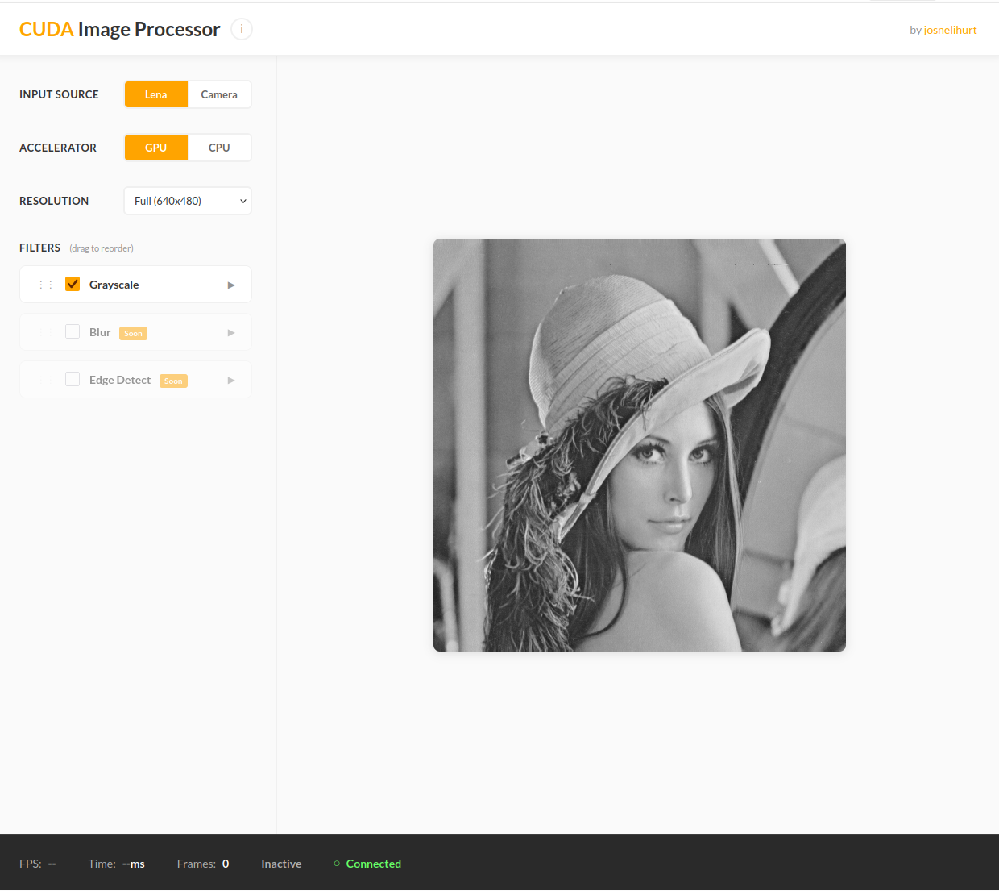
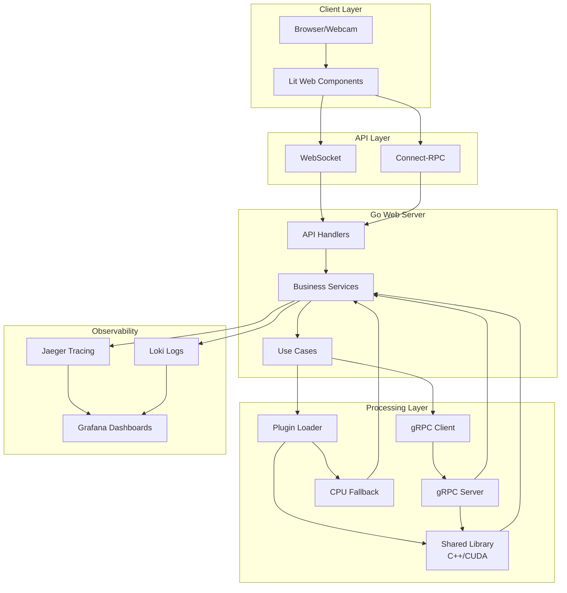
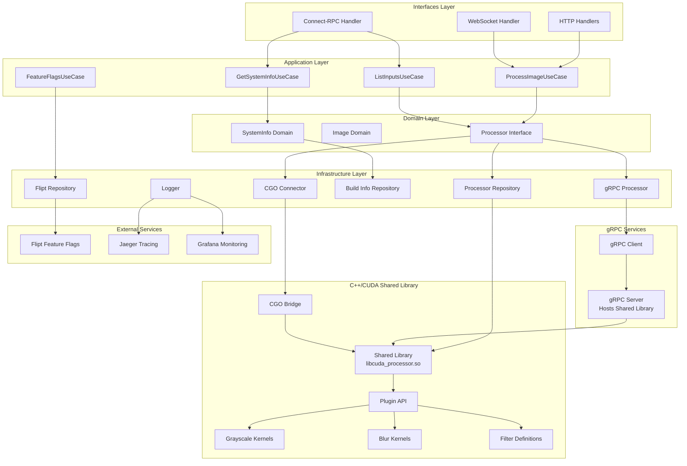

# CUDA Learning Platform

** Live Demo:** https://app-cuda-demo.josnelihurt.me

Learning CUDA and GPU programming by building something real. Started with a simple question: "How fast can I get image filters running on GPU vs CPU?" and ended up with this project.

This isn't another tutorial project. It's my way of exploring CUDA, OpenCL, and other accelerators while applying the software engineering practices I actually use in production. Clean architecture, proper testing, observability, deployment automation—all while figuring out how to make GPUs do cool stuff.



## Table of Contents

- [What's this?](#whats-this)
- [Architecture](#architecture)
  - [High-Level Overview](#high-level-overview)
  - [Detailed Component Architecture](#detailed-component-architecture)
- [Setup](#setup)
  - [Development](#development)
  - [Staging](#staging)
  - [Production](#production)
- [Git Hooks](#git-hooks)
- [Tech](#tech)
- [Image Processing Filters](#image-processing-filters)
- [Commands](#commands)
- [Development Tools](#development-tools)
- [CI Workflows](#ci-workflows)
- [Testing & Code Quality](#testing-code-quality)
- [Code structure](#code-structure)
- [Filter System](#filter-system)
- [Known issues](#known-issues)
- [Roadmap](#roadmap)
- [Learning Journey](#learning-journey)
- [Future Vision](#future-vision)

## What's this?

Real-time image and video processing through CUDA kernels. Point your webcam at something, pick a filter (grayscale more to come), and watch it process on your GPU (or CPU for comparison). Shows FPS and processing time so you can actually see the performance difference.

The system supports multiple input sources—webcam, static images, video files—and processes them through a growing library of filters. Each filter has both GPU and CPU implementations, so you can compare performance and learn how different algorithms work.

**Why I built it this way**: Reading tutorials and doing lab exercises gets boring fast. I learn better by building something I'd actually want to use. So instead of following "CUDA 101" step-by-step, I built a real system with the same practices I use at work—clean architecture, proper testing, observability, the whole deal.

**How it works**: Go web server can communicate with C++ accelerator libraries via two paths: (1) CGO connector using `dlopen` for direct library loading, or (2) gRPC client for remote processing via a separate gRPC server. This dual-path architecture allows swapping between CUDA, OpenCL, or CPU implementations without restarting, and enables both local and distributed processing. The plugin architecture makes it easy to add new filters or different acceleration backends. Everything's wired up with proper dependency injection, so testing is actually doable.

## Architecture

### High-Level Overview



### Detailed Component Architecture



### Processing Architecture: CGO vs gRPC

The system supports two processing backends for communicating with the C++/CUDA accelerator library:

**1. CGO Connector (Direct Library Loading)**
- Uses `dlopen` to dynamically load the C++ shared library at runtime
- Direct function calls via CGO bridge (`cgo_api.cpp`)
- Lower latency for local processing
- Requires library to be available on the same machine
- Implemented in: `webserver/pkg/infrastructure/processor/cpp_connector.go`
- CGO bridge: `cpp_accelerator/ports/cgo/cgo_api.cpp`
- Loader: `webserver/pkg/infrastructure/processor/loader/dlopen_linux.go`

**2. gRPC Processor (Remote Service)**
- Communicates with a separate gRPC server that hosts the C++ library
- Enables remote GPU processing and microservices architecture
- Better for distributed deployments
- Supports version information queries
- Implemented in: `webserver/pkg/infrastructure/processor/grpc_processor.go`
- Client: `webserver/pkg/infrastructure/processor/grpc_client.go`
- Uses `grpc.NewClient` (modern gRPC API) with context propagation

**Configuration:**
- Controlled by `processor.use_grpc_for_processor` flag in config
- Falls back to CGO connector if gRPC client initialization fails
- Both backends implement the same `Processor` domain interface for seamless switching

**Connection Flow:**
- **CGO Path**: Go → CGO Bridge → Shared Library (dlopen)
- **gRPC Path**: Go → gRPC Client → gRPC Server → Shared Library

**Shared Library:**
Both CGO and gRPC server use the same shared library (`libcuda_processor.so`), which contains:
- CUDA kernels for GPU processing
- CPU fallback implementations
- Filter definitions and metadata
- Plugin API interface

This architecture enables the current dual-path approach while laying the foundation for future microservices evolution.

## Setup

Three environments available: development for local coding, staging for production-like testing, and production for real deployment.

### Development

Local development with hot reload. Frontend runs on Vite dev server, backend handles requests directly.

**Start:**
```bash
# First time or after C++/Go changes
./scripts/dev/start.sh --build

# Subsequent runs (hot reload enabled)
./scripts/dev/start.sh
```

**Access:**
- HTTPS: https://localhost:8443

**Configuration:** `config/config.yaml` or `config/config.dev.yaml`
- Hot reload enabled
- Logs to stdout
- TLS with localhost certificates
- Services on direct localhost ports

### Staging

Production-like Docker deployment running locally using pre-built images from GitHub Container Registry. Useful for testing Docker images compiled in CI/CD and integration before production.

**Start:**
```bash
./scripts/deployment/staging_local/start.sh        # Run in background (uses cached image)
./scripts/deployment/staging_local/start.sh --pull # Pull latest image from GHCR
./scripts/deployment/staging_local/stop.sh         # Stop services
./scripts/deployment/staging_local/clean.sh        # Clean volumes
```

**Access:**
- Main app: https://app.localhost
- Grafana: https://grafana.localhost
- Flipt: https://flipt.localhost
- Jaeger: https://jaeger.localhost
- Reports: https://reports.localhost

**Configuration:** `config/config.staging.yaml`
- No hot reload (production build)
- Traefik reverse proxy with HTTPS
- Services via .localhost domains
- File logging
- Docker Compose stack

**Image Source:**
- Uses pre-built image: `ghcr.io/josnelihurt/learning-cuda:amd64-latest`
- Image compiled in GitHub Actions on push to `main`
- No local compilation required

**Requirements:**
- Docker with NVIDIA Container Toolkit
- NVIDIA GPU with drivers

### Production

Real deployment on Jetson Nano hardware with Cloudflare tunnel for external access.

**Production URL:** https://app-cuda-demo.josnelihurt.me

**Services:**
- Main Application: https://app-cuda-demo.josnelihurt.me
- Grafana Monitoring: https://grafana-cuda-demo.josnelihurt.me
- Feature Flags (Flipt): https://flipt-cuda-demo.josnelihurt.me
- Distributed Tracing (Jaeger): https://jaeger-cuda-demo.josnelihurt.me
- Test Reports: https://reports-cuda-demo.josnelihurt.me

**Deployment:**
```bash
# Full deployment (init + sync + start)
./scripts/deployment/jetson-nano/deploy.sh

# Individual steps
./scripts/deployment/jetson-nano/init.sh    # Initialize environment
./scripts/deployment/jetson-nano/sync.sh     # Sync code changes
./scripts/deployment/jetson-nano/start.sh   # Start services
./scripts/deployment/jetson-nano/clean.sh    # Clean deployment
```

**Configuration:** `config/config.production.yaml`
- Cloudflare tunnel for external access
- Ansible automation
- Production-optimized Docker configuration
- Unified logging configuration

## Git Hooks

Install validation hooks:

```bash
./scripts/hooks/install.sh
```

Hooks:
- pre-commit: Unit tests + linters
- pre-push: Full validation with all browsers

Skip when needed: `git commit --no-verify` or `git push --no-verify`

## Tech

- Go server with native HTTPS support handling WebSocket
- C++/CUDA doing the processing via dynamic library plugins (dlopen)
- Protocol Buffers for C++/Go communication
- Bazel for C++/CUDA builds, Makefile for Go
- **Production**: Jetson Nano deployment with Cloudflare tunnel
- **Deployment**: Ansible automation for infrastructure management

**Frontend**: Lit Web Components + TypeScript with Vite bundler. No React, just native web components.

**Observability**: Jaeger distributed tracing, Grafana dashboards, Loki log aggregation, Flipt feature flags.

## Image Processing Filters

Currently implemented a bunch of different filters to explore various GPU programming concepts:

**Grayscale algorithms** (learning color space conversions):
- **BT.601** (0.299R + 0.587G + 0.114B) - old TV standard
- **BT.709** (0.2126R + 0.7152G + 0.0722B) - HD standard  
- **Average** - simple (R+G+B)/3
- **Lightness** - (max+min)/2
- **Luminosity** - weighted average, similar to BT.601

**Coming next** (exploring different GPU concepts):
- Blur filters (Gaussian, Box) - learning convolution and shared memory
- Edge detection (Sobel, Canny) - learning gradients and complex algorithms
- Color space conversions (RGB→HSV, RGB→LAB) - learning conditional operations
- Morphological operations - learning neighborhood processing

Each filter teaches different GPU programming concepts—memory management, shared memory optimization, atomic operations, or complex algorithms. The UI discovers available filters dynamically from the C++ library, so adding new ones is just a matter of implementing the kernel.

## Commands

```bash
./scripts/dev/start.sh --build  # start dev environment (first time)
./scripts/dev/start.sh          # start dev environment
./scripts/dev/stop.sh           # kill all processes
```

Frontend hot reloads with Vite. For C++/Go you gotta rebuild.

## Development Tools

The app includes a dynamic tools dropdown that adapts to your environment:

**Observability:**
- Jaeger Tracing - distributed tracing visualization
- Grafana Logs Dashboard - centralized log viewing
- Grafana Explore - ad-hoc query interface

**Feature Management:**
- Flipt Feature Flags - runtime configuration
- Sync Feature Flags - manual synchronization

**Testing:**
- BDD Test Reports - Cucumber test results
- Code Coverage Reports - Unit test coverage dashboard

Add new tools by editing `config/config.yaml`, no code changes needed.

## CI Workflows

Continuous integration for ARM64 and AMD64 builds runs via GitHub Actions. Detailed triggers, job flow, and runner expectations live in [`docs/ci-workflows.md`](docs/ci-workflows.md).

## Testing & Code Quality

Comprehensive testing and quality assurance across all layers:

```bash
# Run all coverage tests (Frontend, Golang, C++)
./scripts/test/coverage.sh

# Run all linters (ESLint, golangci-lint, clang-tidy)
./scripts/test/linters.sh

# Auto-fix linting issues
./scripts/test/linters.sh --fix

# View coverage reports
docker-compose -f docker-compose.dev.yml --profile coverage up coverage-report-viewer
# Visit: http://localhost:5052
```

**Testing Stack:**
- **Frontend**: Vitest + ESLint + Prettier
- **Golang**: go test + golangci-lint
- **C++**: GoogleTest + Bazel + clang-tidy + clang-format

See [Testing & Coverage Documentation](docs/testing-and-coverage.md) for detailed information.

## Code structure

```
cpp_accelerator/
  infrastructure/cuda/  - GPU kernels
  infrastructure/cpu/   - CPU versions
  ports/cgo/           - CGO bridge

webserver/
  cmd/server/          - main.go
  web/                 - static files

scripts/               - organized scripts (dev/, test/, docker/, tools/, hooks/)
```

## Filter System

The system supports multiple input sources and a growing library of image processing filters. Each filter is designed to teach specific GPU programming concepts while being practically useful.

**Input Sources:**
- Webcam (real-time processing)
- Static images (upload or select from library)
- Video files (frame-by-frame processing)

**Filter Discovery:** The UI automatically discovers available filters and their parameters from the C++ library capabilities. You can drag and drop to reorder filters, adjust parameters in real-time, and compare GPU vs CPU performance.

**Learning Focus:** Each filter implementation explores different aspects of GPU programming—from simple pixel operations to complex algorithms requiring shared memory, atomic operations, or multi-pass processing.

## Known issues

- Camera needs user in `video` group on Linux
- SSL cert warnings if using self-signed certificates (use mkcert to avoid)

## Roadmap

Evolving this into a full CUDA learning platform. See [GitHub Issues](https://github.com/josnelihurt/learning-cuda/issues) for active project management and backlog. Historical backlog planning documents are archived in [docs/archive/](docs/archive/).

## Learning Journey

Started as a weekend project to learn CUDA. What began as a simple question—"How fast can I get image filters running on GPU vs CPU?"—has evolved into a full learning platform covering GPU programming, video processing, neural networks, and production infrastructure. Code quality varies—some parts are clean, others are "it works" territory, but that's part of the learning process.

**What I've learned so far**: CUDA kernels are fun once you get the hang of them. Memory management is tricky. Shared memory optimization makes a huge difference. And building a real system teaches you way more than following tutorials. The current architecture—with its dual-path CGO/gRPC approach and shared library design—provides a solid foundation for exploring microservices, multi-accelerator support, and distributed processing.

**Current State**: The platform now supports multiple processing backends (CGO direct loading and gRPC remote service), dynamic filter discovery, comprehensive observability, and production deployment. The shared library architecture allows both local and remote processing while maintaining the same filter implementations.

**Philosophy**: Learn by building something you'd actually use. Every feature should teach you something new about either GPU programming or software engineering. The evolution from a weekend project to a full platform demonstrates how real-world requirements drive architectural decisions and learning.

## Future Vision

The current architecture provides a solid foundation, but the vision extends to a fully decoupled microservices architecture that breaks vendor lock-in and enables distributed processing across different hardware platforms.

### Microservices Architecture

**Goal**: Decouple the system into independent microservices that can scale independently and support multiple accelerator backends.

**Current Challenge**: The system is currently coupled to NVIDIA containers due to CUDA framework requirements. This limits deployment flexibility and prevents easy expansion to other accelerators like OpenCL or ARM-based processors.

**Planned Evolution**:
- **WebRTC Integration**: Replace WebSocket with WebRTC for direct frame streaming to the CUDA microservice. This addresses latency concerns inherent in microservices architectures by enabling peer-to-peer communication with minimal overhead.
- **WebSocket Deprecation**: Gradually migrate from WebSocket to WebRTC using feature flags. This allows A/B testing and metrics collection to validate performance improvements and ensure smooth transition.
- **Feature Flags Strategy**: Use feature flags throughout the migration to:
  - Enable gradual rollout of new architecture
  - Collect metrics comparing WebSocket vs WebRTC performance
  - Validate hypotheses about latency and throughput
  - Allow quick rollback if issues arise

### Multi-Accelerator Support

**OpenCL Expansion**: Break the NVIDIA dependency by implementing OpenCL versions of all filters. This enables:
- Support for AMD GPUs and other OpenCL-compatible hardware
- Cross-platform deployment without vendor lock-in
- Comparison of CUDA vs OpenCL performance on the same algorithms

**Radxa 5b+ Integration**: Expand beyond x86/NVIDIA to ARM-based processing:
- Use Radxa 5b+ (currently build server) as a processing node
- Implement gRPC/WebRTC service on ARM architecture
- Create filter implementations optimized for ARM processors
- Enable heterogeneous processing across different hardware platforms

**Container Architecture Evolution**: 
- Current: NVIDIA-specific containers limit deployment options
- Future: Multi-accelerator container architecture supporting:
  - NVIDIA CUDA containers for GPU processing
  - OpenCL containers for vendor-agnostic GPU processing
  - ARM-optimized containers for Radxa and similar hardware
  - Service discovery and load balancing across accelerator types

### Technical Approach

**Shared Library Foundation**: The current shared library architecture (`libcuda_processor.so`) is designed to be accelerator-agnostic. The same filter interface can be implemented with:
- CUDA kernels (current)
- OpenCL kernels (planned)
- ARM-optimized implementations (planned)
- CPU fallback (current)


**Metrics & Validation**: Feature flags enable continuous metrics collection:
- Latency comparison: WebSocket vs WebRTC
- Throughput analysis: CGO vs gRPC vs WebRTC
- Performance benchmarks: CUDA vs OpenCL vs ARM
- Resource utilization across different architectures

This vision transforms the platform from a CUDA learning project into a comprehensive multi-accelerator processing platform that explores the full spectrum of GPU and accelerator technologies available today.

### Generate docker 
docker run --rm -v $(pwd):/workspace -u $(id -u):$(id -g) cuda-learning-bufgen:latest generate