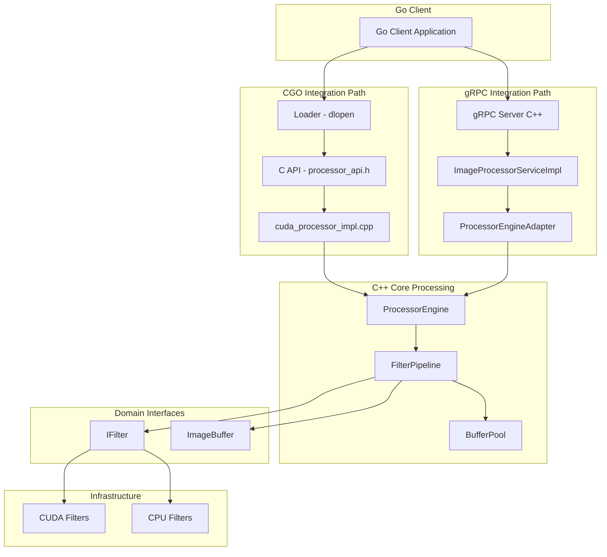
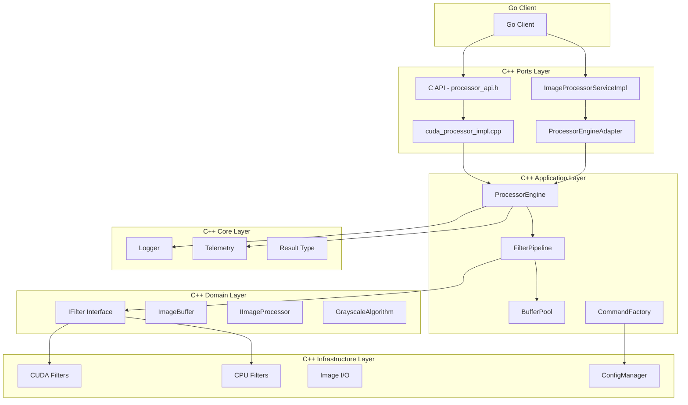
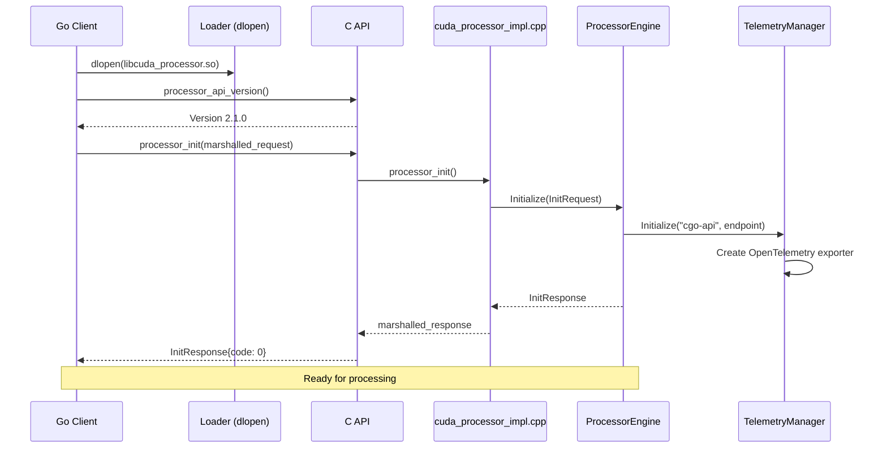
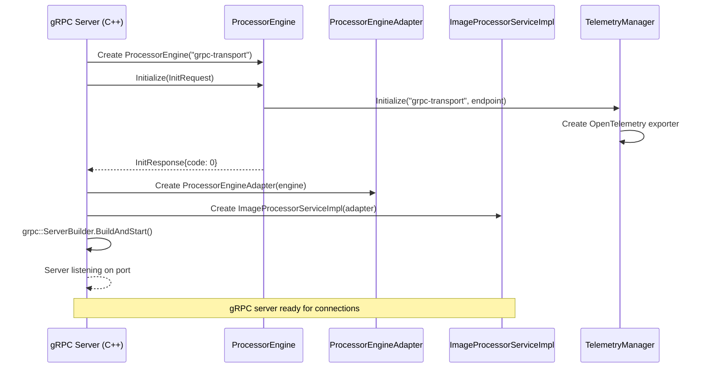
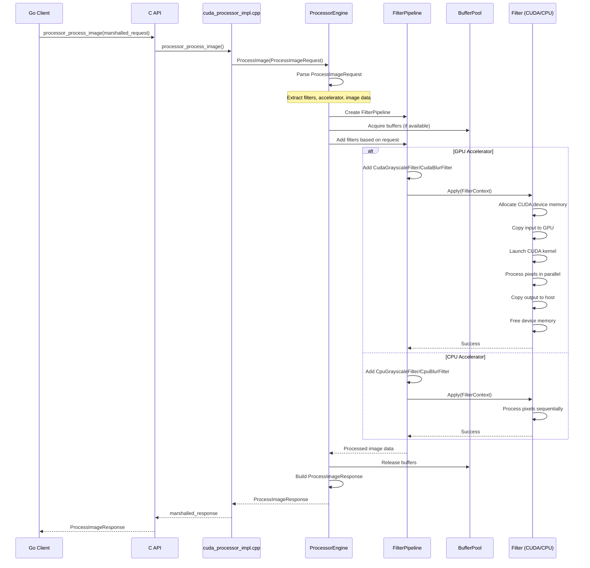
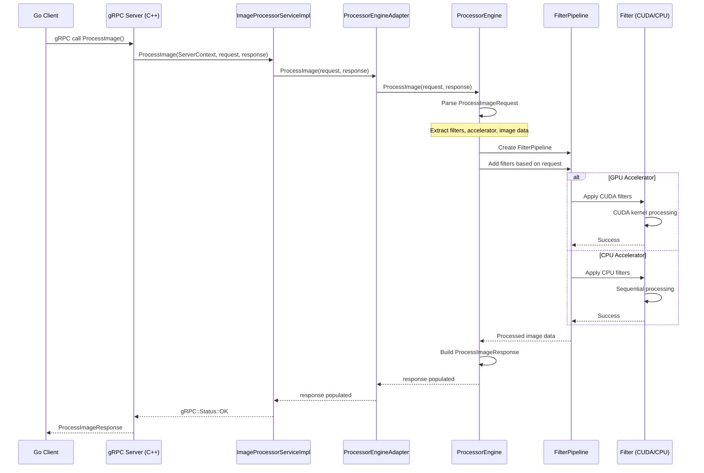

# CUDA Accelerator Library

High-performance image processing library implementing Clean Architecture principles with CUDA GPU acceleration and CPU fallback support.

## Library Description

The CUDA Accelerator Library provides a production-grade image processing framework with GPU-accelerated filters using CUDA kernels. The architecture follows Clean Architecture patterns with clear separation between domain logic, application use cases, infrastructure implementations, and external adapters.

**Version**: See `VERSION` file (currently 2.3.0)

**Note**: The library version (2.3.0) is separate from the C API version (2.1.0 defined in `processor_api.h`). The API version indicates the C interface contract, while the library version tracks overall library releases.

**Features**:
- GPU acceleration via CUDA kernels with CPU fallback
- Dynamic library loading for runtime plugin selection
- Protocol Buffers for language-agnostic API
- OpenTelemetry integration for distributed tracing
- Extensible filter pipeline architecture
- Thread-safe concurrent processing
- gRPC service support with streaming capabilities
- Command pattern for program execution
- Buffer pooling for memory efficiency
- Video streaming support (StreamProcessVideo)
- Configuration management system

## Architecture

### Component Overview

The library supports two integration paths: **CGO (Shared Library)** and **gRPC Service**. Both paths converge at the `ProcessorEngine`, which orchestrates image processing through the filter pipeline.



### Layer Structure



### Initialization Sequences

#### CGO (Shared Library) Initialization



#### gRPC Service Initialization



### Processing Flows

#### CGO (Shared Library) Processing Flow



#### gRPC Processing Flow



## Directory Structure

```
cpp_accelerator/
├── application/          # Application layer - use cases and orchestration
│   ├── commands/         # Command pattern implementation
│   │   ├── command_interface.h
│   │   ├── command_factory.h/cpp
│   │   └── command_factory_test.cpp
│   └── pipeline/         # Filter pipeline implementation
│       ├── filter_pipeline.h/cpp
│       ├── buffer_pool.h/cpp
│       └── filter_pipeline_test.cpp
├── domain/               # Domain layer - business logic interfaces
│   └── interfaces/       # Abstraction interfaces
│       ├── filters/      # Filter interfaces
│       │   └── i_filter.h
│       ├── processors/   # Processor interfaces
│       │   └── i_image_processor.h
│       ├── image_buffer.h
│       ├── image_source.h
│       ├── image_sink.h
│       ├── i_pixel_getter.h
│       └── grayscale_algorithm.h
├── infrastructure/       # Infrastructure layer - concrete implementations
│   ├── cuda/            # CUDA kernel implementations
│   │   ├── grayscale_kernel.cu/h
│   │   ├── blur_kernel.cu/h
│   │   ├── grayscale_filter.h/cpp
│   │   └── blur_processor.h/cpp
│   ├── cpu/             # CPU fallback implementations
│   │   ├── grayscale_filter.h/cpp
│   │   └── blur_filter.h/cpp
│   ├── image/           # Image I/O adapters
│   │   ├── image_loader.h/cpp
│   │   └── image_writer.h/cpp
│   ├── config/          # Configuration management
│   │   ├── config_manager.h/cpp
│   │   └── models/
│   │       └── program_config.h
│   └── filters/          # Filter equivalence tests
│       └── blur_equivalence_test.cpp
├── ports/               # Ports layer - external adapters
│   ├── cgo/             # CGO C++ interop
│   │   └── cgo_api.cpp
│   ├── grpc/            # gRPC service implementation
│   │   ├── image_processor_service_impl.h/cpp
│   │   ├── processor_engine_adapter.h/cpp
│   │   ├── processor_engine_provider.h
│   │   └── server_main.cpp
│   └── shared_lib/      # Shared library exports
│       ├── processor_api.h
│       ├── processor_engine.h/cpp
│       ├── cuda_processor_impl.cpp
│       └── image_buffer_adapter.h/cpp
├── core/                # Core utilities
│   ├── logger.h/cpp     # Logging infrastructure
│   ├── telemetry.h/cpp  # OpenTelemetry integration
│   └── result.h         # Error handling types
└── VERSION              # Library version file
```

## Design Principles

1. **Dependency Inversion**: Domain interfaces define contracts; infrastructure implements them
2. **Single Responsibility**: Each component has one clear purpose
3. **Open/Closed**: Extend via new implementations, not modification
4. **Liskov Substitution**: All filter implementations are interchangeable
5. **Interface Segregation**: Small, focused interfaces (IFilter, ImageBuffer)
6. **Separation of Concerns**: Clear boundaries between layers
7. **Filter Pipeline**: Composable filter architecture for chaining multiple filters

## Key Components

### gRPC Service Port

The library provides a gRPC service implementation (`ImageProcessorServiceImpl`) that exposes image processing capabilities over the network. The service implements the `ImageProcessorService` protocol buffer interface.

**Service Methods**:

- **ProcessImage**: Processes a single image with specified filters and accelerator
  - Accepts `ProcessImageRequest` with image data, filter configuration, and accelerator selection
  - Returns `ProcessImageResponse` with processed image data and metadata

- **ListFilters**: Returns available filter capabilities and their parameters
  - Accepts `ListFiltersRequest` with API version and trace context
  - Returns `ListFiltersResponse` with filter definitions including parameter types (select, range, number, checkbox, text)

- **StreamProcessVideo**: Processes video frames in a streaming fashion
  - Bidirectional streaming: accepts `ProcessImageRequest` frames, returns `ProcessImageResponse` frames
  - Enables efficient video processing without loading entire video into memory

- **GetVersionInfo**: Returns library version information
  - Accepts `GetVersionInfoRequest`
  - Returns `GetVersionInfoResponse` with version details

**Architecture**:

The gRPC service uses the `ProcessorEngineProvider` interface pattern to abstract the underlying processing engine. `ProcessorEngineAdapter` adapts the `ProcessorEngine` (from shared_lib port) to the provider interface, enabling the same processing logic to be used by both C API and gRPC interfaces.

### Command Pattern

The library implements a command pattern for program execution through the `CommandFactory` and `ICommand` interface.

**Components**:

- **ICommand**: Interface defining command execution contract
  - `execute()`: Returns `Result<void>` indicating success or failure

- **CommandFactory**: Factory for creating commands based on program type
  - `create(ProgramType, ProgramConfig)`: Creates appropriate command instance
  - Supports `ProgramType` enum: `Passthrough`, `CudaImageFilters`, `CpuImageFilters`

- **ProgramConfig**: Configuration structure containing:
  - `input_image_path`: Source image file path
  - `output_image_path`: Destination image file path
  - `program_type`: Type of processing program to execute

The command factory integrates with `ConfigManager` to parse command-line arguments and create the appropriate command for execution.

### Buffer Pool

The `BufferPool` class provides efficient memory management for image processing operations by reusing allocated buffers.

**Features**:

- **Acquire/Release Pattern**: Buffers are acquired from the pool when needed and released when done
- **Automatic Growth**: Pool expands as needed, creating new buffers when none are available
- **Memory Efficiency**: Reduces allocation overhead by reusing buffers across filter operations
- **Integration**: Used by `FilterPipeline` to manage intermediate buffers during multi-filter processing

The buffer pool is optional - `FilterPipeline` can operate with or without a buffer pool. When provided, it significantly improves performance for pipelines with multiple filters.

### Processor Engine

The `ProcessorEngine` is the core orchestration component that coordinates image processing operations. It serves as the bridge between the external API interfaces (C API and gRPC) and the internal processing pipeline.

**Responsibilities**:

- **Initialization**: Manages library initialization including telemetry setup
- **Filter Orchestration**: Creates and configures `FilterPipeline` instances based on requests
- **Algorithm Selection**: Converts protocol buffer enums to domain types (e.g., `GrayscaleAlgorithm`)
- **Response Building**: Constructs protocol buffer responses with processed data and metadata

**Integration Points**:

- Used by `ports/shared_lib` for C API implementation
- Used by `ports/grpc` via `ProcessorEngineAdapter` for gRPC service
- Coordinates with `FilterPipeline` for actual image processing
- Manages telemetry and logging context

### Configuration Management

The `ConfigManager` provides command-line argument parsing and configuration management.

**Features**:

- **Argument Parsing**: Parses command-line arguments into structured `ProgramConfig`
- **Type Safety**: Uses `ProgramType` enum for type-safe program selection
- **Validation**: Validates configuration before command creation

**Program Types**:

- **Passthrough**: No-op command (for testing/debugging)
- **CudaImageFilters**: GPU-accelerated image filter processing
- **CpuImageFilters**: CPU-based image filter processing

### Domain Interfaces

The domain layer defines core abstractions used throughout the library:

**FilterType Enum**:
- `GRAYSCALE`: Grayscale conversion filter
- `BLUR`: Gaussian blur filter

**GrayscaleAlgorithm Enum**:
- `BT601`: ITU-R BT.601 (SDTV): Y = 0.299R + 0.587G + 0.114B
- `BT709`: ITU-R BT.709 (HDTV): Y = 0.2126R + 0.7152G + 0.0722B
- `Average`: Simple average: Y = (R + G + B) / 3
- `Lightness`: Lightness: Y = (max(R,G,B) + min(R,G,B)) / 2
- `Luminosity`: Luminosity: Y = 0.21R + 0.72G + 0.07B

**FilterContext Structure**:
- Contains `ImageBuffer` (input) and `ImageBufferMut` (output)
- Passed to filters during `Apply()` operations
- Provides type-safe access to image dimensions and channel data

**IImageProcessor Interface**:
- Defines contract for image processors that work with `IImageSource` and `IImageSink`
- Enables processing pipelines that read from sources and write to sinks
- Supports file-based and memory-based processing workflows

## Code Quality & Compiler Warnings

The project enforces strict compiler warning standards to maintain high code quality. All warnings are treated as errors for the project's own code.

### Warning Configuration

The build system (configured in `.bazelrc`) enables aggressive warning detection for all code in `cpp_accelerator/`:

- **`-Wall`**: Enable all standard warnings
- **`-Wextra`**: Enable additional warnings beyond `-Wall`
- **`-Werror`**: Treat all warnings as errors, preventing compilation if warnings are present

This configuration applies only to the project's own code. External dependencies and generated code (protobuf, third-party libraries) are excluded from `-Werror` to avoid build failures from code we don't control.

### Warning Suppression Strategy

When external headers generate warnings that cannot be fixed (e.g., deprecated APIs in spdlog or protobuf), the project uses localized `#pragma GCC diagnostic` directives around the problematic includes:

```cpp
#pragma GCC diagnostic push
#pragma GCC diagnostic ignored "-Wdeprecated-declarations"
#pragma GCC diagnostic ignored "-Wmissing-requires"
#include <spdlog/spdlog.h>
#pragma GCC diagnostic pop
```

This approach is explicit and local—each file that includes external headers shows clearly which warnings are being suppressed and why.

### Unused Parameters

For parameters that are part of interface contracts but not used in specific implementations (e.g., stub implementations or test code), the `[[maybe_unused]]` attribute is used:

```cpp
bool TelemetryManager::Initialize(
    [[maybe_unused]] const std::string& service_name,
    [[maybe_unused]] const std::string& collector_endpoint,
    bool enabled) {
  // Stub implementation - parameters required by interface but not used
}
```

This is preferred over removing parameters or using `(void)parameter` casts, as it maintains interface compatibility while clearly indicating intentional non-use.

### Current Status

All code in `cpp_accelerator/` compiles without warnings when `-Werror` is enabled. The project maintains a zero-warning policy for its own code.

### Potential Improvements

1. **Static Analysis Integration**: Add clang-static-analyzer or cppcheck to CI/CD pipeline for deeper analysis beyond compiler warnings
2. **Warning Categories**: Consider enabling additional warning categories like `-Wpedantic` or `-Weffc++` for even stricter checks
3. **Custom Warnings**: Define project-specific warnings for common anti-patterns using compiler-specific extensions
4. **Automated Warning Suppression**: Create a script to audit and validate all `#pragma` suppressions, ensuring they're still necessary after dependency updates
5. **Documentation**: Generate warning reports as part of build artifacts to track warning trends over time

## C API Reference

The library exposes a C API through `processor_api.h` for language-agnostic integration. All data exchange uses Protocol Buffer serialization.

**Core Functions**:

- **processor_api_version()**: Returns version information structure (major, minor, patch)
  - Always safe to call, never fails
  - Use for runtime version compatibility checks

- **processor_init()**: Initializes the processor library
  - Parameters: serialized `InitRequest`, response buffer pointer
  - Returns: true on success, false on failure
  - Allocates response buffer (must be freed with `processor_free_response()`)
  - Not thread-safe - call once during application startup

- **processor_cleanup()**: Releases all processor resources
  - No parameters
  - Cleans up CUDA context and GPU memory
  - Not thread-safe - ensure all processing operations complete first
  - Must call `processor_init()` again after cleanup before processing

- **processor_process_image()**: Processes an image with configured filters
  - Parameters: serialized `ProcessImageRequest`, response buffer pointer
  - Returns: true on success, false on failure
  - Allocates response buffer (must be freed with `processor_free_response()`)
  - Thread-safe after successful initialization

- **processor_get_capabilities()**: Queries library capabilities
  - Parameters: serialized `GetCapabilitiesRequest`, response buffer pointer
  - Returns: true on success, false on failure
  - Returns supported filters, accelerators, algorithms, and metadata
  - Thread-safe, can be called without initialization
  - Capabilities are static and don't change during library lifetime

- **processor_get_library_version()**: Gets library version string from VERSION file
  - Parameters: output buffer (min 32 bytes), buffer length
  - Returns: true on success, false on failure
  - Thread-safe, can be called without initialization
  - Version string is null-terminated

- **processor_free_response()**: Frees response buffers allocated by the library
  - Parameters: buffer pointer to free
  - Always call for every non-NULL response buffer to prevent memory leaks
  - Passing NULL is safe and ignored
  - Do not use buffer after calling this function

**Memory Management**:
- Request buffers are managed by the caller
- Response buffers are allocated by the library and must be freed using `processor_free_response()`
- Never call `free()` or `delete` directly on response buffers

**Thread Safety**:
- `processor_init()` and `processor_cleanup()` are not thread-safe
- `processor_process_image()` and `processor_get_capabilities()` can be called concurrently after successful initialization

**API Version**: The C API version is defined as `PROCESSOR_API_VERSION "2.1.0"` in `processor_api.h`. This is separate from the library version (2.3.0) and indicates the C interface contract.

## Adding New Filters

To add a new filter (e.g., Gaussian Blur):

1. **Domain**: Implement `IFilter` interface if needed (current filters use existing interfaces)
2. **Infrastructure**: Implement CPU and CUDA filter classes
3. **Application**: Filters are automatically usable via FilterPipeline
4. **Ports**: Update C API handlers in `ports/cgo/` and `ports/shared_lib/` if new parameters required

Example flow for a new filter:
```
proto/common.proto: Define filter parameters (if needed)
infrastructure/cpu/: Implement CPU filter class
infrastructure/cuda/: Implement CUDA filter class
ports/shared_lib/: Wire up parameters to filters in cuda_processor_impl.cpp
ports/cgo/: Wire up parameters to filters in cgo_api.cpp (if using CGO)
```

The FilterPipeline automatically handles filter composition and execution order.

## Testing

The library includes comprehensive test coverage across all layers:

**Test Types**:

- **Unit Tests**: Individual component testing (filters, pipeline, buffer pool, etc.)
- **Integration Tests**: Cross-component interaction testing
- **Equivalence Tests**: Verify CPU and CUDA filters produce identical results (`infrastructure/filters/blur_equivalence_test.cpp`)
- **gRPC Service Tests**: Test gRPC service implementation and adapter patterns
- **Command Factory Tests**: Test command creation and execution

**Running Tests**:

Run all tests:
```bash
bazel test //cpp_accelerator/...
```

Run specific test:
```bash
bazel test //cpp_accelerator/core:logger_test
bazel test //cpp_accelerator/application/pipeline:filter_pipeline_test
bazel test //cpp_accelerator/application/commands:commands_test
bazel test //cpp_accelerator/infrastructure/filters:blur_equivalence_test
bazel test //cpp_accelerator/ports/grpc:image_processor_service_impl_test
```

Run equivalence tests to verify CPU/CUDA consistency:
```bash
bazel test //cpp_accelerator/infrastructure/filters:blur_equivalence_test
```

## Building

Build shared library:
```bash
bazel build //cpp_accelerator/ports/shared_lib:libcuda_processor.so
```

Build all:
```bash
bazel build //cpp_accelerator/...
```

## Version Compatibility

The library uses semantic versioning:
- **Major**: Breaking API changes
- **Minor**: New features, backward compatible
- **Patch**: Bug fixes, backward compatible

The C API checks version compatibility at runtime to prevent mismatched library/loader combinations.

