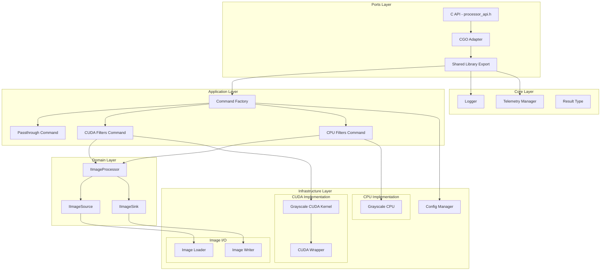
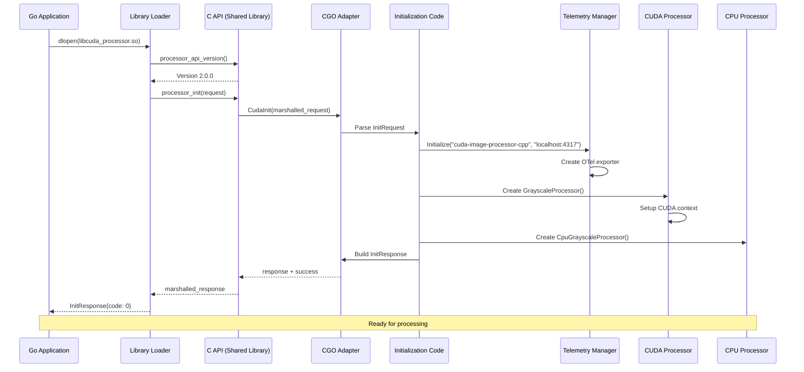
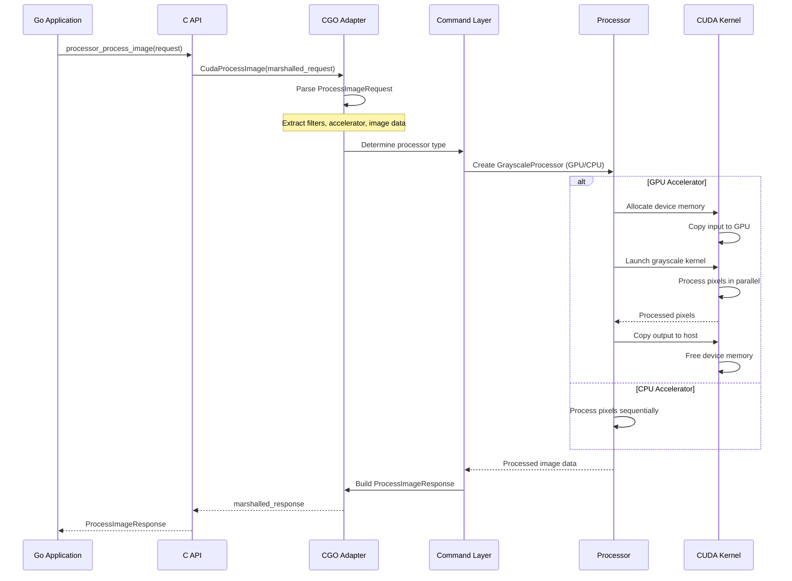

# CUDA Accelerator Library

High-performance image processing library implementing Clean Architecture principles with CUDA GPU acceleration and CPU fallback support.

## Library Description

The CUDA Accelerator Library provides a production-grade image processing framework with GPU-accelerated filters using CUDA kernels. The architecture follows Clean Architecture patterns with clear separation between domain logic, application use cases, infrastructure implementations, and external adapters.

**Version**: See `VERSION` file (currently 2.1.0)

**Features**:
- GPU acceleration via CUDA kernels with CPU fallback
- Dynamic library loading for runtime plugin selection
- Protocol Buffers for language-agnostic API
- OpenTelemetry integration for distributed tracing
- Extensible filter pipeline architecture
- Thread-safe concurrent processing

## Architecture

### Layer Structure



### Initialization Sequence



### Processing Flow



## Directory Structure

```
cpp_accelerator/
├── application/          # Application layer - use cases and orchestration
│   └── commands/         # Command pattern implementations
├── domain/               # Domain layer - business logic interfaces
│   └── interfaces/       # Abstraction interfaces
├── infrastructure/       # Infrastructure layer - concrete implementations
│   ├── cuda/            # CUDA kernel implementations
│   ├── cpu/             # CPU fallback implementations
│   ├── image/           # Image I/O adapters
│   └── config/          # Configuration management
├── ports/               # Ports layer - external adapters
│   ├── cgo/             # CGO C++ interop
│   └── shared_lib/      # Shared library exports
├── core/                # Core utilities
│   ├── logger/          # Logging infrastructure
│   ├── telemetry/       # OpenTelemetry integration
│   └── result.h         # Error handling types
├── cmd/                 # CLI entry points
└── VERSION              # Library version file
```

## Design Principles

1. **Dependency Inversion**: Domain interfaces define contracts; infrastructure implements them
2. **Single Responsibility**: Each component has one clear purpose
3. **Open/Closed**: Extend via new implementations, not modification
4. **Liskov Substitution**: All processor implementations are interchangeable
5. **Interface Segregation**: Small, focused interfaces (IImageProcessor, ImageSource, ImageSink)
6. **Separation of Concerns**: Clear boundaries between layers

## Adding New Filters

To add a new filter (e.g., Gaussian Blur):

1. **Domain**: Define filter contract if needed (current filters use existing interfaces)
2. **Infrastructure**: Implement CPU and CUDA kernels
3. **Application**: Add command or extend factory if needed
4. **Ports**: Update C API handlers if new parameters required

Example flow for Gaussian Blur:
```
proto/common.proto: Define GaussianBlurParameters
infrastructure/cpu/: Implement blur algorithm
infrastructure/cuda/: Implement CUDA kernel
shared_lib/: Wire up parameters to kernels
```

## Testing

Run all tests:
```bash
bazel test //cpp_accelerator/...
```

Run specific test:
```bash
bazel test //cpp_accelerator/core:logger_test
```

## Building

Build shared library:
```bash
bazel build //cpp_accelerator/ports/shared_lib:libcuda_processor.so
```

Build all:
```bash
bazel build //cpp_accelerator/...
```

## Version Compatibility

The library uses semantic versioning:
- **Major**: Breaking API changes
- **Minor**: New features, backward compatible
- **Patch**: Bug fixes, backward compatible

The C API checks version compatibility at runtime to prevent mismatched library/loader combinations.

