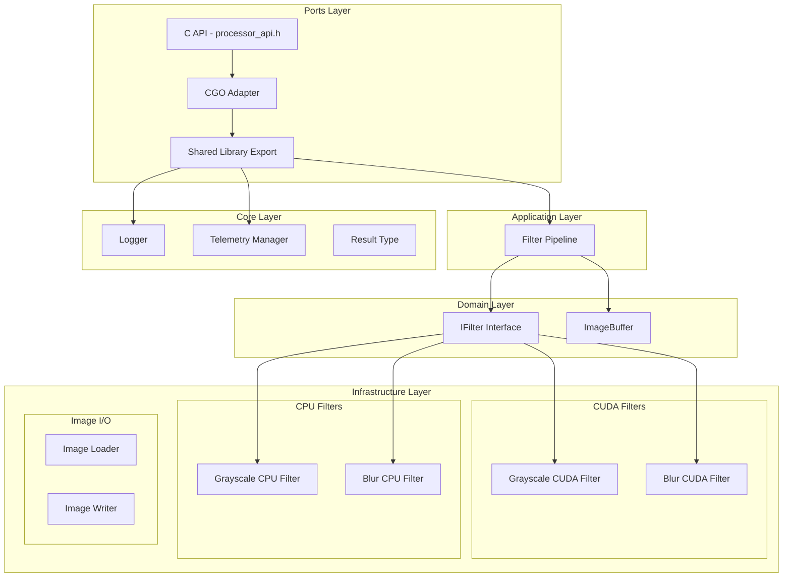
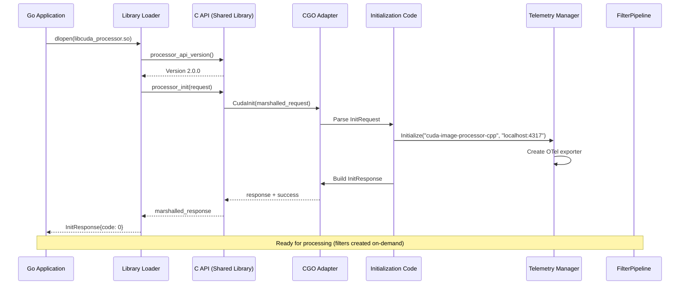
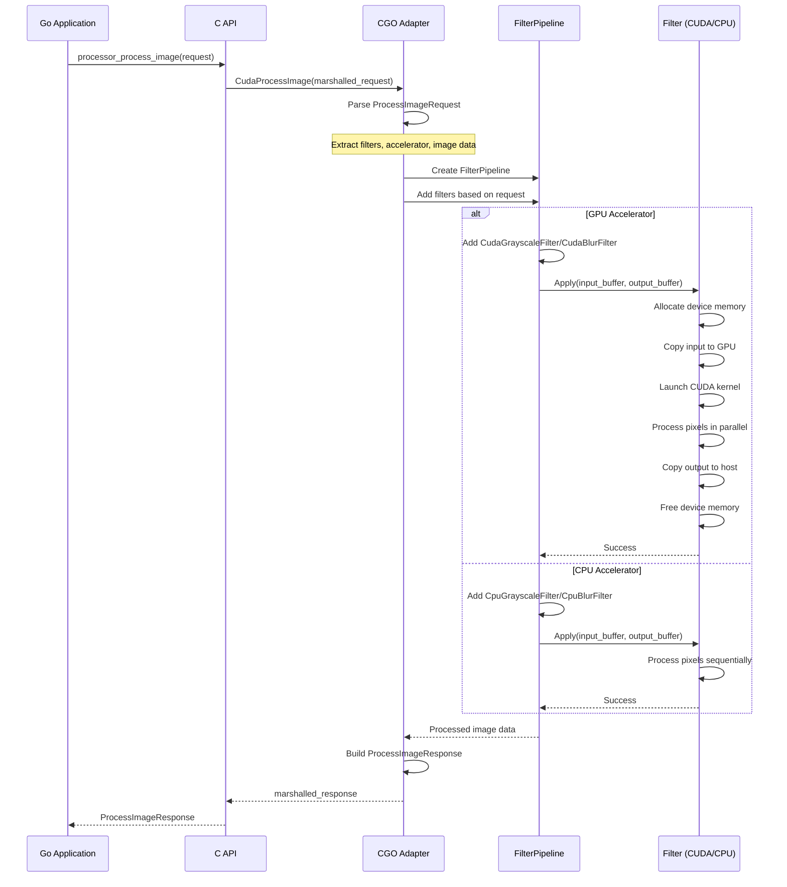

# CUDA Accelerator Library

High-performance image processing library implementing Clean Architecture principles with CUDA GPU acceleration and CPU fallback support.

## Library Description

The CUDA Accelerator Library provides a production-grade image processing framework with GPU-accelerated filters using CUDA kernels. The architecture follows Clean Architecture patterns with clear separation between domain logic, application use cases, infrastructure implementations, and external adapters.

**Version**: See `VERSION` file (currently 2.1.0)

**Features**:
- GPU acceleration via CUDA kernels with CPU fallback
- Dynamic library loading for runtime plugin selection
- Protocol Buffers for language-agnostic API
- OpenTelemetry integration for distributed tracing
- Extensible filter pipeline architecture
- Thread-safe concurrent processing

## Architecture

### Layer Structure



### Initialization Sequence



### Processing Flow



## Directory Structure

```
cpp_accelerator/
├── application/          # Application layer - use cases and orchestration
│   ├── commands/         # Command pattern (placeholder for future use)
│   └── pipeline/         # Filter pipeline implementation
├── domain/               # Domain layer - business logic interfaces
│   └── interfaces/       # Abstraction interfaces
├── infrastructure/       # Infrastructure layer - concrete implementations
│   ├── cuda/            # CUDA kernel implementations
│   ├── cpu/             # CPU fallback implementations
│   ├── image/           # Image I/O adapters
│   └── config/          # Configuration management
├── ports/               # Ports layer - external adapters
│   ├── cgo/             # CGO C++ interop
│   └── shared_lib/      # Shared library exports
├── core/                # Core utilities
│   ├── logger/          # Logging infrastructure
│   ├── telemetry/       # OpenTelemetry integration
│   └── result.h         # Error handling types
└── VERSION              # Library version file
```

## Design Principles

1. **Dependency Inversion**: Domain interfaces define contracts; infrastructure implements them
2. **Single Responsibility**: Each component has one clear purpose
3. **Open/Closed**: Extend via new implementations, not modification
4. **Liskov Substitution**: All filter implementations are interchangeable
5. **Interface Segregation**: Small, focused interfaces (IFilter, ImageBuffer)
6. **Separation of Concerns**: Clear boundaries between layers
7. **Filter Pipeline**: Composable filter architecture for chaining multiple filters

## Code Quality & Compiler Warnings

The project enforces strict compiler warning standards to maintain high code quality. All warnings are treated as errors for the project's own code.

### Warning Configuration

The build system (configured in `.bazelrc`) enables aggressive warning detection for all code in `cpp_accelerator/`:

- **`-Wall`**: Enable all standard warnings
- **`-Wextra`**: Enable additional warnings beyond `-Wall`
- **`-Werror`**: Treat all warnings as errors, preventing compilation if warnings are present

This configuration applies only to the project's own code. External dependencies and generated code (protobuf, third-party libraries) are excluded from `-Werror` to avoid build failures from code we don't control.

### Warning Suppression Strategy

When external headers generate warnings that cannot be fixed (e.g., deprecated APIs in spdlog or protobuf), the project uses localized `#pragma GCC diagnostic` directives around the problematic includes:

```cpp
#pragma GCC diagnostic push
#pragma GCC diagnostic ignored "-Wdeprecated-declarations"
#pragma GCC diagnostic ignored "-Wmissing-requires"
#include <spdlog/spdlog.h>
#pragma GCC diagnostic pop
```

This approach is explicit and local—each file that includes external headers shows clearly which warnings are being suppressed and why.

### Unused Parameters

For parameters that are part of interface contracts but not used in specific implementations (e.g., stub implementations or test code), the `[[maybe_unused]]` attribute is used:

```cpp
bool TelemetryManager::Initialize(
    [[maybe_unused]] const std::string& service_name,
    [[maybe_unused]] const std::string& collector_endpoint,
    bool enabled) {
  // Stub implementation - parameters required by interface but not used
}
```

This is preferred over removing parameters or using `(void)parameter` casts, as it maintains interface compatibility while clearly indicating intentional non-use.

### Current Status

All code in `cpp_accelerator/` compiles without warnings when `-Werror` is enabled. The project maintains a zero-warning policy for its own code.

### Potential Improvements

1. **Static Analysis Integration**: Add clang-static-analyzer or cppcheck to CI/CD pipeline for deeper analysis beyond compiler warnings
2. **Warning Categories**: Consider enabling additional warning categories like `-Wpedantic` or `-Weffc++` for even stricter checks
3. **Custom Warnings**: Define project-specific warnings for common anti-patterns using compiler-specific extensions
4. **Automated Warning Suppression**: Create a script to audit and validate all `#pragma` suppressions, ensuring they're still necessary after dependency updates
5. **Documentation**: Generate warning reports as part of build artifacts to track warning trends over time

## Adding New Filters

To add a new filter (e.g., Gaussian Blur):

1. **Domain**: Implement `IFilter` interface if needed (current filters use existing interfaces)
2. **Infrastructure**: Implement CPU and CUDA filter classes
3. **Application**: Filters are automatically usable via FilterPipeline
4. **Ports**: Update C API handlers in `ports/cgo/` and `ports/shared_lib/` if new parameters required

Example flow for a new filter:
```
proto/common.proto: Define filter parameters (if needed)
infrastructure/cpu/: Implement CPU filter class
infrastructure/cuda/: Implement CUDA filter class
ports/shared_lib/: Wire up parameters to filters in cuda_processor_impl.cpp
ports/cgo/: Wire up parameters to filters in cgo_api.cpp (if using CGO)
```

The FilterPipeline automatically handles filter composition and execution order.

## Testing

Run all tests:
```bash
bazel test //cpp_accelerator/...
```

Run specific test:
```bash
bazel test //cpp_accelerator/core:logger_test
```

## Building

Build shared library:
```bash
bazel build //cpp_accelerator/ports/shared_lib:libcuda_processor.so
```

Build all:
```bash
bazel build //cpp_accelerator/...
```

## Version Compatibility

The library uses semantic versioning:
- **Major**: Breaking API changes
- **Minor**: New features, backward compatible
- **Patch**: Bug fixes, backward compatible

The C API checks version compatibility at runtime to prevent mismatched library/loader combinations.

