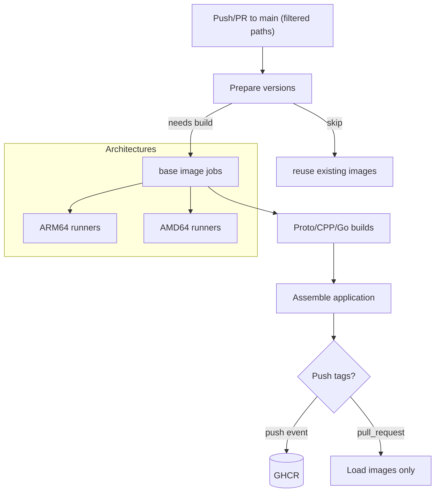

# Continuous Integration Workflows

## Overview
- Two GitHub Actions workflows (`docker-monorepo-build-arm.yml`, `docker-monorepo-build-x86.yml`) guard image builds for Jetson-class ARM64 and standard AMD64 targets.
- Both workflows run on selective path triggers for pushes and pull requests against `main`, with optional manual dispatch.
- Each run resolves component versions, checks whether container manifests already exist in GitHub Container Registry (GHCR), and only rebuilds what is missing.
- Jobs execute on self-hosted runners with GPU access: `jetson-nano` label for ARM64 and on-premises x86 machines for AMD64.

## Trigger Matrix
- `push` to `main` touching Dockerfiles, Bazel modules, protocol buffers, accelerator sources, runtime, integration, or workflow definitions.
- `pull_request` targeting `main` with the same filtered paths, enabling preview builds without publishing images.
- `workflow_dispatch` for manual rebuilds, useful after registry cleanup or runner maintenance.

## Job Sequence
| Stage | Jobs | Key Responsibilities |
| --- | --- | --- |
| Preparation | `prepare` | Read version files, log configuration, authenticate to GHCR (non-PR), decide which images require rebuilds via manifest inspection, compute composite `app_tag`. |
| Base Images | `build_proto_tools`, `build_go_builder`, `build_bazel_base`, `build_runtime_base`, `build_integration_base` | Rebuild base images only for architectures flagged by the prepare stage; apply architecture-specific Docker arguments; push versioned and `latest` tags outside PRs. |
| Intermediate Artifacts | `build_proto`, `build_cpp`, `build_golang` | Consume base images, produce architecture-specific artifacts (generated protobufs, compiled CUDA libraries, built Go binaries), capture digests for downstream verification. |
| Application Image | `build_app` | Validates intermediate digests, assembles the full application image, and publishes both versioned and rolling tags when running on `push`. |

## Build Decision Logic
- `prepare` inspects GHCR manifests (`docker manifest inspect`) for every base, intermediate, and final image.
- Outputs such as `proto_build_arm64` or `app_build_amd64` gate downstream jobs; jobs skip early when the output is `false`.
- The final image tag combines component versions (`{go}-proto{proto}-cpp{cpp}-go{go}`), ensuring cache invalidation whenever any layer changes.

## Flow Diagram

## Runner Infrastructure
- ARM64 workflow requires the Jetson Nano runners provisioned via Terraform and Ansible; see [`../scripts/README.md#deploymentgithub-runner`](../scripts/README.md#deploymentgithub-runner) for provisioning details and maintenance steps.
- AMD64 workflow targets self-hosted Linux runners with Docker Buildx and GPU toolkits aligned with production requirements.

## Related Automation
- Staging deployments `scripts/deployment/staging_local/` consume the published AMD64 images.
- Production deployments on Jetson hardware rely on the latest ARM64 `app` tag produced by the ARM workflow.
