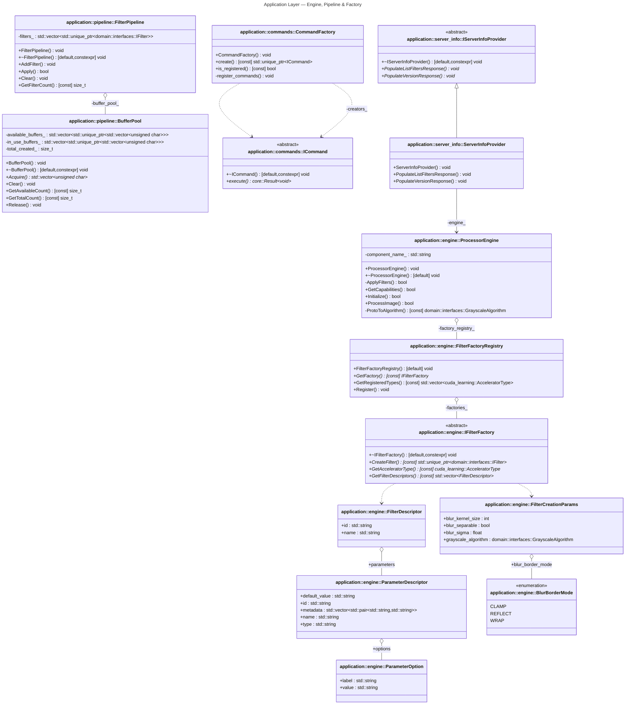
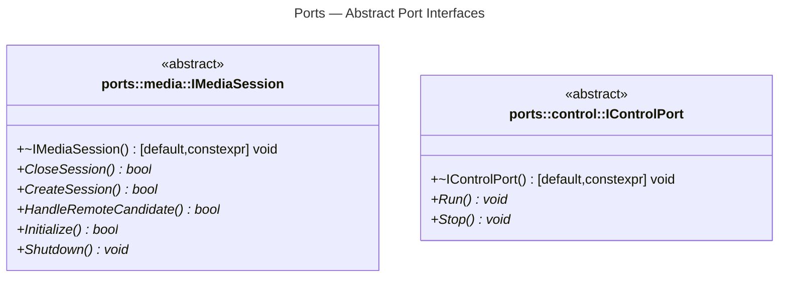

# UML Class Diagrams — cpp_accelerator

> Auto-generated by [`scripts/build/uml.sh`](../../scripts/build/uml.sh) using
> [clang-uml](https://github.com/bkryza/clang-uml).
> Open this file in VS Code and press `Ctrl+Shift+V` to view all diagrams
> (requires the [bierner.markdown-mermaid](https://marketplace.visualstudio.com/items?itemName=bierner.markdown-mermaid) extension).

---

## 1. Domain Layer

Pure abstractions — no infrastructure dependencies.

```mermaid
---
title: Domain Layer — Interfaces & Models
---
classDiagram
    %%{ init: { 'theme': 'default' } }%%
    class C_0017434949923708116087["domain::interfaces::ImageBuffer"]
    class C_0017434949923708116087 {
        +ImageBuffer() void
        +GetTotalSize() [const] int
        +IsValid() [const] bool
        +channels : int
        +data : const unsigned char *
        +height : int
        +width : int
    }
    click C_0017434949923708116087 href "https://github.com/josnelihurt-code/learning-cuda/blob/97e3ed959ece1d65059f15e1d5119503c9b683f8/src/cpp_accelerator/domain/interfaces/image_buffer.h#L5" "ImageBuffer"
    class C_0015401270107979851344["domain::interfaces::ImageBufferMut"]
    class C_0015401270107979851344 {
        +ImageBufferMut() void
        +GetTotalSize() [const] int
        +IsValid() [const] bool
        +channels : int
        +data : unsigned char *
        +height : int
        +width : int
    }
    click C_0015401270107979851344 href "https://github.com/josnelihurt-code/learning-cuda/blob/97e3ed959ece1d65059f15e1d5119503c9b683f8/src/cpp_accelerator/domain/interfaces/image_buffer.h#L19" "ImageBufferMut"
    class C_0015541302109033251352["domain::interfaces::FilterContext"]
    class C_0015541302109033251352 {
        +FilterContext() void
        +memory_pool : void *
    }
    click C_0015541302109033251352 href "https://github.com/josnelihurt-code/learning-cuda/blob/97e3ed959ece1d65059f15e1d5119503c9b683f8/src/cpp_accelerator/domain/interfaces/image_buffer.h#L33" "FilterContext"
    class C_0012087078762394733288["domain::interfaces::FilterType"]
    class C_0012087078762394733288 {
        <<enumeration>>
        GRAYSCALE
        BLUR
        MODEL_INFERENCE
    }
    click C_0012087078762394733288 href "https://github.com/josnelihurt-code/learning-cuda/blob/97e3ed959ece1d65059f15e1d5119503c9b683f8/src/cpp_accelerator/domain/interfaces/filters/i_filter.h#L7" "FilterType"
    class C_0003739923354998470227["domain::interfaces::IFilter"]
    class C_0003739923354998470227 {
        <<abstract>>
        +~IFilter() [default,constexpr] void
        +Apply() bool*
        +GetType() [const] FilterType*
        +IsInPlace() [const] bool*
    }
    click C_0003739923354998470227 href "https://github.com/josnelihurt-code/learning-cuda/blob/97e3ed959ece1d65059f15e1d5119503c9b683f8/src/cpp_accelerator/domain/interfaces/filters/i_filter.h#L9" "IFilter"
    class C_0015277472674566990321["domain::interfaces::GrayscaleAlgorithm"]
    class C_0015277472674566990321 {
        <<enumeration>>
        BT601
        BT709
        Average
        Lightness
        Luminosity
    }
    click C_0015277472674566990321 href "https://github.com/josnelihurt-code/learning-cuda/blob/97e3ed959ece1d65059f15e1d5119503c9b683f8/src/cpp_accelerator/domain/interfaces/grayscale_algorithm.h#L5" "GrayscaleAlgorithm"
    class C_0005681023905559676699["domain::interfaces::IImageSink"]
    class C_0005681023905559676699 {
        <<abstract>>
        +~IImageSink() [default,constexpr] void
        +write() bool*
    }
    click C_0005681023905559676699 href "https://github.com/josnelihurt-code/learning-cuda/blob/97e3ed959ece1d65059f15e1d5119503c9b683f8/src/cpp_accelerator/domain/interfaces/image_sink.h#L6" "IImageSink"
    class C_0017615268068180433495["domain::interfaces::IImageSource"]
    class C_0017615268068180433495 {
        <<abstract>>
        +~IImageSource() [default,constexpr] void
        +channels() [const] int*
        +data() [const] const unsigned char **
        +height() [const] int*
        +is_valid() [const] bool*
        +width() [const] int*
    }
    click C_0017615268068180433495 href "https://github.com/josnelihurt-code/learning-cuda/blob/97e3ed959ece1d65059f15e1d5119503c9b683f8/src/cpp_accelerator/domain/interfaces/image_source.h#L5" "IImageSource"
    class C_0007163517930959479208["domain::interfaces::IPixelGetter"]
    class C_0007163517930959479208 {
        <<abstract>>
        +~IPixelGetter() [default,constexpr] void
        +GetPixelValue() [const] float*
    }
    click C_0007163517930959479208 href "https://github.com/josnelihurt-code/learning-cuda/blob/97e3ed959ece1d65059f15e1d5119503c9b683f8/src/cpp_accelerator/domain/interfaces/i_pixel_getter.h#L7" "IPixelGetter"
    C_0015541302109033251352 o-- C_0017434949923708116087 : +input
    C_0015541302109033251352 o-- C_0015401270107979851344 : +output
    C_0003739923354998470227 ..> C_0015541302109033251352 : 
    C_0003739923354998470227 ..> C_0012087078762394733288 : 
    C_0007163517930959479208 ..> C_0017434949923708116087 : 

%% Generated with clang-uml, version 0.6.2
%% LLVM version Ubuntu clang version 18.1.3 (1ubuntu1)
```



---

## 2. Application Layer

Engine, Pipeline, and Filter Factory Registry.



---

## 3. Ports

Hexagonal port interfaces (control and media).



---

## 4. Core Utilities

Logger, Telemetry, Result, SignalHandler.

```mermaid
---
title: Core Utilities — Logger, Telemetry, Result
---
classDiagram
    %%{ init: { 'theme': 'default' } }%%
    class C_0003070975022905515086["core::LoggerTest"]
    class C_0003070975022905515086 {
        #TearDown() void
    }
    click C_0003070975022905515086 href "https://github.com/josnelihurt-code/learning-cuda/blob/97e3ed959ece1d65059f15e1d5119503c9b683f8/src/cpp_accelerator/core/logger_test.cpp#L12" "LoggerTest"
    class C_0005183287157482385322["core::LoggerTest_InitializeLoggerCreatesDefaultLogger_Test"]
    class C_0005183287157482385322 {
        +LoggerTest_InitializeLoggerCreatesDefaultLogger_Test() [default] void
        +LoggerTest_InitializeLoggerCreatesDefaultLogger_Test() void
        +LoggerTest_InitializeLoggerCreatesDefaultLogger_Test() void
        +~LoggerTest_InitializeLoggerCreatesDefaultLogger_Test() [default] void
        +operator=() LoggerTest_InitializeLoggerCreatesDefaultLogger_Test &
        +operator=() LoggerTest_InitializeLoggerCreatesDefaultLogger_Test &
        -TestBody() void
        -test_info_ : ::testing::TestInfo *const
    }
    click C_0005183287157482385322 href "https://github.com/josnelihurt-code/learning-cuda/blob/97e3ed959ece1d65059f15e1d5119503c9b683f8/src/cpp_accelerator/core/logger_test.cpp#L21" "LoggerTest_InitializeLoggerCreatesDefaultLogger_Test"
    class C_0002737945163598883402["core::LoggerTest_InitializeLoggerSetsInfoLevel_Test"]
    class C_0002737945163598883402 {
        +LoggerTest_InitializeLoggerSetsInfoLevel_Test() [default] void
        +LoggerTest_InitializeLoggerSetsInfoLevel_Test() void
        +LoggerTest_InitializeLoggerSetsInfoLevel_Test() void
        +~LoggerTest_InitializeLoggerSetsInfoLevel_Test() [default] void
        +operator=() LoggerTest_InitializeLoggerSetsInfoLevel_Test &
        +operator=() LoggerTest_InitializeLoggerSetsInfoLevel_Test &
        -TestBody() void
        -test_info_ : ::testing::TestInfo *const
    }
    click C_0002737945163598883402 href "https://github.com/josnelihurt-code/learning-cuda/blob/97e3ed959ece1d65059f15e1d5119503c9b683f8/src/cpp_accelerator/core/logger_test.cpp#L34" "LoggerTest_InitializeLoggerSetsInfoLevel_Test"
    class C_0018069749232895666528["core::LoggerTest_LoggerCanBeUsedAfterInitialization_Test"]
    class C_0018069749232895666528 {
        +LoggerTest_LoggerCanBeUsedAfterInitialization_Test() [default] void
        +LoggerTest_LoggerCanBeUsedAfterInitialization_Test() void
        +LoggerTest_LoggerCanBeUsedAfterInitialization_Test() void
        +~LoggerTest_LoggerCanBeUsedAfterInitialization_Test() [default] void
        +operator=() LoggerTest_LoggerCanBeUsedAfterInitialization_Test &
        +operator=() LoggerTest_LoggerCanBeUsedAfterInitialization_Test &
        -TestBody() void
        -test_info_ : ::testing::TestInfo *const
    }
    click C_0018069749232895666528 href "https://github.com/josnelihurt-code/learning-cuda/blob/97e3ed959ece1d65059f15e1d5119503c9b683f8/src/cpp_accelerator/core/logger_test.cpp#L47" "LoggerTest_LoggerCanBeUsedAfterInitialization_Test"
    class C_0002827361771953966828["core::Result&lt;T=void&gt;"]
    class C_0002827361771953966828 {
        +error() Result&lt;T&gt;$
        +ok() Result&lt;T&gt;$
        +operator bool() [const] bool
        +exit_code : int
        +message : std::string
        +success : bool
        +value : std::optional&lt;T&gt;
    }
    click C_0002827361771953966828 href "https://github.com/josnelihurt-code/learning-cuda/blob/97e3ed959ece1d65059f15e1d5119503c9b683f8/src/cpp_accelerator/core/result.h#L9" "Result"
    class C_0004632168876798078644["core::Result&lt;void&gt;"]
    class C_0004632168876798078644 {
        +error() core::Result&lt;void&gt;$
        +ok() core::Result&lt;void&gt;$
        +operator bool() [const] bool
        +exit_code : int
        +message : std::string
        +success : bool
    }
    click C_0004632168876798078644 href "https://github.com/josnelihurt-code/learning-cuda/blob/97e3ed959ece1d65059f15e1d5119503c9b683f8/src/cpp_accelerator/core/result.h#L28" "Result"
    class C_0005908783496579258385["core::ResultTest_VoidResultOkCreatesSuccessResult_Test"]
    class C_0005908783496579258385 {
        +ResultTest_VoidResultOkCreatesSuccessResult_Test() [default] void
        +ResultTest_VoidResultOkCreatesSuccessResult_Test() void
        +ResultTest_VoidResultOkCreatesSuccessResult_Test() void
        +~ResultTest_VoidResultOkCreatesSuccessResult_Test() [default] void
        +operator=() ResultTest_VoidResultOkCreatesSuccessResult_Test &
        +operator=() ResultTest_VoidResultOkCreatesSuccessResult_Test &
        -TestBody() void
        -test_info_ : ::testing::TestInfo *const
    }
    click C_0005908783496579258385 href "https://github.com/josnelihurt-code/learning-cuda/blob/97e3ed959ece1d65059f15e1d5119503c9b683f8/src/cpp_accelerator/core/result_test.cpp#L9" "ResultTest_VoidResultOkCreatesSuccessResult_Test"
    class C_0008029587975264525172["core::ResultTest_VoidResultErrorCreatesFailureResult_Test"]
    class C_0008029587975264525172 {
        +ResultTest_VoidResultErrorCreatesFailureResult_Test() [default] void
        +ResultTest_VoidResultErrorCreatesFailureResult_Test() void
        +ResultTest_VoidResultErrorCreatesFailureResult_Test() void
        +~ResultTest_VoidResultErrorCreatesFailureResult_Test() [default] void
        +operator=() ResultTest_VoidResultErrorCreatesFailureResult_Test &
        +operator=() ResultTest_VoidResultErrorCreatesFailureResult_Test &
        -TestBody() void
        -test_info_ : ::testing::TestInfo *const
    }
    click C_0008029587975264525172 href "https://github.com/josnelihurt-code/learning-cuda/blob/97e3ed959ece1d65059f15e1d5119503c9b683f8/src/cpp_accelerator/core/result_test.cpp#L20" "ResultTest_VoidResultErrorCreatesFailureResult_Test"
    class C_0012735563457742381121["core::ResultTest_VoidResultOkWithDefaultParameters_Test"]
    class C_0012735563457742381121 {
        +ResultTest_VoidResultOkWithDefaultParameters_Test() [default] void
        +ResultTest_VoidResultOkWithDefaultParameters_Test() void
        +ResultTest_VoidResultOkWithDefaultParameters_Test() void
        +~ResultTest_VoidResultOkWithDefaultParameters_Test() [default] void
        +operator=() ResultTest_VoidResultOkWithDefaultParameters_Test &
        +operator=() ResultTest_VoidResultOkWithDefaultParameters_Test &
        -TestBody() void
        -test_info_ : ::testing::TestInfo *const
    }
    click C_0012735563457742381121 href "https://github.com/josnelihurt-code/learning-cuda/blob/97e3ed959ece1d65059f15e1d5119503c9b683f8/src/cpp_accelerator/core/result_test.cpp#L31" "ResultTest_VoidResultOkWithDefaultParameters_Test"
    class C_0017750373561783923567["core::ResultTest_TypedResultOkCreatesSuccessResultWithValue_Test"]
    class C_0017750373561783923567 {
        +ResultTest_TypedResultOkCreatesSuccessResultWithValue_Test() [default] void
        +ResultTest_TypedResultOkCreatesSuccessResultWithValue_Test() void
        +ResultTest_TypedResultOkCreatesSuccessResultWithValue_Test() void
        +~ResultTest_TypedResultOkCreatesSuccessResultWithValue_Test() [default] void
        +operator=() ResultTest_TypedResultOkCreatesSuccessResultWithValue_Test &
        +operator=() ResultTest_TypedResultOkCreatesSuccessResultWithValue_Test &
        -TestBody() void
        -test_info_ : ::testing::TestInfo *const
    }
    click C_0017750373561783923567 href "https://github.com/josnelihurt-code/learning-cuda/blob/97e3ed959ece1d65059f15e1d5119503c9b683f8/src/cpp_accelerator/core/result_test.cpp#L41" "ResultTest_TypedResultOkCreatesSuccessResultWithValue_Test"
    class C_0000466048065365137126["core::ResultTest_TypedResultErrorCreatesFailureResultWithoutValue_Test"]
    class C_0000466048065365137126 {
        +ResultTest_TypedResultErrorCreatesFailureResultWithoutValue_Test() [default] void
        +ResultTest_TypedResultErrorCreatesFailureResultWithoutValue_Test() void
        +ResultTest_TypedResultErrorCreatesFailureResultWithoutValue_Test() void
        +~ResultTest_TypedResultErrorCreatesFailureResultWithoutValue_Test() [default] void
        +operator=() ResultTest_TypedResultErrorCreatesFailureResultWithoutValue_Test &
        +operator=() ResultTest_TypedResultErrorCreatesFailureResultWithoutValue_Test &
        -TestBody() void
        -test_info_ : ::testing::TestInfo *const
    }
    click C_0000466048065365137126 href "https://github.com/josnelihurt-code/learning-cuda/blob/97e3ed959ece1d65059f15e1d5119503c9b683f8/src/cpp_accelerator/core/result_test.cpp#L54" "ResultTest_TypedResultErrorCreatesFailureResultWithoutValue_Test"
    class C_0009992922704365208604["core::ResultTest_TypedResultOkWithDefaultParameters_Test"]
    class C_0009992922704365208604 {
        +ResultTest_TypedResultOkWithDefaultParameters_Test() [default] void
        +ResultTest_TypedResultOkWithDefaultParameters_Test() void
        +ResultTest_TypedResultOkWithDefaultParameters_Test() void
        +~ResultTest_TypedResultOkWithDefaultParameters_Test() [default] void
        +operator=() ResultTest_TypedResultOkWithDefaultParameters_Test &
        +operator=() ResultTest_TypedResultOkWithDefaultParameters_Test &
        -TestBody() void
        -test_info_ : ::testing::TestInfo *const
    }
    click C_0009992922704365208604 href "https://github.com/josnelihurt-code/learning-cuda/blob/97e3ed959ece1d65059f15e1d5119503c9b683f8/src/cpp_accelerator/core/result_test.cpp#L66" "ResultTest_TypedResultOkWithDefaultParameters_Test"
    class C_0002080181093764814603["core::ResultTest_TypedResultWithStringValue_Test"]
    class C_0002080181093764814603 {
        +ResultTest_TypedResultWithStringValue_Test() [default] void
        +ResultTest_TypedResultWithStringValue_Test() void
        +ResultTest_TypedResultWithStringValue_Test() void
        +~ResultTest_TypedResultWithStringValue_Test() [default] void
        +operator=() ResultTest_TypedResultWithStringValue_Test &
        +operator=() ResultTest_TypedResultWithStringValue_Test &
        -TestBody() void
        -test_info_ : ::testing::TestInfo *const
    }
    click C_0002080181093764814603 href "https://github.com/josnelihurt-code/learning-cuda/blob/97e3ed959ece1d65059f15e1d5119503c9b683f8/src/cpp_accelerator/core/result_test.cpp#L78" "ResultTest_TypedResultWithStringValue_Test"
    class C_0010539444848039096614["core::ResultTest_TypedResultWithMovedValue_Test"]
    class C_0010539444848039096614 {
        +ResultTest_TypedResultWithMovedValue_Test() [default] void
        +ResultTest_TypedResultWithMovedValue_Test() void
        +ResultTest_TypedResultWithMovedValue_Test() void
        +~ResultTest_TypedResultWithMovedValue_Test() [default] void
        +operator=() ResultTest_TypedResultWithMovedValue_Test &
        +operator=() ResultTest_TypedResultWithMovedValue_Test &
        -TestBody() void
        -test_info_ : ::testing::TestInfo *const
    }
    click C_0010539444848039096614 href "https://github.com/josnelihurt-code/learning-cuda/blob/97e3ed959ece1d65059f15e1d5119503c9b683f8/src/cpp_accelerator/core/result_test.cpp#L89" "ResultTest_TypedResultWithMovedValue_Test"
    class C_0003611047518293361269["core::ResultTest_ResultBoolConversionWorksCorrectly_Test"]
    class C_0003611047518293361269 {
        +ResultTest_ResultBoolConversionWorksCorrectly_Test() [default] void
        +ResultTest_ResultBoolConversionWorksCorrectly_Test() void
        +ResultTest_ResultBoolConversionWorksCorrectly_Test() void
        +~ResultTest_ResultBoolConversionWorksCorrectly_Test() [default] void
        +operator=() ResultTest_ResultBoolConversionWorksCorrectly_Test &
        +operator=() ResultTest_ResultBoolConversionWorksCorrectly_Test &
        -TestBody() void
        -test_info_ : ::testing::TestInfo *const
    }
    click C_0003611047518293361269 href "https://github.com/josnelihurt-code/learning-cuda/blob/97e3ed959ece1d65059f15e1d5119503c9b683f8/src/cpp_accelerator/core/result_test.cpp#L103" "ResultTest_ResultBoolConversionWorksCorrectly_Test"
    class C_0003614864643725563970["core::ResultTest_DifferentExitCodesArePreserved_Test"]
    class C_0003614864643725563970 {
        +ResultTest_DifferentExitCodesArePreserved_Test() [default] void
        +ResultTest_DifferentExitCodesArePreserved_Test() void
        +ResultTest_DifferentExitCodesArePreserved_Test() void
        +~ResultTest_DifferentExitCodesArePreserved_Test() [default] void
        +operator=() ResultTest_DifferentExitCodesArePreserved_Test &
        +operator=() ResultTest_DifferentExitCodesArePreserved_Test &
        -TestBody() void
        -test_info_ : ::testing::TestInfo *const
    }
    click C_0003614864643725563970 href "https://github.com/josnelihurt-code/learning-cuda/blob/97e3ed959ece1d65059f15e1d5119503c9b683f8/src/cpp_accelerator/core/result_test.cpp#L113" "ResultTest_DifferentExitCodesArePreserved_Test"
    class C_0004487493333614106075["core::SignalHandler"]
    class C_0004487493333614106075 {
        +SignalHandler() void
        +SignalHandler() void
        -SignalHandler() [default] void
        -~SignalHandler() [default] void
        +operator=() SignalHandler &
        +operator=() SignalHandler &
        -CrashHandler() void$
        +GetInstance() SignalHandler &$
        -HandleSignal() void$
        +Initialize() void
        +Shutdown() void
        -crash_callback_ : CrashCallback
        -initialized_ : std::atomic&lt;bool&gt;
        -shutdown_callback_ : ShutdownCallback
    }
    click C_0004487493333614106075 href "https://github.com/josnelihurt-code/learning-cuda/blob/97e3ed959ece1d65059f15e1d5119503c9b683f8/src/cpp_accelerator/core/signal_handler.h#L8" "SignalHandler"
    class C_0007086053907388411958["core::OtelLogSink"]
    class C_0007086053907388411958 {
        +OtelLogSink() void
        +OtelLogSink() void
        +OtelLogSink() void
        +~OtelLogSink() void
        +operator=() OtelLogSink &
        +operator=() OtelLogSink &
        #flush_() void
        #sink_it_() void
    }
    click C_0007086053907388411958 href "https://github.com/josnelihurt-code/learning-cuda/blob/97e3ed959ece1d65059f15e1d5119503c9b683f8/src/cpp_accelerator/core/otel_log_sink.h#L19" "OtelLogSink"
    class C_0004451550955185917970["core::OtelLogSinkImpl"]
    class C_0004451550955185917970 {
        +OtelLogSinkImpl() void
        +~OtelLogSinkImpl() void
        +EmitLog() void
        +IsInitialized() [const] bool
        -initialized_ : bool
        -logger_ : std::shared_ptr&lt;logs_api::Logger&gt;
    }
    click C_0004451550955185917970 href "https://github.com/josnelihurt-code/learning-cuda/blob/97e3ed959ece1d65059f15e1d5119503c9b683f8/src/cpp_accelerator/core/otel_log_sink.cpp#L40" "OtelLogSinkImpl"
    class C_0013148580921981687373["core::telemetry::StubTracer"]
    class C_0013148580921981687373 {
    }
    click C_0013148580921981687373 href "https://github.com/josnelihurt-code/learning-cuda/blob/97e3ed959ece1d65059f15e1d5119503c9b683f8/src/cpp_accelerator/core/telemetry.h#L9" "StubTracer"
    class C_0016780157519830105342["core::telemetry::StubSpan"]
    class C_0016780157519830105342 {
        +End() void
    }
    click C_0016780157519830105342 href "https://github.com/josnelihurt-code/learning-cuda/blob/97e3ed959ece1d65059f15e1d5119503c9b683f8/src/cpp_accelerator/core/telemetry.h#L10" "StubSpan"
    class C_0017723866300591275282["core::telemetry::TelemetryManager"]
    class C_0017723866300591275282 {
        -TelemetryManager() [default] void
        -TelemetryManager() void
        -~TelemetryManager() [default,constexpr] void
        -operator=() TelemetryManager &
        +CreateChildSpan() SpanPtr
        +CreateSpan() SpanPtr
        +GetInstance() TelemetryManager &$
        +GetTracer() TracerPtr
        +Initialize() bool
        +IsEnabled() [const] bool
        +Shutdown() void
        -enabled_ : bool
        -initialized_ : bool
    }
    click C_0017723866300591275282 href "https://github.com/josnelihurt-code/learning-cuda/blob/97e3ed959ece1d65059f15e1d5119503c9b683f8/src/cpp_accelerator/core/telemetry.h#L17" "TelemetryManager"
    class C_0002677876180628578883["core::telemetry::ScopedSpan"]
    class C_0002677876180628578883 {
        +ScopedSpan() void
        +~ScopedSpan() void
        +AddEvent() void
        +Get() [const] SpanPtr
        +RecordError() void
        +SetAttribute() void
        +SetAttribute() void
        +SetAttribute() void
        +SetAttribute() void
    }
    click C_0002677876180628578883 href "https://github.com/josnelihurt-code/learning-cuda/blob/97e3ed959ece1d65059f15e1d5119503c9b683f8/src/cpp_accelerator/core/telemetry.h#L47" "ScopedSpan"
    C_0003070975022905515086 <|-- C_0005183287157482385322 : 
    C_0003070975022905515086 <|-- C_0002737945163598883402 : 
    C_0003070975022905515086 <|-- C_0018069749232895666528 : 
    C_0004632168876798078644 ..|> C_0002827361771953966828 : 
    C_0004487493333614106075 --> C_0004487493333614106075 : -instance
    C_0007086053907388411958 o-- C_0004451550955185917970 : -pimpl_
    C_0017723866300591275282 ..> C_0013148580921981687373 : 
    C_0017723866300591275282 ..> C_0016780157519830105342 : 
    C_0002677876180628578883 o-- C_0016780157519830105342 : -span_

%% Generated with clang-uml, version 0.6.2
%% LLVM version Ubuntu clang version 18.1.3 (1ubuntu1)
```

---

## 5. Control & Media Adapters

gRPC outbound client and WebRTC (manager, signaling, data channels).

```mermaid
---
title: Control & Media Adapters — gRPC and WebRTC
---
classDiagram
    %%{ init: { 'theme': 'default' } }%%
    class C_0012027728199649945423["grpc_control::ProcessorEngineProvider"]
    class C_0012027728199649945423 {
        <<abstract>>
        +~ProcessorEngineProvider() [default,constexpr] void
        +GetCapabilities() bool*
        +GetVersionInfo() bool*
        +ProcessImage() bool*
    }
    click C_0012027728199649945423 href "https://github.com/josnelihurt-code/learning-cuda/blob/97e3ed959ece1d65059f15e1d5119503c9b683f8/src/cpp_accelerator/adapters/grpc_control/processor_engine_provider.h#L12" "ProcessorEngineProvider"
    class C_0017943137306940345566["grpc_control::AcceleratorControlClientConfig"]
    class C_0017943137306940345566 {
        +accelerator_version : std::string
        +ca_cert_file : std::string
        +client_cert_file : std::string
        +client_key_file : std::string
        +control_addr : std::string
        +device_id : std::string
        +display_name : std::string
        +max_reconnect_delay_s : int
    }
    click C_0017943137306940345566 href "https://github.com/josnelihurt-code/learning-cuda/blob/97e3ed959ece1d65059f15e1d5119503c9b683f8/src/cpp_accelerator/adapters/grpc_control/accelerator_control_client.h#L23" "AcceleratorControlClientConfig"
    class C_0000515333569306060753["grpc_control::AcceleratorControlClient"]
    class C_0000515333569306060753 {
        +AcceleratorControlClient() void
        +~AcceleratorControlClient() void
        -BuildRegisterMessage() [const] cuda_learning::AcceleratorMessage
        -CandidatePumpLoop() void
        -Dispatch() void
        -HandleSignalingMessage() void
        +Run() void
        -RunOnce() bool
        -Send() bool
        +Stop() void
        -active_session_ids_ : std::vector&lt;std::string&gt;
        -ctx_ : grpc::ClientContext *
        -session_ids_mutex_ : std::mutex
        -stop_requested_ : std::atomic&lt;bool&gt;
        -stream_ : BidiStream *
        -write_mutex_ : std::mutex
    }
    click C_0000515333569306060753 href "https://github.com/josnelihurt-code/learning-cuda/blob/97e3ed959ece1d65059f15e1d5119503c9b683f8/src/cpp_accelerator/adapters/grpc_control/accelerator_control_client.h#L45" "AcceleratorControlClient"
    class C_0008576921031893812578["grpc_control::ProcessorEngineAdapter"]
    class C_0008576921031893812578 {
        +ProcessorEngineAdapter() void
        +~ProcessorEngineAdapter() [default] void
        +GetCapabilities() bool
        +GetVersionInfo() bool
        +ProcessImage() bool
        +underlying() [const] std::shared_ptr&lt;jrb::application::engine::ProcessorEngine&gt;
        -engine_ : std::shared_ptr&lt;jrb::application::engine::ProcessorEngine&gt;
    }
    click C_0008576921031893812578 href "https://github.com/josnelihurt-code/learning-cuda/blob/97e3ed959ece1d65059f15e1d5119503c9b683f8/src/cpp_accelerator/adapters/grpc_control/processor_engine_adapter.h#L10" "ProcessorEngineAdapter"
    class C_0007767152947601741520["webrtc::ChunkReassembler"]
    class C_0007767152947601741520 {
        +ChunkReassembler() void
        -EvictOldestIfFull() void
        -EvictTimedOut() void
        +PushChunk() std::optional&lt;std::vector&lt;std::byte&gt;&gt;
        -in_flight_ : std::unordered_map&lt;uint32_t,InFlightMessage&gt;
        -in_flight_order_ : std::vector&lt;uint32_t&gt;
        -timeout_ : std::chrono::milliseconds
    }
    click C_0007767152947601741520 href "https://github.com/josnelihurt-code/learning-cuda/blob/97e3ed959ece1d65059f15e1d5119503c9b683f8/src/cpp_accelerator/adapters/webrtc/data_channel_framing.h#L33" "ChunkReassembler"
    class C_0000976694639771035419["webrtc::ChunkReassembler::InFlightMessage"]
    class C_0000976694639771035419 {
        +chunk_count : uint16_t
        +chunks : std::vector&lt;std::optional&lt;std::vector&lt;std::byte&gt;&gt;&gt;
        +first_chunk_at : std::chrono::steady_clock::time_point
        +received : uint16_t
    }
    click C_0000976694639771035419 href "https://github.com/josnelihurt-code/learning-cuda/blob/97e3ed959ece1d65059f15e1d5119503c9b683f8/src/cpp_accelerator/adapters/webrtc/data_channel_framing.h#L45" "ChunkReassembler::InFlightMessage"
    class C_0016585028379407129340["webrtc::EncodedAccessUnit"]
    class C_0016585028379407129340 {
        +data : rtc::binary
        +frame_info : rtc::FrameInfo
    }
    click C_0016585028379407129340 href "https://github.com/josnelihurt-code/learning-cuda/blob/97e3ed959ece1d65059f15e1d5119503c9b683f8/src/cpp_accelerator/adapters/webrtc/live_video_processor.h#L23" "EncodedAccessUnit"
    class C_0004226281867295033087["webrtc::LiveVideoProcessor"]
    class C_0004226281867295033087 {
        +LiveVideoProcessor() void
        +~LiveVideoProcessor() void
        -BuildProcessingRequest() [const] bool
        -CopyDecodedFrameToRgbBuffer() bool
        -CopyResponseToRgbBuffer() [const] bool
        -EncodeRgbBuffer() bool
        -EnsureDecoder() bool
        -EnsureEncoder() bool
        -EnsureFrameResources() bool
        -FillRgbFrame() [const] bool
        -HasActiveFilters() [const] bool
        +ProcessAccessUnit() bool
        +UpdateFilterState() [const] bool
        -cuda_memory_pool_ : void *
        -decode_packet_ : AVPacket *
        -decode_to_rgb_context_ : SwsContext *
        -decoded_frame_ : AVFrame *
        -decoder_context_ : AVCodecContext *
        -encode_packet_ : AVPacket *
        -encoder_context_ : AVCodecContext *
        -engine_ : jrb::application::engine::ProcessorEngine *
        -frame_height_ : int
        -frame_width_ : int
        -input_pixel_format_ : int
        -next_pts_ : int64_t
        -rgb_input_frame_ : AVFrame *
        -rgb_output_frame_ : AVFrame *
        -rgb_to_yuv_context_ : SwsContext *
        -yuv_frame_ : AVFrame *
    }
    click C_0004226281867295033087 href "https://github.com/josnelihurt-code/learning-cuda/blob/97e3ed959ece1d65059f15e1d5119503c9b683f8/src/cpp_accelerator/adapters/webrtc/live_video_processor.h#L28" "LiveVideoProcessor"
    class C_0012002601456007248787["webrtc::WebRTCManagerConfig"]
    class C_0012002601456007248787 {
        +device_id : std::string
        +display_name : std::string
        +engine : std::shared_ptr&lt;jrb::application::engine::ProcessorEngine&gt;
    }
    click C_0012002601456007248787 href "https://github.com/josnelihurt-code/learning-cuda/blob/97e3ed959ece1d65059f15e1d5119503c9b683f8/src/cpp_accelerator/adapters/webrtc/webrtc_manager.h#L30" "WebRTCManagerConfig"
    class C_0007645506852776838588["webrtc::WebRTCManager"]
    class C_0007645506852776838588 {
        +WebRTCManager() void
        +~WebRTCManager() void
        -CleanupInactiveSessions() void
        +CloseSession() bool
        -CloseSessionTransport() void$
        +CreateSession() bool
        -EmitProcessingStats() void
        -ForwardDetections() void
        +GetPendingLocalCandidates() std::vector&lt;rtc::Candidate&gt;
        -GetSession() std::shared_ptr&lt;SessionState&gt;
        -HandleControlMessage() void
        -HandleProcessingMessage() void
        +HandleRemoteCandidate() bool
        -HandleVideoFrame() void
        +Initialize() bool
        +IsInitialized() [const] bool
        -RegisterSessionChannel() void
        -RemoveSession() void
        +SendToSession() void
        -SetupControlChannel() void
        -SetupDataChannels() void
        -SetupDetectionChannel() void
        -SetupInboundTrackCallbacks() void
        -SetupMainChannel() void
        -SetupMediaTracks() bool
        -SetupPeerConnectionCallbacks() std::shared_future&lt;std::string&gt;
        -SetupStatsChannel() void
        +Shutdown() void
        -UnregisterSessionChannel() void
        -cleanup_running_ : std::atomic&lt;bool&gt;
        -cleanup_thread_ : std::thread
        -config_ : std::unique_ptr&lt;rtc::Configuration&gt;
        -device_id_ : std::string
        -display_name_ : std::string
        -engine_ : std::shared_ptr&lt;jrb::application::engine::ProcessorEngine&gt;
        -initialized_ : bool
        -server_info_ : std::unique_ptr&lt;jrb::application::server_info::IServerInfoProvider&gt;
        -session_channels_ : std::unordered_map&lt;std::string,std::weak_ptr&lt;rtc::DataChannel&gt;&gt;
        -session_channels_mutex_ : std::mutex
        -sessions_ : std::unordered_map&lt;std::string,std::shared_ptr&lt;SessionState&gt;&gt;
        -sessions_mutex_ : std::mutex
    }
    click C_0007645506852776838588 href "https://github.com/josnelihurt-code/learning-cuda/blob/97e3ed959ece1d65059f15e1d5119503c9b683f8/src/cpp_accelerator/adapters/webrtc/webrtc_manager.h#L36" "WebRTCManager"
    class C_0003516926192551703591["webrtc::WebRTCManager::SessionState"]
    class C_0003516926192551703591 {
        +candidates_cv : std::condition_variable
        +candidates_mutex : std::mutex
        +control_channel : std::shared_ptr&lt;rtc::DataChannel&gt;
        +created_at : std::chrono::steady_clock::time_point
        +data_channel : std::shared_ptr&lt;rtc::DataChannel&gt;
        +detection_channel : std::shared_ptr&lt;rtc::DataChannel&gt;
        +frame_count : std::atomic&lt;int&gt;
        +inbound_depacketizer : std::shared_ptr&lt;rtc::H264RtpDepacketizer&gt;
        +inbound_rtcp_session : std::shared_ptr&lt;rtc::RtcpReceivingSession&gt;
        +inbound_video_track : std::shared_ptr&lt;rtc::Track&gt;
        +last_heartbeat : std::chrono::steady_clock::time_point
        +live_filter_state : cuda_learning::ProcessImageRequest
        +local_candidates_queue : std::queue&lt;rtc::Candidate&gt;
        +media_mutex : std::mutex
        +memory_pool : std::unique_ptr&lt;compute::cuda::CudaMemoryPool&gt;
        +mutex : std::mutex
        +outbound_nack_responder : std::shared_ptr&lt;rtc::RtcpNackResponder&gt;
        +outbound_packetizer : std::shared_ptr&lt;rtc::H264RtpPacketizer&gt;
        +outbound_rtp_config : std::shared_ptr&lt;rtc::RtpPacketizationConfig&gt;
        +outbound_sr_reporter : std::shared_ptr&lt;rtc::RtcpSrReporter&gt;
        +outbound_video_track : std::shared_ptr&lt;rtc::Track&gt;
        +outgoing_message_id : std::atomic&lt;uint32_t&gt;
        +peer_connection : std::shared_ptr&lt;rtc::PeerConnection&gt;
        +pending_candidates : std::vector&lt;rtc::Candidate&gt;
        +stats_channel : std::shared_ptr&lt;rtc::DataChannel&gt;
    }
    click C_0003516926192551703591 href "https://github.com/josnelihurt-code/learning-cuda/blob/97e3ed959ece1d65059f15e1d5119503c9b683f8/src/cpp_accelerator/adapters/webrtc/webrtc_manager.h#L60" "WebRTCManager::SessionState"
    class C_0002452424400838743359["webrtc::sdp::OutboundVideoConfig"]
    class C_0002452424400838743359 {
        +mid : std::string
        +payload_type : int
    }
    click C_0002452424400838743359 href "https://github.com/josnelihurt-code/learning-cuda/blob/97e3ed959ece1d65059f15e1d5119503c9b683f8/src/cpp_accelerator/adapters/webrtc/sdp/sdp_utils.h#L12" "OutboundVideoConfig"
    C_0000515333569306060753 o-- C_0017943137306940345566 : -config_
    C_0000515333569306060753 --> C_0012027728199649945423 : -engine_
    C_0000515333569306060753 --> C_0007645506852776838588 : -webrtc_manager_
    C_0012027728199649945423 <|-- C_0008576921031893812578 : 
    C_0007767152947601741520 ()-- C_0000976694639771035419 : 
    C_0004226281867295033087 ..> C_0016585028379407129340 : 
    C_0007645506852776838588 ..> C_0012002601456007248787 : 
    C_0007645506852776838588 ..> C_0003516926192551703591 : 
    C_0007645506852776838588 ()-- C_0003516926192551703591 : 
    C_0003516926192551703591 o-- C_0004226281867295033087 : +live_video_processor
    C_0003516926192551703591 o-- C_0007767152947601741520 : +incoming_reassembler

%% Generated with clang-uml, version 0.6.2
%% LLVM version Ubuntu clang version 18.1.3 (1ubuntu1)
```



---

## 6. Compute Backend — CPU

CPU filter implementations.

```mermaid
---
title: Compute Adapter — CPU Backend
---
classDiagram
    %%{ init: { 'theme': 'default' } }%%
    class C_0010344940797213140253["cpu::internal::BorderClamperFactory"]
    class C_0010344940797213140253 {
    }
    click C_0010344940797213140253 href "https://github.com/josnelihurt-code/learning-cuda/blob/97e3ed959ece1d65059f15e1d5119503c9b683f8/src/cpp_accelerator/adapters/compute/cpu/blur_filter.h#L13" "BorderClamperFactory"
    class C_0001308943800909517930["cpu::BorderMode"]
    class C_0001308943800909517930 {
        <<enumeration>>
        kClamp
        kReflect
        kWrap
    }
    click C_0001308943800909517930 href "https://github.com/josnelihurt-code/learning-cuda/blob/97e3ed959ece1d65059f15e1d5119503c9b683f8/src/cpp_accelerator/adapters/compute/cpu/blur_filter.h#L23" "BorderMode"
    class C_0005897429116311035510["cpu::GaussianBlurFilter"]
    class C_0005897429116311035510 {
        +GaussianBlurFilter() void
        +~GaussianBlurFilter() void
        +Apply() bool
        -ApplyFullBlur() void
        -ApplyHorizontalBlur() void
        -ApplyVerticalBlur() void
        +GetBorderMode() [const] BorderMode
        +GetKernelSize() [const] int
        -GetPixelValue() [const] float
        +GetSigma() [const] float
        +GetType() [const] FilterType
        +IsInPlace() [const] bool
        +SetBorderMode() void
        +SetKernelSize() void
        +SetSigma() void
        -kernel_ : std::vector&lt;float&gt;
        -kernel_size_ : int
        -separable_ : bool
        -sigma_ : float
    }
    click C_0005897429116311035510 href "https://github.com/josnelihurt-code/learning-cuda/blob/97e3ed959ece1d65059f15e1d5119503c9b683f8/src/cpp_accelerator/adapters/compute/cpu/blur_filter.h#L25" "GaussianBlurFilter"
    class C_0008867106658332842661["cpu::GaussianBlurFilterTest"]
    class C_0008867106658332842661 {
        #SetUp() void
        #TearDown() void
        #image_loader_ : std::unique_ptr&lt;ImageLoader&gt;
    }
    click C_0008867106658332842661 href "https://github.com/josnelihurt-code/learning-cuda/blob/97e3ed959ece1d65059f15e1d5119503c9b683f8/src/cpp_accelerator/adapters/compute/cpu/blur_filter_test.cpp#L15" "GaussianBlurFilterTest"
    class C_0013014884969652092545["cpu::GaussianBlurFilterTest_FilterConstructsWithDefaultValues_Test"]
    class C_0013014884969652092545 {
        +GaussianBlurFilterTest_FilterConstructsWithDefaultValues_Test() [default] void
        +GaussianBlurFilterTest_FilterConstructsWithDefaultValues_Test() void
        +GaussianBlurFilterTest_FilterConstructsWithDefaultValues_Test() void
        +~GaussianBlurFilterTest_FilterConstructsWithDefaultValues_Test() [default] void
        +operator=() GaussianBlurFilterTest_FilterConstructsWithDefaultValues_Test &
        +operator=() GaussianBlurFilterTest_FilterConstructsWithDefaultValues_Test &
        -TestBody() void
        -test_info_ : ::testing::TestInfo *const
    }
    click C_0013014884969652092545 href "https://github.com/josnelihurt-code/learning-cuda/blob/97e3ed959ece1d65059f15e1d5119503c9b683f8/src/cpp_accelerator/adapters/compute/cpu/blur_filter_test.cpp#L27" "GaussianBlurFilterTest_FilterConstructsWithDefaultValues_Test"
    class C_0015622299026702952527["cpu::GaussianBlurFilterTest_FilterConstructsWithCustomValues_Test"]
    class C_0015622299026702952527 {
        +GaussianBlurFilterTest_FilterConstructsWithCustomValues_Test() [default] void
        +GaussianBlurFilterTest_FilterConstructsWithCustomValues_Test() void
        +GaussianBlurFilterTest_FilterConstructsWithCustomValues_Test() void
        +~GaussianBlurFilterTest_FilterConstructsWithCustomValues_Test() [default] void
        +operator=() GaussianBlurFilterTest_FilterConstructsWithCustomValues_Test &
        +operator=() GaussianBlurFilterTest_FilterConstructsWithCustomValues_Test &
        -TestBody() void
        -test_info_ : ::testing::TestInfo *const
    }
    click C_0015622299026702952527 href "https://github.com/josnelihurt-code/learning-cuda/blob/97e3ed959ece1d65059f15e1d5119503c9b683f8/src/cpp_accelerator/adapters/compute/cpu/blur_filter_test.cpp#L39" "GaussianBlurFilterTest_FilterConstructsWithCustomValues_Test"
    class C_0005938815156134313611["cpu::GaussianBlurFilterTest_SettersUpdateFilterConfiguration_Test"]
    class C_0005938815156134313611 {
        +GaussianBlurFilterTest_SettersUpdateFilterConfiguration_Test() [default] void
        +GaussianBlurFilterTest_SettersUpdateFilterConfiguration_Test() void
        +GaussianBlurFilterTest_SettersUpdateFilterConfiguration_Test() void
        +~GaussianBlurFilterTest_SettersUpdateFilterConfiguration_Test() [default] void
        +operator=() GaussianBlurFilterTest_SettersUpdateFilterConfiguration_Test &
        +operator=() GaussianBlurFilterTest_SettersUpdateFilterConfiguration_Test &
        -TestBody() void
        -test_info_ : ::testing::TestInfo *const
    }
    click C_0005938815156134313611 href "https://github.com/josnelihurt-code/learning-cuda/blob/97e3ed959ece1d65059f15e1d5119503c9b683f8/src/cpp_accelerator/adapters/compute/cpu/blur_filter_test.cpp#L49" "GaussianBlurFilterTest_SettersUpdateFilterConfiguration_Test"
    class C_0015005305776787898460["cpu::GaussianBlurFilterTest_AppliesBlurToImageSuccessfully_Test"]
    class C_0015005305776787898460 {
        +GaussianBlurFilterTest_AppliesBlurToImageSuccessfully_Test() [default] void
        +GaussianBlurFilterTest_AppliesBlurToImageSuccessfully_Test() void
        +GaussianBlurFilterTest_AppliesBlurToImageSuccessfully_Test() void
        +~GaussianBlurFilterTest_AppliesBlurToImageSuccessfully_Test() [default] void
        +operator=() GaussianBlurFilterTest_AppliesBlurToImageSuccessfully_Test &
        +operator=() GaussianBlurFilterTest_AppliesBlurToImageSuccessfully_Test &
        -TestBody() void
        -test_info_ : ::testing::TestInfo *const
    }
    click C_0015005305776787898460 href "https://github.com/josnelihurt-code/learning-cuda/blob/97e3ed959ece1d65059f15e1d5119503c9b683f8/src/cpp_accelerator/adapters/compute/cpu/blur_filter_test.cpp#L64" "GaussianBlurFilterTest_AppliesBlurToImageSuccessfully_Test"
    class C_0009861164858595367630["cpu::GaussianBlurFilterTest_BlurPreservesImageDimensions_Test"]
    class C_0009861164858595367630 {
        +GaussianBlurFilterTest_BlurPreservesImageDimensions_Test() [default] void
        +GaussianBlurFilterTest_BlurPreservesImageDimensions_Test() void
        +GaussianBlurFilterTest_BlurPreservesImageDimensions_Test() void
        +~GaussianBlurFilterTest_BlurPreservesImageDimensions_Test() [default] void
        +operator=() GaussianBlurFilterTest_BlurPreservesImageDimensions_Test &
        +operator=() GaussianBlurFilterTest_BlurPreservesImageDimensions_Test &
        -TestBody() void
        -test_info_ : ::testing::TestInfo *const
    }
    click C_0009861164858595367630 href "https://github.com/josnelihurt-code/learning-cuda/blob/97e3ed959ece1d65059f15e1d5119503c9b683f8/src/cpp_accelerator/adapters/compute/cpu/blur_filter_test.cpp#L88" "GaussianBlurFilterTest_BlurPreservesImageDimensions_Test"
    class C_0013071167011124245902["cpu::GaussianBlurFilterTest_DifferentSigmaValuesProduceDifferentResults_Test"]
    class C_0013071167011124245902 {
        +GaussianBlurFilterTest_DifferentSigmaValuesProduceDifferentResults_Test() [default] void
        +GaussianBlurFilterTest_DifferentSigmaValuesProduceDifferentResults_Test() void
        +GaussianBlurFilterTest_DifferentSigmaValuesProduceDifferentResults_Test() void
        +~GaussianBlurFilterTest_DifferentSigmaValuesProduceDifferentResults_Test() [default] void
        +operator=() GaussianBlurFilterTest_DifferentSigmaValuesProduceDifferentResults_Test &
        +operator=() GaussianBlurFilterTest_DifferentSigmaValuesProduceDifferentResults_Test &
        -TestBody() void
        -test_info_ : ::testing::TestInfo *const
    }
    click C_0013071167011124245902 href "https://github.com/josnelihurt-code/learning-cuda/blob/97e3ed959ece1d65059f15e1d5119503c9b683f8/src/cpp_accelerator/adapters/compute/cpu/blur_filter_test.cpp#L110" "GaussianBlurFilterTest_DifferentSigmaValuesProduceDifferentResults_Test"
    class C_0009836051393831639866["cpu::GaussianBlurFilterTest_DifferentBorderModesProduceDifferentResults_Test"]
    class C_0009836051393831639866 {
        +GaussianBlurFilterTest_DifferentBorderModesProduceDifferentResults_Test() [default] void
        +GaussianBlurFilterTest_DifferentBorderModesProduceDifferentResults_Test() void
        +GaussianBlurFilterTest_DifferentBorderModesProduceDifferentResults_Test() void
        +~GaussianBlurFilterTest_DifferentBorderModesProduceDifferentResults_Test() [default] void
        +operator=() GaussianBlurFilterTest_DifferentBorderModesProduceDifferentResults_Test &
        +operator=() GaussianBlurFilterTest_DifferentBorderModesProduceDifferentResults_Test &
        -TestBody() void
        -test_info_ : ::testing::TestInfo *const
    }
    click C_0009836051393831639866 href "https://github.com/josnelihurt-code/learning-cuda/blob/97e3ed959ece1d65059f15e1d5119503c9b683f8/src/cpp_accelerator/adapters/compute/cpu/blur_filter_test.cpp#L140" "GaussianBlurFilterTest_DifferentBorderModesProduceDifferentResults_Test"
    class C_0004960405877269943532["cpu::GaussianBlurFilterTest_SeparableAndNonSeparableProduceSameResults_Test"]
    class C_0004960405877269943532 {
        +GaussianBlurFilterTest_SeparableAndNonSeparableProduceSameResults_Test() [default] void
        +GaussianBlurFilterTest_SeparableAndNonSeparableProduceSameResults_Test() void
        +GaussianBlurFilterTest_SeparableAndNonSeparableProduceSameResults_Test() void
        +~GaussianBlurFilterTest_SeparableAndNonSeparableProduceSameResults_Test() [default] void
        +operator=() GaussianBlurFilterTest_SeparableAndNonSeparableProduceSameResults_Test &
        +operator=() GaussianBlurFilterTest_SeparableAndNonSeparableProduceSameResults_Test &
        -TestBody() void
        -test_info_ : ::testing::TestInfo *const
    }
    click C_0004960405877269943532 href "https://github.com/josnelihurt-code/learning-cuda/blob/97e3ed959ece1d65059f15e1d5119503c9b683f8/src/cpp_accelerator/adapters/compute/cpu/blur_filter_test.cpp#L176" "GaussianBlurFilterTest_SeparableAndNonSeparableProduceSameResults_Test"
    class C_0012247706710778130787["cpu::GaussianBlurFilterTest_AppliesCorrectlyToSmallImage_Test"]
    class C_0012247706710778130787 {
        +GaussianBlurFilterTest_AppliesCorrectlyToSmallImage_Test() [default] void
        +GaussianBlurFilterTest_AppliesCorrectlyToSmallImage_Test() void
        +GaussianBlurFilterTest_AppliesCorrectlyToSmallImage_Test() void
        +~GaussianBlurFilterTest_AppliesCorrectlyToSmallImage_Test() [default] void
        +operator=() GaussianBlurFilterTest_AppliesCorrectlyToSmallImage_Test &
        +operator=() GaussianBlurFilterTest_AppliesCorrectlyToSmallImage_Test &
        -TestBody() void
        -test_info_ : ::testing::TestInfo *const
    }
    click C_0012247706710778130787 href "https://github.com/josnelihurt-code/learning-cuda/blob/97e3ed959ece1d65059f15e1d5119503c9b683f8/src/cpp_accelerator/adapters/compute/cpu/blur_filter_test.cpp#L212" "GaussianBlurFilterTest_AppliesCorrectlyToSmallImage_Test"
    class C_0014725696972901327407["cpu::GaussianBlurFilterTest_SingleChannelImageProcessesCorrectly_Test"]
    class C_0014725696972901327407 {
        +GaussianBlurFilterTest_SingleChannelImageProcessesCorrectly_Test() [default] void
        +GaussianBlurFilterTest_SingleChannelImageProcessesCorrectly_Test() void
        +GaussianBlurFilterTest_SingleChannelImageProcessesCorrectly_Test() void
        +~GaussianBlurFilterTest_SingleChannelImageProcessesCorrectly_Test() [default] void
        +operator=() GaussianBlurFilterTest_SingleChannelImageProcessesCorrectly_Test &
        +operator=() GaussianBlurFilterTest_SingleChannelImageProcessesCorrectly_Test &
        -TestBody() void
        -test_info_ : ::testing::TestInfo *const
    }
    click C_0014725696972901327407 href "https://github.com/josnelihurt-code/learning-cuda/blob/97e3ed959ece1d65059f15e1d5119503c9b683f8/src/cpp_accelerator/adapters/compute/cpu/blur_filter_test.cpp#L232" "GaussianBlurFilterTest_SingleChannelImageProcessesCorrectly_Test"
    class C_0012192004089441259651["cpu::GaussianBlurFilterTest_LargeKernelSizeProducesHeavyBlur_Test"]
    class C_0012192004089441259651 {
        +GaussianBlurFilterTest_LargeKernelSizeProducesHeavyBlur_Test() [default] void
        +GaussianBlurFilterTest_LargeKernelSizeProducesHeavyBlur_Test() void
        +GaussianBlurFilterTest_LargeKernelSizeProducesHeavyBlur_Test() void
        +~GaussianBlurFilterTest_LargeKernelSizeProducesHeavyBlur_Test() [default] void
        +operator=() GaussianBlurFilterTest_LargeKernelSizeProducesHeavyBlur_Test &
        +operator=() GaussianBlurFilterTest_LargeKernelSizeProducesHeavyBlur_Test &
        -TestBody() void
        -test_info_ : ::testing::TestInfo *const
    }
    click C_0012192004089441259651 href "https://github.com/josnelihurt-code/learning-cuda/blob/97e3ed959ece1d65059f15e1d5119503c9b683f8/src/cpp_accelerator/adapters/compute/cpu/blur_filter_test.cpp#L252" "GaussianBlurFilterTest_LargeKernelSizeProducesHeavyBlur_Test"
    class C_0005227718989996190739["cpu::GaussianBlurFilterTest_NonSeparableBlurProducesValidOutput_Test"]
    class C_0005227718989996190739 {
        +GaussianBlurFilterTest_NonSeparableBlurProducesValidOutput_Test() [default] void
        +GaussianBlurFilterTest_NonSeparableBlurProducesValidOutput_Test() void
        +GaussianBlurFilterTest_NonSeparableBlurProducesValidOutput_Test() void
        +~GaussianBlurFilterTest_NonSeparableBlurProducesValidOutput_Test() [default] void
        +operator=() GaussianBlurFilterTest_NonSeparableBlurProducesValidOutput_Test &
        +operator=() GaussianBlurFilterTest_NonSeparableBlurProducesValidOutput_Test &
        -TestBody() void
        -test_info_ : ::testing::TestInfo *const
    }
    click C_0005227718989996190739 href "https://github.com/josnelihurt-code/learning-cuda/blob/97e3ed959ece1d65059f15e1d5119503c9b683f8/src/cpp_accelerator/adapters/compute/cpu/blur_filter_test.cpp#L281" "GaussianBlurFilterTest_NonSeparableBlurProducesValidOutput_Test"
    class C_0012461225515377379491["cpu::GaussianBlurFilterTest_AllBorderModesHandleEdgePixels_Test"]
    class C_0012461225515377379491 {
        +GaussianBlurFilterTest_AllBorderModesHandleEdgePixels_Test() [default] void
        +GaussianBlurFilterTest_AllBorderModesHandleEdgePixels_Test() void
        +GaussianBlurFilterTest_AllBorderModesHandleEdgePixels_Test() void
        +~GaussianBlurFilterTest_AllBorderModesHandleEdgePixels_Test() [default] void
        +operator=() GaussianBlurFilterTest_AllBorderModesHandleEdgePixels_Test &
        +operator=() GaussianBlurFilterTest_AllBorderModesHandleEdgePixels_Test &
        -TestBody() void
        -test_info_ : ::testing::TestInfo *const
    }
    click C_0012461225515377379491 href "https://github.com/josnelihurt-code/learning-cuda/blob/97e3ed959ece1d65059f15e1d5119503c9b683f8/src/cpp_accelerator/adapters/compute/cpu/blur_filter_test.cpp#L300" "GaussianBlurFilterTest_AllBorderModesHandleEdgePixels_Test"
    class C_0002119661949802885195["cpu::GrayscaleFilter"]
    class C_0002119661949802885195 {
        +GrayscaleFilter() void
        +~GrayscaleFilter() [default,constexpr] void
        +Apply() bool
        -CalculateGrayscaleValue() [const] unsigned char
        +GetAlgorithm() [const] GrayscaleAlgorithm
        +GetType() [const] jrb::domain::interfaces::FilterType
        +IsInPlace() [const] bool
        +SetAlgorithm() void
        -algorithm_ : GrayscaleAlgorithm
    }
    click C_0002119661949802885195 href "https://github.com/josnelihurt-code/learning-cuda/blob/97e3ed959ece1d65059f15e1d5119503c9b683f8/src/cpp_accelerator/adapters/compute/cpu/grayscale_filter.h#L10" "GrayscaleFilter"
    class C_0010836651246536935609["cpu::CpuFilterFactory"]
    class C_0010836651246536935609 {
        +CpuFilterFactory() [default] void
        +~CpuFilterFactory() [default,constexpr] void
        +CreateFilter() [const] std::unique_ptr&lt;jrb::domain::interfaces::IFilter&gt;
        +GetAcceleratorType() [const] cuda_learning::AcceleratorType
        +GetFilterDescriptors() [const] std::vector&lt;jrb::application::engine::FilterDescriptor&gt;
    }
    click C_0010836651246536935609 href "https://github.com/josnelihurt-code/learning-cuda/blob/97e3ed959ece1d65059f15e1d5119503c9b683f8/src/cpp_accelerator/adapters/compute/cpu/cpu_filter_factory.h#L7" "CpuFilterFactory"
    C_0005897429116311035510 o-- C_0001308943800909517930 : -border_mode_
    C_0005897429116311035510 o-- C_0010344940797213140253 : -border_clamper_factory_
    C_0008867106658332842661 <|-- C_0013014884969652092545 : 
    C_0008867106658332842661 <|-- C_0015622299026702952527 : 
    C_0008867106658332842661 <|-- C_0005938815156134313611 : 
    C_0008867106658332842661 <|-- C_0015005305776787898460 : 
    C_0008867106658332842661 <|-- C_0009861164858595367630 : 
    C_0008867106658332842661 <|-- C_0013071167011124245902 : 
    C_0008867106658332842661 <|-- C_0009836051393831639866 : 
    C_0008867106658332842661 <|-- C_0004960405877269943532 : 
    C_0008867106658332842661 <|-- C_0012247706710778130787 : 
    C_0008867106658332842661 <|-- C_0014725696972901327407 : 
    C_0008867106658332842661 <|-- C_0012192004089441259651 : 
    C_0008867106658332842661 <|-- C_0005227718989996190739 : 
    C_0008867106658332842661 <|-- C_0012461225515377379491 : 

%% Generated with clang-uml, version 0.6.2
%% LLVM version Ubuntu clang version 18.1.3 (1ubuntu1)
```

---

## 7. Compute Backend — CUDA

CUDA filters, memory pool, and TensorRT YOLO inference.

```mermaid
---
title: Compute Adapter — CUDA Backend
---
classDiagram
    %%{ init: { 'theme': 'default' } }%%
    class C_0007615336746000686635["cuda::CudaFilterFactory"]
    class C_0007615336746000686635 {
        +CudaFilterFactory() [default] void
        +~CudaFilterFactory() [default,constexpr] void
        +CreateFilter() [const] std::unique_ptr&lt;jrb::domain::interfaces::IFilter&gt;
        +GetAcceleratorType() [const] cuda_learning::AcceleratorType
        +GetFilterDescriptors() [const] std::vector&lt;jrb::application::engine::FilterDescriptor&gt;
    }
    click C_0007615336746000686635 href "https://github.com/josnelihurt-code/learning-cuda/blob/97e3ed959ece1d65059f15e1d5119503c9b683f8/src/cpp_accelerator/adapters/compute/cuda/cuda_filter_factory.h#L7" "CudaFilterFactory"
    class C_0008705470386285148694["cuda::BorderMode"]
    class C_0008705470386285148694 {
        <<enumeration>>
        CLAMP
        REFLECT
        WRAP
    }
    click C_0008705470386285148694 href "https://github.com/josnelihurt-code/learning-cuda/blob/97e3ed959ece1d65059f15e1d5119503c9b683f8/src/cpp_accelerator/adapters/compute/cuda/filters/blur_filter.h#L14" "BorderMode"
    class C_0002814001579263874940["cuda::GaussianBlurFilter"]
    class C_0002814001579263874940 {
        +GaussianBlurFilter() void
        +~GaussianBlurFilter() void
        +Apply() bool
        +GetBorderMode() [const] BorderMode
        +GetKernelSize() [const] int
        +GetSigma() [const] float
        +GetType() [const] FilterType
        -InitializeKernel() void
        +IsInPlace() [const] bool
        +SetBorderMode() void
        +SetKernelSize() void
        +SetSigma() void
        -kernel_ : std::vector&lt;float&gt;
        -kernel_size_ : int
        -separable_ : bool
        -sigma_ : float
    }
    click C_0002814001579263874940 href "https://github.com/josnelihurt-code/learning-cuda/blob/97e3ed959ece1d65059f15e1d5119503c9b683f8/src/cpp_accelerator/adapters/compute/cuda/filters/blur_filter.h#L16" "GaussianBlurFilter"
    class C_0013357311912543817760["cuda::GrayscaleFilter"]
    class C_0013357311912543817760 {
        +GrayscaleFilter() void
        +~GrayscaleFilter() [default,constexpr] void
        +Apply() bool
        +GetAlgorithm() [const] GrayscaleAlgorithm
        +GetType() [const] jrb::domain::interfaces::FilterType
        +IsInPlace() [const] bool
        +SetAlgorithm() void
        -algorithm_ : GrayscaleAlgorithm
    }
    click C_0013357311912543817760 href "https://github.com/josnelihurt-code/learning-cuda/blob/97e3ed959ece1d65059f15e1d5119503c9b683f8/src/cpp_accelerator/adapters/compute/cuda/filters/grayscale_filter.h#L10" "GrayscaleFilter"
    class C_0007867184912872719953["cuda::GaussianBlurFilterTest"]
    class C_0007867184912872719953 {
        #SetUp() void
        #TearDown() void
        #image_loader_ : std::unique_ptr&lt;ImageLoader&gt;
    }
    click C_0007867184912872719953 href "https://github.com/josnelihurt-code/learning-cuda/blob/97e3ed959ece1d65059f15e1d5119503c9b683f8/src/cpp_accelerator/adapters/compute/cuda/filters/blur_filter_test.cpp#L15" "GaussianBlurFilterTest"
    class C_0014338627021419530494["cuda::GaussianBlurFilterTest_FilterConstructsWithDefaultValues_Test"]
    class C_0014338627021419530494 {
        +GaussianBlurFilterTest_FilterConstructsWithDefaultValues_Test() [default] void
        +GaussianBlurFilterTest_FilterConstructsWithDefaultValues_Test() void
        +GaussianBlurFilterTest_FilterConstructsWithDefaultValues_Test() void
        +~GaussianBlurFilterTest_FilterConstructsWithDefaultValues_Test() [default] void
        +operator=() GaussianBlurFilterTest_FilterConstructsWithDefaultValues_Test &
        +operator=() GaussianBlurFilterTest_FilterConstructsWithDefaultValues_Test &
        -TestBody() void
        -test_info_ : ::testing::TestInfo *const
    }
    click C_0014338627021419530494 href "https://github.com/josnelihurt-code/learning-cuda/blob/97e3ed959ece1d65059f15e1d5119503c9b683f8/src/cpp_accelerator/adapters/compute/cuda/filters/blur_filter_test.cpp#L27" "GaussianBlurFilterTest_FilterConstructsWithDefaultValues_Test"
    class C_0016459301136835905479["cuda::GaussianBlurFilterTest_FilterConstructsWithCustomValues_Test"]
    class C_0016459301136835905479 {
        +GaussianBlurFilterTest_FilterConstructsWithCustomValues_Test() [default] void
        +GaussianBlurFilterTest_FilterConstructsWithCustomValues_Test() void
        +GaussianBlurFilterTest_FilterConstructsWithCustomValues_Test() void
        +~GaussianBlurFilterTest_FilterConstructsWithCustomValues_Test() [default] void
        +operator=() GaussianBlurFilterTest_FilterConstructsWithCustomValues_Test &
        +operator=() GaussianBlurFilterTest_FilterConstructsWithCustomValues_Test &
        -TestBody() void
        -test_info_ : ::testing::TestInfo *const
    }
    click C_0016459301136835905479 href "https://github.com/josnelihurt-code/learning-cuda/blob/97e3ed959ece1d65059f15e1d5119503c9b683f8/src/cpp_accelerator/adapters/compute/cuda/filters/blur_filter_test.cpp#L39" "GaussianBlurFilterTest_FilterConstructsWithCustomValues_Test"
    class C_0006217282387620038949["cuda::GaussianBlurFilterTest_SettersUpdateFilterConfiguration_Test"]
    class C_0006217282387620038949 {
        +GaussianBlurFilterTest_SettersUpdateFilterConfiguration_Test() [default] void
        +GaussianBlurFilterTest_SettersUpdateFilterConfiguration_Test() void
        +GaussianBlurFilterTest_SettersUpdateFilterConfiguration_Test() void
        +~GaussianBlurFilterTest_SettersUpdateFilterConfiguration_Test() [default] void
        +operator=() GaussianBlurFilterTest_SettersUpdateFilterConfiguration_Test &
        +operator=() GaussianBlurFilterTest_SettersUpdateFilterConfiguration_Test &
        -TestBody() void
        -test_info_ : ::testing::TestInfo *const
    }
    click C_0006217282387620038949 href "https://github.com/josnelihurt-code/learning-cuda/blob/97e3ed959ece1d65059f15e1d5119503c9b683f8/src/cpp_accelerator/adapters/compute/cuda/filters/blur_filter_test.cpp#L49" "GaussianBlurFilterTest_SettersUpdateFilterConfiguration_Test"
    class C_0016863696427298780991["cuda::GaussianBlurFilterTest_AppliesBlurToImageSuccessfully_Test"]
    class C_0016863696427298780991 {
        +GaussianBlurFilterTest_AppliesBlurToImageSuccessfully_Test() [default] void
        +GaussianBlurFilterTest_AppliesBlurToImageSuccessfully_Test() void
        +GaussianBlurFilterTest_AppliesBlurToImageSuccessfully_Test() void
        +~GaussianBlurFilterTest_AppliesBlurToImageSuccessfully_Test() [default] void
        +operator=() GaussianBlurFilterTest_AppliesBlurToImageSuccessfully_Test &
        +operator=() GaussianBlurFilterTest_AppliesBlurToImageSuccessfully_Test &
        -TestBody() void
        -test_info_ : ::testing::TestInfo *const
    }
    click C_0016863696427298780991 href "https://github.com/josnelihurt-code/learning-cuda/blob/97e3ed959ece1d65059f15e1d5119503c9b683f8/src/cpp_accelerator/adapters/compute/cuda/filters/blur_filter_test.cpp#L64" "GaussianBlurFilterTest_AppliesBlurToImageSuccessfully_Test"
    class C_0009083496411418190285["cuda::GaussianBlurFilterTest_BlurPreservesImageDimensions_Test"]
    class C_0009083496411418190285 {
        +GaussianBlurFilterTest_BlurPreservesImageDimensions_Test() [default] void
        +GaussianBlurFilterTest_BlurPreservesImageDimensions_Test() void
        +GaussianBlurFilterTest_BlurPreservesImageDimensions_Test() void
        +~GaussianBlurFilterTest_BlurPreservesImageDimensions_Test() [default] void
        +operator=() GaussianBlurFilterTest_BlurPreservesImageDimensions_Test &
        +operator=() GaussianBlurFilterTest_BlurPreservesImageDimensions_Test &
        -TestBody() void
        -test_info_ : ::testing::TestInfo *const
    }
    click C_0009083496411418190285 href "https://github.com/josnelihurt-code/learning-cuda/blob/97e3ed959ece1d65059f15e1d5119503c9b683f8/src/cpp_accelerator/adapters/compute/cuda/filters/blur_filter_test.cpp#L88" "GaussianBlurFilterTest_BlurPreservesImageDimensions_Test"
    class C_0010290465055497638262["cuda::GaussianBlurFilterTest_DifferentSigmaValuesProduceDifferentResults_Test"]
    class C_0010290465055497638262 {
        +GaussianBlurFilterTest_DifferentSigmaValuesProduceDifferentResults_Test() [default] void
        +GaussianBlurFilterTest_DifferentSigmaValuesProduceDifferentResults_Test() void
        +GaussianBlurFilterTest_DifferentSigmaValuesProduceDifferentResults_Test() void
        +~GaussianBlurFilterTest_DifferentSigmaValuesProduceDifferentResults_Test() [default] void
        +operator=() GaussianBlurFilterTest_DifferentSigmaValuesProduceDifferentResults_Test &
        +operator=() GaussianBlurFilterTest_DifferentSigmaValuesProduceDifferentResults_Test &
        -TestBody() void
        -test_info_ : ::testing::TestInfo *const
    }
    click C_0010290465055497638262 href "https://github.com/josnelihurt-code/learning-cuda/blob/97e3ed959ece1d65059f15e1d5119503c9b683f8/src/cpp_accelerator/adapters/compute/cuda/filters/blur_filter_test.cpp#L110" "GaussianBlurFilterTest_DifferentSigmaValuesProduceDifferentResults_Test"
    class C_0001308379048357095277["cuda::GaussianBlurFilterTest_DifferentBorderModesProduceDifferentResults_Test"]
    class C_0001308379048357095277 {
        +GaussianBlurFilterTest_DifferentBorderModesProduceDifferentResults_Test() [default] void
        +GaussianBlurFilterTest_DifferentBorderModesProduceDifferentResults_Test() void
        +GaussianBlurFilterTest_DifferentBorderModesProduceDifferentResults_Test() void
        +~GaussianBlurFilterTest_DifferentBorderModesProduceDifferentResults_Test() [default] void
        +operator=() GaussianBlurFilterTest_DifferentBorderModesProduceDifferentResults_Test &
        +operator=() GaussianBlurFilterTest_DifferentBorderModesProduceDifferentResults_Test &
        -TestBody() void
        -test_info_ : ::testing::TestInfo *const
    }
    click C_0001308379048357095277 href "https://github.com/josnelihurt-code/learning-cuda/blob/97e3ed959ece1d65059f15e1d5119503c9b683f8/src/cpp_accelerator/adapters/compute/cuda/filters/blur_filter_test.cpp#L140" "GaussianBlurFilterTest_DifferentBorderModesProduceDifferentResults_Test"
    class C_0015346377464463784732["cuda::GaussianBlurFilterTest_AppliesCorrectlyToSmallImage_Test"]
    class C_0015346377464463784732 {
        +GaussianBlurFilterTest_AppliesCorrectlyToSmallImage_Test() [default] void
        +GaussianBlurFilterTest_AppliesCorrectlyToSmallImage_Test() void
        +GaussianBlurFilterTest_AppliesCorrectlyToSmallImage_Test() void
        +~GaussianBlurFilterTest_AppliesCorrectlyToSmallImage_Test() [default] void
        +operator=() GaussianBlurFilterTest_AppliesCorrectlyToSmallImage_Test &
        +operator=() GaussianBlurFilterTest_AppliesCorrectlyToSmallImage_Test &
        -TestBody() void
        -test_info_ : ::testing::TestInfo *const
    }
    click C_0015346377464463784732 href "https://github.com/josnelihurt-code/learning-cuda/blob/97e3ed959ece1d65059f15e1d5119503c9b683f8/src/cpp_accelerator/adapters/compute/cuda/filters/blur_filter_test.cpp#L176" "GaussianBlurFilterTest_AppliesCorrectlyToSmallImage_Test"
    class C_0008906375639432249268["cuda::GaussianBlurFilterTest_SingleChannelImageProcessesCorrectly_Test"]
    class C_0008906375639432249268 {
        +GaussianBlurFilterTest_SingleChannelImageProcessesCorrectly_Test() [default] void
        +GaussianBlurFilterTest_SingleChannelImageProcessesCorrectly_Test() void
        +GaussianBlurFilterTest_SingleChannelImageProcessesCorrectly_Test() void
        +~GaussianBlurFilterTest_SingleChannelImageProcessesCorrectly_Test() [default] void
        +operator=() GaussianBlurFilterTest_SingleChannelImageProcessesCorrectly_Test &
        +operator=() GaussianBlurFilterTest_SingleChannelImageProcessesCorrectly_Test &
        -TestBody() void
        -test_info_ : ::testing::TestInfo *const
    }
    click C_0008906375639432249268 href "https://github.com/josnelihurt-code/learning-cuda/blob/97e3ed959ece1d65059f15e1d5119503c9b683f8/src/cpp_accelerator/adapters/compute/cuda/filters/blur_filter_test.cpp#L196" "GaussianBlurFilterTest_SingleChannelImageProcessesCorrectly_Test"
    class C_0005058626398358616231["cuda::GaussianBlurFilterTest_LargeKernelSizeProducesHeavyBlur_Test"]
    class C_0005058626398358616231 {
        +GaussianBlurFilterTest_LargeKernelSizeProducesHeavyBlur_Test() [default] void
        +GaussianBlurFilterTest_LargeKernelSizeProducesHeavyBlur_Test() void
        +GaussianBlurFilterTest_LargeKernelSizeProducesHeavyBlur_Test() void
        +~GaussianBlurFilterTest_LargeKernelSizeProducesHeavyBlur_Test() [default] void
        +operator=() GaussianBlurFilterTest_LargeKernelSizeProducesHeavyBlur_Test &
        +operator=() GaussianBlurFilterTest_LargeKernelSizeProducesHeavyBlur_Test &
        -TestBody() void
        -test_info_ : ::testing::TestInfo *const
    }
    click C_0005058626398358616231 href "https://github.com/josnelihurt-code/learning-cuda/blob/97e3ed959ece1d65059f15e1d5119503c9b683f8/src/cpp_accelerator/adapters/compute/cuda/filters/blur_filter_test.cpp#L216" "GaussianBlurFilterTest_LargeKernelSizeProducesHeavyBlur_Test"
    class C_0013491617695070197926["cuda::GaussianBlurFilterTest_AllBorderModesHandleEdgePixels_Test"]
    class C_0013491617695070197926 {
        +GaussianBlurFilterTest_AllBorderModesHandleEdgePixels_Test() [default] void
        +GaussianBlurFilterTest_AllBorderModesHandleEdgePixels_Test() void
        +GaussianBlurFilterTest_AllBorderModesHandleEdgePixels_Test() void
        +~GaussianBlurFilterTest_AllBorderModesHandleEdgePixels_Test() [default] void
        +operator=() GaussianBlurFilterTest_AllBorderModesHandleEdgePixels_Test &
        +operator=() GaussianBlurFilterTest_AllBorderModesHandleEdgePixels_Test &
        -TestBody() void
        -test_info_ : ::testing::TestInfo *const
    }
    click C_0013491617695070197926 href "https://github.com/josnelihurt-code/learning-cuda/blob/97e3ed959ece1d65059f15e1d5119503c9b683f8/src/cpp_accelerator/adapters/compute/cuda/filters/blur_filter_test.cpp#L245" "GaussianBlurFilterTest_AllBorderModesHandleEdgePixels_Test"
    class C_0017297884481959038049["cuda::CudaMemoryPool"]
    class C_0017297884481959038049 {
        +CudaMemoryPool() [default] void
        -CudaMemoryPool() void
        +~CudaMemoryPool() void
        -operator=() CudaMemoryPool &
        +Allocate() void *
        +Clear() void
        +Deallocate() void
        +GetPoolSize() [const] std::size_t
        +GetTotalAllocatedBytes() [const] std::size_t
        -allocated_sizes_ : std::unordered_map&lt;void *,std::size_t&gt;
        -free_buffers_ : std::unordered_map&lt;std::size_t,std::deque&lt;void *&gt;&gt;
        -mutex_ : std::mutex
        -total_allocated_bytes_ : std::size_t
    }
    click C_0017297884481959038049 href "https://github.com/josnelihurt-code/learning-cuda/blob/97e3ed959ece1d65059f15e1d5119503c9b683f8/src/cpp_accelerator/adapters/compute/cuda/memory/cuda_memory_pool.h#L10" "CudaMemoryPool"
    class C_0002870417091937544357["cuda::Detection"]
    class C_0002870417091937544357 {
        +class_id : int
        +class_name : std::string
        +confidence : float
        +height : float
        +width : float
        +x : float
        +y : float
    }
    click C_0002870417091937544357 href "https://github.com/josnelihurt-code/learning-cuda/blob/97e3ed959ece1d65059f15e1d5119503c9b683f8/src/cpp_accelerator/domain/models/detection.h#L7" "Detection"
    class C_0012539698074853643060["cuda::IYoloDetector"]
    class C_0012539698074853643060 {
        <<abstract>>
        +~IYoloDetector() [default,constexpr] void
        +GetDetections() [const] const std::vector&lt;Detection&gt; &*
    }
    click C_0012539698074853643060 href "https://github.com/josnelihurt-code/learning-cuda/blob/97e3ed959ece1d65059f15e1d5119503c9b683f8/src/cpp_accelerator/domain/interfaces/i_yolo_detector.h#L9" "IYoloDetector"
    class C_0000293881482806403736["cuda::ModelInfo"]
    class C_0000293881482806403736 {
        +description : std::string
        +id : std::string
        +model_path : std::string
        +name : std::string
    }
    click C_0000293881482806403736 href "https://github.com/josnelihurt-code/learning-cuda/blob/97e3ed959ece1d65059f15e1d5119503c9b683f8/src/cpp_accelerator/adapters/compute/cuda/tensorrt/model_registry.h#L9" "ModelInfo"
    class C_0004231114763037218656["cuda::ModelRegistry"]
    class C_0004231114763037218656 {
        +ModelRegistry() [default] void
        +GetAllModelInfo() [const] std::vector&lt;ModelInfo&gt;
        +GetAvailableModels() [const] std::vector&lt;std::string&gt;
        +GetModelInfo() [const] const ModelInfo *
        +RegisterModel() void
    }
    click C_0004231114763037218656 href "https://github.com/josnelihurt-code/learning-cuda/blob/97e3ed959ece1d65059f15e1d5119503c9b683f8/src/cpp_accelerator/adapters/compute/cuda/tensorrt/model_registry.h#L16" "ModelRegistry"
    class C_0002016018658661933354["cuda::ModelManager"]
    class C_0002016018658661933354 {
        -ModelManager() [default] void
        -ModelManager() void
        -~ModelManager() [default] void
        -operator=() ModelManager &
        +GetAvailableModels() [const] std::vector&lt;std::string&gt;
        +GetDetector() std::shared_ptr&lt;IYoloDetector&gt;
        +GetInstance() ModelManager &$
        +Initialize() void
        -initialized_ : bool
        -model_paths_ : std::unordered_map&lt;std::string,std::string&gt;
        -mutex_ : std::mutex
    }
    click C_0002016018658661933354 href "https://github.com/josnelihurt-code/learning-cuda/blob/97e3ed959ece1d65059f15e1d5119503c9b683f8/src/cpp_accelerator/adapters/compute/cuda/tensorrt/model_manager.h#L13" "ModelManager"
    class C_0004883688039647094556["cuda::YOLODetector"]
    class C_0004883688039647094556 {
        +YOLODetector() void
        +~YOLODetector() void
        +Apply() bool
        +GetDetections() [const] const std::vector&lt;Detection&gt; &
        +GetType() [const] jrb::domain::interfaces::FilterType
        +IsInPlace() [const] bool
        -confidence_threshold_ : float
        -impl_ : std::unique_ptr&lt;Impl&gt;
    }
    click C_0004883688039647094556 href "https://github.com/josnelihurt-code/learning-cuda/blob/97e3ed959ece1d65059f15e1d5119503c9b683f8/src/cpp_accelerator/adapters/compute/cuda/tensorrt/yolo_detector.h#L9" "YOLODetector"
    class C_0010548274032834292206["cuda::TRTLogger"]
    class C_0010548274032834292206 {
        +log() void
    }
    click C_0010548274032834292206 href "https://github.com/josnelihurt-code/learning-cuda/blob/97e3ed959ece1d65059f15e1d5119503c9b683f8/src/cpp_accelerator/adapters/compute/cuda/tensorrt/yolo_detector.cpp#L52" "TRTLogger"
    class C_0010670625254109404164["cuda::YOLODetector::Impl"]
    class C_0010670625254109404164 {
        -ApplyNMS() std::vector&lt;Detection&gt;$
        -BoxIoU() float$
        -BuildEngineFromOnnx() void
        +Detect() std::vector&lt;Detection&gt;
        -GetEnginePath() std::string
        +Impl() void
        -LoadEngine() void
        -Postprocess() std::vector&lt;Detection&gt;
        -PrepareBuffers() void
        -RunInference() bool
        -SaveEngine() void
        +~Impl() void
        -confidence_threshold_ : float
        -context_ : nvinfer1::IExecutionContext *
        -d_input_ : float *
        -d_output_ : float *
        -engine_ : nvinfer1::ICudaEngine *
        -h_output_ : std::vector&lt;float&gt;
        -inference_mutex_ : std::mutex
        -input_name_ : std::string
        -input_size_ : size_t
        -model_path_ : std::string
        -output_name_ : std::string
        -output_shape_ : std::vector&lt;int64_t&gt;
        -output_size_ : size_t
        -runtime_ : nvinfer1::IRuntime *
    }
    click C_0010670625254109404164 href "https://github.com/josnelihurt-code/learning-cuda/blob/97e3ed959ece1d65059f15e1d5119503c9b683f8/src/cpp_accelerator/adapters/compute/cuda/tensorrt/yolo_detector.cpp#L73" "YOLODetector::Impl"
    C_0002814001579263874940 o-- C_0008705470386285148694 : -border_mode_
    C_0007867184912872719953 <|-- C_0014338627021419530494 : 
    C_0007867184912872719953 <|-- C_0016459301136835905479 : 
    C_0007867184912872719953 <|-- C_0006217282387620038949 : 
    C_0007867184912872719953 <|-- C_0016863696427298780991 : 
    C_0007867184912872719953 <|-- C_0009083496411418190285 : 
    C_0007867184912872719953 <|-- C_0010290465055497638262 : 
    C_0007867184912872719953 <|-- C_0001308379048357095277 : 
    C_0007867184912872719953 <|-- C_0015346377464463784732 : 
    C_0007867184912872719953 <|-- C_0008906375639432249268 : 
    C_0007867184912872719953 <|-- C_0005058626398358616231 : 
    C_0007867184912872719953 <|-- C_0013491617695070197926 : 
    C_0012539698074853643060 ..> C_0002870417091937544357 : 
    C_0004231114763037218656 o-- C_0000293881482806403736 : -models_
    C_0002016018658661933354 ..> C_0004231114763037218656 : 
    C_0002016018658661933354 ..> C_0012539698074853643060 : 
    C_0004883688039647094556 ..> C_0002870417091937544357 : 
    C_0012539698074853643060 <|-- C_0004883688039647094556 : 
    C_0004883688039647094556 ()-- C_0010670625254109404164 : 
    C_0010670625254109404164 ..> C_0002870417091937544357 : 
    C_0010670625254109404164 o-- C_0010548274032834292206 : -logger_

%% Generated with clang-uml, version 0.6.2
%% LLVM version Ubuntu clang version 18.1.3 (1ubuntu1)
```

---

## 8. Compute Backend — OpenCL

OpenCL filter implementations.

```mermaid
---
title: Compute Adapter — OpenCL Backend
---
classDiagram
    %%{ init: { 'theme': 'default' } }%%
    class C_0004576326558859307292["opencl::OpenCLFilterFactory"]
    class C_0004576326558859307292 {
        +OpenCLFilterFactory() [default] void
        +~OpenCLFilterFactory() [default,constexpr] void
        +CreateFilter() [const] std::unique_ptr&lt;jrb::domain::interfaces::IFilter&gt;
        +GetAcceleratorType() [const] cuda_learning::AcceleratorType
        +GetFilterDescriptors() [const] std::vector&lt;jrb::application::engine::FilterDescriptor&gt;
    }
    click C_0004576326558859307292 href "https://github.com/josnelihurt-code/learning-cuda/blob/97e3ed959ece1d65059f15e1d5119503c9b683f8/src/cpp_accelerator/adapters/compute/opencl/opencl_filter_factory.h#L10" "OpenCLFilterFactory"
    class C_0018343420802103899024["opencl::GaussianBlurFilter"]
    class C_0018343420802103899024 {
        +GaussianBlurFilter() void
        +~GaussianBlurFilter() void
        +Apply() bool
        -EnsureKernels() bool
        +GetType() [const] jrb::domain::interfaces::FilterType
        +IsInPlace() [const] bool
        -kernel_h_ : cl_kernel
        -kernel_ready_ : bool
        -kernel_v_ : cl_kernel
        -program_ : cl_program
    }
    click C_0018343420802103899024 href "https://github.com/josnelihurt-code/learning-cuda/blob/97e3ed959ece1d65059f15e1d5119503c9b683f8/src/cpp_accelerator/adapters/compute/opencl/filters/blur_filter.h#L11" "GaussianBlurFilter"
    class C_0016726580293519053405["opencl::Context"]
    class C_0016726580293519053405 {
        -Context() void
        -Context() void
        -~Context() void
        -operator=() Context &
        +GetInstance() Context &$
        +available() [const] bool
        +context() [const] cl_context
        +device() [const] cl_device_id
        +error_message() [const] const char *
        +queue() [const] cl_command_queue
        -available_ : bool
        -context_ : cl_context
        -device_ : cl_device_id
        -error_message_ : const char *
        -platform_ : cl_platform_id
        -queue_ : cl_command_queue
    }
    click C_0016726580293519053405 href "https://github.com/josnelihurt-code/learning-cuda/blob/97e3ed959ece1d65059f15e1d5119503c9b683f8/src/cpp_accelerator/adapters/compute/opencl/context/context.h#L10" "Context"
    class C_0001381174246648675622["opencl::GrayscaleFilter"]
    class C_0001381174246648675622 {
        +GrayscaleFilter() void
        +~GrayscaleFilter() void
        +Apply() bool
        -EnsureKernel() bool
        +GetType() [const] jrb::domain::interfaces::FilterType
        +IsInPlace() [const] bool
        -kernel_ : cl_kernel
        -kernel_ready_ : bool
        -program_ : cl_program
    }
    click C_0001381174246648675622 href "https://github.com/josnelihurt-code/learning-cuda/blob/97e3ed959ece1d65059f15e1d5119503c9b683f8/src/cpp_accelerator/adapters/compute/opencl/filters/grayscale_filter.h#L11" "GrayscaleFilter"

%% Generated with clang-uml, version 0.6.2
%% LLVM version Ubuntu clang version 18.1.3 (1ubuntu1)
```



---

## 9. Compute Backend — Vulkan

Vulkan filter implementations.

```mermaid
---
title: Compute Adapter — Vulkan Backend
---
classDiagram
    %%{ init: { 'theme': 'default' } }%%
    class C_0018190227109498425533["vulkan::VulkanFilterFactory"]
    class C_0018190227109498425533 {
        +VulkanFilterFactory() [default] void
        +~VulkanFilterFactory() [default,constexpr] void
        +CreateFilter() [const] std::unique_ptr&lt;jrb::domain::interfaces::IFilter&gt;
        +GetAcceleratorType() [const] cuda_learning::AcceleratorType
        +GetFilterDescriptors() [const] std::vector&lt;jrb::application::engine::FilterDescriptor&gt;
    }
    click C_0018190227109498425533 href "https://github.com/josnelihurt-code/learning-cuda/blob/97e3ed959ece1d65059f15e1d5119503c9b683f8/src/cpp_accelerator/adapters/compute/vulkan/vulkan_filter_factory.h#L10" "VulkanFilterFactory"
    class C_0009516930384194590311["vulkan::GaussianBlurFilter"]
    class C_0009516930384194590311 {
        +GaussianBlurFilter() void
        +~GaussianBlurFilter() void
        -AllocateBuffer() bool
        +Apply() bool
        -DestroyPipeline() void
        -EnsurePipeline() bool
        +GetType() [const] jrb::domain::interfaces::FilterType
        +IsInPlace() [const] bool
        -descriptor_set_layout_ : vk::DescriptorSetLayout
        -pipeline_ : vk::Pipeline
        -pipeline_layout_ : vk::PipelineLayout
        -pipeline_ready_ : bool
        -shader_module_ : vk::ShaderModule
    }
    click C_0009516930384194590311 href "https://github.com/josnelihurt-code/learning-cuda/blob/97e3ed959ece1d65059f15e1d5119503c9b683f8/src/cpp_accelerator/adapters/compute/vulkan/filters/blur_filter.h#L14" "GaussianBlurFilter"
    class C_0017119432327451923928["vulkan::Context"]
    class C_0017119432327451923928 {
        -Context() void
        -Context() void
        -~Context() void
        -operator=() Context &
        +GetInstance() Context &$
        -SetError() bool
        +available() [const] bool
        +command_pool() [const] vk::CommandPool
        +compute_queue_family_index() [const] uint32_t
        +device() [const] vk::Device
        +error_message() [const] const char *
        +physical_device() [const] vk::PhysicalDevice
        +queue() [const] vk::Queue
        -available_ : bool
        -command_pool_ : vk::CommandPool
        -compute_queue_family_index_ : uint32_t
        -device_ : vk::Device
        -error_message_ : const char *
        -instance_ : vk::Instance
        -physical_device_ : vk::PhysicalDevice
        -queue_ : vk::Queue
    }
    click C_0017119432327451923928 href "https://github.com/josnelihurt-code/learning-cuda/blob/97e3ed959ece1d65059f15e1d5119503c9b683f8/src/cpp_accelerator/adapters/compute/vulkan/context/context.h#L16" "Context"
    class C_0015254283623081976151["vulkan::GaussianBlurFilterTest"]
    class C_0015254283623081976151 {
        #SetUp() void
        #loader_ : std::unique_ptr&lt;ImageLoader&gt;
    }
    click C_0015254283623081976151 href "https://github.com/josnelihurt-code/learning-cuda/blob/97e3ed959ece1d65059f15e1d5119503c9b683f8/src/cpp_accelerator/adapters/compute/vulkan/filters/blur_filter_test.cpp#L22" "GaussianBlurFilterTest"
    class C_0009820433282547733670["vulkan::GaussianBlurFilterTest_Success_ConstructsWithCorrectType_Test"]
    class C_0009820433282547733670 {
        +GaussianBlurFilterTest_Success_ConstructsWithCorrectType_Test() [default] void
        +GaussianBlurFilterTest_Success_ConstructsWithCorrectType_Test() void
        +GaussianBlurFilterTest_Success_ConstructsWithCorrectType_Test() void
        +~GaussianBlurFilterTest_Success_ConstructsWithCorrectType_Test() [default] void
        +operator=() GaussianBlurFilterTest_Success_ConstructsWithCorrectType_Test &
        +operator=() GaussianBlurFilterTest_Success_ConstructsWithCorrectType_Test &
        -TestBody() void
        -test_info_ : ::testing::TestInfo *const
    }
    click C_0009820433282547733670 href "https://github.com/josnelihurt-code/learning-cuda/blob/97e3ed959ece1d65059f15e1d5119503c9b683f8/src/cpp_accelerator/adapters/compute/vulkan/filters/blur_filter_test.cpp#L34" "GaussianBlurFilterTest_Success_ConstructsWithCorrectType_Test"
    class C_0008698411182414121450["vulkan::GaussianBlurFilterTest_Success_IsNotInPlace_Test"]
    class C_0008698411182414121450 {
        +GaussianBlurFilterTest_Success_IsNotInPlace_Test() [default] void
        +GaussianBlurFilterTest_Success_IsNotInPlace_Test() void
        +GaussianBlurFilterTest_Success_IsNotInPlace_Test() void
        +~GaussianBlurFilterTest_Success_IsNotInPlace_Test() [default] void
        +operator=() GaussianBlurFilterTest_Success_IsNotInPlace_Test &
        +operator=() GaussianBlurFilterTest_Success_IsNotInPlace_Test &
        -TestBody() void
        -test_info_ : ::testing::TestInfo *const
    }
    click C_0008698411182414121450 href "https://github.com/josnelihurt-code/learning-cuda/blob/97e3ed959ece1d65059f15e1d5119503c9b683f8/src/cpp_accelerator/adapters/compute/vulkan/filters/blur_filter_test.cpp#L42" "GaussianBlurFilterTest_Success_IsNotInPlace_Test"
    class C_0017162933394421547325["vulkan::GaussianBlurFilterTest_Success_ApplyReturnsTrueWhenContextAvailable_Test"]
    class C_0017162933394421547325 {
        +GaussianBlurFilterTest_Success_ApplyReturnsTrueWhenContextAvailable_Test() [default] void
        +GaussianBlurFilterTest_Success_ApplyReturnsTrueWhenContextAvailable_Test() void
        +GaussianBlurFilterTest_Success_ApplyReturnsTrueWhenContextAvailable_Test() void
        +~GaussianBlurFilterTest_Success_ApplyReturnsTrueWhenContextAvailable_Test() [default] void
        +operator=() GaussianBlurFilterTest_Success_ApplyReturnsTrueWhenContextAvailable_Test &
        +operator=() GaussianBlurFilterTest_Success_ApplyReturnsTrueWhenContextAvailable_Test &
        -TestBody() void
        -test_info_ : ::testing::TestInfo *const
    }
    click C_0017162933394421547325 href "https://github.com/josnelihurt-code/learning-cuda/blob/97e3ed959ece1d65059f15e1d5119503c9b683f8/src/cpp_accelerator/adapters/compute/vulkan/filters/blur_filter_test.cpp#L52" "GaussianBlurFilterTest_Success_ApplyReturnsTrueWhenContextAvailable_Test"
    class C_0015559999824339633645["vulkan::GaussianBlurFilterTest_Success_OutputDimensionsPreserved_Test"]
    class C_0015559999824339633645 {
        +GaussianBlurFilterTest_Success_OutputDimensionsPreserved_Test() [default] void
        +GaussianBlurFilterTest_Success_OutputDimensionsPreserved_Test() void
        +GaussianBlurFilterTest_Success_OutputDimensionsPreserved_Test() void
        +~GaussianBlurFilterTest_Success_OutputDimensionsPreserved_Test() [default] void
        +operator=() GaussianBlurFilterTest_Success_OutputDimensionsPreserved_Test &
        +operator=() GaussianBlurFilterTest_Success_OutputDimensionsPreserved_Test &
        -TestBody() void
        -test_info_ : ::testing::TestInfo *const
    }
    click C_0015559999824339633645 href "https://github.com/josnelihurt-code/learning-cuda/blob/97e3ed959ece1d65059f15e1d5119503c9b683f8/src/cpp_accelerator/adapters/compute/vulkan/filters/blur_filter_test.cpp#L68" "GaussianBlurFilterTest_Success_OutputDimensionsPreserved_Test"
    class C_0006284695356327858398["vulkan::GaussianBlurFilterTest_Success_BlurActuallyChangesPixels_Test"]
    class C_0006284695356327858398 {
        +GaussianBlurFilterTest_Success_BlurActuallyChangesPixels_Test() [default] void
        +GaussianBlurFilterTest_Success_BlurActuallyChangesPixels_Test() void
        +GaussianBlurFilterTest_Success_BlurActuallyChangesPixels_Test() void
        +~GaussianBlurFilterTest_Success_BlurActuallyChangesPixels_Test() [default] void
        +operator=() GaussianBlurFilterTest_Success_BlurActuallyChangesPixels_Test &
        +operator=() GaussianBlurFilterTest_Success_BlurActuallyChangesPixels_Test &
        -TestBody() void
        -test_info_ : ::testing::TestInfo *const
    }
    click C_0006284695356327858398 href "https://github.com/josnelihurt-code/learning-cuda/blob/97e3ed959ece1d65059f15e1d5119503c9b683f8/src/cpp_accelerator/adapters/compute/vulkan/filters/blur_filter_test.cpp#L89" "GaussianBlurFilterTest_Success_BlurActuallyChangesPixels_Test"
    class C_0018026485976502431525["vulkan::GaussianBlurFilterTest_Success_ConstantImageRemainsConstantAfterBlur_Test"]
    class C_0018026485976502431525 {
        +GaussianBlurFilterTest_Success_ConstantImageRemainsConstantAfterBlur_Test() [default] void
        +GaussianBlurFilterTest_Success_ConstantImageRemainsConstantAfterBlur_Test() void
        +GaussianBlurFilterTest_Success_ConstantImageRemainsConstantAfterBlur_Test() void
        +~GaussianBlurFilterTest_Success_ConstantImageRemainsConstantAfterBlur_Test() [default] void
        +operator=() GaussianBlurFilterTest_Success_ConstantImageRemainsConstantAfterBlur_Test &
        +operator=() GaussianBlurFilterTest_Success_ConstantImageRemainsConstantAfterBlur_Test &
        -TestBody() void
        -test_info_ : ::testing::TestInfo *const
    }
    click C_0018026485976502431525 href "https://github.com/josnelihurt-code/learning-cuda/blob/97e3ed959ece1d65059f15e1d5119503c9b683f8/src/cpp_accelerator/adapters/compute/vulkan/filters/blur_filter_test.cpp#L111" "GaussianBlurFilterTest_Success_ConstantImageRemainsConstantAfterBlur_Test"
    class C_0015394887257409114691["vulkan::GaussianBlurFilterTest_Success_SingleChannelImageProcessedCorrectly_Test"]
    class C_0015394887257409114691 {
        +GaussianBlurFilterTest_Success_SingleChannelImageProcessedCorrectly_Test() [default] void
        +GaussianBlurFilterTest_Success_SingleChannelImageProcessedCorrectly_Test() void
        +GaussianBlurFilterTest_Success_SingleChannelImageProcessedCorrectly_Test() void
        +~GaussianBlurFilterTest_Success_SingleChannelImageProcessedCorrectly_Test() [default] void
        +operator=() GaussianBlurFilterTest_Success_SingleChannelImageProcessedCorrectly_Test &
        +operator=() GaussianBlurFilterTest_Success_SingleChannelImageProcessedCorrectly_Test &
        -TestBody() void
        -test_info_ : ::testing::TestInfo *const
    }
    click C_0015394887257409114691 href "https://github.com/josnelihurt-code/learning-cuda/blob/97e3ed959ece1d65059f15e1d5119503c9b683f8/src/cpp_accelerator/adapters/compute/vulkan/filters/blur_filter_test.cpp#L133" "GaussianBlurFilterTest_Success_SingleChannelImageProcessedCorrectly_Test"
    class C_0012914578899388017827["vulkan::GaussianBlurFilterTest_Success_BlurReducesHighFrequencyVariation_Test"]
    class C_0012914578899388017827 {
        +GaussianBlurFilterTest_Success_BlurReducesHighFrequencyVariation_Test() [default] void
        +GaussianBlurFilterTest_Success_BlurReducesHighFrequencyVariation_Test() void
        +GaussianBlurFilterTest_Success_BlurReducesHighFrequencyVariation_Test() void
        +~GaussianBlurFilterTest_Success_BlurReducesHighFrequencyVariation_Test() [default] void
        +operator=() GaussianBlurFilterTest_Success_BlurReducesHighFrequencyVariation_Test &
        +operator=() GaussianBlurFilterTest_Success_BlurReducesHighFrequencyVariation_Test &
        -TestBody() void
        -test_info_ : ::testing::TestInfo *const
    }
    click C_0012914578899388017827 href "https://github.com/josnelihurt-code/learning-cuda/blob/97e3ed959ece1d65059f15e1d5119503c9b683f8/src/cpp_accelerator/adapters/compute/vulkan/filters/blur_filter_test.cpp#L153" "GaussianBlurFilterTest_Success_BlurReducesHighFrequencyVariation_Test"
    class C_0001023352672268732578["vulkan::GaussianBlurFilterTest_Success_SmallImageHandledCorrectly_Test"]
    class C_0001023352672268732578 {
        +GaussianBlurFilterTest_Success_SmallImageHandledCorrectly_Test() [default] void
        +GaussianBlurFilterTest_Success_SmallImageHandledCorrectly_Test() void
        +GaussianBlurFilterTest_Success_SmallImageHandledCorrectly_Test() void
        +~GaussianBlurFilterTest_Success_SmallImageHandledCorrectly_Test() [default] void
        +operator=() GaussianBlurFilterTest_Success_SmallImageHandledCorrectly_Test &
        +operator=() GaussianBlurFilterTest_Success_SmallImageHandledCorrectly_Test &
        -TestBody() void
        -test_info_ : ::testing::TestInfo *const
    }
    click C_0001023352672268732578 href "https://github.com/josnelihurt-code/learning-cuda/blob/97e3ed959ece1d65059f15e1d5119503c9b683f8/src/cpp_accelerator/adapters/compute/vulkan/filters/blur_filter_test.cpp#L190" "GaussianBlurFilterTest_Success_SmallImageHandledCorrectly_Test"
    class C_0009048361618486078197["vulkan::GrayscaleFilter"]
    class C_0009048361618486078197 {
        +GrayscaleFilter() void
        +~GrayscaleFilter() void
        -AllocateBuffer() bool
        +Apply() bool
        -DestroyPipeline() void
        -EnsurePipeline() bool
        +GetType() [const] jrb::domain::interfaces::FilterType
        +IsInPlace() [const] bool
        -descriptor_set_layout_ : vk::DescriptorSetLayout
        -pipeline_ : vk::Pipeline
        -pipeline_layout_ : vk::PipelineLayout
        -pipeline_ready_ : bool
        -shader_module_ : vk::ShaderModule
    }
    click C_0009048361618486078197 href "https://github.com/josnelihurt-code/learning-cuda/blob/97e3ed959ece1d65059f15e1d5119503c9b683f8/src/cpp_accelerator/adapters/compute/vulkan/filters/grayscale_filter.h#L14" "GrayscaleFilter"
    class C_0015372386241807495856["vulkan::GrayscaleFilterTest"]
    class C_0015372386241807495856 {
        #SetUp() void
        #loader_ : std::unique_ptr&lt;ImageLoader&gt;
    }
    click C_0015372386241807495856 href "https://github.com/josnelihurt-code/learning-cuda/blob/97e3ed959ece1d65059f15e1d5119503c9b683f8/src/cpp_accelerator/adapters/compute/vulkan/filters/grayscale_filter_test.cpp#L30" "GrayscaleFilterTest"
    class C_0009647178073809925785["vulkan::GrayscaleFilterTest_Success_ConstructsWithCorrectType_Test"]
    class C_0009647178073809925785 {
        +GrayscaleFilterTest_Success_ConstructsWithCorrectType_Test() [default] void
        +GrayscaleFilterTest_Success_ConstructsWithCorrectType_Test() void
        +GrayscaleFilterTest_Success_ConstructsWithCorrectType_Test() void
        +~GrayscaleFilterTest_Success_ConstructsWithCorrectType_Test() [default] void
        +operator=() GrayscaleFilterTest_Success_ConstructsWithCorrectType_Test &
        +operator=() GrayscaleFilterTest_Success_ConstructsWithCorrectType_Test &
        -TestBody() void
        -test_info_ : ::testing::TestInfo *const
    }
    click C_0009647178073809925785 href "https://github.com/josnelihurt-code/learning-cuda/blob/97e3ed959ece1d65059f15e1d5119503c9b683f8/src/cpp_accelerator/adapters/compute/vulkan/filters/grayscale_filter_test.cpp#L42" "GrayscaleFilterTest_Success_ConstructsWithCorrectType_Test"
    class C_0015219279838656792955["vulkan::GrayscaleFilterTest_Success_IsNotInPlace_Test"]
    class C_0015219279838656792955 {
        +GrayscaleFilterTest_Success_IsNotInPlace_Test() [default] void
        +GrayscaleFilterTest_Success_IsNotInPlace_Test() void
        +GrayscaleFilterTest_Success_IsNotInPlace_Test() void
        +~GrayscaleFilterTest_Success_IsNotInPlace_Test() [default] void
        +operator=() GrayscaleFilterTest_Success_IsNotInPlace_Test &
        +operator=() GrayscaleFilterTest_Success_IsNotInPlace_Test &
        -TestBody() void
        -test_info_ : ::testing::TestInfo *const
    }
    click C_0015219279838656792955 href "https://github.com/josnelihurt-code/learning-cuda/blob/97e3ed959ece1d65059f15e1d5119503c9b683f8/src/cpp_accelerator/adapters/compute/vulkan/filters/grayscale_filter_test.cpp#L50" "GrayscaleFilterTest_Success_IsNotInPlace_Test"
    class C_0012097212184263874087["vulkan::GrayscaleFilterTest_Success_ApplyReturnsTrueWhenContextAvailable_Test"]
    class C_0012097212184263874087 {
        +GrayscaleFilterTest_Success_ApplyReturnsTrueWhenContextAvailable_Test() [default] void
        +GrayscaleFilterTest_Success_ApplyReturnsTrueWhenContextAvailable_Test() void
        +GrayscaleFilterTest_Success_ApplyReturnsTrueWhenContextAvailable_Test() void
        +~GrayscaleFilterTest_Success_ApplyReturnsTrueWhenContextAvailable_Test() [default] void
        +operator=() GrayscaleFilterTest_Success_ApplyReturnsTrueWhenContextAvailable_Test &
        +operator=() GrayscaleFilterTest_Success_ApplyReturnsTrueWhenContextAvailable_Test &
        -TestBody() void
        -test_info_ : ::testing::TestInfo *const
    }
    click C_0012097212184263874087 href "https://github.com/josnelihurt-code/learning-cuda/blob/97e3ed959ece1d65059f15e1d5119503c9b683f8/src/cpp_accelerator/adapters/compute/vulkan/filters/grayscale_filter_test.cpp#L60" "GrayscaleFilterTest_Success_ApplyReturnsTrueWhenContextAvailable_Test"
    class C_0011611853806601716453["vulkan::GrayscaleFilterTest_Success_OutputDimensionsPreserved_Test"]
    class C_0011611853806601716453 {
        +GrayscaleFilterTest_Success_OutputDimensionsPreserved_Test() [default] void
        +GrayscaleFilterTest_Success_OutputDimensionsPreserved_Test() void
        +GrayscaleFilterTest_Success_OutputDimensionsPreserved_Test() void
        +~GrayscaleFilterTest_Success_OutputDimensionsPreserved_Test() [default] void
        +operator=() GrayscaleFilterTest_Success_OutputDimensionsPreserved_Test &
        +operator=() GrayscaleFilterTest_Success_OutputDimensionsPreserved_Test &
        -TestBody() void
        -test_info_ : ::testing::TestInfo *const
    }
    click C_0011611853806601716453 href "https://github.com/josnelihurt-code/learning-cuda/blob/97e3ed959ece1d65059f15e1d5119503c9b683f8/src/cpp_accelerator/adapters/compute/vulkan/filters/grayscale_filter_test.cpp#L77" "GrayscaleFilterTest_Success_OutputDimensionsPreserved_Test"
    class C_0015778773354101382337["vulkan::GrayscaleFilterTest_Success_OutputValuesAreInValidRange_Test"]
    class C_0015778773354101382337 {
        +GrayscaleFilterTest_Success_OutputValuesAreInValidRange_Test() [default] void
        +GrayscaleFilterTest_Success_OutputValuesAreInValidRange_Test() void
        +GrayscaleFilterTest_Success_OutputValuesAreInValidRange_Test() void
        +~GrayscaleFilterTest_Success_OutputValuesAreInValidRange_Test() [default] void
        +operator=() GrayscaleFilterTest_Success_OutputValuesAreInValidRange_Test &
        +operator=() GrayscaleFilterTest_Success_OutputValuesAreInValidRange_Test &
        -TestBody() void
        -test_info_ : ::testing::TestInfo *const
    }
    click C_0015778773354101382337 href "https://github.com/josnelihurt-code/learning-cuda/blob/97e3ed959ece1d65059f15e1d5119503c9b683f8/src/cpp_accelerator/adapters/compute/vulkan/filters/grayscale_filter_test.cpp#L95" "GrayscaleFilterTest_Success_OutputValuesAreInValidRange_Test"
    class C_0017094683318139075804["vulkan::GrayscaleFilterTest_Success_MatchesCpuBT601WithinRoundingTolerance_Test"]
    class C_0017094683318139075804 {
        +GrayscaleFilterTest_Success_MatchesCpuBT601WithinRoundingTolerance_Test() [default] void
        +GrayscaleFilterTest_Success_MatchesCpuBT601WithinRoundingTolerance_Test() void
        +GrayscaleFilterTest_Success_MatchesCpuBT601WithinRoundingTolerance_Test() void
        +~GrayscaleFilterTest_Success_MatchesCpuBT601WithinRoundingTolerance_Test() [default] void
        +operator=() GrayscaleFilterTest_Success_MatchesCpuBT601WithinRoundingTolerance_Test &
        +operator=() GrayscaleFilterTest_Success_MatchesCpuBT601WithinRoundingTolerance_Test &
        -TestBody() void
        -test_info_ : ::testing::TestInfo *const
    }
    click C_0017094683318139075804 href "https://github.com/josnelihurt-code/learning-cuda/blob/97e3ed959ece1d65059f15e1d5119503c9b683f8/src/cpp_accelerator/adapters/compute/vulkan/filters/grayscale_filter_test.cpp#L121" "GrayscaleFilterTest_Success_MatchesCpuBT601WithinRoundingTolerance_Test"
    class C_0009079231436390356867["vulkan::GrayscaleFilterTest_Success_ConstantColorImageProducesExpectedLuminance_Test"]
    class C_0009079231436390356867 {
        +GrayscaleFilterTest_Success_ConstantColorImageProducesExpectedLuminance_Test() [default] void
        +GrayscaleFilterTest_Success_ConstantColorImageProducesExpectedLuminance_Test() void
        +GrayscaleFilterTest_Success_ConstantColorImageProducesExpectedLuminance_Test() void
        +~GrayscaleFilterTest_Success_ConstantColorImageProducesExpectedLuminance_Test() [default] void
        +operator=() GrayscaleFilterTest_Success_ConstantColorImageProducesExpectedLuminance_Test &
        +operator=() GrayscaleFilterTest_Success_ConstantColorImageProducesExpectedLuminance_Test &
        -TestBody() void
        -test_info_ : ::testing::TestInfo *const
    }
    click C_0009079231436390356867 href "https://github.com/josnelihurt-code/learning-cuda/blob/97e3ed959ece1d65059f15e1d5119503c9b683f8/src/cpp_accelerator/adapters/compute/vulkan/filters/grayscale_filter_test.cpp#L154" "GrayscaleFilterTest_Success_ConstantColorImageProducesExpectedLuminance_Test"
    class C_0007443640806489088130["vulkan::GrayscaleFilterTest_Error_RejectsFourChannelInput_Test"]
    class C_0007443640806489088130 {
        +GrayscaleFilterTest_Error_RejectsFourChannelInput_Test() [default] void
        +GrayscaleFilterTest_Error_RejectsFourChannelInput_Test() void
        +GrayscaleFilterTest_Error_RejectsFourChannelInput_Test() void
        +~GrayscaleFilterTest_Error_RejectsFourChannelInput_Test() [default] void
        +operator=() GrayscaleFilterTest_Error_RejectsFourChannelInput_Test &
        +operator=() GrayscaleFilterTest_Error_RejectsFourChannelInput_Test &
        -TestBody() void
        -test_info_ : ::testing::TestInfo *const
    }
    click C_0007443640806489088130 href "https://github.com/josnelihurt-code/learning-cuda/blob/97e3ed959ece1d65059f15e1d5119503c9b683f8/src/cpp_accelerator/adapters/compute/vulkan/filters/grayscale_filter_test.cpp#L177" "GrayscaleFilterTest_Error_RejectsFourChannelInput_Test"
    C_0015254283623081976151 <|-- C_0009820433282547733670 : 
    C_0015254283623081976151 <|-- C_0008698411182414121450 : 
    C_0015254283623081976151 <|-- C_0017162933394421547325 : 
    C_0015254283623081976151 <|-- C_0015559999824339633645 : 
    C_0015254283623081976151 <|-- C_0006284695356327858398 : 
    C_0015254283623081976151 <|-- C_0018026485976502431525 : 
    C_0015254283623081976151 <|-- C_0015394887257409114691 : 
    C_0015254283623081976151 <|-- C_0012914578899388017827 : 
    C_0015254283623081976151 <|-- C_0001023352672268732578 : 
    C_0015372386241807495856 <|-- C_0009647178073809925785 : 
    C_0015372386241807495856 <|-- C_0015219279838656792955 : 
    C_0015372386241807495856 <|-- C_0012097212184263874087 : 
    C_0015372386241807495856 <|-- C_0011611853806601716453 : 
    C_0015372386241807495856 <|-- C_0015778773354101382337 : 
    C_0015372386241807495856 <|-- C_0017094683318139075804 : 
    C_0015372386241807495856 <|-- C_0009079231436390356867 : 
    C_0015372386241807495856 <|-- C_0007443640806489088130 : 

%% Generated with clang-uml, version 0.6.2
%% LLVM version Ubuntu clang version 18.1.3 (1ubuntu1)
```
