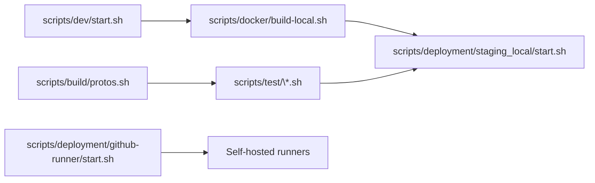

# Scripts Overview

This directory consolidates operational tooling used during development, CI builds, and deployments. Each subfolder groups scripts by lifecycle stage; the sections below summarize intent and entry points.

## Directory Catalog
- `build/`: language-specific build helpers (`golang.sh`, `protos.sh`, `frontend.sh`) wired into CI jobs or local automation.
- `deployment/`: infrastructure launchers for staging, production, and GitHub runners. See [Deployment Tooling](#deployment-tooling) for deeper coverage.
- `dev/`: developer convenience wrappers (`start.sh`, `stop.sh`, `clean.sh`) for local iterative flows with hot reload.
- `docker/`: utilities for building images locally, generating certs, and validating host prerequisites, highlighted in [Local Docker Tooling](#local-docker-tooling).
- `hooks/`: git hook installers and language-specific linters run before commits or pushes.
- `linters/`: language-agnostic lint orchestration, including the Dockerfile used by the language compliance pipeline.
- `secrets/`: bootstrap scripts for encrypted secrets material.
- `test/`: coverage, unit, integration, BDD, and workflow-local runners mirroring CI behaviour.
- `tools/`: ad-hoc video and frame analysis helpers for experimentation and debugging.

## Interaction Map

## Deployment Tooling
### `deployment/github-runner`
- **Purpose**: provisions self-hosted GitHub Actions runners for ARM64 and AMD64 workloads using Terraform (Proxmox VMs) and Ansible (runtime configuration, runner registration).
- **Pipeline**: `start.sh` verifies dependencies (`terraform`, `gh`, `ansible-playbook`, `jq`, `python3`), applies Terraform, renders per-runner Ansible variable files, executes `site.yml`, then polls the GitHub API until each runner reports `online`.
- **Outputs**: self-hosted runners labeled for workflow selection (`jetson-nano`, architecture-specific tags) and preloaded with Docker, NVIDIA toolkit, and registry credentials required by CI.
- **Maintenance**: `stop.sh` tears down instances via Terraform destroy; secrets such as `proxmox-api.key` live under `.secrets/` and must exist before provisioning.

### `deployment/staging_local`
- Ships a docker-compose stack mirroring production, pulling AMD64 images from GHCR. Useful for validating image outputs from CI on a laptop or workstation.

### `deployment/jetson-nano`
- Automates production deployment on Jetson Nano hardware using Ansible playbooks (`deploy.sh` orchestrates `init`, `sync`, and `start`). Aligns with the ARM64 CI workflow outputs.

### `deployment/local_dev`
- Provides `start.sh` for fast local stacks without cloud dependencies, targeting developers iterating on scripts or runtime settings.

## Local Docker Tooling
- `docker/build-local.sh`: builds the monorepo Docker image using the same Dockerfiles as CI, enabling preflight validation before opening pull requests.
- `docker/install-nvidia-toolkit.sh`: configures host NVIDIA drivers and container toolkit, matching the requirements enforced on self-hosted runners.
- `docker/generate-certs.sh`: issues local TLS certs consumed by `scripts/dev/start.sh` and staging stacks.

## Runner Operations Reference
For provisioning internals, troubleshooting workflows, and label conventions, refer to the dedicated CI documentation in [`.github/README.md`](../.github/README.md). The two documents complement each other: this file covers script entry points, while the CI doc explains how the workflows consume the resulting infrastructure.
