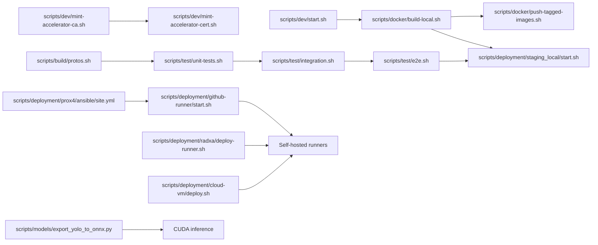

# Scripts Overview

This directory consolidates operational tooling used during development, CI builds, and deployments. Each subfolder groups scripts by lifecycle stage; the sections below summarize intent and entry points.

## Directory Catalog
- `build/`: language-specific build helpers (`golang.sh`, `protos.sh`, `frontend.sh`) wired into CI jobs or local automation.
- `deployment/`: infrastructure launchers for staging, production, GitHub runners, and ARM64 hardware. See [Deployment Tooling](#deployment-tooling) for deeper coverage.
- `dev/`: developer convenience wrappers for local iterative flows with hot reload. Includes service lifecycle (`start.sh`, `stop.sh`, `clean.sh`), observability (`grafana-mcp-server.sh`), mTLS certificate tooling (`mint-accelerator-ca.sh`, `mint-accelerator-cert.sh`), and VS Code attach helpers (`update_launch_*_attach_process_id.py`).
- `docker/`: utilities for building and pushing images, generating certs, and validating host prerequisites. See [Local Docker Tooling](#local-docker-tooling).
- `hooks/`: git hook installers and language-specific linters run before commits or pushes. Includes the pre-push build verifier.
- `linters/`: language-agnostic lint orchestration (`language-check.sh`) and the Dockerfile (`language.dockerfile`) used by the language compliance pipeline.
- `models/`: ML model export utilities. `export_yolo_to_onnx.py` downloads and exports YOLO models to ONNX format for C++/CUDA deployment.
- `secrets/`: bootstrap scripts for encrypted secrets material. `setup.sh` initializes development and production secrets from templates.
- `test/`: coverage, unit, integration, BDD, E2E, and workflow-local runners mirroring CI behaviour. See [Test Runners](#test-runners) for details.
- `tools/`: ad-hoc video and frame analysis helpers for experimentation and debugging:
  - `extract-frames.sh`: extract frames from video files
  - `generate-video.sh`: generate test video files
  - `analyze-frames.js`: analyze extracted frames (Node.js)
  - `analyze-video.js`: analyze video files (Node.js)

## Interaction Map

```mermaid
flowchart LR
    DevStart[scripts/dev/start.sh]
    DevMintCA[scripts/dev/mint-accelerator-ca.sh]
    DevMintCert[scripts/dev/mint-accelerator-cert.sh]
    BuildProtos[scripts/build/protos.sh]
    DockerLocal[scripts/docker/build-local.sh]
    DockerPush[scripts/docker/push-tagged-images.sh]
    UnitTests[scripts/test/unit-tests.sh]
    Integration[scripts/test/integration.sh]
    E2E[scripts/test/e2e.sh]
    Staging[scripts/deployment/staging_local/start.sh]
    Runners[scripts/deployment/github-runner/start.sh]
    Radxa[scripts/deployment/radxa/deploy-runner.sh]
    CloudVM[scripts/deployment/cloud-vm/deploy.sh]
    Prox4[scripts/deployment/prox4/ansible/site.yml]
    ExportModel[scripts/models/export_yolo_to_onnx.py]

    DevMintCA --> DevMintCert
    DevStart --> DockerLocal
    BuildProtos --> UnitTests
    DockerLocal --> DockerPush
    DockerLocal --> Staging
    UnitTests --> Integration
    Integration --> E2E
    E2E --> Staging
    Runners --> CI[Self-hosted runners]
    Prox4 --> Runners
    Radxa --> CI
    CloudVM --> CI
    ExportModel --> CudaKernels[CUDA inference]
```

## Deployment Tooling
### `deployment/github-runner`
- **Purpose**: provisions self-hosted GitHub Actions runners for ARM64 and AMD64 workloads using Terraform (Proxmox VMs) and Ansible (runtime configuration, runner registration).
- **Pipeline**: `start.sh` verifies dependencies (`terraform`, `gh`, `ansible-playbook`, `jq`, `python3`), applies Terraform, renders per-runner Ansible variable files, executes `site.yml`, then polls the GitHub API until each runner reports `online`.
- **Outputs**: self-hosted runners labeled for workflow selection (`jetson-nano`, architecture-specific tags) and preloaded with Docker, NVIDIA toolkit, and registry credentials required by CI.
- **Maintenance**: `stop.sh` tears down instances via Terraform destroy; secrets such as `proxmox-api.key` live under `.secrets/` and must exist before provisioning.

### `deployment/staging_local`
- Ships a docker-compose stack mirroring production, pulling AMD64 images from GHCR. Useful for validating image outputs from CI on a laptop or workstation.
- `start.sh` launches the full stack; `stop.sh` tears it down while preserving volumes; `clean.sh` removes volumes as well.

### `deployment/jetson-nano`
- Automates production deployment on Jetson Nano hardware using Ansible playbooks (`deploy.sh` orchestrates `init`, `sync`, and `start`). Aligns with the ARM64 CI workflow outputs.

### `deployment/prox4`
- Ansible playbooks for Prox4 (Proxmox) hosts and GitHub Actions runner LXC/VM targets.
- Files: `deployment/prox4/ansible/site.yml` (main playbook), `deployment/prox4/ansible/inventory.yml`, `deployment/prox4/ansible/ansible.cfg`
- **Runner provisioning**: `site.yml` installs **Docker CE** from Docker’s official apt repository (`docker-ce`, `docker-buildx-plugin`, etc.), not the distro `docker.io` package. Monorepo workflows set **`DOCKER_BUILDKIT=0`** so `scripts/docker/build-local.sh` uses the **classic** builder; Buildx remains available for other uses.
- **Related**: Proxmox template download and Bazel remote cache host roles are also defined in `site.yml`; coordinate with `deployment/github-runner` Terraform when creating runner CTs.

### `deployment/cloud-vm`
- Automates production deployment of the Go server to a cloud VM (x86_64) using Ansible playbooks. The Go server runs separately from the Jetson Nano deployment, which only hosts the gRPC server (C++ with CUDA) and infrastructure services.
- **Pipeline**: `deploy.sh` orchestrates Ansible playbooks: `ansible/sync.yml` (sync configuration and secrets) and `ansible/start.yml` (pull images and start services). Also includes `deploy-runner.sh` for provisioning a self-hosted GitHub Actions runner (`learning-cuda-cloud-vm-1`, labels: `self-hosted,Linux,X64,prod,cloud-vm`).
- **Automation**: Integrated into the x86 CI workflow (`docker-monorepo-build-x86.yml`) to automatically deploy after building and pushing images to GHCR.
- **Requirements**: SSH access to the cloud VM, Docker installed, user in docker group. Secrets configured in GitHub Actions: `CLOUD_VM_HOST`, `CLOUD_VM_USER`, `CLOUD_VM_SSH_KEY`.
- **Configuration**: Uses `docker-compose.go-cloud.yml` (deployed to cloud VM via Ansible sync) to deploy only the Go server service, connecting to existing Traefik instance via `public-wan` Docker network.

### `deployment/radxa`
- Automates GitHub Actions runner provisioning on Radxa ARM64 hardware. `deploy-runner.sh` registers runner `learning-cuda-radxa-1` with labels `self-hosted,Linux,ARM64,radxa`. Supports both `RADXA_*` and `JETSON_*` environment variables for compatibility. `test.sh` validates SSH connectivity and Ansible availability. Includes Ansible playbooks for application deployment and Docker orchestration. See [`deployment/radxa/README.md`](radxa/README.md) for full documentation.

## Local Docker Tooling
- `docker/build-local.sh`: builds the monorepo Docker image using the same Dockerfiles as CI, enabling preflight validation before opening pull requests.
- `docker/push-tagged-images.sh`: pushes locally built images to GHCR and publishes `latest-${ARCH}` aliases for `app`, `cpp-accelerator`, and `web-frontend`. Requires `ripgrep`.
- `docker/install-nvidia-toolkit.sh`: configures host NVIDIA drivers and container toolkit, matching the requirements enforced on self-hosted runners.
- `docker/generate-certs.sh`: issues local TLS certs consumed by `scripts/dev/start.sh` and staging stacks.
- `docker/validate-env.sh`: validates Docker environment prerequisites (SSL certs, Docker daemon, NVIDIA toolkit, GPU availability).

## Test Runners
- `test/unit-tests.sh`: runs unit tests for Go, C++ (Bazel), and frontend (Vitest). Supports `--skip-golang` and `--skip-frontend` flags for selective execution.
- `test/coverage.sh`: runs all coverage tests across the full stack.
- `test/linters.sh`: runs all linters. Supports `--fix` for auto-fixing lint issues.
- `test/e2e.sh`: runs Playwright end-to-end tests. Supports `--chromium` for fast Chromium-only runs, or runs all browsers by default.
- `test/integration.sh`: runs Docker-based BDD and E2E tests using `docker-compose.dev.yml`. Accepts `backend`, `e2e`, or `all` (default) to select which test suites to execute. Requires local services running (`scripts/dev/start.sh`).
- `test/workflow-local.sh`: tests GitHub Actions workflows locally using [act](https://github.com/nektos/act). Supports `--dry-run`, `--job <name>`, and `--list` flags. Requires `.secrets.act` with a valid `GITHUB_TOKEN`. See `test/README-act.md` for setup instructions.

## Model Export
- `models/export_yolo_to_onnx.py`: downloads a YOLO model (default: `yolov10n`) and exports it to ONNX format with dynamic axes and simplification. Requires `ultralytics` package. Output goes to `data/models/` by default.

## Runner Operations Reference
For provisioning internals, troubleshooting workflows, and label conventions, refer to the dedicated CI documentation in [`docs/ci-workflows.md`](../docs/ci-workflows.md). The two documents complement each other: this file covers script entry points, while the CI doc explains how the workflows consume the resulting infrastructure.
