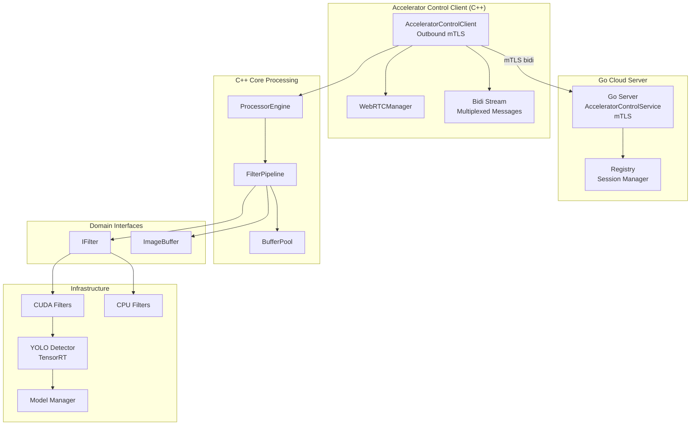
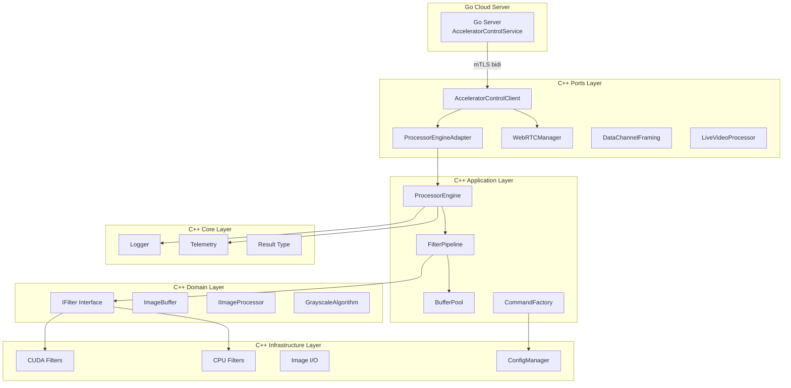
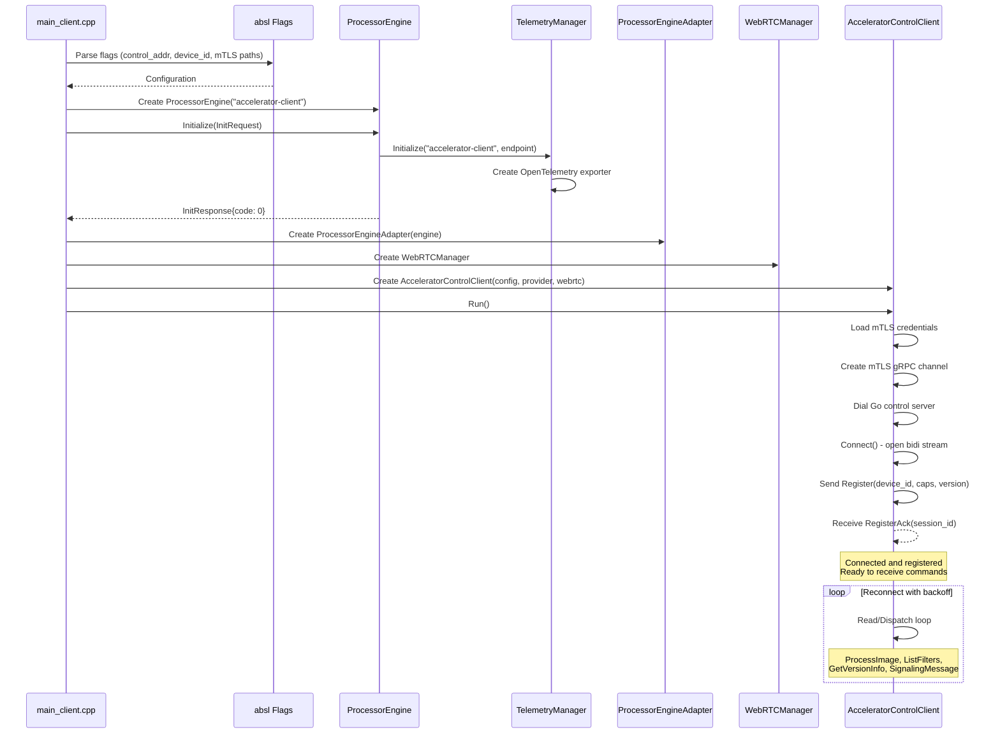
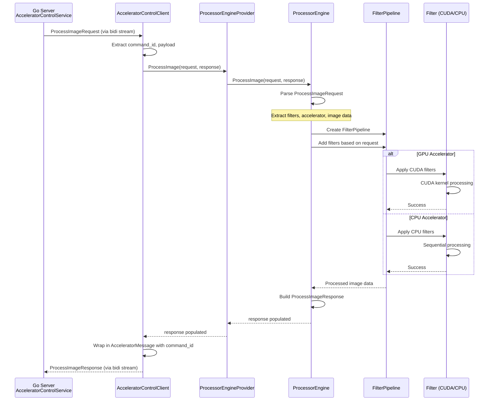

# CUDA Accelerator Library

High-performance image processing library implementing Clean Architecture principles with CUDA GPU acceleration and CPU fallback support.

## Library Description

The CUDA Accelerator Library provides a production-grade image processing framework with GPU-accelerated filters using CUDA kernels. The architecture follows Clean Architecture patterns with clear separation between domain logic, application use cases, infrastructure implementations, and external adapters.

**Version**: See `VERSION` file (currently 4.0.1)

**Note**: The library version (4.0.1) is separate from the C API version (2.1.0 defined in `processor_api.h`). The API version indicates the C interface contract, while the library version tracks overall library releases.

**Features**:
- GPU acceleration via CUDA kernels with CPU fallback
- **Accelerator Control Client** with mTLS outbound connections to Go cloud server
- **Multiplexed bidirectional gRPC stream** for all commands (image processing, filters, version, signaling)
- WebRTC signaling support for real-time video streaming
- **YOLO object detection** via TensorRT with GPU-accelerated inference
- **Data channel framing** for structured detection result transport over WebRTC
- Extensible filter pipeline architecture
- Thread-safe concurrent processing
- Buffer pooling and CUDA memory pooling for memory efficiency
- Configuration management system

## Architecture

### Component Overview

The library uses the **Accelerator Control Client** as the primary integration path. The client dials outbound to a Go cloud server via mTLS and establishes a multiplexed bidirectional stream for all communication. All processing requests are received from the Go server through the AcceleratorControlService protocol, which converges at the `ProcessorEngine` to orchestrate image processing through the filter pipeline.



### Layer Structure



### Initialization Sequence



### Processing Flow



## Directory Structure

```
cpp_accelerator/
├── application/                # Application layer - use cases and orchestration
│   ├── commands/               # Command pattern implementation (placeholder)
│   │   ├── command_interface.h
│   │   ├── command_factory.h/cpp
│   │   └── command_factory_test.cpp
│   └── pipeline/               # Filter pipeline implementation
│       ├── filter_pipeline.h/cpp
│       ├── buffer_pool.h/cpp
│       └── filter_pipeline_test.cpp
├── domain/                     # Domain layer - business logic interfaces
│   └── interfaces/             # Abstraction interfaces
│       ├── filters/            # Filter interfaces
│       │   └── i_filter.h
│       ├── processors/         # Processor interfaces
│       │   └── i_image_processor.h
│       ├── image_buffer.h
│       ├── image_source.h
│       ├── image_sink.h
│       ├── i_pixel_getter.h
│       └── grayscale_algorithm.h
├── infrastructure/             # Infrastructure layer - concrete implementations
│   ├── cuda/                   # CUDA kernel implementations → [see README](infrastructure/cuda/README.md)
│   │   ├── cuda_memory_pool.h/cpp             # Thread-local GPU allocation cache
│   │   ├── grayscale_kernel.cu/h              # Grayscale CUDA kernel
│   │   ├── grayscale_filter.h/cpp             # Grayscale filter (CUDA)
│   │   ├── blur_kernel.cu/h                   # Gaussian blur CUDA kernels (4 variants)
│   │   ├── blur_processor.h/wrapper.cpp       # Blur processor host interface
│   │   ├── letterbox_kernel.cu/h              # Aspect-preserving resize + NCHW convert for TRT
│   │   ├── i_yolo_detector.h                  # YOLO detector interface (extends IFilter)
│   │   ├── yolo_detector.h/cpp                # TensorRT-based YOLO inference engine
│   │   ├── yolo_factory.h/cpp                 # Factory for creating YOLO detector instances
│   │   ├── detection.h                        # Detection result struct
│   │   ├── model_manager.h/cpp                # Model loading & management
│   │   └── model_registry.h/cpp               # Model path registry
│   ├── cpu/                    # CPU fallback implementations
│   │   ├── grayscale_filter.h/cpp
│   │   └── blur_filter.h/cpp
│   ├── image/                  # Image I/O adapters
│   │   ├── image_loader.h/cpp
│   │   └── image_writer.h/cpp
│   ├── config/                 # Configuration management
│   │   ├── config_manager.h/cpp
│   │   └── models/
│   │       └── program_config.h
│   └── filters/                # Cross-accelerator tests
│       └── blur_equivalence_test.cpp
├── ports/                      # Ports layer - external adapters
│   ├── grpc/                   # Accelerator control client (primary integration path)
│   │   ├── accelerator_control_client.h/cpp   # Outbound mTLS client to Go server
│   │   ├── processor_engine_adapter.h/cpp     # Adapter for ProcessorEngine
│   │   ├── processor_engine_provider.h        # Provider interface
│   │   ├── webrtc_manager.h/cpp               # WebRTC session management
│   │   ├── data_channel_framing.h/cpp         # Binary framing protocol for WebRTC data channels
│   │   ├── live_video_processor.h/cpp         # Real-time video frame processing
│   │   └── main_client.cpp                    # Client entry point
│   └── shared_lib/             # Shared library exports (C API)
│       ├── processor_api.h                    # C API header
│       ├── processor_engine.h/cpp             # Processor engine shared lib wrapper
│       ├── cuda_processor_impl.cpp            # C API implementation
│       ├── image_buffer_adapter.h/cpp         # Image buffer adapter
│       ├── library_version.h                  # Library version constants
│       └── blur_e2e_test.cpp                  # End-to-end blur test
├── core/                       # Core utilities
│   ├── logger.h/cpp            # Logging infrastructure
│   ├── telemetry.h/cpp         # OpenTelemetry integration
│   ├── otel_log_sink.h/cpp     # OpenTelemetry log sink for spdlog
│   ├── signal_handler.h/cpp    # Process signal handling
│   └── result.h                # Error handling types
├── docker-cuda-runtime/        # CUDA runtime image for deployment
│   ├── Dockerfile
│   └── VERSION
├── yolo-model-gen/             # YOLO model generation container
│   ├── Dockerfile
│   └── VERSION
├── docker-compose.yml
├── Dockerfile.build            # Build image for gRPC server
├── Dockerfile.build.mock       # Mock build image for testing
├── VERSION                     # Library version file
└── lessons_learned.md          # Development notes and learnings
```

## Sub-folder Documentation

- **[infrastructure/cuda/README.md](infrastructure/cuda/README.md)** — Comprehensive CUDA tutorial covering kernel implementations, memory hierarchy, blur optimization variants, letterbox preprocessing, and TensorRT YOLO inference pipeline.

## Design Principles

1. **Dependency Inversion**: Domain interfaces define contracts; infrastructure implements them
2. **Single Responsibility**: Each component has one clear purpose
3. **Open/Closed**: Extend via new implementations, not modification
4. **Liskov Substitution**: All filter implementations are interchangeable
5. **Interface Segregation**: Small, focused interfaces (IFilter, ImageBuffer)
6. **Separation of Concerns**: Clear boundaries between layers
7. **Filter Pipeline**: Composable filter architecture for chaining multiple filters

## Key Components

### Accelerator Control Client

The library provides an outbound gRPC client (`AcceleratorControlClient`) that connects to a Go cloud server via mTLS. The client implements the `AcceleratorControlService` protocol buffer interface with a single multiplexed bidirectional stream.

**Multiplexed Message Types**:

The client sends and receives messages through the `AcceleratorMessage` envelope with `oneof payload`:

- **Register** (C++ → Go): First message sent on connection
  - Contains `device_id`, `display_name`, `version`, `capabilities`, `labels`
  - Go server responds with `RegisterAck` (accepted/rejected, assigned `session_id`)

- **ProcessImageRequest** (Go → C++): Image processing command
  - Contains image data, filter configuration, accelerator selection
  - Client responds with `ProcessImageResponse` with processed image data

- **ListFiltersRequest** (Go → C++): Capability discovery
  - Client responds with `ListFiltersResponse` containing filter definitions

- **GetVersionInfoRequest** (Go → C++): Version query
  - Client responds with `GetVersionInfoResponse` with library version details

- **SignalingMessage** (bidirectional): WebRTC signaling
  - SDP offers/answers, ICE candidates tunneled through the bidi stream

- **Keepalive** (bidirectional): Liveness check
  - No reply expected; used to detect dead connections

- **ErrorReport** (bidirectional): Error signaling
  - Optional `fatal` flag indicates connection should close

**Architecture**:

The `AcceleratorControlClient` holds a `ProcessorEngineProvider` interface for local processing and a `WebRTCManager` for WebRTC peer connections. The client:
1. Dials the Go control server with mTLS credentials
2. Opens a bidirectional stream via `Connect()`
3. Sends `Register` message with device metadata
4. Waits for `RegisterAck` confirmation
5. Enters read/dispatch loop, processing incoming commands from Go

Each message carries a `command_id` (UUID v7) for request/response correlation and an optional `trace_context` (W3C) for distributed tracing.

### WebRTC Real-time Video Processing

The library provides WebRTC-based real-time video streaming capabilities through WebRTCManager. WebRTC signaling messages are tunneled through the AcceleratorControlClient's multiplexed bidi stream.

**Components**:

- **WebRTCManager** (`ports/grpc/webrtc_manager.h/cpp`): Manages WebRTC peer connections, ICE candidate exchange, and session lifecycle
- **DataChannelFraming** (`ports/grpc/data_channel_framing.h/cpp`): Binary framing protocol for structured data transport over WebRTC data channels
- **LiveVideoProcessor** (`ports/grpc/live_video_processor.h/cpp`): Real-time video frame processing pipeline integrating with WebRTC data channels

**Signaling Flow**:

1. Go server sends `SignalingMessage` to C++ client via the bidi stream
2. AcceleratorControlClient dispatches signaling to WebRTCManager
3. WebRTCManager processes SDP offers/answers and ICE candidates
4. C++ client responds with `SignalingMessage` via the bidi stream
5. Direct WebRTC data channel established for video frame transport

### YOLO Object Detection

The library includes YOLO object detection via TensorRT for GPU-accelerated inference. See the [CUDA infrastructure README](infrastructure/cuda/README.md) for detailed documentation on the inference pipeline, letterbox preprocessing, and TensorRT engine lifecycle.

**Components**:

- **IYoloDetector** (`infrastructure/cuda/i_yolo_detector.h`): Detector interface extending `IFilter`
- **YOLODetector** (`infrastructure/cuda/yolo_detector.h/cpp`): TensorRT-based inference engine with NMS post-processing
- **YoloFactory** (`infrastructure/cuda/yolo_factory.h/cpp`): Factory for creating detector instances
- **ModelManager** (`infrastructure/cuda/model_manager.h/cpp`): Model loading & session management
- **ModelRegistry** (`infrastructure/cuda/model_registry.h/cpp`): Model path resolution
- **LetterboxKernel** (`infrastructure/cuda/letterbox_kernel.cu/h`): GPU-accelerated resize + pad + NCHW conversion

### Command Pattern

The command pattern infrastructure (`application/commands/`) is maintained for potential future use. All processing is currently handled directly by `FilterPipeline` which orchestrates filter chains without the command pattern abstraction layer.

### Buffer Pool

The `BufferPool` class provides efficient memory management for image processing operations by reusing allocated buffers. The buffer pool is optional — `FilterPipeline` can operate with or without it. When provided, it significantly improves performance for pipelines with multiple filters.

### Processor Engine

The `ProcessorEngine` is the core orchestration component that coordinates image processing operations. It bridges the external API interfaces (C API and gRPC) and the internal processing pipeline.

**Responsibilities**: Initialization and telemetry setup, filter orchestration via `FilterPipeline`, algorithm selection from protocol buffer enums, and response building.

**Integration Points**: Used by `ports/shared_lib` for C API implementation, and by `ports/grpc` via `ProcessorEngineAdapter` for the gRPC service.

### Domain Interfaces

The domain layer defines core abstractions used throughout the library:

**FilterType Enum**: `GRAYSCALE`, `BLUR`

**GrayscaleAlgorithm Enum**: `BT601` (SDTV), `BT709` (HDTV), `Average`, `Lightness`, `Luminosity`

**FilterContext Structure**: Contains `ImageBuffer` (input) and `ImageBufferMut` (output), passed to filters during `Apply()` operations.

**IImageProcessor Interface**: Defines contract for image processors that work with `IImageSource` and `IImageSink`.

## Code Quality & Compiler Warnings

The project enforces strict compiler warning standards. All warnings are treated as errors for the project's own code (`-Wall`, `-Wextra`, `-Werror` configured in `.bazelrc`).

For parameters that are part of interface contracts but not used in specific implementations, the `[[maybe_unused]]` attribute is used to maintain interface compatibility while clearly indicating intentional non-use.

All code in `cpp_accelerator/` compiles without warnings when `-Werror` is enabled.

## C API Reference

The library exposes a C API through `processor_api.h` for language-agnostic integration. All data exchange uses Protocol Buffer serialization.

**Core Functions**:

- **`processor_api_version()`**: Returns version information structure (major, minor, patch)
- **`processor_init()`**: Initializes the processor library. Not thread-safe — call once during startup.
- **`processor_cleanup()`**: Releases all processor resources. Not thread-safe.
- **`processor_process_image()`**: Processes an image with configured filters. Thread-safe after initialization.
- **`processor_get_capabilities()`**: Queries library capabilities. Thread-safe, can be called without initialization.
- **`processor_get_library_version()`**: Gets library version string from VERSION file. Thread-safe.
- **`processor_free_response()`**: Frees response buffers allocated by the library. Always call for every non-NULL response buffer.

**Memory Management**: Request buffers are managed by the caller. Response buffers are allocated by the library and must be freed using `processor_free_response()`. Never call `free()` or `delete` directly on response buffers.

**API Version**: The C API version is defined as `PROCESSOR_API_VERSION "2.1.0"` in `processor_api.h`. This is separate from the library version (4.0.1) and indicates the C interface contract.

## Adding New Filters

1. **Infrastructure**: Implement CPU and CUDA filter classes in `infrastructure/cpu/` and `infrastructure/cuda/`
2. **Application**: Filters are automatically usable via `FilterPipeline`
3. **Ports**: Update adapters if new parameters are required

The FilterPipeline automatically handles filter composition and execution order.

## Testing

Run all tests:
```bash
bazel test //src/cpp_accelerator/...
```

Run specific tests:
```bash
bazel test //src/cpp_accelerator/core:logger_test
bazel test //src/cpp_accelerator/core:result_test
bazel test //src/cpp_accelerator/application/pipeline:filter_pipeline_test
bazel test //src/cpp_accelerator/application/commands:commands_test
bazel test //src/cpp_accelerator/infrastructure/filters:blur_equivalence_test
bazel test //src/cpp_accelerator/infrastructure/cuda:grayscale_filter_test
bazel test //src/cpp_accelerator/infrastructure/cuda:blur_processor_test
bazel test //src/cpp_accelerator/infrastructure/cpu:grayscale_filter_test
bazel test //src/cpp_accelerator/infrastructure/cpu:blur_filter_test
bazel test //src/cpp_accelerator/infrastructure/image:image_loader_test
bazel test //src/cpp_accelerator/infrastructure/image:image_writer_test
bazel test //src/cpp_accelerator/infrastructure/config:config_manager_test
bazel test //src/cpp_accelerator/ports/shared_lib:blur_e2e_test
bazel test //src/cpp_accelerator/ports/grpc:data_channel_framing_test
```

## Building

Build accelerator control client:
```bash
bazel build //src/cpp_accelerator/ports/grpc:accelerator_control_client
```

Build shared library:
```bash
bazel build //src/cpp_accelerator/ports/shared_lib:libcuda_processor.so
```

Build all:
```bash
bazel build //src/cpp_accelerator/...
```

Refresh compile headers:
```bash
bazel run @hedron_compile_commands//:refresh_all
```

## Version Compatibility

The library uses semantic versioning:
- **Major**: Breaking API changes
- **Minor**: New features, backward compatible
- **Patch**: Bug fixes, backward compatible

The C API checks version compatibility at runtime to prevent mismatched library/loader combinations.
