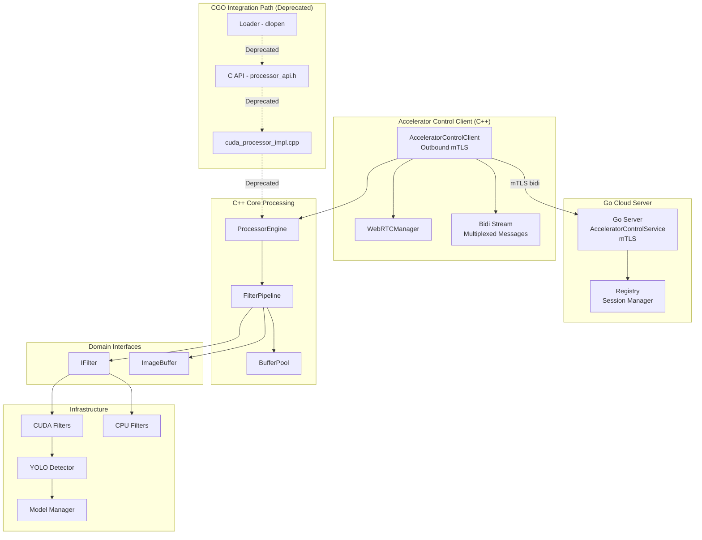
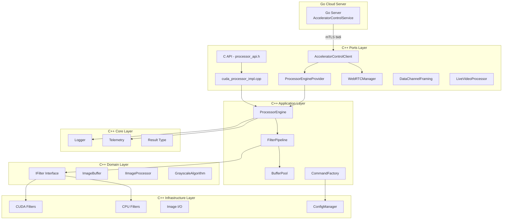
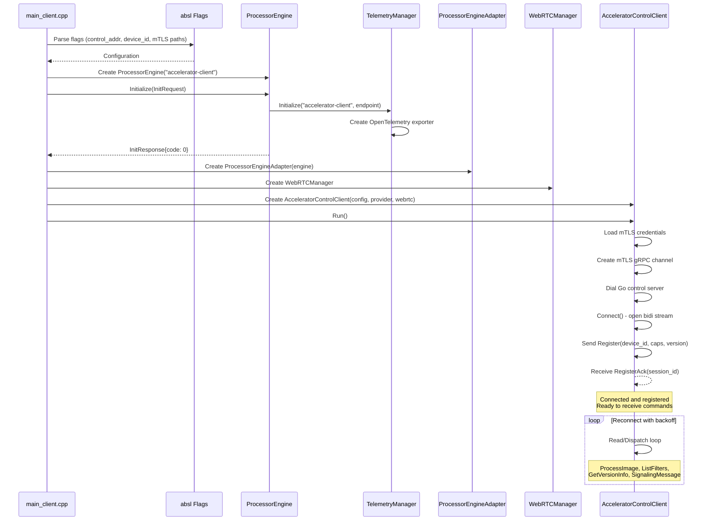
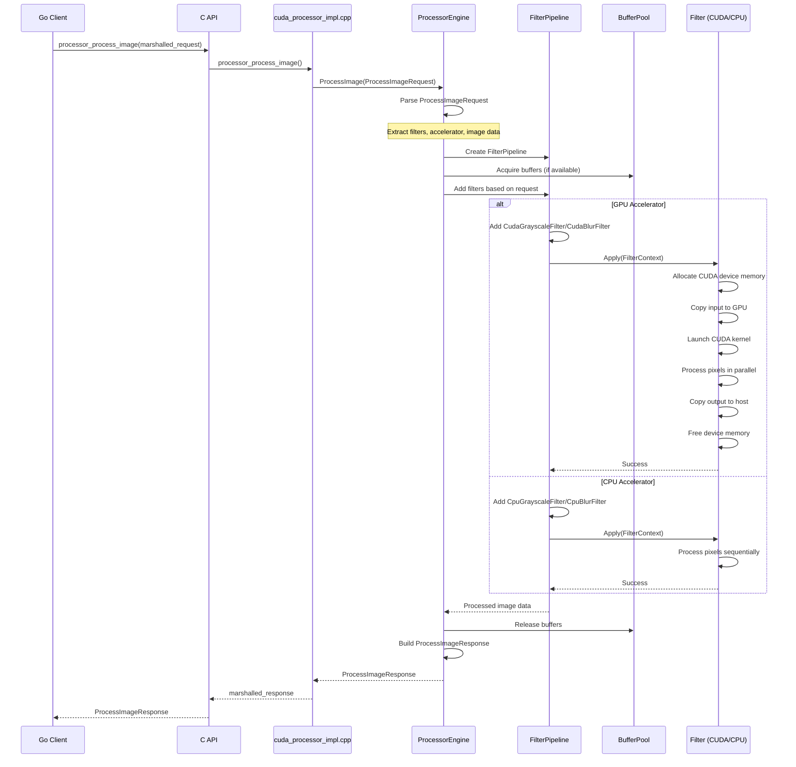
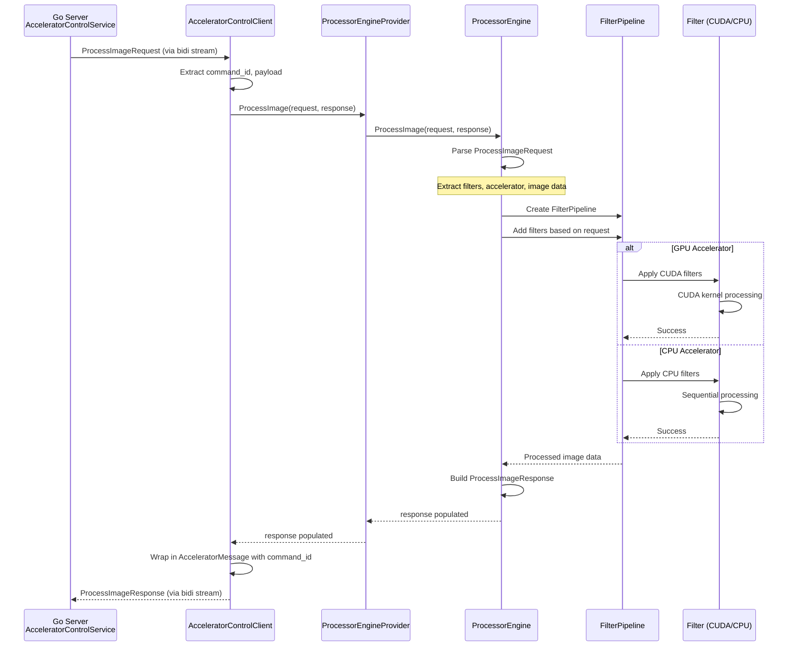

# CUDA Accelerator Library

High-performance image processing library implementing Clean Architecture principles with CUDA GPU acceleration and CPU fallback support.

## Library Description

The CUDA Accelerator Library provides a production-grade image processing framework with GPU-accelerated filters using CUDA kernels. The architecture follows Clean Architecture patterns with clear separation between domain logic, application use cases, infrastructure implementations, and external adapters.

**Version**: See `VERSION` file (currently 3.3.3)

**Note**: The library version (3.3.3) is separate from the C API version (2.1.0 defined in `processor_api.h`). The API version indicates the C interface contract, while the library version tracks overall library releases.

**Features**:
- GPU acceleration via CUDA kernels with CPU fallback
- Dynamic library loading for runtime plugin selection
- Protocol Buffers for language-agnostic API
- OpenTelemetry integration for distributed tracing and log aggregation
- Extensible filter pipeline architecture
- Thread-safe concurrent processing
- **Accelerator Control Client** with mTLS outbound connections to Go cloud server
- **Multiplexed bidirectional gRPC stream** for all commands (image processing, filters, version, signaling)
- WebRTC signaling support for real-time video streaming
- **YOLO object detection** via ONNX Runtime with CUDA Execution Provider
- **Data channel framing** for structured detection result transport over WebRTC
- Command pattern for program execution
- Buffer pooling for memory efficiency
- Configuration management system

## Architecture

### Component Overview

The library uses the **Accelerator Control Client** as the primary integration path. The client dials outbound to a Go cloud server via mTLS and establishes a multiplexed bidirectional stream for all communication. The CGO (Shared Library) path is deprecated and no longer used by the Go server. All processing requests are received from the Go server through the AcceleratorControlService protocol, which converges at the `ProcessorEngine` to orchestrate image processing through the filter pipeline.



### Layer Structure



### Initialization Sequences

#### Accelerator Control Client Initialization



### Processing Flows

#### CGO (Shared Library) Processing Flow (Deprecated)

> **Note**: The CGO processing flow is deprecated. The Go server no longer uses CGO. This section is retained for historical reference.



#### Accelerator Control Client Processing Flow



## Directory Structure

```
cpp_accelerator/
├── application/          # Application layer - use cases and orchestration
│   ├── commands/         # Command pattern implementation
│   │   ├── command_interface.h
│   │   ├── command_factory.h/cpp
│   │   └── command_factory_test.cpp
│   └── pipeline/         # Filter pipeline implementation
│       ├── filter_pipeline.h/cpp
│       ├── buffer_pool.h/cpp
│       └── filter_pipeline_test.cpp
├── domain/               # Domain layer - business logic interfaces
│   └── interfaces/       # Abstraction interfaces
│       ├── filters/      # Filter interfaces
│       │   └── i_filter.h
│       ├── processors/   # Processor interfaces
│       │   └── i_image_processor.h
│       ├── image_buffer.h
│       ├── image_source.h
│       ├── image_sink.h
│       ├── i_pixel_getter.h
│       └── grayscale_algorithm.h
├── infrastructure/       # Infrastructure layer - concrete implementations
│   ├── cuda/            # CUDA kernel implementations
│   │   ├── grayscale_kernel.cu/h
│   │   ├── blur_kernel.cu/h
│   │   ├── grayscale_filter.h/cpp
│   │   ├── blur_processor.h/wrapper.cpp
│   │   ├── yolo_detector.h/cpp        # YOLO object detection (ONNX Runtime)
│   │   ├── model_manager.h/cpp        # ONNX model loading & management
│   │   └── model_registry.h/cpp       # Model path registry
│   ├── cpu/             # CPU fallback implementations
│   │   ├── grayscale_filter.h/cpp
│   │   └── blur_filter.h/cpp
│   ├── image/           # Image I/O adapters
│   │   ├── image_loader.h/cpp
│   │   └── image_writer.h/cpp
│   ├── config/          # Configuration management
│   │   ├── config_manager.h/cpp
│   │   └── models/
│   │       └── program_config.h
│   └── filters/          # Filter equivalence tests
│       └── blur_equivalence_test.cpp
├── ports/               # Ports layer - external adapters
│   ├── grpc/            # Accelerator control client implementation (primary integration path)
│   │   ├── accelerator_control_client.h/cpp   # Outbound mTLS client to Go server
│   │   ├── processor_engine_adapter.h/cpp     # Adapter for ProcessorEngine
│   │   ├── processor_engine_provider.h        # Provider interface
│   │   ├── webrtc_manager.h/cpp               # WebRTC session management
│   │   ├── data_channel_framing.h/cpp         # Binary framing protocol for WebRTC data channels
│   │   ├── data_channel_framing_test.cpp      # Framing protocol tests
│   │   ├── live_video_processor.h/cpp         # Real-time video frame processing
│   │   └── main_client.cpp                    # Client entry point
│   └── shared_lib/      # Shared library exports
│       ├── processor_api.h
│       ├── processor_engine.h/cpp
│       ├── cuda_processor_impl.cpp
│       ├── image_buffer_adapter.h/cpp
│       └── library_version.h
├── core/                # Core utilities
│   ├── logger.h/cpp     # Logging infrastructure
│   ├── telemetry.h/cpp  # OpenTelemetry integration
│   ├── otel_log_sink.h/cpp  # OpenTelemetry log sink for spdlog
│   └── result.h         # Error handling types
├── docker-build-base/   # Docker build infrastructure
│   ├── Dockerfile       # Base image for Bazel builds
│   └── Dockerfile.mock  # Mock image for testing
├── docker-cpp-dependencies/    # Pre-built Bazel third-party/proto layer (intermediate:cpp-dependencies-*)
│   ├── Dockerfile
│   └── VERSION
├── Dockerfile.build     # Build image for gRPC server
├── Dockerfile.build.mock # Mock build image for testing
└── VERSION              # Library version file
```

## Design Principles

1. **Dependency Inversion**: Domain interfaces define contracts; infrastructure implements them
2. **Single Responsibility**: Each component has one clear purpose
3. **Open/Closed**: Extend via new implementations, not modification
4. **Liskov Substitution**: All filter implementations are interchangeable
5. **Interface Segregation**: Small, focused interfaces (IFilter, ImageBuffer)
6. **Separation of Concerns**: Clear boundaries between layers
7. **Filter Pipeline**: Composable filter architecture for chaining multiple filters

## Key Components

### Accelerator Control Client

The library provides an outbound gRPC client (`AcceleratorControlClient`) that connects to a Go cloud server via mTLS. The client implements the `AcceleratorControlService` protocol buffer interface with a single multiplexed bidirectional stream.

**Multiplexed Message Types**:

The client sends and receives messages through the `AcceleratorMessage` envelope with `oneof payload`:

- **Register** (C++ → Go): First message sent on connection
  - Contains `device_id`, `display_name`, `version`, `capabilities`, `labels`
  - Go server responds with `RegisterAck` (accepted/rejected, assigned `session_id`)

- **ProcessImageRequest** (Go → C++): Image processing command
  - Contains image data, filter configuration, accelerator selection
  - Client responds with `ProcessImageResponse` with processed image data

- **ListFiltersRequest** (Go → C++): Capability discovery
  - Client responds with `ListFiltersResponse` containing filter definitions

- **GetVersionInfoRequest** (Go → C++): Version query
  - Client responds with `GetVersionInfoResponse` with library version details

- **SignalingMessage** (bidirectional): WebRTC signaling
  - SDP offers/answers, ICE candidates tunneled through the bidi stream

- **Keepalive** (bidirectional): Liveness check
  - No reply expected; used to detect dead connections

- **ErrorReport** (bidirectional): Error signaling
  - Optional `fatal` flag indicates connection should close

**Architecture**:

The `AcceleratorControlClient` holds a `ProcessorEngineProvider` interface for local processing and a `WebRTCManager` for WebRTC peer connections. The client:
1. Dials the Go control server with mTLS credentials
2. Opens a bidirectional stream via `Connect()`
3. Sends `Register` message with device metadata
4. Waits for `RegisterAck` confirmation
5. Enters read/dispatch loop, processing incoming commands from Go

Each message carries a `command_id` (UUID v7) for request/response correlation and an optional `trace_context` (W3C) for distributed tracing.

### WebRTC Real-time Video Processing

The library provides WebRTC-based real-time video streaming capabilities through WebRTCManager. WebRTC signaling messages are tunneled through the AcceleratorControlClient's multiplexed bidi stream.

**Components**:

- **WebRTCManager** (`webrtc_manager.h/cpp`): Manages WebRTC peer connections, ICE candidate exchange, and session lifecycle
  - Creates and manages WebRTC PeerConnection instances
  - Handles ICE candidate exchange between peers
  - Receives signaling messages from AcceleratorControlClient
  - Cleans up inactive sessions

- **DataChannelFraming** (`data_channel_framing.h/cpp`): Binary framing protocol for structured data transport over WebRTC data channels
  - Encodes/decodes framed messages with type headers and payloads
  - Supports detection results, frame metadata, and control messages
  - Tests in `data_channel_framing_test.cpp`

- **LiveVideoProcessor** (`live_video_processor.h/cpp`): Real-time video frame processing pipeline
  - Integrates with WebRTC data channels for frame ingestion
  - Applies YOLO detection or filter processing per frame
  - Returns processed frames and detection results via data channel

**Signaling Flow**:

WebRTC signaling is now integrated into the AcceleratorControlService protocol:
1. Go server sends `SignalingMessage` to C++ client via the bidi stream
2. AcceleratorControlClient dispatches signaling to WebRTCManager
3. WebRTCManager processes SDP offers/answers and ICE candidates
4. C++ client responds with `SignalingMessage` via the bidi stream
5. Direct WebRTC data channel established for video frame transport

**Architecture**:

WebRTC replaces WebSocket for real-time video transport, providing:
- Lower latency through peer-to-peer communication
- H.264 video codec support for efficient streaming
- Direct integration with ProcessorEngine for per-frame processing
- ICE candidate handling for NAT traversal
- Signaling tunneled through the same mTLS connection used for processing commands
- Structured detection results via DataChannelFraming protocol

### YOLO Object Detection

The library includes YOLO object detection via ONNX Runtime with CUDA Execution Provider for GPU-accelerated inference.

**Components**:

- **YOLODetector** (`infrastructure/cuda/yolo_detector.h/cpp`): YOLO inference engine
  - Loads ONNX models exported from Ultralytics
  - Uses ONNX Runtime with CUDA Execution Provider for GPU inference
  - Preprocessing: resize to 640x640, normalize
  - Postprocessing: NMS, confidence thresholding
  - Returns `std::vector<Detection>` with bounding boxes and class labels

- **ModelManager** (`infrastructure/cuda/model_manager.h/cpp`): ONNX model lifecycle management
  - Loads and caches ONNX Runtime sessions
  - Manages CUDA EP configuration
  - Thread-safe model access

- **ModelRegistry** (`infrastructure/cuda/model_registry.h/cpp`): Model path resolution
  - Maps model names to filesystem paths
  - Validates model file existence
  - Default model path: `data/models/`

### Command Pattern

The library previously implemented a command pattern for program execution through `CommandFactory` and `ICommand` interface.

**NOTE**: All commands have been migrated to `FilterPipeline`. The `CommandFactory::register_commands()` method is now empty and kept as a placeholder. The command pattern infrastructure is maintained for potential future use but is not currently active in the processing pipeline.

**Historical Components**:

- **ICommand**: Interface defining command execution contract
- **CommandFactory**: Factory for creating commands (now placeholder)
- **ProgramConfig**: Configuration structure for program execution

Current processing is handled directly by `FilterPipeline` which orchestrates filter chains without the command pattern abstraction layer.

### Buffer Pool

The `BufferPool` class provides efficient memory management for image processing operations by reusing allocated buffers.

**Features**:

- **Acquire/Release Pattern**: Buffers are acquired from the pool when needed and released when done
- **Automatic Growth**: Pool expands as needed, creating new buffers when none are available
- **Memory Efficiency**: Reduces allocation overhead by reusing buffers across filter operations
- **Integration**: Used by `FilterPipeline` to manage intermediate buffers during multi-filter processing

The buffer pool is optional - `FilterPipeline` can operate with or without a buffer pool. When provided, it significantly improves performance for pipelines with multiple filters.

### Processor Engine

The `ProcessorEngine` is the core orchestration component that coordinates image processing operations. It serves as the bridge between the external API interfaces (C API and gRPC) and the internal processing pipeline.

**Responsibilities**:

- **Initialization**: Manages library initialization including telemetry setup
- **Filter Orchestration**: Creates and configures `FilterPipeline` instances based on requests
- **Algorithm Selection**: Converts protocol buffer enums to domain types (e.g., `GrayscaleAlgorithm`)
- **Response Building**: Constructs protocol buffer responses with processed data and metadata

**Integration Points**:

- Used by `ports/shared_lib` for C API implementation
- Used by `ports/grpc` via `ProcessorEngineAdapter` for gRPC service
- Coordinates with `FilterPipeline` for actual image processing
- Manages telemetry and logging context

### Configuration Management

The `ConfigManager` provides command-line argument parsing and configuration management.

**Features**:

- **Argument Parsing**: Parses command-line arguments into structured `ProgramConfig`
- **Type Safety**: Uses `ProgramType` enum for type-safe program selection
- **Validation**: Validates configuration before command creation

**Program Types**:

- **Passthrough**: No-op command (for testing/debugging)
- **CudaImageFilters**: GPU-accelerated image filter processing
- **CpuImageFilters**: CPU-based image filter processing

### Domain Interfaces

The domain layer defines core abstractions used throughout the library:

**FilterType Enum**:
- `GRAYSCALE`: Grayscale conversion filter
- `BLUR`: Gaussian blur filter

**GrayscaleAlgorithm Enum**:
- `BT601`: ITU-R BT.601 (SDTV): Y = 0.299R + 0.587G + 0.114B
- `BT709`: ITU-R BT.709 (HDTV): Y = 0.2126R + 0.7152G + 0.0722B
- `Average`: Simple average: Y = (R + G + B) / 3
- `Lightness`: Lightness: Y = (max(R,G,B) + min(R,G,B)) / 2
- `Luminosity`: Luminosity: Y = 0.21R + 0.72G + 0.07B

**FilterContext Structure**:
- Contains `ImageBuffer` (input) and `ImageBufferMut` (output)
- Passed to filters during `Apply()` operations
- Provides type-safe access to image dimensions and channel data

**IImageProcessor Interface**:
- Defines contract for image processors that work with `IImageSource` and `IImageSink`
- Enables processing pipelines that read from sources and write to sinks
- Supports file-based and memory-based processing workflows

## Code Quality & Compiler Warnings

The project enforces strict compiler warning standards to maintain high code quality. All warnings are treated as errors for the project's own code.

### Warning Configuration

The build system (configured in `.bazelrc`) enables aggressive warning detection for all code in `cpp_accelerator/`:

- **`-Wall`**: Enable all standard warnings
- **`-Wextra`**: Enable additional warnings beyond `-Wall`
- **`-Werror`**: Treat all warnings as errors, preventing compilation if warnings are present

This configuration applies only to the project's own code. External dependencies and generated code (protobuf, third-party libraries) are excluded from `-Werror` to avoid build failures from code we don't control.

### Warning Suppression Strategy

When external headers generate warnings that cannot be fixed (e.g., deprecated APIs in spdlog or protobuf), the project uses localized `#pragma GCC diagnostic` directives around the problematic includes:

```cpp
#pragma GCC diagnostic push
#pragma GCC diagnostic ignored "-Wdeprecated-declarations"
#pragma GCC diagnostic ignored "-Wmissing-requires"
#include <spdlog/spdlog.h>
#pragma GCC diagnostic pop
```

This approach is explicit and local—each file that includes external headers shows clearly which warnings are being suppressed and why.

### Unused Parameters

For parameters that are part of interface contracts but not used in specific implementations (e.g., stub implementations or test code), the `[[maybe_unused]]` attribute is used:

```cpp
bool TelemetryManager::Initialize(
    [[maybe_unused]] const std::string& service_name,
    [[maybe_unused]] const std::string& collector_endpoint,
    bool enabled) {
  // Stub implementation - parameters required by interface but not used
}
```

This is preferred over removing parameters or using `(void)parameter` casts, as it maintains interface compatibility while clearly indicating intentional non-use.

### Current Status

All code in `cpp_accelerator/` compiles without warnings when `-Werror` is enabled. The project maintains a zero-warning policy for its own code.

### Potential Improvements

1. **Static Analysis Integration**: Add clang-static-analyzer or cppcheck to CI/CD pipeline for deeper analysis beyond compiler warnings
2. **Warning Categories**: Consider enabling additional warning categories like `-Wpedantic` or `-Weffc++` for even stricter checks
3. **Custom Warnings**: Define project-specific warnings for common anti-patterns using compiler-specific extensions
4. **Automated Warning Suppression**: Create a script to audit and validate all `#pragma` suppressions, ensuring they're still necessary after dependency updates
5. **Documentation**: Generate warning reports as part of build artifacts to track warning trends over time

## C API Reference

The library exposes a C API through `processor_api.h` for language-agnostic integration. All data exchange uses Protocol Buffer serialization.

**Core Functions**:

- **processor_api_version()**: Returns version information structure (major, minor, patch)
  - Always safe to call, never fails
  - Use for runtime version compatibility checks

- **processor_init()**: Initializes the processor library
  - Parameters: serialized `InitRequest`, response buffer pointer
  - Returns: true on success, false on failure
  - Allocates response buffer (must be freed with `processor_free_response()`)
  - Not thread-safe - call once during application startup

- **processor_cleanup()**: Releases all processor resources
  - No parameters
  - Cleans up CUDA context and GPU memory
  - Not thread-safe - ensure all processing operations complete first
  - Must call `processor_init()` again after cleanup before processing

- **processor_process_image()**: Processes an image with configured filters
  - Parameters: serialized `ProcessImageRequest`, response buffer pointer
  - Returns: true on success, false on failure
  - Allocates response buffer (must be freed with `processor_free_response()`)
  - Thread-safe after successful initialization

- **processor_get_capabilities()**: Queries library capabilities
  - Parameters: serialized `GetCapabilitiesRequest`, response buffer pointer
  - Returns: true on success, false on failure
  - Returns supported filters, accelerators, algorithms, and metadata
  - Thread-safe, can be called without initialization
  - Capabilities are static and don't change during library lifetime

- **processor_get_library_version()**: Gets library version string from VERSION file
  - Parameters: output buffer (min 32 bytes), buffer length
  - Returns: true on success, false on failure
  - Thread-safe, can be called without initialization
  - Version string is null-terminated

- **processor_free_response()**: Frees response buffers allocated by the library
  - Parameters: buffer pointer to free
  - Always call for every non-NULL response buffer to prevent memory leaks
  - Passing NULL is safe and ignored
  - Do not use buffer after calling this function

**Memory Management**:
- Request buffers are managed by the caller
- Response buffers are allocated by the library and must be freed using `processor_free_response()`
- Never call `free()` or `delete` directly on response buffers

**Thread Safety**:
- `processor_init()` and `processor_cleanup()` are not thread-safe
- `processor_process_image()` and `processor_get_capabilities()` can be called concurrently after successful initialization

**API Version**: The C API version is defined as `PROCESSOR_API_VERSION "2.1.0"` in `processor_api.h`. This is separate from the library version (3.3.3) and indicates the C interface contract.

## Adding New Filters

To add a new filter (e.g., Gaussian Blur):

1. **Domain**: Implement `IFilter` interface if needed (current filters use existing interfaces)
2. **Infrastructure**: Implement CPU and CUDA filter classes
3. **Application**: Filters are automatically usable via FilterPipeline
4. **Ports**: Update the service/shared-library adapters if new parameters are required

Example flow for a new filter:
```
proto/common.proto: Define filter parameters (if needed)
infrastructure/cpu/: Implement CPU filter class
infrastructure/cuda/: Implement CUDA filter class
ports/shared_lib/: Wire up parameters to filters in cuda_processor_impl.cpp
ports/grpc/: Wire up parameters to filters when the service transport needs them
```

The FilterPipeline automatically handles filter composition and execution order.

## Testing

The library includes comprehensive test coverage across all layers:

**Test Types**:

- **Unit Tests**: Individual component testing (filters, pipeline, buffer pool, etc.)
- **Integration Tests**: Cross-component interaction testing
- **Equivalence Tests**: Verify CPU and CUDA filters produce identical results (`infrastructure/filters/blur_equivalence_test.cpp`)
- **Accelerator Control Client Tests**: Test outbound client implementation and message handling
- **Command Factory Tests**: Test command creation and execution

**Running Tests**:

Run all tests:
```bash
bazel test //src/cpp_accelerator/...
```

Run specific test:
```bash
bazel test //src/cpp_accelerator/core:logger_test
bazel test //src/cpp_accelerator/application/pipeline:filter_pipeline_test
bazel test //src/cpp_accelerator/application/commands:commands_test
bazel test //src/cpp_accelerator/infrastructure/filters:blur_equivalence_test
```

Run equivalence tests to verify CPU/CUDA consistency:
```bash
bazel test //src/cpp_accelerator/infrastructure/filters:blur_equivalence_test
```

## Building

Build shared library:
```bash
bazel build //src/cpp_accelerator/ports/shared_lib:libcuda_processor.so
```

Build accelerator control client:
```bash
bazel build //src/cpp_accelerator/ports/grpc:accelerator_control_client
```

Build all:
```bash
bazel build //src/cpp_accelerator/...
```

Refresh compile headers:
```bash
bazel run @hedron_compile_commands//:refresh_all
```

## Version Compatibility

The library uses semantic versioning:
- **Major**: Breaking API changes
- **Minor**: New features, backward compatible
- **Patch**: Bug fixes, backward compatible

The C API checks version compatibility at runtime to prevent mismatched library/loader combinations.
