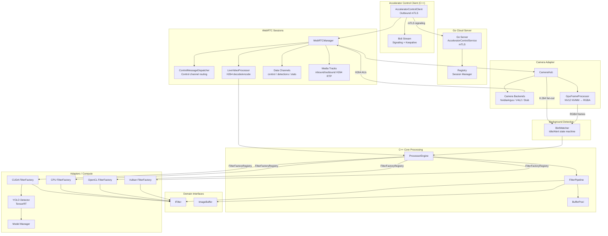
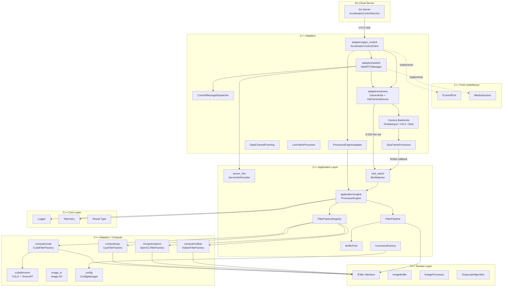
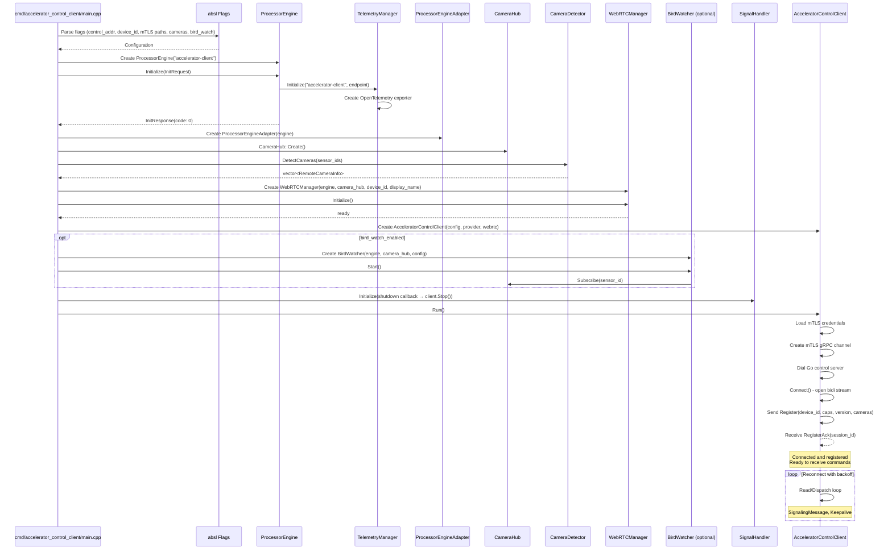
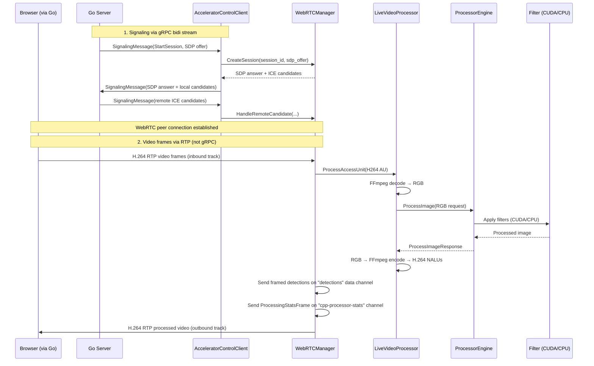
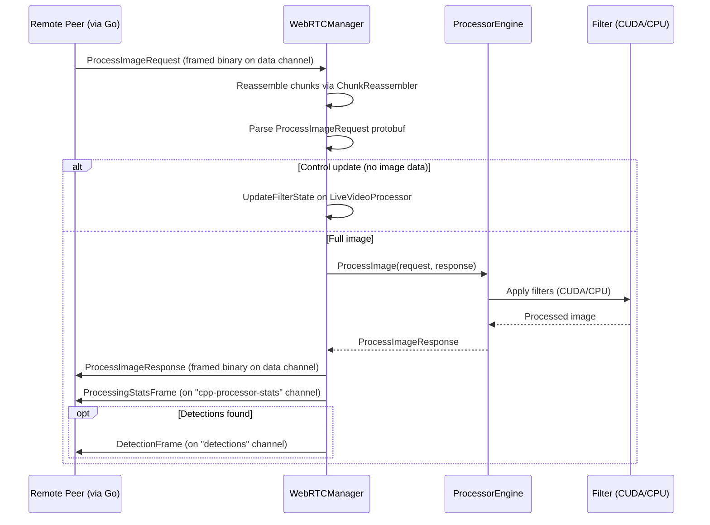
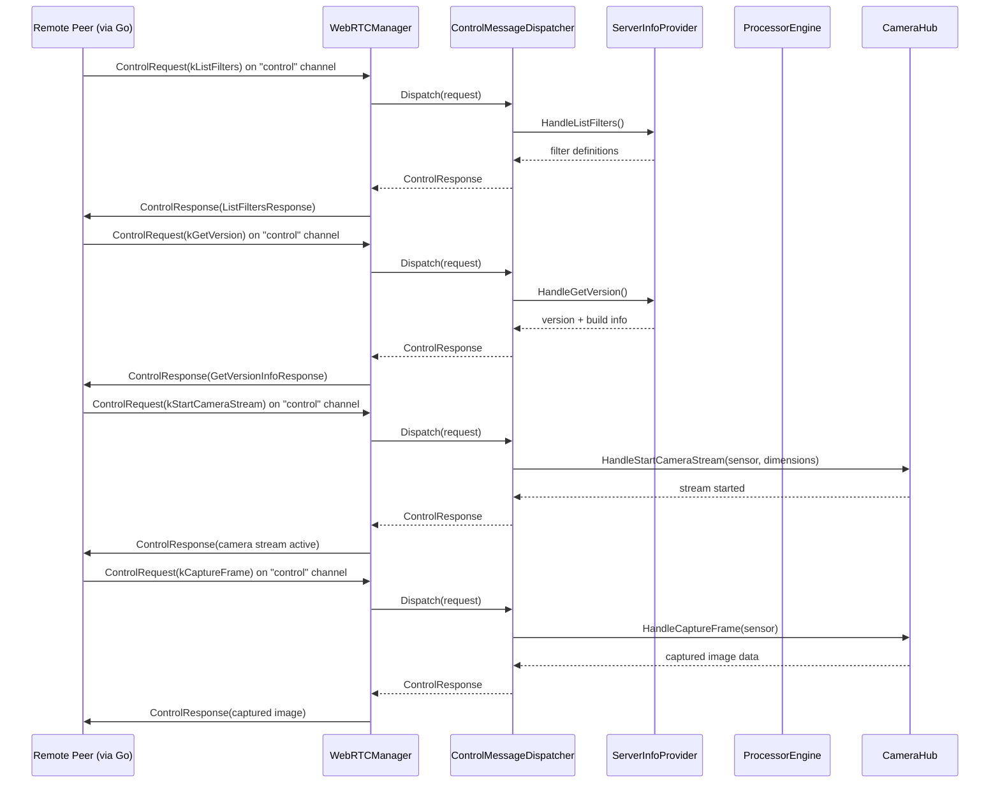

# CUDA Accelerator Library

High-performance image processing library implementing Clean Architecture principles with multi-backend GPU acceleration (CUDA, OpenCL) and CPU fallback support.

## Library Description

The CUDA Accelerator Library provides a production-grade image processing framework with GPU-accelerated filters. The architecture uses a **pluggable filter factory** pattern: `ProcessorEngine` is decoupled from concrete filter implementations via `IFilterFactory`, with one factory registered per accelerator backend (CUDA, CPU, OpenCL). New backends are added by implementing `IFilterFactory` and registering it at startup — no engine changes required. The library also includes remote camera capture via GStreamer/Jetson camera sources, streamed over WebRTC peer connections.

**Version**: See `VERSION` file (currently 4.7.2)

**Features**:
- Multi-backend GPU acceleration: **CUDA**, **OpenCL**, and CPU fallback
- Pluggable `IFilterFactory` / `FilterFactoryRegistry` for extensibility
- **Accelerator Control Client** with mTLS outbound connections to Go cloud server
- WebRTC signaling support for real-time video streaming
- **YOLO object detection** via TensorRT with GPU-accelerated inference
- **Data channel framing** for structured detection result transport over WebRTC
- **Remote camera streaming** via GStreamer/Jetson camera sources and CameraHub
- Extensible filter pipeline architecture
- Thread-safe concurrent processing
- Buffer pooling and CUDA memory pooling for memory efficiency
- Configuration management system

## Architecture

### Component Overview

The library uses the **Accelerator Control Client** as the primary integration path. The client dials outbound to a Go cloud server via mTLS and establishes a multiplexed bidirectional stream used exclusively for registration, WebRTC signaling, and keepalives. All image processing occurs over **WebRTC peer connections** established through that signaling. The Go server negotiates WebRTC sessions; once connected, video frames flow over RTP media tracks while still-image processing, detection results, and control requests flow over dedicated data channels. Remote camera streams from Jetson-attached sensors flow through `CameraHub` → camera backends (Argus/V4L2) → WebRTC outbound track. On Jetson, a `GpuFrameProcessor` provides a GPU-side NV12→RGBA tap for the `BirdWatcher` background detection service, which runs YOLO inference alongside the WebRTC stream without requiring a separate H.264 decode round-trip. All processing converges at the `ProcessorEngine` which orchestrates image processing through the filter pipeline.



### Layer Structure



### Initialization Sequence



### Processing Flows

The gRPC bidi stream carries only **signaling** and **keepalive** messages. All image processing flows through WebRTC peer connections after session establishment.

#### Live Video Processing (WebRTC Media Track)

The primary path for real-time video. Go sends H.264 video via RTP; C++ decodes, processes, re-encodes, and sends processed video back on an outbound track.



#### Still Image Processing (WebRTC Data Channel)

For individual frame processing requests sent as protobuf over the default data channel.



#### Control Requests (WebRTC Data Channel)

Filter discovery, version queries, camera stream control, and capture management are handled on a dedicated "control" data channel. The `ControlMessageDispatcher` routes each request type to a typed handler.



## Directory Structure

Hexagonal architecture: `ports/` holds abstract interfaces only; `adapters/` holds all concrete implementations.

```
cpp_accelerator/
├── cmd/
│   ├── accelerator_control_client/
│   │   ├── main.cpp            # Binary entry point
│   │   ├── BUILD_CONFIG.md     # Backend/camera build configuration docs
│   │   └── BUILD
│   ├── hello-world-opencl/     # Minimal OpenCL vector-add example
│   ├── hello-world-vulkan/     # Minimal Vulkan compute vector-add example
│   └── hello-world-nvidia-argus/ # Jetson Argus camera probe example
├── core/                       # Cross-cutting utilities (no deps on other layers)
│   ├── logger.h/cpp
│   ├── telemetry.h/cpp
│   ├── otel_log_sink.h/cpp
│   ├── signal_handler.h/cpp
│   ├── result.h
│   └── version.h               # Build-time version + git hash (generated)
├── domain/                     # Pure domain — no infrastructure deps
│   ├── interfaces/
│   │   ├── filters/
│   │   │   └── i_filter.h      # Core filter interface
│   │   ├── processors/
│   │   │   └── i_image_processor.h
│   │   ├── i_yolo_detector.h   # YOLO detector interface (extends IFilter)
│   │   ├── image_buffer.h, image_sink.h, image_source.h, i_pixel_getter.h
│   │   └── grayscale_algorithm.h
│   └── models/
│       └── detection.h         # Detection result struct
├── application/                # Use cases — orchestrates domain + adapters
│   ├── engine/
│   │   ├── processor_engine.h/cpp   # Main orchestrator: filter dispatch + YOLO cache
│   │   ├── i_filter_factory.h       # IFilterFactory — one per accelerator backend
│   │   ├── filter_descriptor.h      # FilterDescriptor, FilterCreationParams, BlurBorderMode
│   │   ├── filter_factory_registry.h/cpp  # Registry: AcceleratorType → IFilterFactory
│   │   ├── filter_creation_dispatch.hpp   # Shared Strategy Pattern dispatch helper
│   │   ├── README.md            # Engine filter dispatch pattern docs
│   │   └── BUILD
│   ├── pipeline/
│   │   ├── filter_pipeline.h/cpp
│   │   └── buffer_pool.h/cpp
│   ├── server_info/
│   │   ├── i_server_info_provider.h     # Interface for version/filter queries
│   │   ├── server_info_provider.h/cpp   # Implementation (reads VERSION, queries engine caps)
│   │   ├── filter_parameter_mapping.h/cpp  # Engine FilterParameter → wire GenericFilterParameter
│   │   └── accelerator_label.h/cpp         # AcceleratorType → human-readable label
│   ├── bird_watch/              # Background bird detection service
│   │   ├── bird_watcher.h/cpp            # Detection loop, state machine, FFmpeg decode
│   │   ├── bird_watcher_gpu_argus.cpp    # Jetson GPU NV12→RGBA path wiring
│   │   ├── bird_watcher_gpu_stub.cpp     # No-op stub for non-Argus builds
│   │   ├── README.md                     # Architecture, state machine, config docs
│   │   ├── README_STILLS.md              # High-res still capture + regression postmortem
│   │   └── BUILD
│   └── commands/               # CommandFactory (not wired into main pipeline)
├── ports/                      # Abstract port interfaces ONLY
│   ├── control/
│   │   └── i_control_port.h    # IControlPort — Run/Stop interface
│   └── media/
│       └── i_media_session.h   # IMediaSession — WebRTC session lifecycle
├── adapters/                   # Concrete implementations of ports + domain
│   ├── grpc_control/           # Outbound mTLS gRPC control client
│   │   ├── accelerator_control_client.h/cpp  # implements IControlPort
│   │   ├── processor_engine_adapter.h/cpp    # bridges engine → ProcessorEngineProvider
│   │   └── processor_engine_provider.h       # service provider interface
│   ├── webrtc/                 # WebRTC media path
│   │   ├── webrtc_manager.h/cpp              # implements IMediaSession
│   │   ├── control_message_dispatcher.h/cpp  # Control channel request routing
│   │   ├── webrtc_session_state.h            # SessionState struct (per-session state)
│   │   ├── live_video_processor.h/cpp        # H.264 decode → ProcessorEngine → encode
│   │   ├── data_channel_framing.h/cpp        # chunked binary framing + SendFramed over SCTP
│   │   ├── channel_labels.h                  # channel name constants, session prefixes
│   │   ├── session_routing.h/cpp             # IsGoVideoSession, ShouldRegisterSessionChannel
│   │   ├── protocol/             # WebRTC protocol helpers
│   │   │   ├── filter_resolver.h/cpp         # Generic filter → enum mapping
│   │   │   └── data_channel_envelope.h/cpp   # DataChannelRequest protobuf envelope parsing
│   │   └── sdp/                  # SDP utilities
│   │       └── sdp_utils.h/cpp               # Codec negotiation, extmap strip, ICE injection
│   ├── camera/                 # Camera capture and streaming
│   │   ├── camera_hub.h/cpp                 # Owns GstCameraSource per sensor, fans out H264 AUs
│   │   ├── camera_detector.h/cpp            # Camera detection facade
│   │   ├── camera_detector_impl.h/cpp       # Platform-specific detection dispatch
│   │   ├── camera_detector_impl_argus.cpp   # Argus sensor probe
│   │   ├── camera_detector_impl_v4l2.cpp    # V4L2 device probe
│   │   ├── gst_camera_source.h              # Camera source interface
│   │   ├── gst_camera_source_impl.h/cpp     # Platform dispatch for implementations
│   │   ├── gst_camera_source_impl_argus.cpp # Jetson Argus pipeline
│   │   ├── gst_camera_source_impl_v4l2.cpp  # V4L2/USB pipeline
│   │   ├── gst_camera_source_impl_gpu_argus.cpp # Argus + GPU NV12→RGBA tap
│   │   ├── gpu_frame_processor.h/cpp        # NV12 NVMM → RGBA via CUDA (Jetson)
│   │   ├── nvbuf_cuda_utils.h/cpp           # NvBufSurface mapping wrapper
│   │   └── backends/            # Pluggable camera backends
│   │       ├── camera_backend.h             # Common backend interface
│   │       ├── nvidia_argus_backend.h/cpp    # Jetson CSI (nvarguscamerasrc)
│   │       ├── v4l2_backend.h/cpp            # USB/V4L2 cameras
│   │       ├── stub_backend.h/cpp            # No-op fallback
│   │       └── README.md                    # Jetson camera ops guide
│   ├── compute/
│   │   ├── cpu/                # CPU filter implementations
│   │   │   ├── grayscale_filter.h/cpp
│   │   │   ├── blur_filter.h/cpp
│   │   │   └── cpu_filter_factory.h/cpp    # IFilterFactory for CPU
│   │   ├── cuda/
│   │   │   ├── cuda_filter_factory.h/cpp   # IFilterFactory for CUDA
│   │   │   ├── kernels/        # Kernel launchers (.h) and CUDA source (.cu)
│   │   │   │   ├── grayscale_kernel.h/cu
│   │   │   │   ├── letterbox_kernel.h/cu
│   │   │   │   ├── nv12_utils_kernel.h/cu  # NV12→RGBA + NV12 letterbox (Jetson)
│   │   │   │   ├── blur_kernel.h           # Launcher header for blur variants
│   │   │   │   └── blur/       # Blur kernel implementations
│   │   │   │       ├── device_utils.cuh    # Shared border-clamp helpers
│   │   │   │       ├── non_separable.cu    # Naive 2D convolution (reference)
│   │   │   │       ├── separable_basic.cu  # Two 1D passes (algorithmic win)
│   │   │   │       └── separable_tiled.cu  # Tiled + constant mem (production)
│   │   │   ├── filters/        # C++ wrappers: grayscale_filter, blur_filter
│   │   │   ├── memory/         # cuda_memory_pool (thread-local GPU alloc cache)
│   │   │   └── tensorrt/       # TensorRT/YOLO inference
│   │   │       ├── yolo_detector.h/cpp
│   │   │       ├── yolo_factory.h/trt.cpp
│   │   │       ├── model_manager.h/cpp
│   │   │       └── model_registry.h/cpp
│   │   ├── opencl/              # OpenCL filter implementations
│   │   │   ├── context/
│   │   │   │   └── context.h/cpp            # OpenCL platform/device initialization
│   │   │   ├── filters/
│   │   │   │   ├── grayscale_filter.h/cpp
│   │   │   │   └── blur_filter.h/cpp
│   │   │   ├── kernels/
│   │   │   │   ├── cl_grayscale.cl          # Grayscale OpenCL kernel source
│   │   │   │   └── cl_blur.cl               # Blur OpenCL kernel source
│   │   │   └── opencl_filter_factory.h/cpp  # IFilterFactory for OpenCL
│   │   ├── vulkan/              # Vulkan compute filter implementations
│   │   │   ├── context/
│   │   │   │   ├── context.h/cpp            # Vulkan instance/device initialization
│   │   │   │   └── compute_utils.h
│   │   │   ├── filters/
│   │   │   │   ├── grayscale_filter.h/cpp
│   │   │   │   └── blur_filter.h/cpp
│   │   │   ├── kernels/
│   │   │   │   ├── grayscale.comp           # Grayscale GLSL compute shader
│   │   │   │   └── blur.comp                # Blur GLSL compute shader
│   │   │   └── vulkan_filter_factory.h/cpp  # IFilterFactory for Vulkan
│   │   └── filters/            # Cross-backend equivalence tests
│   ├── image_io/               # Image file I/O (stb-based)
│   │   ├── image_loader.h/cpp
│   │   └── image_writer.h/cpp
│   └── config/                 # Configuration management
│       ├── config_manager.h/cpp
│       └── models/program_config.h
├── composition/                # Bazel-flag-driven platform wiring
│   └── platform/
│       ├── platform_support.h              # Common registration interface
│       ├── platform_support_cpu.cpp        # CPU-only build
│       ├── platform_support_cuda.cpp       # CUDA-only build
│       ├── platform_support_opencl.cpp     # OpenCL-only build
│       ├── platform_support_vulkan.cpp     # Vulkan-only build
│       ├── platform_support_full.cpp       # CUDA + OpenCL
│       ├── platform_support_all.cpp        # All backends
│       ├── platform_support_cuda_vulkan.cpp
│       ├── platform_support_opencl_vulkan.cpp
│       ├── cpu/
│       │   └── cpu_platform.h/cpp          # CPU platform registration
│       ├── cuda/
│       │   └── cuda_platform.h/cpp         # CUDA platform registration
│       ├── opencl/
│       │   └── opencl_platform.h/cpp       # OpenCL platform registration
│       └── vulkan/
│           └── vulkan_platform.h/cpp       # Vulkan platform registration
├── docker-cuda-runtime/
├── yolo-model-gen/
├── Dockerfile.build
├── VERSION
└── lessons_learned.md
```

## UML Class Diagrams

Mermaid class diagrams for each architectural layer are generated automatically from source using [clang-uml](https://github.com/bkryza/clang-uml) and the `compile_commands.json` produced by Bazel.

| Diagram | Scope |
|---------|-------|
| [cpp_domain_layer](../../docs/uml/generated/cpp_domain_layer.mmd) | `jrb::domain` — interfaces & models |
| [cpp_application_layer](../../docs/uml/generated/cpp_application_layer.mmd) | `jrb::application` — engine, pipeline, factories |
| [cpp_ports](../../docs/uml/generated/cpp_ports.mmd) | `jrb::ports` — hexagonal port interfaces |
| [cpp_core](../../docs/uml/generated/cpp_core.mmd) | `jrb::core` — Logger, Telemetry, Result |
| [cpp_control_adapters](../../docs/uml/generated/cpp_control_adapters.mmd) | gRPC control + WebRTC adapters |
| [cpp_compute_cpu](../../docs/uml/generated/cpp_compute_cpu.mmd) | `jrb::adapters::compute::cpu` |
| [cpp_compute_cuda](../../docs/uml/generated/cpp_compute_cuda.mmd) | `jrb::adapters::compute::cuda` + TensorRT |
| [cpp_compute_opencl](../../docs/uml/generated/cpp_compute_opencl.mmd) | `jrb::adapters::compute::opencl` |
| [cpp_compute_vulkan](../../docs/uml/generated/cpp_compute_vulkan.mmd) | `jrb::adapters::compute::vulkan` |

**Regenerate diagrams** (after source changes):

```bash
# One-time install (Ubuntu 24.04)
scripts/dev/install-clang-uml.sh

# Generate / refresh
scripts/build/uml.sh
```

See [docs/uml/README.md](../../docs/uml/README.md) for full documentation, viewing options, and troubleshooting.

## Sub-folder Documentation

- **[adapters/compute/cuda/README.md](adapters/compute/cuda/README.md)** — Comprehensive CUDA tutorial covering kernel implementations, memory hierarchy, blur optimization variants, letterbox preprocessing, and TensorRT YOLO inference pipeline.

- **[application/engine/README.md](application/engine/README.md)** — Describes the Strategy Pattern dispatch used in `IFilterFactory::CreateFilter` and the `DispatchCreateFilter` shared helper.

- **[adapters/camera/backends/README.md](adapters/camera/backends/README.md)** — End-to-end guide for Jetson camera backends (Argus/V4L2), Docker runtime dependencies, device mappings, operational diagnostics, and postmortem of the Orin Nano incident.

- **[application/bird_watch/README.md](application/bird_watch/README.md)** — BirdWatcher background detection service architecture, state machine, frame pipeline, rate gating, and Jetson/Argus integration.

- **[application/bird_watch/README_STILLS.md](application/bird_watch/README_STILLS.md)** — High-resolution still capture on Jetson, the NV12 GPU pipeline, and regression postmortem for the WebRTC frame corruption bug.

- **[cmd/accelerator_control_client/BUILD_CONFIG.md](cmd/accelerator_control_client/BUILD_CONFIG.md)** — Bazel build configuration for backend selection (`--config=cuda`, `--config=full`, etc.) and camera feature flags (`--config=v4l2-camera`, `--config=nvidia-argus-camera`).

- **[lessons_learned.md](lessons_learned.md)** — WebRTC pipeline debugging: libdatachannel weak_ptr track lifetime, MediaHandler chain execution order, and diagnostic methodology.

## Hello World Examples

The `cmd/` folder contains several minimal examples for learning GPU programming concepts. These are standalone programs that demonstrate specific compute APIs without the full accelerator architecture:

- **[OpenCL Hello World](cmd/hello-world-opencl/README.md)** — Minimal OpenCL example adding two float vectors on the GPU. Demonstrates OpenCL platform/device initialization, embedded SPIR-V and OpenCL C source assets, and program compilation.

- **[Vulkan Compute Hello World](cmd/hello-world-vulkan/README.md)** — Minimal Vulkan compute shader example for vector addition. Demonstrates Vulkan instance/device setup, compute pipeline creation, and embedded SPIR-V shaders.

- **[NVIDIA Argus Hello World](cmd/hello-world-nvidia-argus/)** — Minimal Jetson Argus camera probe example. Standalone Makefile + cross-compile Dockerfile for testing camera availability on Jetson targets.

These examples are intentionally kept separate from the production codebase and serve as learning resources for understanding the underlying compute APIs.

## Design Principles

1. **Dependency Inversion**: Domain interfaces define contracts; infrastructure implements them
2. **Single Responsibility**: Each component has one clear purpose
3. **Open/Closed**: Extend via new implementations, not modification
4. **Liskov Substitution**: All filter implementations are interchangeable
5. **Interface Segregation**: Small, focused interfaces (IFilter, ImageBuffer)
6. **Separation of Concerns**: Clear boundaries between layers
7. **Filter Pipeline**: Composable filter architecture for chaining multiple filters
8. **Pluggable Backends**: `IFilterFactory` + `FilterFactoryRegistry` enable zero-change engine extensibility

## Key Components

### Accelerator Control Client

The library provides an outbound gRPC client (`AcceleratorControlClient`) that connects to a Go cloud server via mTLS. The client implements the `AcceleratorControlService` protocol buffer interface with a single multiplexed bidirectional stream.

**Multiplexed Message Types** (gRPC bidi stream):

The client sends and receives messages through the `AcceleratorMessage` envelope with `oneof payload`. The gRPC stream carries only signaling and registration; actual processing uses WebRTC.

- **Register** (C++ → Go): First message sent on connection
  - Contains `device_id`, `display_name`, `accelerator_version`, `capabilities`
  - Go server responds with `RegisterAck` (accepted/rejected, assigned `session_id`)

- **SignalingMessage** (bidirectional): WebRTC session negotiation
  - `StartSession`: Go sends SDP offer, C++ responds with SDP answer
  - `IceCandidate`: Bidirectional ICE candidate exchange
  - `CloseSession`: Session teardown

- **Keepalive** (bidirectional): Liveness check
  - No reply expected; used to detect dead connections

**WebRTC Data Channel Message Types** (after peer connection established):

- **ProcessImageRequest**: Image processing and live filter control updates (default data channel)
- **ControlRequest**: `ListFilters`, `GetVersion`, `GetAcceleratorCapabilities`, `StartCameraStream`, `StopCameraStream`, `CaptureFrame`, `ListCapturedImages`, `GetCapturedImage`, `DeleteCapturedImage` ("control" data channel)
- **DetectionFrame**: Detection results from YOLO inference ("detections" data channel)
- **ProcessingStatsFrame**: Per-frame timing metrics ("cpp-processor-stats" data channel)

**Architecture**:

The `AcceleratorControlClient` holds a `ProcessorEngineProvider` interface for local processing and a `WebRTCManager` for WebRTC peer connections. The `WebRTCManager` delegates control channel messages to a `ControlMessageDispatcher`. The client:
1. Dials the Go control server with mTLS credentials
2. Opens a bidirectional stream via `Connect()`
3. Sends `Register` message with device metadata
4. Waits for `RegisterAck` confirmation
5. Enters read/dispatch loop, processing incoming commands from Go

Each message carries a `command_id` (UUID v7) for request/response correlation and an optional `trace_context` (W3C) for distributed tracing.

### WebRTC Real-time Video Processing

The library provides WebRTC-based real-time video streaming capabilities through WebRTCManager. WebRTC signaling messages are tunneled through the AcceleratorControlClient's gRPC bidi stream; after session establishment, all data flows over the peer connection.

**Components**:

- **WebRTCManager** (`adapters/webrtc/webrtc_manager.h/cpp`): Manages WebRTC peer connections, ICE candidate exchange, session lifecycle, and per-session CUDA memory pools. Delegates control channel messages to `ControlMessageDispatcher`.
- **ControlMessageDispatcher** (`adapters/webrtc/control_message_dispatcher.h/cpp`): Routes incoming `ControlRequest` messages to typed handlers (ListFilters, GetVersion, GetAcceleratorCapabilities, StartCameraStream, StopCameraStream, CaptureFrame, ListCapturedImages, GetCapturedImage, DeleteCapturedImage).
- **SessionState** (`adapters/webrtc/webrtc_session_state.h`): Per-session state struct holding peer connection, data channels, RTP handlers, memory pool, live video processor, camera subscription, and synchronization primitives.
- **LiveVideoProcessor** (`adapters/webrtc/live_video_processor.h/cpp`): Real-time video frame processing pipeline — FFmpeg H.264 decode → RGB → ProcessorEngine → RGB → FFmpeg H.264 encode
- **DataChannelFraming** (`adapters/webrtc/data_channel_framing.h/cpp`): Binary chunking/reassembly protocol for large protobuf messages over SCTP data channels, plus `SendFramed()` helper
- **Channel labels & routing** (`adapters/webrtc/channel_labels.h`, `session_routing.h/cpp`): Channel name constants, Go-video session prefix detection, session channel registration logic
- **Protocol helpers** (`adapters/webrtc/protocol/`): Filter parameter resolution (`filter_resolver`), `DataChannelRequest` protobuf envelope parsing (`data_channel_envelope`)
- **SDP utilities** (`adapters/webrtc/sdp/sdp_utils.h/cpp`): H.264 codec negotiation, RTP header extension stripping, manual ICE candidate injection, SDP answer waiting

**WebRTC Channels per Session**:

| Channel | Direction | Purpose |
|---|---|---|
| Inbound video track | Peer → C++ | H.264 RTP live camera frames |
| Outbound video track | C++ → Peer | H.264 RTP processed video |
| Default data channel | Bidirectional | `ProcessImageRequest`/`Response` for still images + live filter state updates |
| `control` | Bidirectional | Filter/version queries, camera stream control, capture management |
| `detections` | C++ → Peer | `DetectionFrame` with YOLO bounding boxes |
| `cpp-processor-stats` | C++ → Peer | `ProcessingStatsFrame` with per-frame timing metrics |

**Signaling Flow**:

1. Go server sends `SignalingMessage(StartSession)` with SDP offer via gRPC bidi stream
2. AcceleratorControlClient dispatches to WebRTCManager
3. WebRTCManager creates PeerConnection, sets up track/channel handlers, creates `ControlMessageDispatcher` for the session, generates SDP answer
4. ICE candidates exchanged via `SignalingMessage(IceCandidate)` through the bidi stream
5. Direct WebRTC peer connection established — all subsequent data flows over RTP/data channels
6. Control channel messages routed through `ControlMessageDispatcher` to typed handlers

### YOLO Object Detection

The library includes YOLO object detection via TensorRT for GPU-accelerated inference. See the [CUDA compute adapter README](adapters/compute/cuda/README.md) for detailed documentation on the inference pipeline, letterbox preprocessing, and TensorRT engine lifecycle.

**Components**:

- **IYoloDetector** (`domain/interfaces/i_yolo_detector.h`): Detector interface extending `IFilter`
- **YOLODetector** (`adapters/compute/cuda/tensorrt/yolo_detector.h/cpp`): TensorRT-based inference engine with NMS post-processing
- **YoloFactory** (`adapters/compute/cuda/tensorrt/yolo_factory.h/trt.cpp`): Factory for creating detector instances
- **ModelManager** (`adapters/compute/cuda/tensorrt/model_manager.h/cpp`): Model loading & session management
- **ModelRegistry** (`adapters/compute/cuda/tensorrt/model_registry.h/cpp`): Model path resolution
- **LetterboxKernel** (`adapters/compute/cuda/kernels/letterbox_kernel.cu/h`): GPU-accelerated resize + pad + NCHW conversion
- **NV12 Utils** (`adapters/compute/cuda/kernels/nv12_utils_kernel.cu/h`): GPU-accelerated NV12→RGBA conversion and NV12 letterbox for Jetson camera pipeline
- **GpuFrameProcessor** (`adapters/camera/gpu_frame_processor.h/cpp`): Maps NV12 NVMM GstBuffer to CUDA and runs the NV12→RGBA kernel for BirdWatcher GPU path

### Camera Adapter

The camera adapter provides Jetson-attached and USB camera capture and streaming over WebRTC. Camera sources are probed at startup via platform-specific detector implementations and advertised as remote cameras in the registration message.

**Components**:

- **CameraHub** (`adapters/camera/camera_hub.h/cpp`): Owns one `GstCameraSource` per sensor ID. Fans out encoded H.264 access units to multiple WebRTC session subscribers via RAII `Subscription` handles. Also provides `GrabStillFrame()` for high-resolution captures and `GetGpuFrameProcessor()` for GPU-side NV12→RGBA tap. Devices are lazily opened on first subscribe and held open until process shutdown to avoid `EBUSY` on rapid open/close cycles.
- **GstCameraSource** (`adapters/camera/gst_camera_source.h`): Camera source interface. Platform dispatch through `gst_camera_source_impl.h/cpp` routes to Argus, V4L2, or GPU-Argus implementations based on build configuration.
- **CameraDetector** (`adapters/camera/camera_detector.h/cpp`): Facade that delegates to platform-specific `CameraDetectorImpl` variants (Argus, V4L2) to probe sensor IDs and return `RemoteCameraInfo` protobuf for each detected camera.
- **GpuFrameProcessor** (`adapters/camera/gpu_frame_processor.h/cpp`): Maps NV12 NVMM `GstBuffer` to CUDA, runs `nv12_to_rgba` kernel, forwards RGBA to an optional consumer (e.g., BirdWatcher YOLO). Does no work when no `RgbCallback` is registered.
- **Camera Backends** (`adapters/camera/backends/`): Pluggable backend implementations selected at compile time via Bazel `select()`:
  - **NvidiaArgusBackend** (`nvidia_argus_backend.h/cpp`): Jetson CSI cameras via `nvarguscamerasrc`. Supports hardware NVENC and software x264enc fallback. Three-branch `tee` pipeline: `still_sink` (full-res NV12), `raw_sink` (720p NVMM for GPU tap), `stream_sink` (720p H.264 for WebRTC).
  - **V4l2Backend** (`v4l2_backend.h/cpp`): USB/V4L2 cameras via GStreamer.
  - **StubBackend** (`stub_backend.h/cpp`): No-op fallback when no camera backend is compiled in.

See **[adapters/camera/backends/README.md](adapters/camera/backends/README.md)** for the full Jetson operations guide, Docker requirements, and debugging postmortems.

**Integration**: `WebRTCManager` receives a `CameraHub` instance and uses `CreateCameraSession()` to establish a WebRTC peer connection that streams H.264 from a camera backend to the remote peer. `BirdWatcher` subscribes to the same `CameraHub` fan-out for background detection. On Jetson, `GpuFrameProcessor` provides a GPU-side NV12→RGBA tap that bypasses the H.264 decode round-trip for YOLO inference. The camera registration data flows through `AcceleratorControlClient` → `Register` message → Go server.

### BirdWatcher Background Detection

The BirdWatcher (`application/bird_watch/`) is an optional background service that runs autonomous bird detection alongside the WebRTC live-streaming stack. It subscribes to the same `CameraHub` fan-out as browser clients, decodes H.264 frames with FFmpeg (or receives GPU NV12→RGBA frames on Jetson), runs YOLO inference via `ProcessorEngine`, and saves BMP captures of detected birds.

**Key design points**:

- **WebRTC-independent**: Standalone `CameraHub` subscriber. Camera stays alive even with zero WebRTC clients.
- **Two-state machine** (Idle/Alert): Idle mode throttles YOLO to once every N seconds; Alert mode runs inference on every frame.
- **Rate gating**: Captures are constrained by configurable per-minute and minimum-interval limits.
- **Jetson GPU path**: On Argus builds, bypasses the H.264 decode round-trip by receiving NV12 frames directly from `GpuFrameProcessor` via `cuda_nv12_to_rgba_device` kernel.

See **[application/bird_watch/README.md](application/bird_watch/README.md)** for full architecture, configuration flags, and **[application/bird_watch/README_STILLS.md](application/bird_watch/README_STILLS.md)** for the high-resolution still capture pipeline and regression postmortem.

### Command Pattern

The command pattern infrastructure (`application/commands/`) is maintained for potential future use. All processing is currently handled directly by `FilterPipeline` which orchestrates filter chains without the command pattern abstraction layer.

### Filter Factory Pattern

The engine uses a **pluggable factory pattern** to decouple from concrete filter implementations:

- **`IFilterFactory`** (`application/engine/i_filter_factory.h`): Interface with three methods — `GetAcceleratorType()`, `GetFilterDescriptors()`, `CreateFilter()`
- **`FilterFactoryRegistry`** (`application/engine/filter_factory_registry.h`): Maps `AcceleratorType` → `IFilterFactory`. One factory per type; re-registration replaces.
- **`FilterDescriptor`** (`application/engine/filter_descriptor.h`): Declarative filter metadata (id, name, parameters with validation rules). Each factory returns its supported filters.
- **`FilterCreationParams`**: Runtime parameter struct passed to `CreateFilter()` — factories read what they need.

Registered factories: `CudaFilterFactory`, `CpuFilterFactory`, `OpenCLFilterFactory`, `VulkanFilterFactory`.

`GetCapabilities()` accepts an optional `requested_accelerator` — when specified, only that backend's filter descriptors are returned. When unspecified, all factories contribute (backward compatible).

### Processor Engine

The `ProcessorEngine` is the core orchestration component that coordinates image processing operations. It uses a `FilterFactoryRegistry` to look up the appropriate `IFilterFactory` for the requested accelerator type, then delegates filter creation to that factory. This decouples the engine from concrete filter implementations.

**Responsibilities**: Initialization and telemetry setup, filter orchestration via `FilterFactoryRegistry` → `IFilterFactory` → `FilterPipeline`, algorithm selection from protocol buffer enums, and response building.

**Integration Points**: Used by `adapters/grpc_control` via `ProcessorEngineAdapter` for the gRPC service, and by `adapters/webrtc` for WebRTC data channel and live video processing.

### Domain Interfaces

The domain layer defines core abstractions used throughout the library:

**FilterType Enum**: `GRAYSCALE`, `BLUR`

**GrayscaleAlgorithm Enum**: `BT601` (SDTV), `BT709` (HDTV), `Average`, `Lightness`, `Luminosity`

**IFilter Interface** (`domain/interfaces/filters/i_filter.h`): Core filter contract with `Apply()` method.

**IYoloDetector Interface** (`domain/interfaces/i_yolo_detector.h`): YOLO detector interface extending `IFilter`.

**FilterContext Structure**: Contains `ImageBuffer` (input) and `ImageBufferMut` (output), passed to filters during `Apply()` operations.

**IImageProcessor Interface** (`domain/interfaces/processors/i_image_processor.h`): Defines contract for image processors that work with `IImageSource` and `IImageSink`.

## Code Quality & Compiler Warnings

The project enforces strict compiler warning standards. All warnings are treated as errors for the project's own code (`-Wall`, `-Wextra`, `-Werror` configured in `.bazelrc`).

For parameters that are part of interface contracts but not used in specific implementations, the `[[maybe_unused]]` attribute is used to maintain interface compatibility while clearly indicating intentional non-use.

All code in `cpp_accelerator/` compiles without warnings when `-Werror` is enabled.

## C API Reference

The library previously exposed a C API through `processor_api.h`. The shared library build target (`libcuda_processor.so`) has been removed. The `processor_engine` wrapper in the application layer is now used directly by the gRPC and WebRTC adapters.

**API Version**: The C API version was defined as `PROCESSOR_API_VERSION "2.1.0"`. This is separate from the library version (4.7.2).

## Adding New Filters or Backends

### Adding a new filter to an existing backend

1. **Adapters**: Implement the filter class in the appropriate `adapters/compute/<backend>/` directory
2. **Factory**: Add the filter to the backend's `IFilterFactory::CreateFilter()` switch and add a `FilterDescriptor` to `GetFilterDescriptors()`
3. **Protocol**: Add parameter parsing in `adapters/webrtc/protocol/filter_resolver` if new generic filter parameters are needed

### Adding a new accelerator backend

1. **Adapters**: Create `adapters/compute/<backend>/` with filter implementations and an `<backend>_filter_factory.h/cpp` implementing `IFilterFactory`
2. **Platform registration**: Create `composition/platform/<backend>/<backend>_platform.h/cpp` with `RegisterFactories()` function
3. **Composition**: Create a new `composition/platform/platform_support_<backend>.cpp` that includes `cpu` + the new backend
4. **Bazel flags**: Add `bool_flag` and `config_setting` in `bazel/flags/BUILD`, add `--config` shorthand in `.bazelrc`
5. **Composition BUILD**: Add entries to the `select()` blocks in `composition/BUILD` for the new backend and its combinations
6. **Protocol buffer**: Add the new `AcceleratorType` enum value in `image_processor_service.proto`

The `FilterFactoryRegistry` handles the rest — no engine logic changes needed.

See **[cmd/accelerator_control_client/BUILD_CONFIG.md](cmd/accelerator_control_client/BUILD_CONFIG.md)** for full details on the build configuration system.

The FilterPipeline automatically handles filter composition and execution order.

## Testing

Run all tests:
```bash
bazel test //src/cpp_accelerator/...
```

Run specific tests:
```bash
bazel test //src/cpp_accelerator/core:logger_test
bazel test //src/cpp_accelerator/core:result_test
bazel test //src/cpp_accelerator/application/pipeline:filter_pipeline_test
bazel test //src/cpp_accelerator/application/commands:commands_test
bazel test //src/cpp_accelerator/adapters/compute/filters:blur_equivalence_test
bazel test //src/cpp_accelerator/adapters/compute/cuda/filters:grayscale_filter_test
bazel test //src/cpp_accelerator/adapters/compute/cuda/filters:blur_filter_test
bazel test //src/cpp_accelerator/adapters/compute/cpu:grayscale_filter_test
bazel test //src/cpp_accelerator/adapters/compute/cpu:blur_filter_test
bazel test //src/cpp_accelerator/adapters/compute/opencl/filters:grayscale_filter_test
bazel test //src/cpp_accelerator/adapters/compute/opencl/filters:blur_filter_test
bazel test //src/cpp_accelerator/adapters/compute/vulkan/filters:grayscale_filter_test
bazel test //src/cpp_accelerator/adapters/compute/vulkan/filters:blur_filter_test
bazel test //src/cpp_accelerator/adapters/image_io:image_loader_test
bazel test //src/cpp_accelerator/adapters/image_io:image_writer_test
bazel test //src/cpp_accelerator/adapters/config:config_manager_test
bazel test //src/cpp_accelerator/adapters/webrtc:data_channel_framing_test
```

## Building

Build accelerator control client:
```bash
bazel build //src/cpp_accelerator/cmd/accelerator_control_client
```

Build all:
```bash
bazel build //src/cpp_accelerator/...
```

Refresh compile headers:
```bash
bazel run @hedron_compile_commands//:refresh_all
```

## Version Compatibility

The library uses semantic versioning:
- **Major**: Breaking API changes
- **Minor**: New features, backward compatible
- **Patch**: Bug fixes, backward compatible
