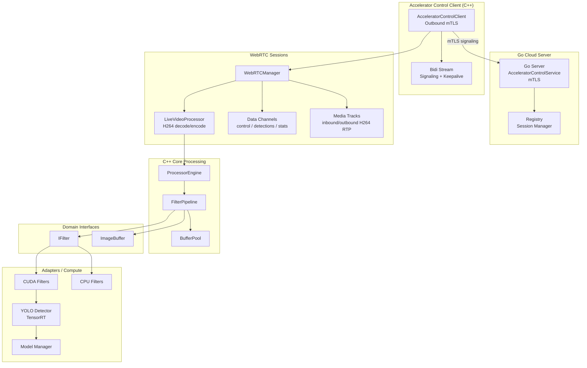
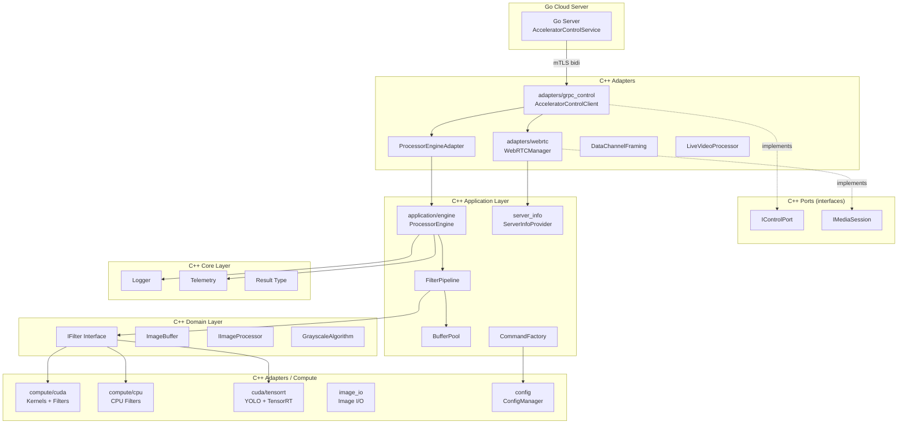
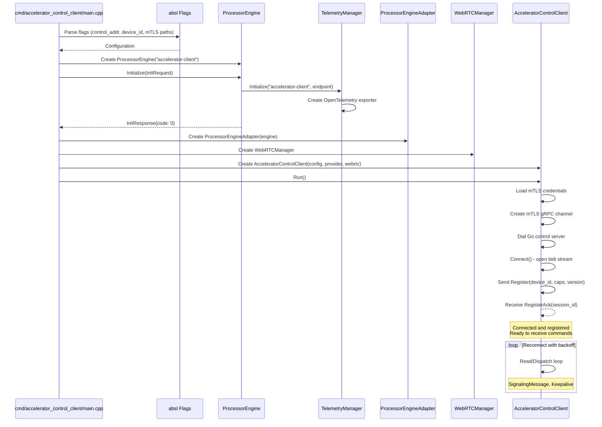
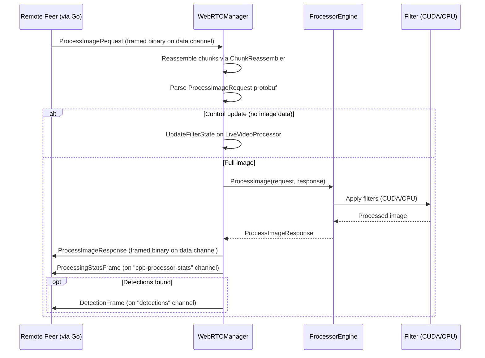
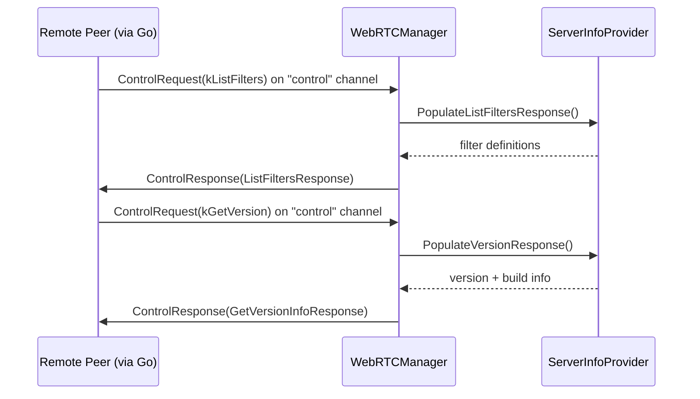

# CUDA Accelerator Library

High-performance image processing library implementing Clean Architecture principles with CUDA GPU acceleration and CPU fallback support.

## Library Description

The CUDA Accelerator Library provides a production-grade image processing framework with GPU-accelerated filters using CUDA kernels. The architecture follows Clean Architecture patterns with clear separation between domain logic, application use cases, infrastructure implementations, and external adapters.

**Version**: See `VERSION` file (currently 4.0.6)

**Features**:
- GPU acceleration via CUDA kernels with CPU fallback
- **Accelerator Control Client** with mTLS outbound connections to Go cloud server
- **Multiplexed bidirectional gRPC stream** for all commands (image processing, filters, version, signaling)
- WebRTC signaling support for real-time video streaming
- **YOLO object detection** via TensorRT with GPU-accelerated inference
- **Data channel framing** for structured detection result transport over WebRTC
- Extensible filter pipeline architecture
- Thread-safe concurrent processing
- Buffer pooling and CUDA memory pooling for memory efficiency
- Configuration management system

## Architecture

### Component Overview

The library uses the **Accelerator Control Client** as the primary integration path. The client dials outbound to a Go cloud server via mTLS and establishes a multiplexed bidirectional stream used exclusively for registration, WebRTC signaling, and keepalives. All image processing occurs over **WebRTC peer connections** established through that signaling. The Go server negotiates WebRTC sessions; once connected, video frames flow over RTP media tracks while still-image processing, detection results, and control requests flow over dedicated data channels. All processing converges at the `ProcessorEngine` which orchestrates image processing through the filter pipeline.



### Layer Structure



### Initialization Sequence



### Processing Flows

The gRPC bidi stream carries only **signaling** and **keepalive** messages. All image processing flows through WebRTC peer connections after session establishment.

#### Live Video Processing (WebRTC Media Track)

The primary path for real-time video. Go sends H.264 video via RTP; C++ decodes, processes, re-encodes, and sends processed video back on an outbound track.

```mermaid
sequenceDiagram
    participant Browser as Browser (via Go)
    participant Go as Go Server
    participant Client as AcceleratorControlClient
    participant WRTC as WebRTCManager
    participant LVP as LiveVideoProcessor
    participant Engine as ProcessorEngine
    participant Filter as Filter (CUDA/CPU)

    Note over Go,Client: 1. Signaling via gRPC bidi stream
    Go->>Client: SignalingMessage(StartSession, SDP offer)
    Client->>WRTC: CreateSession(session_id, sdp_offer)
    WRTC-->>Client: SDP answer + ICE candidates
    Client->>Go: SignalingMessage(SDP answer + local candidates)
    Go->>Client: SignalingMessage(remote ICE candidates)
    Client->>WRTC: HandleRemoteCandidate(...)
    Note over Browser,WRTC: WebRTC peer connection established

    Note over Browser,WRTC: 2. Video frames via RTP (not gRPC)
    Browser->>WRTC: H.264 RTP video frames (inbound track)
    WRTC->>LVP: ProcessAccessUnit(H264 AU)
    LVP->>LVP: FFmpeg decode → RGB
    LVP->>Engine: ProcessImage(RGB request)
    Engine->>Filter: Apply filters (CUDA/CPU)
    Filter-->>Engine: Processed image
    Engine-->>LVP: ProcessImageResponse
    LVP->>LVP: RGB → FFmpeg encode → H.264 NALUs
    WRTC->>WRTC: Send framed detections on "detections" data channel
    WRTC->>WRTC: Send ProcessingStatsFrame on "cpp-processor-stats" channel
    WRTC->>Browser: H.264 RTP processed video (outbound track)
```



#### Still Image Processing (WebRTC Data Channel)

For individual frame processing requests sent as protobuf over the default data channel.



#### Control Requests (WebRTC Data Channel)

Filter discovery and version queries are handled on a dedicated "control" data channel.



## Directory Structure

Hexagonal architecture: `ports/` holds abstract interfaces only; `adapters/` holds all concrete implementations.

```
cpp_accelerator/
├── cmd/
│   ├── accelerator_control_client/
│   │   ├── main.cpp            # Binary entry point
│   │   └── BUILD
│   ├── spike_multi_gpu_backend/  # Experimental multi-backend abstraction spike
│   └── [hello-world examples]    # See "Hello World Examples" section below
├── core/                       # Cross-cutting utilities (no deps on other layers)
│   ├── logger.h/cpp
│   ├── telemetry.h/cpp
│   ├── otel_log_sink.h/cpp
│   ├── signal_handler.h/cpp
│   ├── result.h
│   └── version.h               # Build-time version + git hash (generated)
├── domain/                     # Pure domain — no infrastructure deps
│   ├── interfaces/
│   │   ├── filters/i_filter.h
│   │   ├── processors/i_image_processor.h
│   │   ├── i_yolo_detector.h   # YOLO detector interface (extends IFilter)
│   │   ├── image_buffer.h, image_sink.h, image_source.h, i_pixel_getter.h
│   │   └── grayscale_algorithm.h
│   └── models/
│       └── detection.h         # Detection result struct
├── application/                # Use cases — orchestrates domain + adapters
│   ├── engine/
│   │   ├── processor_engine.h/cpp   # Main orchestrator: filter dispatch + YOLO cache
│   │   └── BUILD
│   ├── pipeline/
│   │   ├── filter_pipeline.h/cpp
│   │   └── buffer_pool.h/cpp
│   ├── server_info/
│   │   ├── i_server_info_provider.h     # Interface for version/filter queries
│   │   └── server_info_provider.h/cpp   # Implementation (reads VERSION, queries engine caps)
│   └── commands/               # Placeholder command pattern (unused)
├── ports/                      # Abstract port interfaces ONLY
│   ├── control/
│   │   └── i_control_port.h    # IControlPort — Run/Stop interface
│   └── media/
│       └── i_media_session.h   # IMediaSession — WebRTC session lifecycle
├── adapters/                   # Concrete implementations of ports + domain
│   ├── grpc_control/           # Outbound mTLS gRPC control client
│   │   ├── accelerator_control_client.h/cpp  # implements IControlPort
│   │   ├── processor_engine_adapter.h/cpp    # bridges engine → ProcessorEngineProvider
│   │   └── processor_engine_provider.h       # service provider interface
│   ├── webrtc/                 # WebRTC media path
│   │   ├── webrtc_manager.h/cpp              # implements IMediaSession
│   │   ├── live_video_processor.h/cpp        # H.264 decode → ProcessorEngine → encode
│   │   ├── data_channel_framing.h/cpp        # chunked binary framing over SCTP
│   │   ├── protocol/             # WebRTC protocol helpers
│   │   │   ├── filter_resolver.h/cpp         # Generic filter → enum mapping
│   │   │   ├── message_codec.h/cpp           # DataChannel request parsing + framed send
│   │   │   └── session_routing.h/cpp         # Session constants + routing helpers
│   │   └── sdp/                  # SDP utilities
│   │       └── sdp_utils.h/cpp               # Codec negotiation, extmap strip, ICE injection
│   ├── compute/
│   │   ├── cpu/                # CPU filter implementations
│   │   │   ├── grayscale_filter.h/cpp
│   │   │   └── blur_filter.h/cpp
│   │   ├── cuda/
│   │   │   ├── kernels/        # Raw CUDA .cu kernels
│   │   │   │   ├── blur/       # Blur variants (non-separable, separable basic/tiled)
│   │   │   │   ├── grayscale_kernel.cu
│   │   │   │   └── letterbox_kernel.cu
│   │   │   ├── filters/        # C++ wrappers: grayscale_filter, blur_processor
│   │   │   ├── memory/         # cuda_memory_pool (thread-local GPU alloc cache)
│   │   │   └── tensorrt/       # TensorRT/YOLO inference
│   │   │       ├── yolo_detector.h/cpp
│   │   │       ├── yolo_factory.h/trt.cpp
│   │   │       ├── model_manager.h/cpp
│   │   │       └── model_registry.h/cpp
│   │   └── filters/            # Cross-backend equivalence tests
│   ├── image_io/               # Image file I/O (stb-based)
│   │   ├── image_loader.h/cpp
│   │   └── image_writer.h/cpp
│   └── config/                 # Configuration management
│       ├── config_manager.h/cpp
│       └── models/program_config.h
├── docker-cuda-runtime/
├── yolo-model-gen/
├── Dockerfile.build
├── VERSION
└── lessons_learned.md
```

## Sub-folder Documentation

- **[adapters/compute/cuda/README.md](adapters/compute/cuda/README.md)** — Comprehensive CUDA tutorial covering kernel implementations, memory hierarchy, blur optimization variants, letterbox preprocessing, and TensorRT YOLO inference pipeline.

## Hello World Examples

The `cmd/` folder contains several minimal examples for learning GPU programming concepts. These are standalone programs that demonstrate specific compute APIs without the full accelerator architecture:

- **[OpenCL Hello World](cmd/hello-world-opencl/README.md)** — Minimal OpenCL example adding two float vectors on the GPU. Demonstrates OpenCL platform/device initialization, embedded SPIR-V and OpenCL C source assets, and program compilation.

- **[Vulkan Compute Hello World](cmd/hello-world-vulkan/README.md)** — Minimal Vulkan compute shader example for vector addition. Demonstrates Vulkan instance/device setup, compute pipeline creation, and embedded SPIR-V shaders.

- **[Spike Multi-GPU Backend](cmd/spike_multi_gpu_backend/)** — Experimental spike exploring a unified backend abstraction for CUDA/OpenCL with a grayscale filter demo.

These examples are intentionally kept separate from the production codebase and serve as learning resources for understanding the underlying compute APIs.

## Design Principles

1. **Dependency Inversion**: Domain interfaces define contracts; infrastructure implements them
2. **Single Responsibility**: Each component has one clear purpose
3. **Open/Closed**: Extend via new implementations, not modification
4. **Liskov Substitution**: All filter implementations are interchangeable
5. **Interface Segregation**: Small, focused interfaces (IFilter, ImageBuffer)
6. **Separation of Concerns**: Clear boundaries between layers
7. **Filter Pipeline**: Composable filter architecture for chaining multiple filters

## Key Components

### Accelerator Control Client

The library provides an outbound gRPC client (`AcceleratorControlClient`) that connects to a Go cloud server via mTLS. The client implements the `AcceleratorControlService` protocol buffer interface with a single multiplexed bidirectional stream.

**Multiplexed Message Types** (gRPC bidi stream):

The client sends and receives messages through the `AcceleratorMessage` envelope with `oneof payload`. The gRPC stream carries only signaling and registration; actual processing uses WebRTC.

- **Register** (C++ → Go): First message sent on connection
  - Contains `device_id`, `display_name`, `accelerator_version`, `capabilities`
  - Go server responds with `RegisterAck` (accepted/rejected, assigned `session_id`)

- **SignalingMessage** (bidirectional): WebRTC session negotiation
  - `StartSession`: Go sends SDP offer, C++ responds with SDP answer
  - `IceCandidate`: Bidirectional ICE candidate exchange
  - `CloseSession`: Session teardown

- **Keepalive** (bidirectional): Liveness check
  - No reply expected; used to detect dead connections

**WebRTC Data Channel Message Types** (after peer connection established):

- **ProcessImageRequest**: Image processing and live filter control updates (default data channel)
- **ControlRequest**: `ListFilters` and `GetVersion` queries ("control" data channel)
- **DetectionFrame**: Detection results from YOLO inference ("detections" data channel)
- **ProcessingStatsFrame**: Per-frame timing metrics ("cpp-processor-stats" data channel)

**Architecture**:

The `AcceleratorControlClient` holds a `ProcessorEngineProvider` interface for local processing and a `WebRTCManager` for WebRTC peer connections. The client:
1. Dials the Go control server with mTLS credentials
2. Opens a bidirectional stream via `Connect()`
3. Sends `Register` message with device metadata
4. Waits for `RegisterAck` confirmation
5. Enters read/dispatch loop, processing incoming commands from Go

Each message carries a `command_id` (UUID v7) for request/response correlation and an optional `trace_context` (W3C) for distributed tracing.

### WebRTC Real-time Video Processing

The library provides WebRTC-based real-time video streaming capabilities through WebRTCManager. WebRTC signaling messages are tunneled through the AcceleratorControlClient's gRPC bidi stream; after session establishment, all data flows over the peer connection.

**Components**:

- **WebRTCManager** (`adapters/webrtc/webrtc_manager.h/cpp`): Manages WebRTC peer connections, ICE candidate exchange, session lifecycle, and per-session CUDA memory pools
- **LiveVideoProcessor** (`adapters/webrtc/live_video_processor.h/cpp`): Real-time video frame processing pipeline — FFmpeg H.264 decode → RGB → ProcessorEngine → RGB → FFmpeg H.264 encode
- **DataChannelFraming** (`adapters/webrtc/data_channel_framing.h/cpp`): Binary chunking/reassembly protocol for large protobuf messages over SCTP data channels
- **Protocol helpers** (`adapters/webrtc/protocol/`): Filter parameter resolution (`filter_resolver`), data channel message parsing/framing (`message_codec`), session routing constants (`session_routing`)
- **SDP utilities** (`adapters/webrtc/sdp/sdp_utils.h/cpp`): H.264 codec negotiation, RTP header extension stripping, manual ICE candidate injection, SDP answer waiting

**WebRTC Channels per Session**:

| Channel | Direction | Purpose |
|---|---|---|
| Inbound video track | Peer → C++ | H.264 RTP live camera frames |
| Outbound video track | C++ → Peer | H.264 RTP processed video |
| Default data channel | Bidirectional | `ProcessImageRequest`/`Response` for still images + live filter state updates |
| `control` | Bidirectional | `ListFilters`, `GetVersion` queries |
| `detections` | C++ → Peer | `DetectionFrame` with YOLO bounding boxes |
| `cpp-processor-stats` | C++ → Peer | `ProcessingStatsFrame` with per-frame timing metrics |

**Signaling Flow**:

1. Go server sends `SignalingMessage(StartSession)` with SDP offer via gRPC bidi stream
2. AcceleratorControlClient dispatches to WebRTCManager
3. WebRTCManager creates PeerConnection, sets up track/channel handlers, generates SDP answer
4. ICE candidates exchanged via `SignalingMessage(IceCandidate)` through the bidi stream
5. Direct WebRTC peer connection established — all subsequent data flows over RTP/data channels

### YOLO Object Detection

The library includes YOLO object detection via TensorRT for GPU-accelerated inference. See the [CUDA compute adapter README](adapters/compute/cuda/README.md) for detailed documentation on the inference pipeline, letterbox preprocessing, and TensorRT engine lifecycle.

**Components**:

- **IYoloDetector** (`domain/interfaces/i_yolo_detector.h`): Detector interface extending `IFilter`
- **YOLODetector** (`adapters/compute/cuda/tensorrt/yolo_detector.h/cpp`): TensorRT-based inference engine with NMS post-processing
- **YoloFactory** (`adapters/compute/cuda/tensorrt/yolo_factory.h/trt.cpp`): Factory for creating detector instances
- **ModelManager** (`adapters/compute/cuda/tensorrt/model_manager.h/cpp`): Model loading & session management
- **ModelRegistry** (`adapters/compute/cuda/tensorrt/model_registry.h/cpp`): Model path resolution
- **LetterboxKernel** (`adapters/compute/cuda/kernels/letterbox_kernel.cu/h`): GPU-accelerated resize + pad + NCHW conversion

### Command Pattern

The command pattern infrastructure (`application/commands/`) is maintained for potential future use. All processing is currently handled directly by `FilterPipeline` which orchestrates filter chains without the command pattern abstraction layer.

### Buffer Pool

The `BufferPool` class provides efficient memory management for image processing operations by reusing allocated buffers. The buffer pool is optional — `FilterPipeline` can operate with or without it. When provided, it significantly improves performance for pipelines with multiple filters.

### Processor Engine

The `ProcessorEngine` is the core orchestration component that coordinates image processing operations. It bridges the gRPC service interface and the internal processing pipeline.

**Responsibilities**: Initialization and telemetry setup, filter orchestration via `FilterPipeline`, algorithm selection from protocol buffer enums, and response building.

**Integration Points**: Used by `adapters/grpc_control` via `ProcessorEngineAdapter` for the gRPC service, and by `adapters/webrtc` for WebRTC data channel and live video processing.

### Domain Interfaces

The domain layer defines core abstractions used throughout the library:

**FilterType Enum**: `GRAYSCALE`, `BLUR`

**GrayscaleAlgorithm Enum**: `BT601` (SDTV), `BT709` (HDTV), `Average`, `Lightness`, `Luminosity`

**FilterContext Structure**: Contains `ImageBuffer` (input) and `ImageBufferMut` (output), passed to filters during `Apply()` operations.

**IImageProcessor Interface**: Defines contract for image processors that work with `IImageSource` and `IImageSink`.

## Code Quality & Compiler Warnings

The project enforces strict compiler warning standards. All warnings are treated as errors for the project's own code (`-Wall`, `-Wextra`, `-Werror` configured in `.bazelrc`).

For parameters that are part of interface contracts but not used in specific implementations, the `[[maybe_unused]]` attribute is used to maintain interface compatibility while clearly indicating intentional non-use.

All code in `cpp_accelerator/` compiles without warnings when `-Werror` is enabled.

## C API Reference

The library previously exposed a C API through `processor_api.h`. The shared library build target (`libcuda_processor.so`) has been removed. The `processor_engine` wrapper in the application layer is now used directly by the gRPC and WebRTC adapters.

**API Version**: The C API version was defined as `PROCESSOR_API_VERSION "2.1.0"`. This is separate from the library version (4.0.6).

## Adding New Filters

1. **Adapters**: Implement CPU and CUDA filter classes in `adapters/compute/cpu/` and `adapters/compute/cuda/`
2. **Application**: Filters are automatically usable via `FilterPipeline`
3. **Protocol**: Add parameter parsing in `adapters/webrtc/protocol/filter_resolver` if new generic filter parameters are needed

The FilterPipeline automatically handles filter composition and execution order.

## Testing

Run all tests:
```bash
bazel test //src/cpp_accelerator/...
```

Run specific tests:
```bash
bazel test //src/cpp_accelerator/core:logger_test
bazel test //src/cpp_accelerator/core:result_test
bazel test //src/cpp_accelerator/application/pipeline:filter_pipeline_test
bazel test //src/cpp_accelerator/application/commands:commands_test
bazel test //src/cpp_accelerator/adapters/compute/filters:blur_equivalence_test
bazel test //src/cpp_accelerator/adapters/compute/cuda/filters:grayscale_filter_test
bazel test //src/cpp_accelerator/adapters/compute/cuda/filters:blur_processor_test
bazel test //src/cpp_accelerator/adapters/compute/cpu:grayscale_filter_test
bazel test //src/cpp_accelerator/adapters/compute/cpu:blur_filter_test
bazel test //src/cpp_accelerator/adapters/image_io:image_loader_test
bazel test //src/cpp_accelerator/adapters/image_io:image_writer_test
bazel test //src/cpp_accelerator/adapters/config:config_manager_test
bazel test //src/cpp_accelerator/adapters/webrtc:data_channel_framing_test
```

## Building

Build accelerator control client:
```bash
bazel build //src/cpp_accelerator/cmd/accelerator_control_client
```

Build all:
```bash
bazel build //src/cpp_accelerator/...
```

Refresh compile headers:
```bash
bazel run @hedron_compile_commands//:refresh_all
```

## Version Compatibility

The library uses semantic versioning:
- **Major**: Breaking API changes
- **Minor**: New features, backward compatible
- **Patch**: Bug fixes, backward compatible
