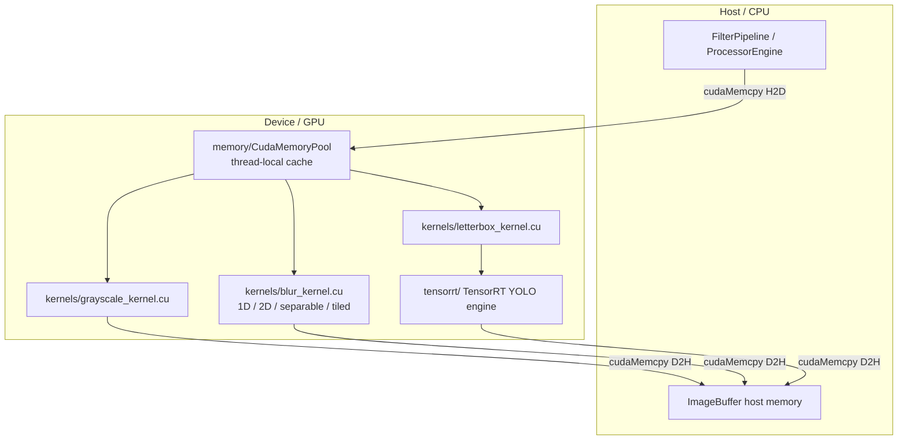
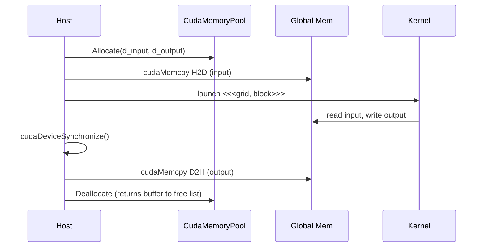
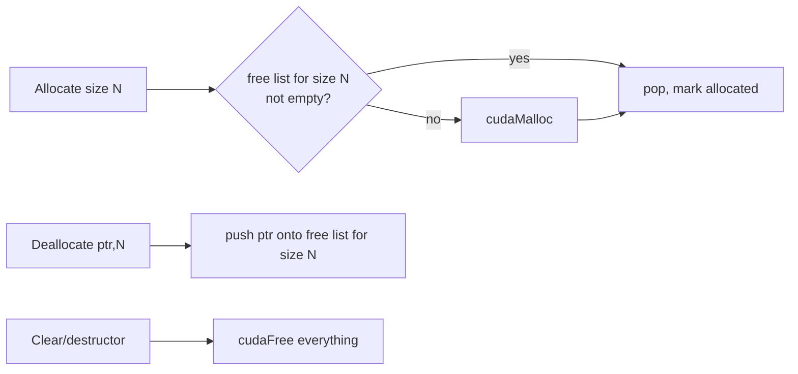
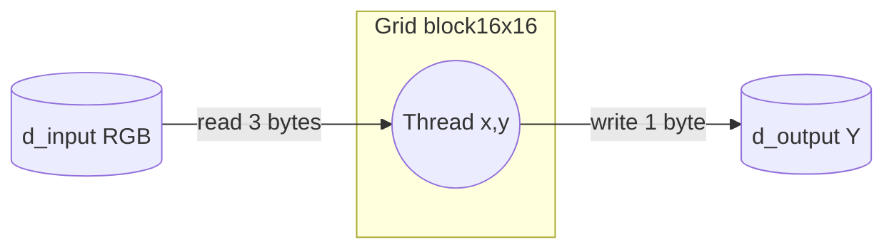
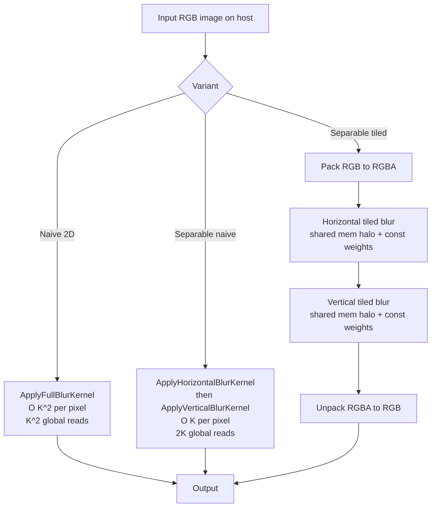
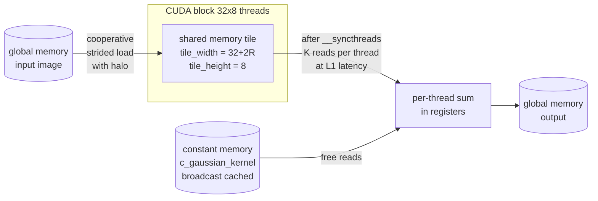
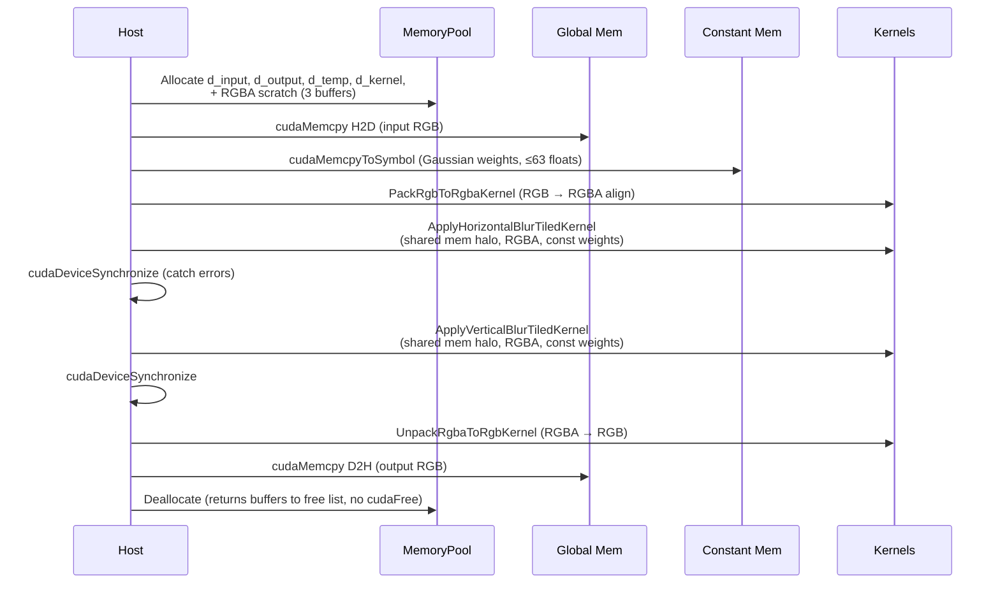
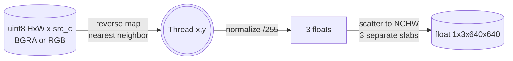
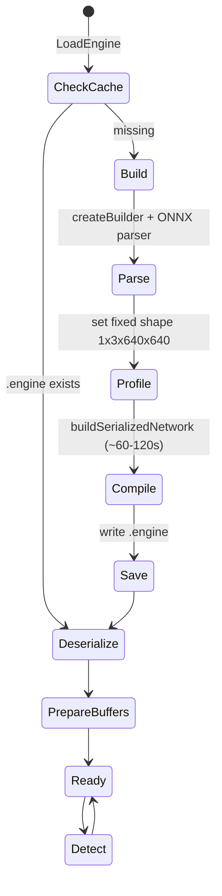
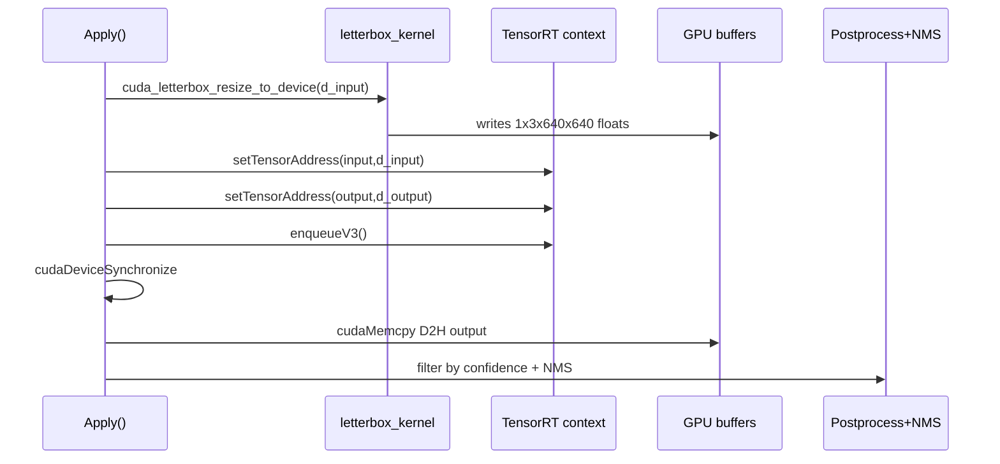

# CUDA Compute Adapter — A Tutor's Walkthrough

This folder contains every GPU kernel and GPU-side helper used by the accelerator. It is the `adapters/compute/cuda/` layer of the hexagonal architecture: the concrete hardware-specific implementations behind the abstract `IFilter` / `IImageProcessor` / `IYoloDetector` ports defined in `domain/`.

The code is split into four focused subfolders:

| Subfolder | Contents |
|---|---|
| `kernels/` | Raw `.cu` kernel files — no C++ class wrappers, just the CUDA math. |
| `filters/` | `IFilter`-implementing C++ classes that invoke the kernels. |
| `memory/` | Thread-local GPU allocation pool (`CudaMemoryPool`). |
| `tensorrt/` | TensorRT-based YOLO inference pipeline. |

Read this README as a CUDA tutorial. We will go kernel by kernel, explain the algorithm in plain terms, then explain **why the algorithm maps well onto a GPU**, **where data crosses the CPU↔GPU boundary**, and **what optimizations are in place**. Each section has a Mermaid diagram. A glossary and a "what CUDA features did we use" recap close the document.

---

## 1. High-Level Map



Files at a glance:

| File | Purpose |
|---|---|
| `memory/cuda_memory_pool.{h,cpp}` | Thread-local GPU allocation cache. Kills `cudaMalloc/Free` churn. |
| `kernels/grayscale_kernel.cu` + `filters/grayscale_filter.{h,cpp}` | RGB → 1-channel luma, 5 algorithms. |
| `kernels/blur_kernel.cu` + `filters/blur_processor*` | Gaussian blur, four flavors (full 2D, two 1D passes, separable+tiled). |
| `kernels/letterbox_kernel.cu` | Aspect-preserving resize + pad + uint8→float NCHW for TRT input. |
| `tensorrt/yolo_detector.{h,cpp}` + `tensorrt/model_*`, `tensorrt/yolo_factory*` | TensorRT-based YOLO inference + NMS post-process. |

Domain interfaces that define the contracts implemented here live outside this folder:
- `domain/interfaces/i_yolo_detector.h`
- `domain/models/detection.h`

---

## 2. CUDA Refresher (read this first)

The GPU runs **kernels** — functions launched as a 3D **grid** of **blocks**, where each block contains a 3D set of **threads**. Threads in a block share fast on-chip **shared memory** and can synchronize with `__syncthreads()`. Threads in different blocks cannot.

The mental model used throughout this folder is *one thread = one output pixel*. A 2D grid of 2D blocks (e.g. `block(16,16)` / `block(32,8)`) tiles the image; each thread looks up its `(x,y)` from `blockIdx`, `blockDim`, and `threadIdx`.

Memory hierarchy used here, from slowest to fastest:

1. **Host RAM** — CPU side. Reached via `cudaMemcpy*`.
2. **Global (device) memory** — large, off-chip GDDR. `cudaMalloc` lives here.
3. **Constant memory** — 64 KB, broadcast-cached. Used in blur for the Gaussian weights.
4. **Shared memory** — per-block scratchpad, ~48 KB. Used in the tiled blur.
5. **Registers** — per-thread, fastest.

Every kernel here goes through the same pattern:



---

## 3. `memory/cuda_memory_pool` — Why we don't `cudaMalloc` per frame

`cudaMalloc` and `cudaFree` are **expensive** — they synchronize implicitly with the device and serialize against any in-flight kernels. Doing one round-trip per frame at 30 fps is wasteful.

**Algorithm.** A `std::unordered_map<std::size_t, std::deque<void*>> free_buffers_` keyed by allocation size. `Allocate(n)` first checks the free list for that exact size; if found, it pops and returns. Otherwise it falls back to `cudaMalloc`. `Deallocate(ptr, n)` pushes the pointer back onto the free list — it does **not** call `cudaFree`. `Clear()` (and the destructor) frees everything for real.

**Why it works.** Image dimensions are stable over a video stream. The first frame pays the malloc cost; every subsequent frame reuses the same buffers.

**Thread-local twist.** `GetThreadLocalMemoryPool()` returns a `thread_local` pool. Each WebRTC processing thread has its own pool, so no mutex contention across frames in different threads, and no cross-thread aliasing. The internal mutex still guards within-thread reentrancy.



Optimization summary:
- O(1) hot-path allocation.
- Zero `cudaMalloc/Free` per frame after warm-up.
- No locking across threads.

---

## 4. `kernels/grayscale_kernel.cu` — The Hello-World

**Algorithm.** For each output pixel, read R, G, B from input, combine into one luma value with one of: BT.601 (`0.299R + 0.587G + 0.114B`), BT.709, simple average, lightness `(max+min)/2`, or luminosity. Write one byte to output.

**Why GPU.** Pure data parallelism — every output pixel is independent. No neighbor reads, no shared state. Memory-bound, but coalesced because consecutive threads read consecutive bytes.



Launch geometry (`grayscale_kernel.cu:90-92`):
```
block(16,16), grid(ceil(W/16), ceil(H/16))
```

**Memory copies.**
- H2D: full input image once (`cudaMemcpyHostToDevice`).
- D2H: full grayscale output once.

**Optimizations.** Minimal — this is the baseline. Bounds-check early-return (`if (x>=width || y>=height) return;`). Per-thread arithmetic in registers. Note: this kernel still uses raw `cudaMalloc`/`cudaFree` (it predates the memory pool), which is a known opportunity for cleanup.

---

## 5. `kernels/blur_kernel.cu` — Four Flavors of Gaussian Blur

This is the centerpiece of the folder. Read it as a tutorial: we start with the **math of blur itself**, build a naïve CUDA kernel from it, then add one optimization at a time until we reach the production code.

### 5.1 What is a blur, mathematically?

A blur replaces each pixel with a **weighted average of its neighborhood**. Formally, image convolution:

```
output(x, y) = Σ Σ  input(x + i, y + j) · K(i, j)
              i  j
```

where `K` is the **kernel** (a.k.a. *filter mask*). Different `K` produce different effects:

- All weights equal → "box blur" (cheap but ugly — produces ringing artifacts).
- Bell-shaped weights → **Gaussian blur** (smooth, natural, no ringing). This is what we implement.

The 2D Gaussian function is:
```
G(x, y) = (1 / (2πσ²)) · exp( -(x² + y²) / (2σ²) )
```
- `σ` (sigma) controls how wide the blur is. Bigger σ → blurrier image.
- We **sample** this continuous function at integer offsets `(i, j)` to get the discrete kernel.
- We **truncate** at radius `R` (~3σ is enough; tail values are negligible). Kernel size `K = 2R + 1` is always odd, giving a centered tap.
- We **normalize** so the weights sum to 1, which guarantees output brightness equals input brightness.

A typical 5×5 (R=2) Gaussian kernel:
```
1  4  6  4  1
4 16 24 16  4
6 24 36 24  6     ÷ 256  (normalize)
4 16 24 16  4
1  4  6  4  1
```
The center weight is largest; weights drop off radially. The output is therefore a smooth average dominated by the original pixel — exactly what "blur" means visually.

### 5.2 The single most important property: **separability**

The 2D Gaussian factors:
```
G(x, y) = g(x) · g(y)     where g(t) = (1/√(2πσ²)) · exp(-t² / (2σ²))
```

This is a special property of the Gaussian — most 2D kernels are *not* separable. Because it factors, convolving with `G` is mathematically identical to:

```
temp(x, y)   = Σ input(x + i, y) · g(i)        ← horizontal 1D pass
                i
output(x, y) = Σ temp(x, y + j) · g(j)         ← vertical 1D pass on the temp result
                j
```

**Why this matters:** instead of K² multiply-adds per output pixel, you do `K + K = 2K`. For a 21×21 kernel that's `441 → 42`, a **10× reduction** before any GPU tricks. As K grows, the gap widens linearly.

This is purely an algorithmic win — no GPU yet. But it compounds beautifully with hardware: each 1D pass also has better cache locality (you walk along one axis) and is much easier to tile.

### 5.3 Border handling — what to do at the edges

When you blur pixel `(0, 0)`, the kernel asks for `input(-1, -1)` etc. — pixels that don't exist. Three common policies, all in `ClampX` / `ClampY`:

| Mode | Rule | Visual result |
|---|---|---|
| `CLAMP` | Treat OOB as the nearest valid edge pixel. | Edges get smeared inward. Common, simple. |
| `REFLECT` | Mirror the image about the edge: `-1 → 0`, `-2 → 1`, … | Cleanest — preserves frequency content at boundaries. |
| `WRAP` | Modulo: `-1 → width-1`. Treats image as a torus. | Useful for tileable textures, weird elsewhere. |

The code (`blur_kernel.cu:11-51`) is exactly that math, hand-written:
```cpp
case BorderMode::REFLECT:
  if (x < 0)        return -x - 1;          //  -1 → 0,  -2 → 1
  if (x >= width)   return 2*width - x - 1; //  W → W-1, W+1 → W-2
  return x;
```

### 5.4 The four entry points (overview)

| extern "C" function | Inner kernel | Algorithmic cost | Memory pattern | Notes |
|---|---|---|---|---|
| `cuda_apply_gaussian_blur_non_separable` | `ApplyFullBlurKernel` | O(K²) per pixel | Direct global reads | Reference / correctness baseline |
| `cuda_apply_gaussian_blur_1d_horizontal` | `ApplyHorizontalBlurKernel` | O(K) per pixel | Direct global reads | One axis only — teaches separability |
| `cuda_apply_gaussian_blur_1d_vertical` | `ApplyVerticalBlurKernel` | O(K) per pixel | Direct global reads | Mirror of horizontal |
| `cuda_apply_gaussian_blur_separable` | `ApplyHorizontalBlurTiledKernel` → `ApplyVerticalBlurTiledKernel` | O(K) total | Shared-mem tiles + constant-mem weights + RGBA repack | **Production** |



### 5.5 Variant 1 — naïve 2D convolution: `ApplyFullBlurKernel`

The literal translation of the math from §5.1. Easiest to read, slowest. Worth studying because every other variant is an optimization *of this*.

**Algorithm in pseudocode:**
```
for each output pixel (x, y):           ← parallelized: one thread per pixel
  for each channel c:
    sum = 0
    for kx in [-R, +R]:
      for ky in [-R, +R]:
        sum += input(x+kx, y+ky, c) * G(kx, ky)
    output(x, y, c) = clamp(sum, 0, 255)
```

**The CUDA translation** (`blur_kernel.cu:238-267`):
```cpp
__global__ void ApplyFullBlurKernel(const unsigned char* input, unsigned char* output,
                                    int width, int height, int channels,
                                    const float* kernel, int kernel_size,
                                    BorderMode border_mode) {
  int x = blockIdx.x * blockDim.x + threadIdx.x;   // ← which pixel am I?
  int y = blockIdx.y * blockDim.y + threadIdx.y;

  if (x >= width || y >= height) return;            // ← grid is rounded up; cull strays

  int radius = kernel_size / 2;
  int output_idx = (y * width + x) * channels;

  for (int c = 0; c < channels; c++) {
    float sum = 0.0F;
    for (int ky = -radius; ky <= radius; ky++) {
      for (int kx = -radius; kx <= radius; kx++) {
        float weight = kernel[ky + radius] * kernel[kx + radius]; // ← G(kx,ky) = g(kx)·g(ky)
        sum += GetPixelChannelValue(input, x+kx, y+ky, ..., c, border_mode) * weight;
      }
    }
    output[output_idx + c] = clamp_to_byte(sum);
  }
}
```

**Translating math → code, line by line:**

| Math | Code |
|---|---|
| "for each output pixel" | `int x = blockIdx.x * blockDim.x + threadIdx.x;` etc. — every thread *is* an iteration of the outer loop. |
| "for each kernel offset (kx, ky)" | The two inner `for` loops. |
| `input(x+kx, y+ky)` | `GetPixelChannelValue(...)` clamps + indexes into global memory. |
| `K(kx, ky)` | `kernel[ky+radius] * kernel[kx+radius]` — exploiting that the 1D `g` was passed in, so `G = g(kx)·g(ky)`. |
| Output write | `output[output_idx + c] = ...` |

**Why this works on GPU:** every output pixel is independent. No thread-to-thread dependency. The work decomposes into millions of independent computations — the textbook GPU workload.

**Why it is slow:**
1. **Each thread does K² global loads.** For K=15 that's 225 trips to global memory per output pixel; global memory has hundreds of cycles of latency.
2. **Massive redundancy across threads.** Adjacent threads have overlapping neighborhoods: thread `(x,y)` reads `input(x+1, y)` and so does thread `(x+1, y)` reading `input(x+1, y) + 0`. Same byte, fetched twice. Across a 16×16 block with K=15, the same input pixel can be fetched on the order of 100 times.
3. **Border check on every read.** `GetPixelChannelValue` runs `ClampX`/`ClampY` on every tap, even though only a tiny fringe of threads actually have OOB offsets.

Variants 2–4 attack each of these.

### 5.6 Variant 2 — separable as two 1D kernels: `ApplyHorizontalBlurKernel` + `ApplyVerticalBlurKernel`

Apply the math from §5.2: turn one O(K²) pass into two O(K) passes. From `blur_kernel.cu:269-294`:
```cpp
__global__ void ApplyVerticalBlurKernel(...) {
  int y = blockIdx.y * blockDim.y + threadIdx.y;
  if (y >= height) return;
  int radius = kernel_size / 2;
  for (int x = 0; x < width; x++) {            // each thread sweeps an entire row
    for (int c = 0; c < channels; c++) {
      float sum = 0.0F;
      for (int k = -radius; k <= radius; k++) {
        int pixel_y = y + k;
        sum += GetPixelChannelValue(input, x, pixel_y, ..., c, border_mode) * kernel[k+radius];
      }
      output[(y*width + x)*channels + c] = clamp_to_byte(sum);
    }
  }
}
```

**Note on the launch shape.** The horizontal version uses `dim3 block_size(256)` (a 1D block) and each thread iterates over all rows; the vertical version uses 2D blocks but each thread walks all `x`. These shapes are kept simple to demonstrate separability without yet adding tiling; they are the algorithmic stepping stone, not the production path. The vertical launch in particular has poor coalescing because consecutive threads (consecutive `y`) read addresses one row apart — the GPU's worst-case stride pattern. That's exactly what shared-memory tiling fixes in variant 3.

**The win:** total reads per pixel drop from K² to 2K. For K=21 that's `441 → 42`, a 10× reduction — purely from algorithmic restructuring.

### 5.7 Variant 3 — shared-memory tiling with halos: `ApplyHorizontalBlurTiledKernel`

Now we attack redundant global reads (problem #2 from §5.5).

**Core idea.** The 256 threads of a block all need overlapping neighborhoods. If they cooperate to load their region into **shared memory** *once*, every subsequent neighborhood read is on-chip — about 100× faster than global.

**The "halo" insight.** A 32×8 block of threads produces a 32×8 patch of output. To convolve that patch horizontally with radius R, you need input pixels from `x = block_start_x - R` to `x = block_start_x + 32 + R - 1`. That's `32 + 2R` columns. The extra 2R columns on each side are the **halo** — pixels that *output-wise* belong to neighbouring blocks, but that this block needs as inputs.

```
Block boundary (output):   [—————— 32 pixels ——————]
Block reads (input):    [—R—|—————— 32 pixels ——————|—R—]
                         ^ left halo            right halo ^
```

**Shared-memory layout.**
```cpp
extern __shared__ unsigned char tile[];
const int tile_width  = blockDim.x + 2 * radius;   // 32 + 2R
const int tile_height = blockDim.y;                // 8
```
Total bytes = `tile_width * tile_height * channels`. The kernel launch passes this size as the third `<<<…>>>` argument: `<<<grid, block, shared_horizontal_rgba>>>`. **Dynamic shared memory** — caller specifies the size at launch.

**Cooperative load with strided loop** (`blur_kernel.cu:107-120`):
```cpp
if (threadIdx.y < tile_height) {
  for (int sx = threadIdx.x; sx < tile_width; sx += blockDim.x) {  // ← cooperative fill
    int src_x = blockIdx.x * blockDim.x + sx - radius;             // ← shift by -radius for halo
    int src_y = y;
    if (src_y < height) {
      int clamped_x = ClampX(src_x, width, border_mode);
      int src_idx = (src_y * width + clamped_x) * channels;
      int dst_idx = (threadIdx.y * tile_width + sx) * channels;
      for (int c = 0; c < channels; ++c) {
        tile[dst_idx + c] = input[src_idx + c];
      }
    }
  }
}

__syncthreads();   // ← BARRIER: nobody reads tile[] until everybody has finished writing
```

The strided pattern `sx = threadIdx.x; sx < tile_width; sx += blockDim.x` is the canonical CUDA idiom for "N threads cooperatively fill M slots, where M ≥ N". With 32 threads filling, say, 50 slots, each thread does ⌈50/32⌉ = 2 iterations: first iteration covers slots 0–31, second covers 32–49.

**Why `__syncthreads()` is non-negotiable.** Without it, thread A might read `tile[5]` before thread B finished writing `tile[5]`. The barrier guarantees that when *any* thread proceeds past it, *every* thread in the block has reached it — so all writes to `tile[]` are visible to all subsequent reads.

**The actual convolution after the load** (`blur_kernel.cu:128-147`):
```cpp
int output_idx = (y * width + x) * channels;
bool is_interior = (x >= radius) && (x < width - radius);
for (int c = 0; c < channels; ++c) {
  float sum = 0.0F;
  if (is_interior) {
    int tile_base = (threadIdx.y * tile_width + threadIdx.x) * channels;
    for (int k = -radius; k <= radius; ++k) {
      int tile_idx = tile_base + (k + radius) * channels + c;          // ← read tile[], not input[]
      sum += float(tile[tile_idx]) * c_gaussian_kernel[k + radius];    // ← weight from constant mem
    }
  } else {
    // Threads on the global image edge: their halo wraps off the image,
    // so the tile load couldn't capture it. Fall back to slow path.
    for (int k = -radius; k <= radius; ++k) {
      int px = ClampX(x + k, width, border_mode);
      int idx = (y * width + px) * channels + c;
      sum += float(input[idx]) * c_gaussian_kernel[k + radius];
    }
  }
  output[output_idx + c] = clamp_to_byte(sum);
}
```

The `is_interior` split is small but important: most threads (the bulk of the image) take the fast path through shared memory. Only threads on the global image border take the slow `ClampX`-based path. The hot path stays branchless and fast.

**Quantifying the win.** With K=21, R=10, block 32×8:
- Naïve (variant 1): each of the 256 threads does K² = 441 global reads → **112,896 global reads per block**.
- Tiled (variant 3): the block cooperatively does `(32+20) × 8 = 416` global reads, then everybody reads from shared → **~416 global reads per block**, a **~270× reduction** in global traffic.



**The vertical pass is the mirror of all this.** Same idea, halo on top/bottom instead of left/right; tile is `blockDim.x × (blockDim.y + 2R)`.

### 5.8 Variant 4 — production path: variant 3 + constant memory + RGBA repack

Variant 3 is fast but two more nuisances remain. Variant 4 is variant 3 plus two final tweaks.

**Tweak A — Gaussian weights live in constant memory.**
```cpp
__constant__ float c_gaussian_kernel[kMaxKernelSize];   // declared at file scope
// ...
cudaMemcpyToSymbol(c_gaussian_kernel, kernel, kernel_size * sizeof(float), 0,
                   cudaMemcpyHostToDevice);             // upload once before launch
```

**Why it wins.** Constant memory is a small (64 KB) read-only memory with a hardware broadcast path: when **every thread in a warp reads the same address**, the access is broadcast in a single cycle from the constant cache. Our convolution loop does exactly that: at iteration `k`, *all 32 threads* in a warp read `c_gaussian_kernel[k + radius]` — the exact same address. Weight loads cost ~0. If we kept weights in global memory we'd waste bandwidth; in shared memory we'd waste capacity for what is essentially a constant.

**Tweak B — RGB → RGBA repack for coalescing.**

CUDA reads global memory in 32 / 64 / 128-byte transactions, **aligned**. Best case: 32 consecutive threads read 32 consecutive 4-byte values starting at a 128-byte boundary → one transaction. Worst case: each thread reads a misaligned scattered byte → up to 32 transactions.

A 3-byte RGB pixel is a worst case. Pixel `i` is at byte `3i`, so successive threads read addresses `0, 3, 6, 9, …` — neither aligned nor of a power-of-two stride. The hardware can't fully coalesce; effective bandwidth drops.

The trick:
1. `PackRgbToRgbaKernel` (`blur_kernel.cu:66-80`) widens RGB → RGBA in a temporary buffer, padding each pixel with `alpha = 255`. Now pixel `i` is at byte `4i` — aligned, power-of-two stride, perfect coalescing.
2. The two tiled blur passes run on RGBA. They process 4 channels instead of 3, so they do ~33% more arithmetic — **but** all global accesses are now coalesced, and on memory-bound kernels (which blurs are) that's a net win.
3. `UnpackRgbaToRgbKernel` (`blur_kernel.cu:82-95`) drops the alpha back, producing the final RGB output.

The net of "pack + 33% extra compute + unpack" beats "no pack + uncoalesced loads", because we were memory-bound, and we improved bandwidth utilization more than we added work.

### 5.9 The full production sequence (variant 4)



### 5.10 Optimization checklist (cumulative)

Each row here corresponds to a variant in §5.5–§5.8 solving a problem from §5.5:

| Optimization | Where | Problem solved | Speedup ballpark |
|---|---|---|---|
| Separable filter (2 × 1D vs 1 × 2D) | Variant 2+ | K² → 2K arithmetic & reads | ~K/2× (e.g. 10× at K=21) |
| Shared-memory tiling with halo | Variant 3+ | Redundant overlapping global reads | 10–100× depending on K |
| Constant memory for kernel weights | Variant 4 | Weight reads competing for L1/shared bandwidth | Marginal but free; clears bandwidth budget |
| RGB → RGBA repack | Variant 4 (channels=3) | Uncoalesced 3-byte global access | ~1.3–2× on memory-bound paths |
| Memory pool | All variants | `cudaMalloc/Free` synchronizing per frame | ~ms per frame at video rates |
| 32×8 block shape | Variants 3, 4 | Warp utilization (32 = warp size) | Avoids partial-warp overhead |
| `is_interior` fast/slow split | Variants 3, 4 | Border check on every read | Eliminates `ClampX` from the hot path for ~99% of threads |

### 5.11 What you should be able to do after reading this section

1. Derive the cost (in global reads, in arithmetic) for any of the four variants given an image size and kernel radius.
2. Explain *why* the Gaussian is separable and most other 2D kernels are not.
3. Pick a sensible block shape for a stencil kernel and explain why it's a multiple of 32 in the fastest-varying axis.
4. Compute the shared-memory bytes needed for a tiled stencil kernel: `(blockDim.x + 2R) × (blockDim.y + 2R) × channels × bytes_per_channel`.
5. Recognize the "cooperative strided load + `__syncthreads` + use shared memory" pattern, which generalizes far beyond blur (matrix multiply, transpose, reductions).
6. Diagnose why a 3-channel image kernel might be slow even when "the math looks fine" — and apply the RGB→RGBA repack fix.
7. Decide when to pin small read-only data (filter taps, lookup tables, learned constants) into constant memory.

---

## 6. `kernels/letterbox_kernel.cu` — Resize + Pad + Format Convert in One Pass

YOLO expects a `1 × 3 × 640 × 640` float tensor (NCHW, normalized to [0,1]). Real input frames are arbitrary HxW uint8 images, often 4-channel (BGRA). Letterboxing means: resize keeping aspect ratio, then pad the short side with zeros so the output is exactly 640×640.

**Algorithm.** For each output pixel `(x,y)` in the 640×640 canvas:
1. Reverse-map to source: `src_x = (x - pad_x) / scale`, same for y. This is **nearest-neighbor sampling**.
2. If out of bounds → write 0 (this is the padding region).
3. Otherwise read the source pixel, normalize to `[0,1]`, **scatter** the 3 channels into NCHW layout: `dst[c * H * W + y * W + x]`.

That last step is the non-obvious one. NCHW = "all of red plane, then all of green, then all of blue". The kernel writes each channel to a different slab of the output buffer, which is exactly what TensorRT wants.

The channel mapping logic at line 28 swaps channels for 4-channel BGRA inputs to match the original CPU `Preprocess()` exactly — this is a compatibility detail, not a CUDA feature.



**Why GPU.** Resize is embarrassingly parallel — every output pixel independent. Format conversion (HWC uint8 → CHW float) fuses naturally into the same kernel: do the resize and the layout transform together so each source pixel is read **once**.

**Memory copies.** The input is `cudaMemcpy`'d H2D once. The output goes **directly into a pre-allocated TensorRT input buffer** (`dst_device`) — no D2H, because the next consumer is TRT, also on the GPU. This is critical: it keeps the entire pipeline GPU-resident from preprocess through inference.

**Optimizations.**
- Fused resize + normalize + layout-convert (no intermediate buffers).
- Output stays on device, passed by pointer to TRT.
- 16×16 block, simple bounds-check.

Future optimization opportunity: the input `cudaMalloc`+`cudaMemcpy`+`cudaFree` in `cuda_letterbox_resize_to_device` should also use the memory pool.

---

## 7. `tensorrt/yolo_detector.cpp` — TensorRT End-to-End

### 7.1 What TensorRT is

TensorRT is NVIDIA's inference compiler. It takes an ONNX model, runs layer fusion + kernel autotuning + precision selection, and emits an optimized **engine** binary you can deserialize and execute. Speedups are typically 2–5× over running the same ONNX in a generic runtime, mostly from kernel fusion and FP16/INT8 conversion.

### 7.2 Engine lifecycle



The first run is slow (~60–90 s on x86, ~120 s on Jetson) because TRT compiles. Subsequent runs load the `.engine` file directly. On `aarch64` (Jetson) we look for `model.jp6.engine` first because compiled engines are not portable across architectures.

### 7.3 Per-frame inference flow



### 7.4 The two output formats

YOLOv10 ships with **end-to-end NMS baked into the graph**: output is `[1, N, 6] = (x1,y1,x2,y2,conf,class_id)`. The detector just confidence-filters; no CPU NMS needed.

YOLOv8-style models output `[1, N, 4 + num_classes]` with `(cx,cy,w,h, score_per_class…)`. For these, the code does **CPU-side NMS** (`ApplyNMS` at line 458): sort by confidence, walk the list, suppress any later box whose IoU with a kept box exceeds 0.45. This NMS is intentionally on CPU because N is small after confidence filtering — moving it to GPU would cost more in launch overhead than it saves.

### 7.5 Coordinate transform

Detections come back in 640×640 model space. `Apply()` reverses the letterbox transform: subtract pad, divide by scale, clip to image bounds. This produces final pixel-space boxes ready for the UI.

### 7.6 Threading

`std::lock_guard<std::mutex> inference_mutex_` serializes calls into the TRT context — TRT execution contexts are not thread-safe. `tl_detections` is `thread_local` so each WebRTC frame thread can read its own results without racing.

---

## 8. CUDA Features Used in This Folder

A checklist of CUDA capabilities you can study by reading these files:

- **Kernel launch syntax** `<<<grid, block, shared_bytes, stream>>>` — every `.cu` file.
- **`__global__`, `__device__`, `__constant__` qualifiers** — `kernels/blur_kernel.cu`.
- **Thread/block/grid indexing** `blockIdx`, `blockDim`, `threadIdx` — every kernel.
- **Bounds-check early return** — every kernel; the standard idiom for non-divisible image sizes.
- **`cudaMemcpy` H2D / D2H** — wrappers in every `.cu`.
- **`cudaMemcpyToSymbol`** — uploading the Gaussian weights to constant memory.
- **`extern __shared__` dynamic shared memory** — tiled blur.
- **`__syncthreads()`** — barrier after the cooperative tile load.
- **Constant memory broadcast** — Gaussian weights.
- **Coalesced access via RGBA repack** — blur separable path.
- **Cooperative tile loading with halo** — tiled blur.
- **`cudaDeviceSynchronize` + `cudaGetLastError`** — error handling pattern after every launch.
- **`cudaErrorString`** — for human-readable diagnostics.
- **Memory pool / reuse** — `memory/cuda_memory_pool.cpp`.
- **NCHW layout for DL inference** — letterbox kernel scatter write.
- **TensorRT integration** — `tensorrt/yolo_detector.cpp`: `IRuntime`, `ICudaEngine`, `IExecutionContext`, `enqueueV3`, `setTensorAddress`, `setMemoryPoolLimit`, `buildSerializedNetwork`, ONNX parser, optimization profile for dynamic shapes.

## 9. Topics Learned (Conceptual Recap)

After reading this folder you should be comfortable with:

1. **Mapping data-parallel image work onto a 2D thread grid** (one thread = one output pixel).
2. **The memory hierarchy**: when to use registers, shared, constant, global. Why each one matters.
3. **Algorithmic choices that compound with hardware**: separable filters cut work K-fold *and* improve cache reuse.
4. **Tiling with halos**: turning a "K reads per thread" pattern into "1 read per pixel per block".
5. **Coalescing**: why 4-byte aligned access matters and how RGB→RGBA repacking pays for itself.
6. **Constant memory for read-only broadcast data** (filter weights, lookup tables).
7. **Kernel fusion**: doing resize, normalize, and HWC→CHW in one pass instead of three.
8. **Keeping data on the GPU**: avoid D2H round-trips when the next consumer is also on the GPU (letterbox → TRT).
9. **Allocation hygiene**: pool allocators eliminate the hidden cost of `cudaMalloc/Free`.
10. **Error handling**: every launch needs `cudaGetLastError` + `cudaDeviceSynchronize` to surface async failures.
11. **Threading**: TRT contexts are not thread-safe; thread-local pools and result buffers eliminate races.
12. **Inference engines**: ONNX → TRT compilation, engine caching per architecture, dynamic-shape fixing via optimization profiles, end-to-end vs classical post-processing.

---

## 10. Glossary

- **CUDA** — NVIDIA's parallel computing platform; the C++ extension and runtime used to program GPUs.
- **Kernel** — A function annotated `__global__` that runs on the GPU and is launched from the CPU.
- **Thread** — The smallest unit of execution. Each thread has unique `(threadIdx.x, threadIdx.y, threadIdx.z)` within its block.
- **Block** — A group of threads (up to 1024) that share shared memory and can synchronize. Indexed by `blockIdx`.
- **Grid** — The collection of all blocks for one kernel launch. Indexed by `gridDim`.
- **Warp** — A group of 32 threads that execute in lockstep on SIMT hardware. The fundamental scheduling unit.
- **SIMT** — Single Instruction, Multiple Threads. The GPU executes the same instruction across 32 threads of a warp simultaneously.
- **Global memory** — Large (GB-scale) device DRAM. High latency, high bandwidth. `cudaMalloc` returns this.
- **Shared memory** — On-chip per-block scratchpad, ~48–100 KB. ~100× lower latency than global. Declared with `__shared__`.
- **Constant memory** — 64 KB, read-only from device. Cached and broadcast to a warp when all threads read the same address.
- **Registers** — Per-thread storage, fastest. Local variables in a kernel land here unless they spill.
- **Coalescing** — When threads in a warp access consecutive aligned memory addresses, the hardware combines them into a single transaction. Misaligned access is several times slower.
- **Occupancy** — The ratio of active warps on a streaming multiprocessor to its maximum. Affected by registers/thread, shared mem/block, and block size.
- **`__syncthreads()`** — Barrier: all threads in the block wait here before any continues. Required after cooperative shared-memory loads.
- **`cudaMemcpy(H2D / D2H / D2D)`** — Synchronous memory copy between host and device or device and device.
- **`cudaDeviceSynchronize()`** — Block the CPU until all previously launched GPU work has finished. Used both for ordering and to surface async errors.
- **Halo** — Extra rows/columns loaded into a tile so that boundary threads in a stencil can read their neighbors without going to global memory.
- **Stencil** — A computation where each output point depends on a fixed-shape neighborhood of inputs (blur, convolution, etc.).
- **Separable filter** — A 2D filter `F(x,y)` that factors as `f(x)·f(y)`, allowing two 1D passes instead of one 2D pass.
- **Letterboxing** — Resizing an image to fit a target while preserving aspect ratio, padding the leftover area with a constant color.
- **NCHW / HWC** — Tensor layouts. NCHW = (batch, channels, height, width), planar. HWC = interleaved pixel format.
- **NMS (Non-Maximum Suppression)** — Post-processing for object detection: among overlapping boxes for the same class, keep the highest-confidence one and suppress others above an IoU threshold.
- **IoU (Intersection over Union)** — Overlap metric: `area(A ∩ B) / area(A ∪ B)`.
- **TensorRT** — NVIDIA's inference SDK. Compiles ONNX models into highly optimized GPU engines.
- **ONNX** — Open Neural Network Exchange. A portable model format used as the import path into TensorRT.
- **Engine** — A serialized, compiled TensorRT model targeted at a specific GPU architecture.
- **Execution context** — Per-inference state for a TRT engine. Holds tensor addresses and dynamic shapes. Not thread-safe.
- **Optimization profile** — TRT mechanism to declare min/opt/max shapes for dynamic inputs at build time.
- **Memory pool** — An allocator that holds onto freed buffers and reuses them, avoiding the cost of asking the runtime for fresh allocations.
- **Thread-local storage** — Per-thread state (`thread_local` in C++) used here so that each WebRTC frame thread has its own GPU memory pool and detection results buffer.
