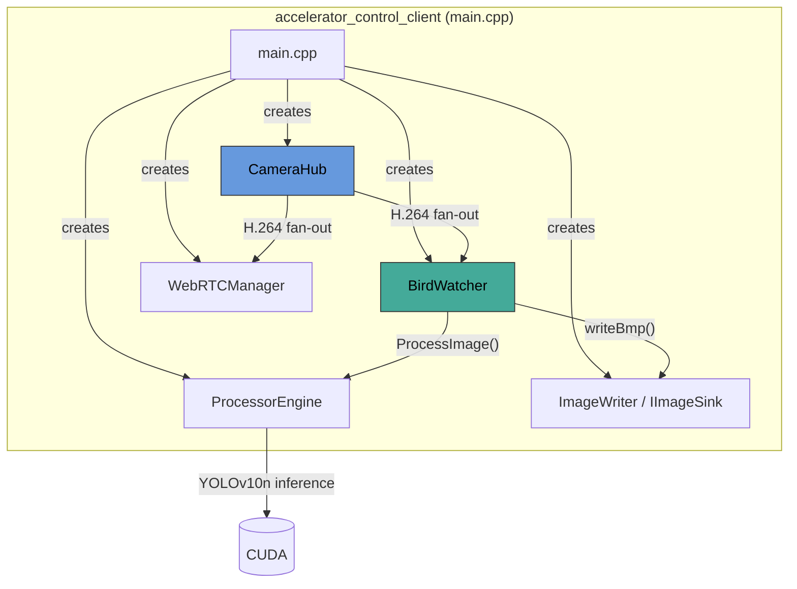
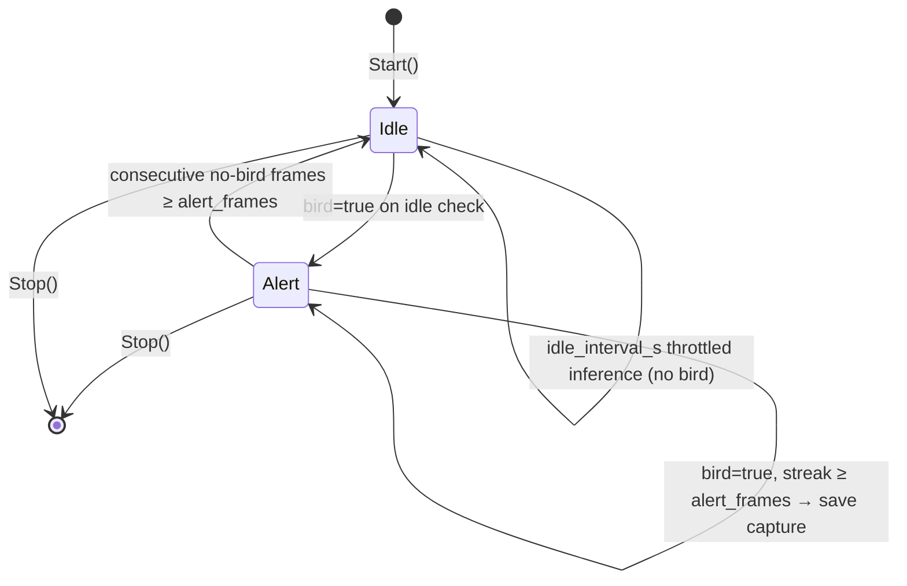
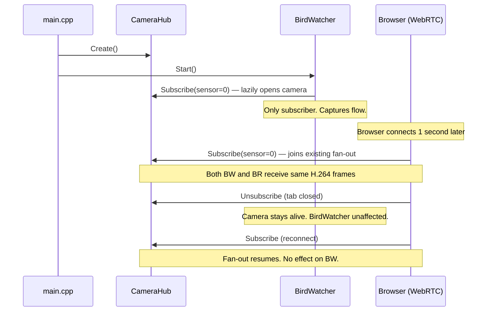

# BirdWatcher

Background bird-detection service that runs autonomously alongside the WebRTC
live-streaming stack. It subscribes to the same `CameraHub` fan-out as any
browser client, decodes H.264 frames with FFmpeg, runs YOLO inference via
`ProcessorEngine`, and saves BMP captures of detected birds — all without
requiring a UI connection.

## Architecture Overview



## File Responsibilities

| File | Role |
|---|---|
| `bird_watcher.h` | Defines `BirdWatcherConfig` and the `BirdWatcher` class — state machine, frame queue, FFmpeg decoder, YOLO integration, rate-limited BMP capture. |
| `bird_watcher.cpp` | Full implementation: H.264 decode → RGB → bird detection → state transitions → file save. |
| `BUILD` | Bazel `cc_library` target linking FFmpeg (`-lavcodec`, `-lavutil`, `-lswscale`), libdatachannel, and internal deps. |

### External Dependencies (not in this directory)

| Component | Path | Relationship |
|---|---|---|
| `CameraHub` | `adapters/camera/camera_hub.{h,cpp}` | Shared H.264 fan-out publisher. `BirdWatcher` calls `Subscribe()` to receive frames. Camera stays alive even with zero subscribers. |
| `ProcessorEngine` | `application/engine/processor_engine.{h,cpp}` | Synchronous YOLO inference endpoint. `BirdWatcher` calls `ProcessImage()` per frame. |
| `IImageSink` / `ImageWriter` | `domain/interfaces/` | BMP file writer. `BirdWatcher` calls `writeBmp()` to persist captures. |
| `main.cpp` | `cmd/accelerator_control_client/` | Wires everything together; reads absl flags, constructs `BirdWatcher`, calls `Start()`. |

## Frame Processing Pipeline

```mermaid
flowchart TD
    A[CameraHub H.264 callback] -->|enqueue| B{Queue ≤ 60?}
    B -->|yes| C[Push to frame_queue_]
    B -->|no| D[Drop oldest, push]
    C --> E[WorkerLoop thread]
    D --> E
    E --> F[FeedDecoderAndExtractRgb]
    F -->|always decode| G[H.264 AU → FFmpeg decoder]
    G --> H{want_rgb?}

    H -->|"no (idle, throttled)"| I[Discard decoded frame]
    H -->|yes| J[sws_scale → RGB24]
    J --> K[DetectBird: YOLO via ProcessorEngine]
    K --> L{bird detected?}

    L -->|no| M[consecutive_no_bird_frames_++]
    M --> N{≥ alert_frames?}
    N -->|yes| O["ALERT → IDLE"]
    N -->|no| P[Wait for next frame]

    L -->|yes| Q[consecutive_bird_frames_++]
    Q --> R{≥ alert_frames?}
    R -->|yes| S[MaybeSave → rate gate → BMP]
    R -->|no --> P

    style A fill:#69d,stroke:#333,color:#000
    style G fill:#e95,stroke:#333,color:#fff
    style K fill:#4a9,stroke:#333,color:#000
    style S fill:#d94,stroke:#333,color:#fff
```

## State Machine

`BirdWatcher` uses a two-state model to avoid wasting GPU cycles when no birds
are present:



**Idle** — YOLO inference runs only once every `idle_interval_s` seconds
(default 3). If a bird is detected, transitions to Alert.

**Alert** — Every decoded frame is sent to YOLO. After `alert_frames`
consecutive positive frames (default 5), a BMP is saved (subject to
rate gating). After `alert_frames` consecutive negative frames, returns to
Idle.

## Rate Gating

Saves are constrained by two configurable limits:

| Parameter | Default | Description |
|---|---|---|
| `max_per_minute` | 5 | Max captures saved in any rolling 60-second window |
| `min_save_interval_s` | 5 | Minimum gap between consecutive saves |

## WebRTC Independence

`BirdWatcher` is a **standalone subscriber** on `CameraHub`. It does not depend
on, wait for, or interact with WebRTC sessions:



Key design decisions that ensure independence:

1. **Camera stays alive with zero subscribers** — `CameraHub::Unsubscribe` does
   not tear down the GStreamer pipeline, avoiding V4L2 reopen latency and
   EBUSY races.
2. **First subscriber wins resolution** — the camera opens at whatever WxH/fps
   the first `Subscribe()` call requests. `BirdWatcher` defaults to
   1280×720@30 fps.
3. **Frame queue absorbs startup burst** — `kMaxQueueSize = 60` (~1 s at 30 fps)
   ensures the first IDR carrying SPS/PPS is not dropped before the FFmpeg
   decoder sees it.

## Configuration Flags

All flags are set in `main.cpp` via absl and forwarded through
`BirdWatcherConfig`:

| Flag | Default | Maps to |
|---|---|---|
| `--bird_watch_enabled` | `false` | `config.enabled` |
| `--bird_watch_confidence` | `0.4` | `config.confidence_threshold` |
| `--bird_watch_idle_interval_s` | `3` | `config.idle_interval_s` |
| `--bird_watch_alert_frames` | `5` | `config.alert_frames` |
| `--bird_watch_max_per_minute` | `5` | `config.max_per_minute` |
| `--bird_watch_min_interval_s` | `5` | `config.min_save_interval_s` |
| `--bird_watch_camera_id` | `0` | `config.camera_sensor_id` |
| `--captures_dir` | — | `config.captures_dir` |

## Jetson / Nvidia Argus Notes

With `--config=nvidia-argus-camera`, `GstCameraSourceImpl` selects the
`NvidiaArgusBackend` at runtime. The Argus pipeline re-emits SPS/PPS at every
IDR (`h264parse config-interval=-1`, `nvv4l2h264enc insert-sps-pps=true`), so
decoder recovery after queue overflow is guaranteed within one GOP (~1–2 s).

The BirdWatcher's default 1280×720 may not be a native sensor mode on Jetson
cameras (e.g., IMX477). If the Argus pipeline fails to negotiate, set the
capture dimensions to 0 to let the backend pick its defaults (typically
1920×1080@30).

## Build

```bash
# x86 + V4L2
bazel build --config=v4l2-camera \
  //src/cpp_accelerator/cmd/accelerator_control_client:accelerator_control_client

# Jetson + Argus
bazel build --config=cuda --config=nvidia-argus-camera \
  //src/cpp_accelerator/cmd/accelerator_control_client:accelerator_control_client
```

## Run

```bash
# Enable bird watching with default settings
./accelerator_control_client \
  --bird_watch_enabled=true \
  --captures_dir=./captures \
  --bird_watch_confidence=0.4

# The process will log:
# [CameraHub] Started sensor_id=0 1280x720@30fps
# [BirdWatcher] Started (camera=0, threshold=0.40)
# [BirdWatcher] first H264 frame decoded 1280x720
# [BirdWatcher] IDLE -> ALERT (bird detected)
# [BirdWatcher] Saved capture: ./captures/2026-05-02T19-00-43Z.bmp
```
