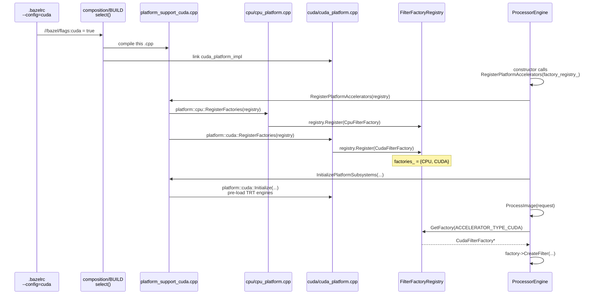
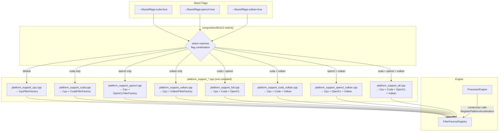

# Build Configuration: Accelerator Backend Selection

This document explains how the `accelerator_control_client` binary selects which GPU/CPU compute backends to compile in, and how this mechanism eliminates the need for `#ifdef` preprocessor guards in the C++ source code.

---

## Available Build Configurations

The binary supports four accelerator backends and one camera feature flag. **CPU is always compiled in**; the others are opt-in:

| Config flag | `--config=` shorthand | Backends included |
|---|---|---|
| *(none)* | *(default)* | CPU only |
| `--//bazel/flags:cuda=true` | `--config=cuda` | CPU + CUDA |
| `--//bazel/flags:opencl=true` | `--config=opencl` | CPU + OpenCL |
| `--//bazel/flags:vulkan=true` | `--config=vulkan` | CPU + Vulkan |
| *(combinations)* | `--config=cuda --config=opencl` | CPU + CUDA + OpenCL |
| `--config=full` | `--config=full` | CPU + CUDA + OpenCL + Vulkan |

These flags can be combined freely with the camera flag below.

### Camera Feature Flags: `--config=v4l2-camera` and `--config=nvidia-argus-camera`

Camera backends are now enabled explicitly via Bazel flags. These flags are separate from compute backend flags (`cuda`, `opencl`, `vulkan`) and only control camera capture backends.

| Platform | Camera config | Backends compiled | Behavior |
|---|---|---|---|
| Jetson (aarch64) | `--config=nvidia-argus-camera` | `NVIDIA Argus` (+ `Stub`) | Uses `nvarguscamerasrc` for CSI cameras |
| Jetson (aarch64) | *(none)* | `Stub` only | No camera backend available at runtime |
| x86 | `--config=v4l2-camera` | `V4L2` (+ `Stub`) | USB cameras via GStreamer |
| x86 | *(none)* | `Stub` only | Camera detection returns no cameras; streaming warns |
| any | `--config=cameras` | `V4L2` + `NVIDIA Argus` (+ `Stub`) | Enables all camera backends |

**Prerequisites**:

```bash
sudo apt install libgstreamer1.0-dev libgstreamer-plugins-base1.0-dev \
    libgstreamer-plugins-ugly1.0-dev gstreamer1.0-plugins-good
```

`adapters/camera/BUILD` enables camera backends through `config_setting` labels. If neither `v4l2_camera_enabled` nor `nvidia_argus_camera_enabled` is active, only the stub backend is linked:

```python
# adapters/camera/BUILD
cc_library(
    name = "backends",
    deps = [
        ":camera_backend",
        ":stub_backend",
    ] + select({
        "//bazel/flags:v4l2_camera_enabled": ["//src/cpp_accelerator/adapters/camera/backends:v4l2_backend"],
        "//conditions:default": [],
    }) + select({
        "//bazel/flags:nvidia_argus_camera_enabled": ["//src/cpp_accelerator/adapters/camera/backends:nvidia_argus_backend"],
        "//conditions:default": [],
    }),
)
```

The same `select()`-without-`#ifdef` pattern applies: three `.cpp` files, one compiled, no conditional compilation in C++ source.

Examples:

```bash
# CPU-only (no GPU)
bazel build //src/cpp_accelerator/cmd/accelerator_control_client

# CUDA + CPU (GPU inference)
bazel build --config=cuda //src/cpp_accelerator/cmd/accelerator_control_client

# All backends
bazel build --config=full //src/cpp_accelerator/cmd/accelerator_control_client

# CUDA + USB camera streaming (typical x86 dev setup)
bazel build --config=cuda --config=v4l2-camera //src/cpp_accelerator/cmd/accelerator_control_client

# CUDA + Jetson CSI camera streaming (Jetson/Nano Orin)
bazel build --config=cuda --config=nvidia-argus-camera //src/cpp_accelerator/cmd/accelerator_control_client

# Full compute + all camera backends
bazel build --config=full --config=cameras //src/cpp_accelerator/cmd/accelerator_control_client
```

---

## How It Works: Three Layers

The system is built from three layers that chain together: **flags** → **`select()`** → **platform wiring**.

### Layer 1: Bazel Boolean Flags (`bazel/flags/BUILD`)

Five `bool_flag` declarations create build-time toggles, each defaulting to `false`:

```python
bool_flag(name = "cuda",        build_setting_default = False)
bool_flag(name = "opencl",      build_setting_default = False)
bool_flag(name = "vulkan",      build_setting_default = False)
bool_flag(name = "v4l2_camera", build_setting_default = False)
```

`.bazelrc` wraps them in named configs for convenience:

```bash
build:cuda         --//bazel/flags:cuda=true
build:opencl       --//bazel/flags:opencl=true
build:vulkan       --//bazel/flags:vulkan=true
build:full         --config=cuda --config=opencl --config=vulkan

# USB camera support (x86 dev machines with V4L2 cameras + GStreamer + x264enc installed).
# Requires: sudo apt install libgstreamer1.0-dev libgstreamer-plugins-base1.0-dev \
#               libgstreamer-plugins-ugly1.0-dev gstreamer1.0-plugins-good
build:v4l2-camera  --//bazel/flags:v4l2_camera=true
```

`config_setting` rules convert each flag into a matchable label:

```python
config_setting(name = "cuda_enabled",        flag_values = {":cuda": "true"})
config_setting(name = "opencl_enabled",      flag_values = {":opencl": "true"})
config_setting(name = "vulkan_enabled",      flag_values = {":vulkan": "true"})
config_setting(name = "v4l2_camera_enabled", flag_values = {":v4l2_camera": "true"})
```

### Layer 2: `select()` in `composition/BUILD`

The `platform_support` `cc_library` target uses **two parallel `select()` blocks** — one for `srcs`, one for `deps`. Bazel evaluates them together at analysis time and picks exactly one branch for each based on which flags are true:

```python
cc_library(
    name = "platform_support",
    hdrs = ["platform/platform_support.h"],
    srcs = select({
        ":cuda_opencl_and_vulkan":      ["platform/platform_support_all.cpp"],
        ":cuda_and_opencl":             ["platform/platform_support_full.cpp"],
        ":cuda_and_vulkan":             ["platform/platform_support_cuda_vulkan.cpp"],
        ":opencl_and_vulkan":           ["platform/platform_support_opencl_vulkan.cpp"],
        "//bazel/flags:cuda_enabled":   ["platform/platform_support_cuda.cpp"],
        "//bazel/flags:opencl_enabled": ["platform/platform_support_opencl.cpp"],
        "//bazel/flags:vulkan_enabled": ["platform/platform_support_vulkan.cpp"],
        "//conditions:default":         ["platform/platform_support_cpu.cpp"],
    }),
    deps = [...] + select({
        ":cuda_opencl_and_vulkan":      [":cuda_platform_impl", ":opencl_platform_impl", ":vulkan_platform_impl"],
        ":cuda_and_opencl":             [":cuda_platform_impl", ":opencl_platform_impl"],
        ":cuda_and_vulkan":             [":cuda_platform_impl", ":vulkan_platform_impl"],
        ":opencl_and_vulkan":           [":opencl_platform_impl", ":vulkan_platform_impl"],
        "//bazel/flags:cuda_enabled":   [":cuda_platform_impl"],
        "//bazel/flags:opencl_enabled": [":opencl_platform_impl"],
        "//bazel/flags:vulkan_enabled": [":vulkan_platform_impl"],
        "//conditions:default":         [],
    }),
)
```

**What this does**: for a given combination of flags, Bazel compiles exactly **one** `platform_support_*.cpp` file and links in exactly the matching set of `*_platform_impl` libraries. The most-specific combination wins (e.g., `cuda_opencl_and_vulkan` beats `cuda_enabled`).

### Layer 3: Platform Wiring (no `#ifdef`)

Each `platform_support_*.cpp` implements the same three functions declared in `platform_support.h`:

```cpp
void RegisterPlatformAccelerators(FilterFactoryRegistry& registry);
void InitializePlatformSubsystems(const InitRequest&, InitResponse*);
bool ApplyInference(...);
```

Each variant `#include`s only the headers for the backends it supports and makes **unconditional** registration calls. For example, `platform_support_cuda.cpp`:

```cpp
#include "cpu/cpu_platform.h"
#include "cuda/cuda_platform.h"

void RegisterPlatformAccelerators(FilterFactoryRegistry& registry) {
  platform::cpu::RegisterFactories(registry);    // always
  platform::cuda::RegisterFactories(registry);   // because this is the CUDA variant
}
```

And `platform_support_all.cpp`:

```cpp
#include "cpu/cpu_platform.h"
#include "cuda/cuda_platform.h"
#include "opencl/opencl_platform.h"
#include "vulkan/vulkan_platform.h"

void RegisterPlatformAccelerators(FilterFactoryRegistry& registry) {
  platform::cpu::RegisterFactories(registry);
  platform::cuda::RegisterFactories(registry);
  platform::opencl::RegisterFactories(registry);
  platform::vulkan::RegisterFactories(registry);
}
```

**No `#ifdef` anywhere.** The "which backends to compile" decision is made entirely at the Bazel level. The C++ compiler sees only the code for the selected backends.

---

## Complete Registration Chain



---

## All Build Variants

| `platform_support_*.cpp` | Includes | Registered factories | `InitializePlatformSubsystems` | `ApplyInference` |
|---|---|---|---|---|
| `platform_support_cpu.cpp` | `cpu` | `CpuFilterFactory` | no-op | returns `false` |
| `platform_support_cuda.cpp` | `cpu` + `cuda` | `CpuFilterFactory` + `CudaFilterFactory` | `cuda::Initialize` (TRT preload) | `cuda::ApplyInference` |
| `platform_support_opencl.cpp` | `cpu` + `opencl` | `CpuFilterFactory` + `OpenCLFilterFactory` | no-op | returns `false` |
| `platform_support_vulkan.cpp` | `cpu` + `vulkan` | `CpuFilterFactory` + `VulkanFilterFactory` | no-op | returns `false` |
| `platform_support_full.cpp` | `cpu` + `cuda` + `opencl` | `Cpu` + `Cuda` + `OpenCL` | `cuda::Initialize` | `cuda::ApplyInference` |
| `platform_support_cuda_vulkan.cpp` | `cpu` + `cuda` + `vulkan` | `Cpu` + `Cuda` + `Vulkan` | `cuda::Initialize` | `cuda::ApplyInference` |
| `platform_support_opencl_vulkan.cpp` | `cpu` + `opencl` + `vulkan` | `Cpu` + `OpenCL` + `Vulkan` | no-op | returns `false` |
| `platform_support_all.cpp` | all four | `Cpu` + `Cuda` + `OpenCL` + `Vulkan` | `cuda::Initialize` | `cuda::ApplyInference` |

---

## Why This Eliminates `#ifdef`

### The `#ifdef` approach (what we avoid)

Without build-system-level selection, multi-backend code typically looks like this:

```cpp
void RegisterBackends(FilterFactoryRegistry& registry) {
  registry.Register(std::make_unique<CpuFilterFactory>());
#ifdef ENABLE_CUDA
  registry.Register(std::make_unique<CudaFilterFactory>());
#endif
#ifdef ENABLE_OPENCL
  registry.Register(std::make_unique<OpenCLFilterFactory>());
#endif
#ifdef ENABLE_VULKAN
  registry.Register(std::make_unique<VulkanFilterFactory>());
#endif
}

void InitializeSubsystem(...) {
#ifdef ENABLE_CUDA
  PreloadTensorRTEngines();
#endif
}
```

This pattern has several problems:

1. **Readability**: Every multi-backend function is littered with `#ifdef` blocks. The reader must mentally evaluate preprocessor conditions while reading the actual logic. A function's visible behavior depends on which macros are defined — the source code does not tell the full story.

2. **Compilation coupling**: Adding a new backend means editing the same source files that all other backends live in. The `#ifdef` for CUDA, OpenCL, and Vulkan all share one file, one compilation unit, one editor buffer. A typo in one `#ifdef` block can break the build for unrelated backends.

3. **IDE confusion**: Syntax highlighting, code navigation, and refactoring tools struggle with `#ifdef`. An IDE typically shows only one branch as "active"; the rest is grayed out or hidden. This makes it easy to introduce errors in the inactive branches that nobody sees until a different build configuration is used.

4. **Testing fragility**: With `#ifdef`, a single source file produces different binaries depending on preprocessor state. You cannot test all code paths in one compilation. A bug that only exists when `ENABLE_CUDA` is defined but `ENABLE_OPENCL` is not is invisible when you compile with both enabled.

### The `select()` approach (what we use)

With Bazel `select()`, each backend combination gets its own **self-contained `.cpp` file**:

```cpp
// platform_support_cuda.cpp — compiled only when --config=cuda
void RegisterPlatformAccelerators(FilterFactoryRegistry& registry) {
  platform::cpu::RegisterFactories(registry);
  platform::cuda::RegisterFactories(registry);   // unconditional
}
```

**Benefits**:

- **Plain C++**: Every line in every compiled file is real, executable C++. There are zero preprocessor conditionals in the composition layer. What you see is what runs.
- **Single Responsibility**: Each `platform_support_*.cpp` has one job — wire together exactly the backends for its configuration. Adding a new backend or combination means adding a new file, not editing an existing one.
- **Per-backend isolation**: `cuda_platform.cpp` cannot accidentally break `opencl_platform.cpp` because they live in separate compilation units. Each backend's implementation is physically separated.
- **IDE-friendly**: Every file is always fully visible to editors and tools. No grayed-out blocks, no hidden code paths.
- **Exhaustive and explicit**: The `select()` table in `composition/BUILD` serves as a single source of truth mapping every flag combination to exactly one implementation. It is easy to audit: there are 8 entries for 8 variants, and the mapping is visible at a glance.

---

## Architecture Diagram



---

## Adding a New Backend

To add a new accelerator backend (e.g., "Metal"):

1. **`bazel/flags/BUILD`**: Add `bool_flag(name = "metal")` and `config_setting(name = "metal_enabled")`.
2. **`.bazelrc`**: Add `build:metal --//bazel/flags:metal=true`.
3. **`composition/platform/metal/`**: Create `metal_platform.h` and `metal_platform.cpp` with `RegisterFactories()`.
4. **`composition/BUILD`**: Add `metal_platform_impl` library, then add new entries to both `select()` blocks for combinations involving Metal.
5. **Create new `platform_support_*.cpp`** files for each combination that includes Metal.

No existing source files are modified — only `BUILD` files and new `.cpp` files.

---

## Key Files

| File | Role |
|---|---|
| `bazel/flags/BUILD` | `bool_flag` and `config_setting` declarations |
| `.bazelrc` | Named `--config=` shorthands |
| `composition/BUILD` | `select()` blocks choosing `platform_support_*.cpp` + deps |
| `composition/platform/platform_support.h` | Shared interface (3 functions) |
| `composition/platform/platform_support_*.cpp` | One per backend combination |
| `composition/platform/<backend>/<backend>_platform.h/cpp` | Per-backend `RegisterFactories()` |
| `adapters/camera/BUILD` | `select()` blocks choosing camera source per platform |
| `adapters/camera/gst_camera_source_stub.cpp` | No-op camera source (x86 default) |
| `adapters/camera/gst_camera_source_v4l2.cpp` | V4L2 + GStreamer source (`--config=v4l2-camera`) |
| `adapters/camera/backends/nvidia_argus_backend.cpp` | Jetson Argus backend (`--config=nvidia-argus-camera`) |
| `application/engine/processor_engine.cpp` | Calls `RegisterPlatformAccelerators()` in constructor |
| `application/engine/filter_factory_registry.h` | `Register()` / `GetFactory()` map |
