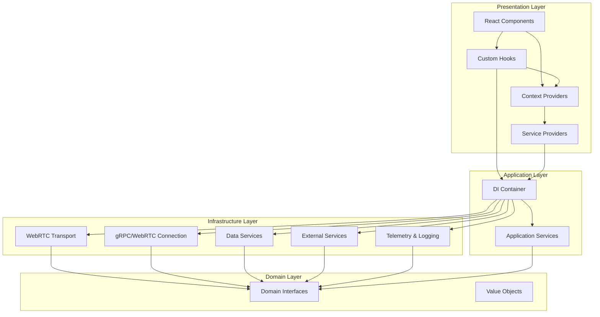
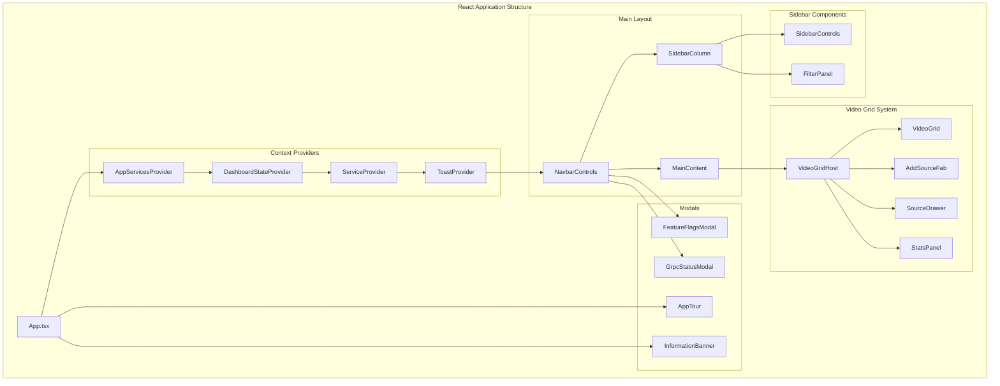
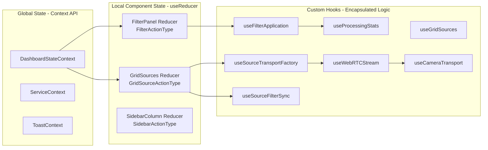

# CUDA Image Processor - Frontend

TypeScript frontend application built with **React 19**, implementing Clean Architecture principles for maintainable and testable code.

## Overview

The frontend is a **single-page application (SPA)** that provides real-time image and video processing through a modern web interface. Built with React 19, TypeScript, and Vite, it communicates with the Go backend via Connect-RPC for service calls and WebRTC for real-time frame streaming.

**Key Features:**
- **Multi-source video grid** supporting up to 9 simultaneous video sources
- Real-time webcam processing with GPU/CPU filter selection
- Static image and video file upload and processing
- Dynamic filter discovery from backend capabilities
- Drag-and-drop filter reordering with reducer-based state management
- Real-time performance metrics (FPS, processing time, frame count)
- Feature flag integration for gradual rollouts
- Comprehensive observability with OpenTelemetry
- Responsive design with collapsible sidebar

**Application Architecture:**
- **Clean Architecture** with clear separation between domain, application, infrastructure, and presentation layers
- **Context-based state management** for global dashboard state
- **Custom hooks** for encapsulated business logic
- **Reducer patterns** for complex state management (filters, grid sources, sidebar)
- **Dependency injection** container for service management

## Architecture

The frontend follows Clean Architecture principles with four distinct layers: **Domain**, **Application**, **Infrastructure**, and **Presentation**.

### Layer Overview



### Presentation Layer Architecture



### State Management Patterns

The application uses multiple state management patterns optimized for different use cases:



## Component Structure

### Application Root (`presentation/App.tsx`)

The main application entry point that orchestrates the entire UI:
- Renders navbar with `NavbarControls` and `InformationBanner`
- Manages `SidebarColumn` for filters and controls
- Hosts `VideoGridHost` for video processing
- Handles modal state for `FeatureFlagsModal`, `GrpcStatusModal`, and `AppTour`
- Provides localStorage clear functionality via credit footer interaction
- Integrates with `AppServicesProvider` for service availability

### Layout Components

**`SidebarColumn`** (`presentation/components/sidebar/SidebarColumn.tsx`):
- Collapsible sidebar panel with expand/collapse toggle
- Uses `useReducer` with `SidebarActionType` enum (EXPAND, COLLAPSE)
- Contains `SidebarControls` and `FilterPanel`
- Toggles CSS class on body for main content adjustment
- CSS Modules styling (`SidebarColumn.module.css`)

**`NavbarControls`** (`presentation/components/app/NavbarControls.tsx`):
- Top navigation bar with service controls
- `VersionTooltip` component displaying frontend/backend version information
- Feature flags toggle button
- Accelerator status indicator
- gRPC status indicator
- CSS Modules styling (`NavbarControls.module.css`)

### Video Grid System

**`VideoGridHost`** (`presentation/components/video/VideoGridHost.tsx`):
- Central orchestrator for the multi-source video grid (max 9 sources)
- Manages `VideoGrid`, `SourceDrawer`, `ImageSelectorModal`, and `StatsPanel`
- Integrates multiple custom hooks: `useGridSources`, `useCameraTransport`, `useSourceTransportFactory`, `useFilterApplication`, `useProcessingStats`, `useSourceFilterSync`
- Handles source selection, filter synchronization, and WebRTC readiness
- Coordinates between dashboard state and individual video sources

**`VideoGrid`** (`presentation/components/video/VideoGrid.tsx`):
- Responsive grid layout for displaying video sources
- Delegates rendering to `VideoGridHost` for each source
- CSS-based grid styling (`video-grid.css`)

**`VideoCanvas`** (`presentation/components/video/VideoCanvas.tsx`):
- HTML Canvas-based video frame renderer
- Draws detection bounding boxes using `detection-colors` palette
- Handles aspect ratio and canvas resizing
- CSS Modules styling (`VideoCanvas.module.css`)

**`VideoStreamer`** (`presentation/components/video/VideoStreamer.tsx`):
- WebRTC-based video streaming component
- Sends frames via `WebRTCFrameTransport`
- Receives detection results via `DataChannelFraming`
- Manages streaming session lifecycle
- CSS Modules styling (`VideoStreamer.module.css`)

**`VideoSourceCard`** (`presentation/components/video/VideoSourceCard.tsx`):
- Card wrapper for individual video sources
- Displays source preview with status indicators
- CSS Modules styling (`VideoSourceCard.module.css`)

**`grid-source.ts`** (`presentation/components/video/grid-source.ts`):
- TypeScript type definitions for grid sources
- `GridSource` interface: id, number, name, type, connected, filters, detections, stats
- `GridSourceActionType` enum for reducer actions (ADD, REMOVE, SELECT, UPDATE_STATE, etc.)
- `filtersToFilterData` utility for filter conversion

**`useGridSources.ts`** (`presentation/hooks/useGridSources.ts`):
- Custom hook for managing grid source state with reducer
- Provides source CRUD operations and selection management
- Handles source numbering and refs for real-time updates
- Integrates with dashboard state for synchronization

**`CameraPreview`** (`presentation/components/video/CameraPreview.tsx`):
- Webcam capture and display component
- MediaDevices API integration for camera access
- Sends frames to backend for processing
- Real-time processed frame display
- CSS Modules styling (`CameraPreview.module.css`)

**`detection-colors.ts`** (`presentation/components/video/detection-colors.ts`):
- Color palette mapping for detection bounding boxes
- Maps detection class labels to distinct colors

**`SourceDrawer`** (`presentation/components/video/SourceDrawer.tsx`):
- Side drawer for selecting input sources (images/videos)
- Tabbed interface for Images and Videos
- Integrates `ImageSelectorModal` and `VideoSelector`

**`AddSourceFab`** (`presentation/components/video/AddSourceFab.tsx`):
- Floating action button for adding new sources
- Triggers source drawer opening

**`AcceleratorStatusFab`** (`presentation/components/video/AcceleratorStatusFab.tsx`):
- Floating action button showing accelerator status
- Quick access to accelerator health information

**`ImageSelectorModal`** (`presentation/components/video/ImageSelectorModal.tsx`):
- Modal dialog for image source selection
- Displays available static images

**`VideoSelector`** (`presentation/components/video/VideoSelector.tsx`):
- Video source selection component
- Lists available video files

**`VideoUpload`** (`presentation/components/video/VideoUpload.tsx`):
- Video file upload component
- Handles file selection and upload progress
- CSS Modules styling (`VideoUpload.module.css`)

### Filter System

**`FilterPanel`** (`presentation/components/filters/FilterPanel.tsx`):
- Complex filter management component with reducer-based state
- `FilterActionType` enum for actions (INIT, TOGGLE_CARD, SET_ENABLED, SET_PARAMETER, REORDER, DRAG_START, DRAG_ENTER, DRAG_END)
- Drag-and-drop filter reordering with visual feedback
- Per-filter parameter controls (select, range, number, checkbox, text)
- Filter enable/disable toggle with auto-collapse on disable
- Integrates with `useFilters` hook for backend capabilities
- CSS Modules styling (`FilterPanel.module.css`)
- Comprehensive test coverage (`FilterPanel.test.tsx`)

### Application Components

**`StatsPanel`** (`presentation/components/app/StatsPanel.tsx`):
- Real-time processing statistics display
- Shows FPS, processing time, and frame count
- Toggleable visibility with localStorage persistence
- CSS Modules styling (`StatsPanel.module.css`)

**`SidebarControls`** (`presentation/components/sidebar/SidebarControls.tsx`):
- Accelerator selection (GPU/CPU)
- Resolution selection
- Integration with dashboard state

**`FeatureFlagsModal`** (`presentation/components/app/FeatureFlagsModal.tsx`):
- Modal dialog for feature flag management
- Flipt integration for flag evaluation
- CSS Modules styling (`FeatureFlagsModal.module.css`)

**`GrpcStatusModal`** (`presentation/components/app/GrpcStatusModal.tsx`):
- Modal dialog for gRPC connection status
- Displays connection health and diagnostics
- CSS Modules styling (`GrpcStatusModal.module.css`)

**`AppTour`** (`presentation/components/app/AppTour.tsx`):
- Guided tour for first-time users
- Shepherd.js integration
- CSS Modules styling (`AppTour.module.css`)

**`InformationBanner`** (`presentation/components/app/InformationBanner.tsx`):
- Information banner for announcements and alerts
- CSS Modules styling (`InformationBanner.module.css`)

### Supporting Components

**`HealthIndicator`** (`presentation/components/health/HealthIndicator.tsx`):
- Visual health status indicator
- Color-coded status display
- CSS Modules styling (`HealthIndicator.module.css`)

**`HealthPanel`** (`presentation/components/health/HealthPanel.tsx`):
- Detailed health information panel
- Accelerator and system health display
- CSS Modules styling (`HealthPanel.module.css`)

**`FileList`** (`presentation/components/files/FileList.tsx`):
- File listing component for images and videos
- CSS Modules styling (`FileList.module.css`)

**`ImageUpload`** (`presentation/components/image/ImageUpload.tsx`):
- Image upload component with drag-and-drop
- File validation and upload progress
- CSS Modules styling (`ImageUpload.module.css`)

## Service Architecture

### Dependency Injection Container (`application/di/container.ts`)

Singleton-based DI container providing centralized service access:
- `getConfigService()`: Stream configuration management
- `getVideoService()`: Video file operations
- `getFileService()`: Image file operations
- `getInputSourceService()`: Input source management
- `getProcessorCapabilitiesService()`: Filter capabilities
- `getTelemetryService()`: OpenTelemetry tracing
- `getLogger()`: Structured logging
- `getToolsService()`: External tools configuration
- `getWebRTCService()`: WebRTC connection management

### Application Services (`application/services/`)

**`config-service.ts`** (`StreamConfigService`):
- Manages stream configuration from backend (`ConfigService` gRPC client)
- Handles log level and console logging settings
- Initializes via `initialize()` method
- Provides `getLogLevel()`, `getConsoleLogging()` accessors
- Notifies listeners on configuration changes

**`processor-capabilities-service.ts`** (`ProcessorCapabilitiesService`):
- Fetches available filters and their parameters from `ImageProcessorService`
- Maps generic `GenericFilterDefinition` to UI-friendly types
- Notifies listeners when capabilities change via `addFiltersUpdatedListener()`
- Caches filter definitions for performance
- Supports filter refresh epoch for processor updates

**Root-level services** (`services/`):
- `feature-flags-service.ts`: Flipt integration for feature flag evaluation
- `processor-capabilities-service.ts`: Alternate location for processor capabilities

### Infrastructure Services

#### Transport Layer (`infrastructure/transport/`)

**`webrtc-frame-transport.ts`** (`WebRTCFrameTransportService`):
- WebRTC implementation for real-time frame streaming
- Implements `IFrameTransportService` interface
- Peer-to-peer communication with the gRPC server via data channels
- Low-latency frame transmission for real-time processing
- Connection lifecycle management and reconnection handling
- Integrates with `IWebRTCService` for signaling

**`data-channel-framing.ts`**:
- Binary framing protocol for structured data over WebRTC data channels
- `DataChannelFraming` class with static encode/decode methods
- Encodes/decodes detection results and frame metadata
- Protocol versioning and length-prefixed binary format
- Mirrors the C++ DataChannelFraming protocol for cross-language compatibility
- Tested in `data-channel-framing.test.ts`

**`transport-types.ts`**:
- Shared type definitions: `FrameData`, `DetectionResult`, `IToastDisplay`
- Toast notification interfaces for transport layer feedback

#### Connection Layer (`infrastructure/connection/`)

**`webrtc-service.ts`** (`webrtcService`):
- Comprehensive WebRTC peer connection management
- Implements `IWebRTCService` interface
- SDP offer/answer exchange via `WebRTCSignalService`
- ICE candidate handling and connection state management
- Session lifecycle: create, start, stop, close
- Heartbeat mechanism for connection health monitoring
- Data channel management for frame transmission

**`grpc-connection-service.ts`**:
- gRPC connection configuration and management

**`webrtc-manage.ts`**:
- WebRTC management utilities

#### Data Services (`infrastructure/data/`)

**`video-service.ts`** (`videoService`):
- Implements `IVideoService` interface
- Video file management (list, upload) via `FileService` gRPC client
- Video metadata handling and preview image generation
- `initialize()` method for preloading video data

**`file-service.ts`** (`fileService`):
- Implements `IFileService` interface
- Static image file management via `FileService` gRPC client
- Image upload, listing, and validation
- `initialize()` method for preloading image data

**`input-source-service.ts`** (`inputSourceService`):
- Implements `IInputSourceService` interface
- Manages available input sources from `ConfigService`
- Coordinates between images, videos, and webcam sources
- Source selection and switching capabilities
- `initialize()` method for loading input sources

#### External Services (`infrastructure/external/`)

**`feature-flags-service.ts`** (`featureFlagsService`):
- OpenFeature SDK integration with go-feature-flag-web-provider
- Fetches and caches feature flags from backend
- `isFeatureEnabled()` for boolean flag evaluation
- `getVariantFlag()` for variant flag evaluation
- Supports gradual rollouts and A/B testing

**`system-info-service.ts`** (`systemInfoService`):
- Retrieves system information from `ConfigService`
- Version information (Go, C++, Proto, frontend)
- Build metadata (branch, commit hash, build time)
- Environment detection (dev/staging/production)
- `initialize()` for preloading system info

**`tools-service.ts`** (`toolsService`):
- Dynamic tools configuration from `ConfigService`
- Observability tool links (Jaeger, Grafana, Loki)
- Test report and coverage access
- External service URLs
- `initialize()` for loading tools configuration

**`accelerator-health-monitor.ts`** (`acceleratorHealthMonitor`):
- Monitors GPU/CPU accelerator health status
- Polls `AcceleratorControlService` for health metrics
- Configurable polling interval and check callbacks
- Tracks accelerator availability and issues
- `startMonitoring()` and `stopMonitoring()` methods

**`grpc-version-service.ts`**:
- Retrieves gRPC version information
- Backend compatibility checking
- Version verification utilities

**`remote-management-service.ts`**:
- Remote device management capabilities
- Handles remote configuration via `RemoteManagementService`
- Manages remote service connections

#### gRPC Infrastructure (`infrastructure/grpc/`)

**`create-grpc-transport.ts`**:
- Creates Connect-RPC transport with `createConnectTransport()`
- Configured for HTTPS and HTTP/JSON fallback
- Interceptor support for observability

**`tracing-interceptor.ts`** (`tracingInterceptor`):
- OpenTelemetry interceptor for distributed tracing
- Injects trace context into gRPC requests
- Span creation for RPC calls

#### Observability (`infrastructure/observability/`)

**`telemetry-service.ts`** (`telemetryService`):
- OpenTelemetry SDK integration for web
- `initialize()` for tracer setup with optional feature flag
- Console and remote export support
- Resource detection and service naming

**`otel-logger.ts`** (`logger`):
- Structured logging with OpenTelemetry Logs Bridge
- Log level management (debug, info, warn, error)
- Console and remote logging with configurable output
- `initialize()` for setting up log levels and sinks
- `setEnvironment()` for environment context
- `shutdown()` for graceful cleanup

**`caller-site.ts`**:
- Source location tracking for log caller identification

**`resolve-caller-source.ts`**:
- Utilities for resolving caller source file and line number

## Domain Layer

### Interfaces (`domain/interfaces/`)

Domain interfaces define contracts without implementation details, following the Dependency Inversion Principle:

- **`IFrameTransportService`**: Frame transmission interface with methods for sending frames and receiving detections
- **`IConfigService`**: Configuration management with initialization and log level accessors
- **`IProcessorCapabilitiesService`**: Filter capabilities with listener support for capability changes
- **`IVideoService`**: Video operations (list, upload, metadata, previews)
- **`IFileService`**: File operations (list, upload for static images)
- **`IInputSourceService`**: Input source management and selection
- **`IToolsService`**: Tools and external services management
- **`IWebRTCService`**: WebRTC signaling and peer connection management (SDP exchange, ICE candidates, session lifecycle, heartbeat, data channels)
- **`ITelemetryService`**: Observability with span creation and initialization
- **`ILogger`**: Logging interface with structured logging methods

### Value Objects (`domain/value-objects/`)

Type-safe domain models with validation and business logic:

- **`ImageData`**: Image data with dimensions, format, and pixel data validation
- **`FilterData`**: Filter configuration with parameters, includes `toGenericFilterParameter()` conversion
- **`AcceleratorConfig`**: GPU/CPU accelerator selection with validation
- **`GrayscaleAlgorithm`**: Grayscale algorithm types (LUMINOSITY, AVERAGE, LIGHTNESS) with descriptive labels
- **`ConnectionStatus`**: WebRTC connection state and quality metrics (connecting, connected, disconnected, failed)
- **`FilterTypes`**: Filter parameter type definitions (enum, select, range, number, checkbox, text) with UI-friendly conversions
- **`ConnectionInfo`**: Connection metadata and session information
- **`WebRTCSession`**: WebRTC session information (ID, state, statistics)
- **`Uuid`**: UUID generation and validation utility

### Test Coverage

Value objects include comprehensive unit tests:
- `FilterData.test.ts`: Filter parameter conversion and validation
- `GrayscaleAlgorithm.test.ts`: Algorithm type conversion and validation
- `ImageData.test.ts`: Image data validation and edge cases

## React Context Architecture

The application uses React Context for global state management, providing a centralized way to share state across the component tree.

### Context Providers (`presentation/context/`)

**`dashboard-state-context.tsx`** (`DashboardStateProvider`):
- **Purpose**: Global dashboard state for selected source, filters, accelerator, and resolution
- **State**:
  - `selectedSourceNumber`: Currently selected source number (1-9)
  - `selectedSourceName`: Display name of selected source
  - `selectedAccelerator`: GPU or CPU accelerator choice
  - `selectedResolution`: Output resolution setting
  - `activeFilters`: Array of active filters with parameters
  - `processorFilterEpoch`: Epoch counter for processor filter updates
  - `isWebRTCReady`: WebRTC connection ready status
- **Actions**: Setters for each state property with useCallback optimization
- **Integration**: Listens to `ProcessorCapabilitiesService` for filter updates

**`service-context.tsx`** (`ServiceProvider`):
- **Purpose**: Legacy context for gRPC client injection (being phased out)
- **Provides**: `imageProcessorClient` and `remoteManagementClient`
- **Usage**: Primarily for testing with `renderWithService` utility

**`toast-context.tsx`** (`ToastProvider`):
- **Purpose**: Global toast notification system
- **Methods**: `success()`, `error()`, `warning()`, `info()`
- **Implementation**: Renders `ToastContainer` with notification queue
- **CSS Modules**: `toast-context.module.css` for styling

### Service Providers (`presentation/providers/`)

**`app-services-provider.tsx`** (`AppServicesProvider`):
- **Purpose**: Application bootstrap and service availability
- **State**: `ready` flag indicating service initialization complete
- **Provides**: Access to DI container via `useAppServices()` hook
- **Bootstrap**: Calls `ensureReactDashboardBootstrap()` on mount
- **Integration**: Wraps entire application, initializes all services

**`grpc-clients-provider.tsx`** (`GRPCClientsProvider`):
- **Purpose**: gRPC client initialization and injection
- **Provides**: Typed gRPC clients for Connect-RPC services
- **Lifecycle**: Manages client creation and cleanup

## Custom Hooks Architecture

Custom hooks encapsulate business logic and provide reusable stateful functionality across components.

### Video Processing Hooks (`presentation/hooks/`)

**`useWebRTCStream.ts`**:
- Establishes and manages WebRTC peer connections
- Handles video frame processing and transmission
- Manages connection state and quality metrics
- Integrates with `IWebRTCService` for signaling

**`useCameraTransport.ts`**:
- Manages webcam transport selection and initialization
- Handles camera frame transport for real-time processing
- Integrates WebRTC and Connect-RPC transports
- Provides camera control methods (start, stop, capture)

**`useSourceTransportFactory.ts`**:
- Factory pattern for creating appropriate transport per source type
- Manages transport lifecycle and cleanup
- Handles transport-specific configuration (resolution, accelerator)
- Returns `buildSource()` function for source creation

**`useSourceFilterSync.ts`**:
- Synchronizes filter state across multiple video sources
- Manages per-source filter configuration
- Handles filter order and parameter updates
- Propagates dashboard filter changes to active sources

**`useFilterApplication.ts`**:
- Manages filter application to video sources
- Handles static filter application for images
- Handles video filter synchronization for video sources
- Tracks processing statistics and metrics

**`useVideoFilterManager.ts`**:
- Manages filter pipeline for video sources
- Handles filter chain execution
- Coordinates filter operations with video playback

**`useProcessingStats.ts`**:
- Tracks FPS and processing time metrics
- Provides performance analytics for filters
- Manages statistics display and persistence
- Provides `statsManager` for individual source statistics

**`useGridSources.ts`**:
- Reducer-based hook for managing video source grid
- Handles source CRUD operations (add, remove, select, update)
- Manages source numbering (1-9) and refs for real-time updates
- Integrates with dashboard state for synchronization

### Configuration and Data Hooks

**`useConfig.ts`**:
- Fetches stream configuration from backend
- Manages feature flags and system settings
- Handles configuration updates and re-renders

**`useFilters.ts`**:
- Loads available filters from backend capabilities
- Manages filter order and parameters
- Handles drag-and-drop reordering

**`useAsyncGRPC.ts`**:
- Handles async gRPC calls with proper error handling
- Manages loading states
- Provides typed gRPC response handling

**`useFiles.ts`**:
- Lists available files (images and videos)
- Manages file operations and metadata
- Tracks file availability and changes

**`useImageUpload.ts`**:
- Manages file selection and upload
- Tracks upload progress
- Validates image formats and sizes

### UI and Utility Hooks

**`useToast.ts`**:
- Provides toast notification API
- Displays success/error messages
- Manages notification queue and auto-dismiss

**`useHealthMonitor.ts`**:
- Tracks accelerator availability
- Monitors system resources
- Provides health status updates and callbacks

## Application Bootstrap (`presentation/bootstrap-react-dashboard.ts`)

The `ensureReactDashboardBootstrap()` function initializes all services on application startup:

1. **Observability Services**:
   - `TelemetryService.initialize()` - OpenTelemetry tracing setup (feature gated)
   - `Logger.initialize()` - Structured logging configuration

2. **Configuration Services**:
   - `StreamConfigService.initialize()` - Stream config loading
   - `SystemInfoService.initialize()` - System info and environment detection
   - `ToolsService.initialize()` - External tools configuration

3. **Data Services**:
   - `InputSourceService.initialize()` - Available input sources
   - `ProcessorCapabilitiesService.initialize()` - Filter definitions
   - `VideoService.initialize()` - Video file listing
   - `WebRTCService.initialize()` - WebRTC service setup

4. **Health Monitoring**:
   - `AcceleratorHealthMonitor.startMonitoring()` - Health check polling
   - Global `accelerator-unhealthy` event dispatch

5. **Cleanup Handlers**:
   - `beforeunload` event listener for graceful shutdown
   - WebRTC session cleanup
   - Logger shutdown

## Utilities

**`presentation/utils/image-utils.ts`**:
- `frameResponseToDataUrl()`: Converts frame bytes to data URL for display
- `rasterizeImageToRgb()`: Rasterizes image to RGB pixel data
- Handles different channel formats (grayscale, RGB, RGBA)

**`presentation/test-utils/render-with-service.tsx`**:
- Test utility for rendering components with service context
- Mock gRPC client injection
- Root and cleanup management

## Dependency Injection

**`application/di/container.ts`**:
- Centralized dependency injection container
- Singleton pattern for service instances
- Factory methods for component-specific services
- Provides type-safe service access

**Service Resolution:**
- Application services: Singleton instances
- Transport service: WebRTCFrameTransportService with component dependencies
- Infrastructure services: Singleton instances with lazy initialization

## Transport Selection

The frontend uses **WebRTC** as the primary transport for real-time frame streaming:

- **WebRTC**: Peer-to-peer low-latency streaming via WebRTC data channels
- Signaling is handled through Connect-RPC WebRTC services
- Components use the `IFrameTransportService` interface, implemented by `WebRTCFrameTransportService`

The transport provides:
- Direct browser-to-gRTC server communication
- Low-latency frame transmission for real-time processing
- Automatic connection management and reconnection

## Development

### Quick Start

From project root:
```bash
./scripts/dev/start.sh --build  # First time or after code changes
./scripts/dev/start.sh           # Subsequent runs (hot reload)
```

**Access:**
- **React Dashboard**: https://localhost:8443 (production mode, served by Go server)
- **Vite Dev Server**: https://localhost:3000 (development mode with hot reload)

The backend Go server runs on port 8443. During development, Vite proxies gRPC calls to the Go server while providing hot module replacement.

### Manual Development

```bash
cd src/front-end
npm install              # Install dependencies
npm run dev             # Vite dev server with hot reload on port 3000
```

### Vite Configuration

The `vite.config.ts` includes several custom plugins:

1. **`gitVersionPlugin()`**: Injects git metadata (commit hash, branch, build time) as global constants
2. **`prettyFrontendRoutesPlugin()`**: Pretty URL routing for SPA
3. **`serveDataDirPlugin()`**: Serves `./data/**` at `/data/**` during development (nginx handles this in production)
4. **`@vitejs/plugin-react`**: React Fast Refresh and JSX support

### Build

```bash
npm run build           # Production build (syncs version first)
npm run build:prod      # Alias for build
```

The build process:
1. Runs `sync-version.mjs` to copy VERSION to build
2. Vite builds to `dist/` directory
3. Generates `manifest.json` for asset mapping
4. Creates production-optimized bundle with esbuild minification

Build output is embedded in the Go server binary as static assets. Production deployment uses Nginx to serve pre-built static files.

### Version Management

The `VERSION` file contains the semantic version number (e.g., `3.0.5`). The `sync-version.mjs` script syncs this version to the build before each production build.

## Testing

### Unit Tests (Vitest)

```bash
npm run test              # Run Vitest unit tests
npm run test:ui           # Vitest UI mode
npm run test:coverage     # Generate coverage report
```

**Test Patterns:**
- AAA (Arrange-Act-Assert) comments for test structure
- `vi.fn()` and `vi.mock()` for mocking
- `sut` (system under test) naming convention
- Table-driven tests for multiple cases
- Test data builders: `makeXXX()` functions
- Naming: `Success_`, `Error_`, `Edge_` prefix

**Test Files:**
- Component tests: `ComponentName.test.tsx` alongside component
- Hook tests: `useHookName.test.tsx` alongside hook
- Service tests: `service-name.test.ts` alongside service
- Value object tests: `ValueObjectName.test.ts` alongside value object

**Example Test Structure:**
```typescript
describe('ComponentName', () => {
  // Success: describe('Success_', () => { ... })
  // Error: describe('Error_', () => { ... })
  // Edge: describe('Edge_', () => { ... })
});
```

### E2E Tests (Playwright)

```bash
npm run test:e2e          # Run Playwright E2E tests
npm run test:e2e:ui       # Playwright UI mode
npm run test:e2e:dev      # Development mode (TEST_ENV=development)
npm run test:e2e:prod     # Production mode (TEST_ENV=production)
npm run test:e2e:headed   # Run with visible browser
npm run test:e2e:debug    # Debug mode with inspector
```

**E2E Test Coverage:**
- Dashboard bootstrap and initialization
- Filter configuration and application
- Image and video selection
- Filter combinations and toggle behavior
- Grayscale and blur filter visual validation
- Multi-source management
- Panel synchronization
- Resolution control
- Source removal
- Stream configuration and management
- Feature flags
- Frontend logging
- Image upload
- Tutorial and tour steps
- UI validation
- Version information
- Video playback

**Test Helpers:**
- `tests/e2e/helpers/`: Reusable test utilities
- `tests/e2e/utils/`: Test-specific helper functions

### Linting

```bash
npm run lint             # ESLint check
npm run lint:fix         # ESLint auto-fix
npm run format           # Prettier format
npm run format:check     # Prettier check
```

## Tech Stack

### Core Framework
- **React 19.2.5**: Modern React with concurrent rendering, automatic batching, and improved hooks
- **TypeScript 5.3.3**: Type-safe development with strict mode enabled
- **Vite 5.0.10**: Fast build tool and dev server with hot module replacement

### Build and Tooling
- **esbuild**: Fast minification via Vite
- **@vitejs/plugin-react 4.7.0**: React Fast Refresh and JSX support
- **prettier 3.2.4**: Code formatting
- **eslint 8.56.0**: Linting with React and TypeScript plugins

### Testing
- **Vitest 1.2.0**: Unit testing with native ESM support
- **@vitest/coverage-v8 1.2.0**: Code coverage with v8
- **@vitest/ui 1.2.0**: Vitest UI for interactive test running
- **Playwright 1.40.0**: E2E testing with cross-browser support
- **@testing-library/react 16.3.2**: React component testing utilities
- **@testing-library/user-event 14.6.1**: User interaction simulation
- **happy-dom 12.10.3**: Lightweight DOM implementation for testing

### RPC and Communication
- **@connectrpc/connect 1.7.0**: Type-safe RPC framework
- **@connectrpc/connect-web 1.7.0**: gRPC-Web implementation
- **@bufbuild/protobuf 1.10.1**: Protocol Buffers for JavaScript
- **@bufbuild/protoc-gen-es 1.10.1**: Code generation for ES
- **@connectrpc/protoc-gen-connect-es 1.7.0**: Connect code generation

### Observability
- **@opentelemetry/api 1.9.0**: OpenTelemetry API
- **@opentelemetry/sdk-trace-web 1.28.0**: Web tracing SDK
- **@opentelemetry/sdk-trace-base 1.28.0**: Base tracing SDK
- **@opentelemetry/resources 1.28.0**: Resource SDK
- **@opentelemetry/core 1.28.0**: Core utilities
- **@opentelemetry/exporter-trace-otlp-http 0.55.0**: OTLP trace exporter
- **@opentelemetry/sdk-logs 0.206.0**: Logs SDK
- **@opentelemetry/exporter-logs-otlp-http 0.206.0**: OTLP log exporter
- **@opentelemetry/api-logs 0.206.0**: Logs API bridge

### Feature Flags
- **@openfeature/web-sdk 1.7.3**: OpenFeature web SDK
- **@openfeature/go-feature-flag-web-provider 0.2.9**: go-feature-flag provider

### Utilities
- **uuid 13.0.0**: UUID generation
- **dotenv 17.2.3**: Environment variable management

## State Management Patterns

The application uses multiple state management patterns optimized for different use cases:

### Global State: React Context

**`DashboardStateContext`**:
- Selected source (number and name)
- Active filters with parameters
- Accelerator choice (GPU/CPU)
- Resolution setting
- WebRTC ready status
- Filter update epoch

**`AppServicesContext`**:
- DI container access
- Service initialization status

**`ToastContext`**:
- Toast notification queue
- Notification display methods

### Local Component State: useReducer

**`FilterPanel`** (`FilterActionType` enum):
- `INIT`: Initialize filter list
- `TOGGLE_CARD`: Expand/collapse filter
- `SET_ENABLED`: Enable/disable filter
- `SET_PARAMETER`: Update parameter value
- `REORDER`: Move filter to new position
- `DRAG_START`: Begin drag operation
- `DRAG_ENTER`: Drag over target
- `DRAG_END`: Complete drag operation

**`GridSources`** (`GridSourceActionType` enum):
- `ADD`: Add new source
- `REMOVE`: Remove source by ID
- `SELECT`: Select active source
- `UPDATE_STATE`: Update source connection state
- `SET_REMOTE_STREAM`: Set WebRTC stream
- `UPDATE_FILTERS`: Sync filters from dashboard
- `UPDATE_DETECTIONS`: Update detection results
- `UPDATE_STATS`: Update processing statistics

**`SidebarColumn`** (`SidebarActionType` enum):
- `EXPAND`: Expand sidebar
- `COLLAPSE`: Collapse sidebar

### Custom Hooks: Encapsulated Logic

Custom hooks provide reusable stateful functionality and business logic:
- State management via `useState`, `useReducer`
- Side effects via `useEffect`
- Memoization via `useMemo`, `useCallback`
- Ref management via `useRef`
- Context consumption via `useContext`

### Ref Patterns for Real-Time Updates

The application uses refs extensively for real-time state synchronization:
- `activeFiltersRef`: Current active filters (updated by context)
- `selectedResolutionRef`: Current resolution setting
- `selectedAcceleratorRef`: Current accelerator choice
- `sourcesRef`: Current grid sources array
- `selectedSourceIdRef`: Current selected source ID
- `nextNumberRef`: Next source number tracker

Refs allow hooks to access current state without triggering re-renders or creating dependency cycles.

## Directory Structure

```
front-end/
├── src/
│   ├── application/                # Application layer
│   │   ├── di/                     # Dependency injection container
│   │   │   ├── container.ts        # Singleton DI container
│   │   │   └── index.ts            # Barrel exports
│   │   └── services/               # Application services
│   │       ├── config-service.ts   # Stream configuration
│   │       └── processor-capabilities-service.ts
│   │                                  # Filter capabilities
│   ├── domain/                     # Domain layer
│   │   ├── interfaces/             # Domain contracts
│   │   │   ├── i-config-service.ts
│   │   │   ├── i-file-service.ts
│   │   │   ├── i-frame-transport-service.ts
│   │   │   ├── i-input-source-service.ts
│   │   │   ├── i-logger.ts
│   │   │   ├── i-processor-capabilities-service.ts
│   │   │   ├── i-telemetry-service.ts
│   │   │   ├── i-tools-service.ts
│   │   │   ├── i-video-service.ts
│   │   │   └── i-webrtc-service.ts
│   │   └── value-objects/          # Type-safe domain models
│   │       ├── accelerator-config.ts
│   │       ├── connection-info.ts
│   │       ├── connection-status.ts
│   │       ├── filter-data.ts
│   │       ├── filter-types.ts
│   │       ├── grayscale-algorithm.ts
│   │       ├── image-data.ts
│   │       ├── uuid.ts
│   │       ├── webrtc-session.ts
│   │       └── index.ts
│   ├── infrastructure/             # Infrastructure layer
│   │   ├── connection/             # gRPC/WebRTC connection
│   │   │   ├── grpc-connection-service.ts
│   │   │   ├── webrtc-manage.ts
│   │   │   └── webrtc-service.ts
│   │   ├── data/                   # Data services
│   │   │   ├── file-service.ts
│   │   │   ├── input-source-service.ts
│   │   │   └── video-service.ts
│   │   ├── external/               # External integrations
│   │   │   ├── accelerator-health-monitor.ts
│   │   │   ├── feature-flags-service.ts
│   │   │   ├── grpc-version-service.ts
│   │   │   ├── remote-management-service.ts
│   │   │   ├── system-info-service.ts
│   │   │   └── tools-service.ts
│   │   ├── grpc/                   # gRPC infrastructure
│   │   │   ├── create-grpc-transport.ts
│   │   │   └── tracing-interceptor.ts
│   │   ├── observability/          # Telemetry & logging
│   │   │   ├── caller-site.ts
│   │   │   ├── otel-logger.ts
│   │   │   ├── resolve-caller-source.ts
│   │   │   ├── telemetry-service.ts
│   │   │   ├── caller-site.test.ts
│   │   │   └── resolve-caller-source.test.ts
│   │   └── transport/              # Frame transport
│   │       ├── data-channel-framing.ts
│   │       ├── transport-types.ts
│   │       ├── webrtc-frame-transport.ts
│   │       └── data-channel-framing.test.ts
│   ├── presentation/               # Presentation layer (React)
│   │   ├── App.tsx                 # Main application component
│   │   ├── main.tsx                # React entry point
│   │   ├── bootstrap-react-dashboard.ts
│   │   │                             # Application bootstrap
│   │   ├── components/             # React components
│   │   │   ├── app/                # App-level components
│   │   │   │   ├── AppTour.tsx
│   │   │   │   ├── FeatureFlagsModal.tsx
│   │   │   │   ├── GrpcStatusModal.tsx
│   │   │   │   ├── InformationBanner.tsx
│   │   │   │   ├── NavbarControls.tsx
│   │   │   │   └── StatsPanel.tsx
│   │   │   ├── camera/             # Camera components (empty)
│   │   │   ├── files/              # File management
│   │   │   │   └── FileList.tsx
│   │   │   ├── filters/            # Filter UI
│   │   │   │   ├── FilterPanel.tsx
│   │   │   │   └── FilterPanel.test.tsx
│   │   │   ├── health/             # Health monitoring
│   │   │   │   ├── HealthIndicator.tsx
│   │   │   │   └── HealthPanel.tsx
│   │   │   ├── image/              # Image processing
│   │   │   │   └── ImageUpload.tsx
│   │   │   ├── sidebar/            # Sidebar components
│   │   │   │   ├── SidebarColumn.tsx
│   │   │   │   └── SidebarControls.tsx
│   │   │   └── video/              # Video components
│   │   │       ├── AcceleratorStatusFab.tsx
│   │   │       ├── AddSourceFab.tsx
│   │   │       ├── CameraPreview.tsx
│   │   │       ├── ImageSelectorModal.tsx
│   │   │       ├── SourceDrawer.tsx
│   │   │       ├── VideoCanvas.tsx
│   │   │       ├── VideoGrid.tsx
│   │   │       ├── VideoGridHost.tsx
│   │   │       ├── VideoSelector.tsx
│   │   │       ├── VideoSourceCard.tsx
│   │   │       ├── VideoStreamer.tsx
│   │   │       ├── VideoUpload.tsx
│   │   │       ├── detection-colors.ts
│   │   │       └── grid-source.ts
│   │   ├── context/                # React context
│   │   │   ├── dashboard-state-context.tsx
│   │   │   ├── service-context.tsx
│   │   │   └── toast-context.tsx
│   │   ├── hooks/                  # Custom hooks
│   │   │   ├── useAsyncGRPC.ts
│   │   │   ├── useCameraTransport.ts
│   │   │   ├── useConfig.ts
│   │   │   ├── useFactories.ts
│   │   │   ├── useFilterApplication.ts
│   │   │   ├── useFilters.ts
│   │   │   ├── useFiles.ts
│   │   │   ├── useGridSources.ts
│   │   │   ├── useHealthMonitor.ts
│   │   │   ├── useImageUpload.ts
│   │   │   ├── useProcessingStats.ts
│   │   │   ├── useSourceFilterSync.ts
│   │   │   ├── useSourceTransportFactory.ts
│   │   │   ├── useToast.ts
│   │   │   ├── useVideoFilterManager.ts
│   │   │   └── useWebRTCStream.ts
│   │   ├── providers/              # Service providers
│   │   │   ├── app-services-provider.tsx
│   │   │   └── grpc-clients-provider.tsx
│   │   ├── test-utils/             # Test utilities
│   │   │   └── render-with-service.tsx
│   │   └── utils/                  # Utilities
│   │       └── image-utils.ts
│   ├── services/                   # Root-level services
│   │   ├── feature-flags-service.ts
│   │   └── processor-capabilities-service.ts
│   ├── gen/                        # Generated protobuf code
│   │   ├── *_connect.ts           # Connect-RPC clients
│   │   └── *_pb.ts                # Protobuf messages
│   ├── test-setup.ts               # Vitest test setup
│   ├── vite-env.d.ts               # Vite type declarations
│   └── ...                         # Other source files
├── public/                         # Static assets
│   └── static/                    # CSS, images, fonts
├── tests/
│   └── e2e/                        # Playwright E2E tests
│       ├── helpers/                # Test helpers
│       ├── utils/                  # Test utilities
│       └── *.spec.ts              # Test specs
├── index.html                      # HTML entry point
├── vite.config.ts                  # Vite configuration
├── tsconfig.json                   # TypeScript configuration
├── vitest.config.ts                # Vitest configuration
├── playwright.config.ts            # Playwright configuration
├── Dockerfile                      # Production build with Nginx
├── Dockerfile.build                # Multi-stage build
├── VERSION                         # Version file
├── sync-version.mjs                # Version sync script
└── package.json                    # Dependencies and scripts
```

## Design Principles

1. **Clean Architecture**: Clear separation between domain, application, infrastructure, and presentation layers
2. **Dependency Inversion**: Components depend on interfaces, not implementations
3. **Single Responsibility**: Each component and service has one clear purpose
4. **Interface Segregation**: Small, focused interfaces (e.g., `IFrameTransportService` vs `IWebRTCService`)
5. **Composition over Inheritance**: Services aggregate functionality; hooks compose behavior
6. **Type Safety**: TypeScript strict mode with comprehensive type coverage
7. **Reducer Pattern**: Complex state management uses reducers with action type enums
8. **Context for Global State**: React Context for application-wide state
9. **Hooks for Logic**: Custom hooks encapsulate business logic and side effects
10. **CSS Modules**: Scoped CSS to prevent style conflicts
11. **Enum-Based Actions**: Type-safe action enums for reducer-based state management
12. **Test-Driven**: Comprehensive test coverage for components, hooks, services, and value objects

## See Also

- [Main README](../../README.md) - Project overview
- [Go API README](../go_api/README.md) - Backend architecture
- [Testing Documentation](../../docs/testing-and-coverage.md) - Test execution guide
