# CUDA Image Processor - Frontend

TypeScript frontend application built with **React**, implementing Clean Architecture principles for maintainable and testable code.

## Overview

The frontend is a **multi-page application (MPA)** that provides real-time image and video processing through a web interface. It contains:

1. **React Dashboard** (`/`) - Full React 19 application with components, hooks, and context providers

Both communicate with the Go backend via Connect-RPC (gRPC-Web) for service calls and WebRTC for real-time frame streaming.

**Key Features:**
- Real-time webcam processing with GPU/CPU filter selection
- Static image and video file upload and processing
- Dynamic filter discovery from backend capabilities
- Drag-and-drop filter reordering
- Real-time performance metrics (FPS, processing time)
- Feature flag integration for gradual rollouts
- Comprehensive observability with OpenTelemetry

## Architecture

The frontend follows Clean Architecture principles with clear separation between domain interfaces, application services, infrastructure implementations, and UI components.

```mermaid
graph TB
    subgraph "Presentation Layer"
        AppRoot[App Root]
        FilterPanel[FilterPanel]
        VideoGrid[VideoGrid]
        VideoGridHost[VideoGridHost]
        VideoCanvas[VideoCanvas]
        VideoStreamer[VideoStreamer]
        VideoSourceCard[VideoSourceCard]
        CameraPreview[CameraPreview]
        StatsPanel[StatsPanel]
        SourceDrawer[SourceDrawer]
        ToolsDropdown[ToolsDropdown]
        DetectionColors[Detection Colors]
    end

    subgraph "Application Services Layer"
        ConfigService[ConfigService]
        ProcessorCaps[ProcessorCapabilitiesService]
        DIContainer[DI Container]
    end

    subgraph "Infrastructure Layer"
        subgraph "Transport"
            WebRTCTransport[WebRTCFrameTransport]
            DataChannelFraming[DataChannelFraming]
        end

        subgraph "Connection"
            GRPCConnection[gRPC Connection]
            WebRTCService[WebRTC Service]
            WebRTCManage[WebRTC Manage]
        end

        subgraph "Data Services"
            VideoService[VideoService]
            FileService[FileService]
            InputSourceService[InputSourceService]
        end

        subgraph "External Services"
            FeatureFlags[FeatureFlagsService]
            SystemInfo[SystemInfoService]
            ToolsService[ToolsService]
        end

        subgraph "Observability"
            TelemetryService[TelemetryService]
            Logger[Logger]
        end
    end

    subgraph "Domain Layer"
        Interfaces[Domain Interfaces]
        ValueObjects[Value Objects]
    end

    subgraph "Backend"
        GoServer[Go Web Server]
        GRPCServer[gRPC Server]
    end

    AppRoot --> FilterPanel
    AppRoot --> VideoGrid
    AppRoot --> CameraPreview
    AppRoot --> StatsPanel
    AppRoot --> SourceDrawer
    VideoGrid --> VideoGridHost
    VideoGridHost --> VideoCanvas
    VideoGridHost --> VideoStreamer
    VideoGridHost --> VideoSourceCard

    FilterPanel --> ProcessorCaps
    CameraPreview --> WebRTCTransport
    VideoStreamer --> WebRTCTransport
    VideoStreamer --> DataChannelFraming
    VideoCanvas --> DetectionColors

    ProcessorCaps --> GRPCServer
    WebRTCTransport --> GRPCServer
    WebRTCTransport --> WebRTCService

    VideoService --> GoServer
    FileService --> GoServer
    InputSourceService --> GoServer

    ConfigService --> GoServer
    FeatureFlags --> GoServer
    SystemInfo --> GoServer
    ToolsService --> GoServer

    ConfigService --> Interfaces
    ProcessorCaps --> Interfaces
    WebRTCTransport --> Interfaces
    VideoService --> Interfaces
    FileService --> Interfaces

    TelemetryService --> Logger
    Logger --> GoServer
```



## Component Structure

### Core Application Components

**`app-root`** (`components/app/app-root.ts`):
- Main application container component
- Manages global state and component lifecycle
- Coordinates between UI components and services
- Handles application initialization

**`filter-panel`** (`components/app/filter-panel.ts`):
- Displays available filters from backend capabilities
- Allows drag-and-drop filter reordering
- Provides parameter controls (select, range, number, checkbox, text)
- Updates filter configuration in real-time

**`video-grid`** (`components/video/VideoGrid.tsx`):
- Displays video sources in a grid layout
- Hosts VideoGridHost for rendering individual sources

**`video-grid-host`** (`components/video/VideoGridHost.tsx`):
- Manages the video grid layout and source lifecycle
- Renders VideoCanvas and VideoStreamer components per source
- Handles source selection and removal

**`video-canvas`** (`components/video/VideoCanvas.tsx`):
- Renders processed video frames and detection overlays on an HTML Canvas
- Draws bounding boxes using detection-colors palette
- Handles canvas resizing and aspect ratio

**`video-streamer`** (`components/video/VideoStreamer.tsx`):
- Manages WebRTC-based video streaming sessions
- Sends frames via WebRTCFrameTransport
- Receives detection results via DataChannelFraming

**`video-source-card`** (`components/video/VideoSourceCard.tsx`):
- Card component for individual video sources
- Shows source preview, status, and controls
- CSS Modules styling (VideoSourceCard.module.css)

**`detection-colors.ts`** (`components/video/detection-colors.ts`):
- Color palette for rendering detection bounding boxes
- Maps detection class labels to distinct colors

**`camera-preview`** (`components/video/CameraPreview.tsx`):
- Captures frames from webcam using MediaDevices API
- Sends frames to backend via transport layer
- Displays processed frames in real-time
- Shows connection status and performance metrics

**`stats-panel`** (`components/app/stats-panel.ts`):
- Displays real-time processing statistics
- Shows FPS, processing time, frame count
- Toggleable visibility with state persistence

**`source-drawer`** (`components/app/source-drawer.ts`):
- Side drawer for selecting input sources
- Tabs for Images and Videos
- Integrates with ImageSelectorModal and VideoSelector

### Supporting Components

**`toast-container`** (`components/app/toast-container.ts`):
- Global toast notification system
- Success, error, warning, and info messages
- Auto-dismiss with configurable duration

**`app-tour`** (`components/app/app-tour.ts`):
- Guided tour for first-time users
- Highlights key features and UI elements
- Uses Shepherd.js for tour management

**`connection-status-card`** (`components/app/connection-status-card.ts`):
- Displays current connection status
- Shows WebRTC connection state and quality
- Connection quality indicators

**`tools-dropdown`** (`components/ui/tools-dropdown.ts`):
- Dynamic tools menu based on configuration
- Links to observability tools (Jaeger, Grafana)
- Feature flag management (Flipt)
- Test reports and coverage

## Service Architecture

### Application Services (`application/services/`)

**`config-service.ts`**:
- Manages stream configuration from backend
- Handles log level and console logging settings
- Provides configuration to other services

**`processor-capabilities-service.ts`**:
- Fetches available filters and their parameters
- Maps generic filter definitions to UI types
- Notifies listeners when capabilities change
- Caches filter definitions for performance

### Infrastructure Services

#### Transport Layer (`infrastructure/transport/`)

**`webrtc-frame-transport.ts`**:
- WebRTC implementation for real-time frame streaming
- Peer-to-peer communication with the gRPC server
- Uses WebRTC data channels for low-latency frame transmission
- Handles WebRTC signaling through Connect-RPC
- Connection lifecycle management and reconnection handling

**`data-channel-framing.ts`**:
- Binary framing protocol for structured data over WebRTC data channels
- Encodes/decodes detection results and frame metadata
- Mirrors the C++ DataChannelFraming protocol for cross-language compatibility
- Tested in `data-channel-framing.test.ts`

**`transport-types.ts`**:
- Shared type definitions for the transport layer

#### Data Services (`infrastructure/data/`)

**`video-service.ts`**:
- Video file management (list, upload)
- Video metadata handling
- Preview image generation

**`file-service.ts`**:
- Static image file management
- Image upload and listing
- File validation

**`input-source-service.ts`**:
- Manages available input sources
- Coordinates between images, videos, and webcam
- Source selection and switching

#### External Services (`infrastructure/external/`)

**`feature-flags-service.ts`**:
- Fetches and caches feature flags from Flipt
- Evaluates boolean and variant flags
- Supports gradual rollouts

**`system-info-service.ts`**:
- Retrieves system information from backend
- Version information and build details
- Backend capabilities

**`tools-service.ts`**:
- Dynamic tools configuration
- Observability tool links
- Test report access

#### External Services (`infrastructure/external/`)

**`accelerator-health-monitor.ts`**:
- Monitors GPU/CPU accelerator health status
- Tracks accelerator availability
- Provides health metrics and diagnostics

**`grpc-version-service.ts`**:
- Retrieves gRPC version information
- Checks backend compatibility
- Manages version verification

**`remote-management-service.ts`**:
- Remote device management capabilities
- Handles remote configuration
- Manages remote service connections

#### Observability (`infrastructure/observability/`)

**`telemetry-service.ts`**:
- OpenTelemetry integration
- Distributed tracing support
- Span creation and management

**`otel-logger.ts`**:
- Structured logging with OpenTelemetry
- Log level management
- Console and remote logging

## Domain Layer

### Interfaces (`domain/interfaces/`)

Domain interfaces define contracts without implementation details:

- **`IFrameTransportService`**: Frame transmission interface (WebRTC implementation)
- **`IConfigService`**: Configuration management
- **`IProcessorCapabilitiesService`**: Filter capabilities
- **`IVideoService`**: Video operations
- **`IFileService`**: File operations
- **`IInputSourceService`**: Input source management
- **`IToolsService`**: Tools and external services management
- **`IWebRTCService`**: WebRTC signaling and peer connection management (includes SDP exchange, ICE candidates, session lifecycle)
- **`ITelemetryService`**: Observability
- **`ILogger`**: Logging interface

### Value Objects (`domain/value-objects/`)

Type-safe domain models:

- **`ImageData`**: Image data with dimensions and format
- **`FilterData`**: Filter configuration and parameters
- **`AcceleratorConfig`**: GPU/CPU accelerator selection
- **`GrayscaleAlgorithm`**: Grayscale algorithm types
- **`ConnectionStatus`**: WebRTC connection state and quality metrics
- **`WebRTCSession`**: WebRTC session information
- **`Uuid`**: UUID generation and validation utility

### React Hooks & Context Architecture

The React dashboard uses custom hooks and context providers for state management, replacing the previous UIService approach.

**Custom Hooks** (`react/hooks/`):

- **`useWebRTCStream.ts`**: Manages WebRTC connections for real-time video streaming
  - Establishes WebRTC peer connections
  - Handles video frame processing
  - Manages connection state and quality metrics

- **`useImageProcessing.ts`**: Orchestrates image processing operations
  - Processes images via Connect-RPC
  - Manages filter configuration
  - Tracks processing metrics

- **`useFilters.ts`**: Filter management and selection
  - Loads available filters from backend
  - Manages filter order and parameters
  - Handles drag-and-drop reordering

- **`useConfig.ts`**: Configuration management
  - Fetches stream configuration
  - Manages feature flags
  - Handles system settings

- **`useHealthMonitor.ts`**: System health monitoring
  - Tracks accelerator availability
  - Monitors system resources
  - Provides health status updates

- **`useAsyncGRPC.ts`**: Async gRPC operation management
  - Handles async gRPC calls with proper error handling
  - Manages loading states
  - Provides typed gRPC response handling

- **`useImageUpload.ts`**: Image upload handling
  - Manages file selection and upload
  - Tracks upload progress
  - Validates image formats and sizes

- **`useFiles.ts`**: File management
  - Lists available files
  - Manages file operations
  - Tracks file metadata

- **`useToast.ts`**: Toast notifications
  - Displays success/error messages
  - Manages notification queue
  - Provides notification API

**Context Providers** (`react/context/`):

- **`dashboard-state-context.tsx`**: Global dashboard state
  - Manages active input sources
  - Coordinates filter pipelines
  - Handles UI state (drawers, panels)

- **`service-context.tsx`**: Service dependency injection
  - Provides application services to components
  - Manages service lifecycle
  - Enables testing with mock services

- **`toast-context.tsx`**: Toast notifications
  - Displays success/error messages
  - Manages notification queue
  - Provides notification API

**Service Providers** (`react/providers/`):

- **`app-services-provider.tsx`**: Application services provider
  - Initializes application-level services
  - Sets up service dependencies
  - Wraps application with context providers

- **`grpc-clients-provider.tsx`**: gRPC clients provider
  - Initializes gRPC client connections
  - Provides typed gRPC clients to components
  - Manages client lifecycle
  - Wraps application with context providers

## Dependency Injection

**`application/di/Container.ts`**:
- Centralized dependency injection container
- Singleton pattern for service instances
- Factory methods for component-specific services
- Provides type-safe service access

**Service Resolution:**
- Application services: Singleton instances
- Transport service: WebRTCFrameTransportService with component dependencies
- Infrastructure services: Singleton instances with lazy initialization

## Transport Selection

The frontend uses **WebRTC** as the primary transport for real-time frame streaming:

- **WebRTC**: Peer-to-peer low-latency streaming via WebRTC data channels
- Signaling is handled through Connect-RPC WebRTC services
- Components use the `IFrameTransportService` interface, implemented by `WebRTCFrameTransportService`

The transport provides:
- Direct browser-to-gRTC server communication
- Low-latency frame transmission for real-time processing
- Automatic connection management and reconnection

## Development

### Quick Start

From project root:
```bash
./scripts/dev/start.sh --build  # First time or after code changes
./scripts/dev/start.sh           # Subsequent runs (hot reload)
```

**Access:**
- **React Dashboard**: https://localhost:8443 (or http://localhost:3000 for Vite dev server)

The backend Go server runs on port 8443, while the Vite dev server runs on port 3000 during development.

### Manual Development

```bash
cd src/front-end
npm install
npm run dev  # Vite dev server with hot reload on port 3000
```

### Build

```bash
npm run build  # Production build
```

The build output is embedded in the Go server binary as static assets. The production deployment uses Nginx to serve the pre-built static files.

## Testing

### Unit Tests

```bash
npm run test  # Vitest unit tests
npm run test:ui  # Vitest UI mode
npm run test:coverage  # Generate coverage report
```

### E2E Tests

```bash
npm run test:e2e  # Playwright E2E tests
npm run test:e2e:ui  # Playwright UI mode
npm run test:e2e:dev  # Development mode
```

## Tech Stack

- **React 19**: Modern React application with hooks and context
- **TypeScript**: Type-safe JavaScript
- **Vite**: Build tool and dev server with MPA support
- **Vitest**: Unit testing framework
- **Playwright**: E2E testing
- **Connect-RPC**: gRPC-Web client library for service calls and WebRTC signaling
- **WebRTC**: Real-time peer-to-peer frame streaming
- **OpenTelemetry**: Distributed tracing
- **Shepherd.js**: Guided tour library

## Directory Structure

```
front-end/
├── src/
│   ├── application/          # Application layer
│   │   ├── di/              # Dependency injection container
│   │   └── services/        # Application services (ConfigService, ProcessorCapabilitiesService)
│   ├── domain/               # Domain layer
│   │   ├── interfaces/      # Contracts (IFrameTransportService, IWebRTCService, etc.)
│   │   └── value-objects/   # Type-safe domain models
│   ├── infrastructure/       # Infrastructure layer
│   │   ├── connection/      # gRPC connection, WebRTC service & management
│   │   ├── data/            # VideoService, FileService, InputSourceService
│   │   ├── external/        # FeatureFlags, SystemInfo, ToolsService, HealthMonitor
│   │   ├── grpc/            # gRPC client utilities
│   │   ├── observability/   # TelemetryService, OTelLogger
│   │   └── transport/       # WebRTCFrameTransport, DataChannelFraming
│   ├── presentation/         # Presentation layer (React)
│   │   ├── components/      # React components
│   │   │   ├── app/         # Core app components (AppRoot, FilterPanel, StatsPanel)
│   │   │   ├── camera/      # Camera preview
│   │   │   ├── files/       # File management
│   │   │   ├── filters/     # Filter selection UI
│   │   │   ├── health/      # Health monitoring
│   │   │   ├── image/       # Image processing
│   │   │   ├── settings/    # Settings panel
│   │   │   ├── sidebar/     # Sidebar components
│   │   │   └── video/       # VideoGrid, VideoCanvas, VideoStreamer, VideoSourceCard, etc.
│   │   ├── context/         # React context providers (dashboard-state, service, toast)
│   │   ├── hooks/           # Custom hooks (useWebRTCStream, useFilters, useConfig, etc.)
│   │   ├── providers/       # Service providers (app-services, grpc-clients)
│   │   └── test-utils/      # Test utilities and helpers
│   ├── services/             # Shared services
│   └── gen/                  # Generated protobuf code
├── public/                   # Static assets
│   └── static/              # CSS, images, fonts
├── tests/
│   └── e2e/                 # E2E tests (Playwright)
├── index.html                # Main entry point
├── vite.config.ts            # Vite configuration
├── Dockerfile                # Production build with Nginx
└── package.json
```

## Design Principles

1. **Clean Architecture**: Clear separation between domain, application, and infrastructure
2. **Dependency Inversion**: Components depend on interfaces, not implementations
3. **Single Responsibility**: Each component and service has one clear purpose
4. **Interface Segregation**: Small, focused interfaces
5. **Composition over Inheritance**: Services aggregate functionality
6. **Type Safety**: TypeScript for compile-time error detection

## See Also

- [Main README](../../README.md) - Project overview
- [Go API README](../go_api/README.md) - Backend architecture
- [Testing Documentation](../../docs/testing-and-coverage.md) - Test execution guide
