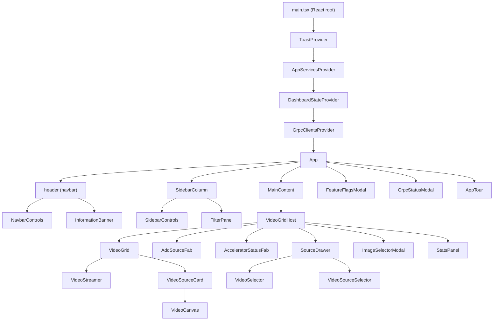
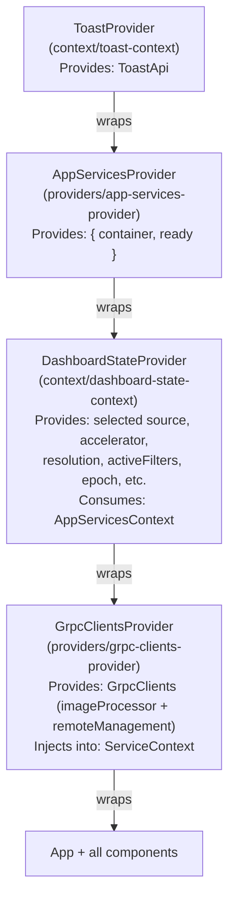
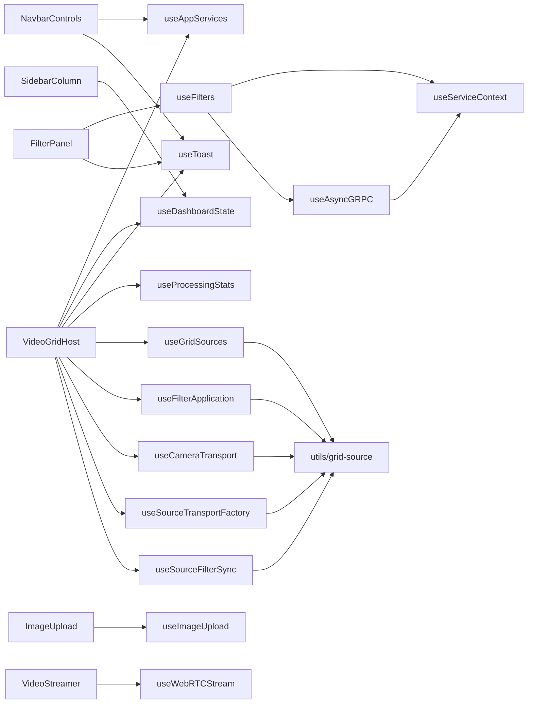

# presentation/

This folder is the **React presentation layer** of the frontend's Clean Architecture stack:

```
domain/ → application/ → infrastructure/ → presentation/  ← you are here
```

It owns everything the user sees and interacts with: React components, custom hooks, context providers, and view-level utilities. It depends on `application/` (DI container, use-case services) and `infrastructure/` (transport, gRPC, observability) but **never the other way around**.

Nothing in this folder should contain business rules. Domain logic lives in `domain/`; orchestration lives in `application/`.

---

## File naming (project convention)

| Kind | Pattern | Examples |
|------|---------|----------|
| React components under `components/` | PascalCase + `.tsx` | `VideoGrid.tsx`, `VideoGridHost.test.tsx` |
| Root app shell | PascalCase + `.tsx` | `App.tsx`, `App.test.tsx` |
| Context, providers, test-utils (non-component `.tsx`) | kebab-case + `.tsx` | `dashboard-state-context.tsx`, `render-with-service.tsx` |
| Entry | `main.tsx` | (exception to PascalCase) |
| Hooks under `hooks/` | `use` + descriptive name + `.ts` / `.tsx` | `useToast.ts`, `useAsyncGRPC.ts` (acronyms like GRPC/WebRTC stay uppercase; `unicorn/filename-case` is off under `hooks/` so strict camelCase does not force `useAsyncGrpc`) |
| Utilities | kebab-case + `.ts` | `image-utils.ts`, `grid-source.ts` |

Elsewhere under `src/`: domain interface files are kebab-case with an `i-` prefix (e.g. `i-config-service.ts`); value objects and other non-hook `.ts` modules use kebab-case. Generated code under `src/gen/` is excluded from filename-case linting.

---

## Folder Tree (annotated)

```
presentation/
├── main.tsx                        Entry point — mounts React root, wraps with providers
├── App.tsx                         Root layout: navbar, sidebar, main content area
├── App.test.tsx                    Smoke test for App render
├── App.module.css
├── bootstrap-react-dashboard.ts    One-shot async bootstrap (services init, telemetry, WebRTC)
├── root.css                        Global CSS reset / design tokens
│
├── providers/                      React Context providers that wrap the whole app
│   ├── app-services-provider.tsx   Exposes the DI container + "ready" flag via AppServicesContext
│   └── grpc-clients-provider.tsx   Creates gRPC promise clients, injects into ServiceContext
│
├── context/                        Shared React contexts (value + hook exports)
│   ├── service-context.tsx         GrpcClients context (imageProcessor + remoteManagement)
│   ├── service-context.test.tsx
│   ├── dashboard-state-context.tsx Global UI state: selected source, accelerator, filters, etc.
│   ├── toast-context.tsx           Toast notification API (success/error/warning/info)
│   └── toast-context.module.css
│
├── hooks/                          Custom React hooks — one concern per file
│   ├── useAsyncGRPC.ts             Generic gRPC async state machine (loading/data/error/refetch)
│   ├── useAsyncGRPC.test.tsx
│   ├── useCameraTransport.ts       Camera MediaTrack session lifecycle
│   ├── useConfig.ts                App configuration loader
│   ├── useFiles.ts                 Available static image file list
│   ├── useFilterApplication.ts     Sends filter updates to transport (static + video paths)
│   ├── useFilters.ts               Fetches filter definitions via gRPC; wraps useAsyncGRPC
│   ├── useFilters.test.tsx
│   ├── useGridSources.ts           Reducer + ref management for the grid source array
│   ├── useHealthMonitor.ts         Polls accelerator health on an interval (visibility-aware)
│   ├── useHealthMonitor.test.tsx
│   ├── useImageUpload.ts           File-upload to backend with progress tracking
│   ├── useImageUpload.test.tsx
│   ├── useProcessingStats.ts       FPS/frame/timing stats aggregation
│   ├── useSourceFilterSync.ts      Synchronises filter state from dashboard → active source
│   ├── useSourceTransportFactory.ts Builds a configured GridSource + transport from InputSource
│   ├── useToast.ts                 Reads ToastContext; throws if used outside provider
│   ├── useToast.test.tsx
│   ├── useVideoFilterManager.ts    Higher-level filter manager for video sources
│   └── useWebRTCStream.ts          WebRTC stream start/stop state machine
│
├── utils/                          Pure TypeScript utilities with no React dependencies
│   ├── detection-colors.ts         Fixed 12-color palette + colorForClassId(classId) helper
│   ├── grid-source.ts              GridSource types, GridSourceActionType enum, action union,
│   │                               filtersToFilterData(), normalizeFilters() helpers
│   └── image-utils.ts              Canvas/image manipulation helpers
│
├── test-utils/                     Shared testing infrastructure (not shipped to production)
│   ├── render-with-service.tsx     renderWithService() — renders UI inside ServiceContext.Provider
│   └── register-mock-video-grid.ts Registers <video-grid> custom element stub for jsdom tests
│
└── components/                     React UI components grouped by feature domain
    ├── app/                        Top-level chrome: navbar, banners, modals, stats overlay
    │   ├── AppTour.tsx             Guided onboarding tour
    │   ├── FeatureFlagsModal.tsx   Feature flag toggle UI (modal)
    │   ├── GrpcStatusModal.tsx     gRPC connectivity status modal
    │   ├── InformationBanner.tsx   Dismissible top banner
    │   ├── NavbarControls.tsx      Tools dropdown + Feature Flags button + version tooltip
    │   └── StatsPanel.tsx          FPS / processing time overlay panel
    ├── sidebar/                    Left sidebar: source controls + filter panel
    │   ├── SidebarColumn.tsx       Collapsible sidebar shell + collapse/expand grip
    │   └── SidebarControls.tsx     Source info, accelerator selector, resolution selector
    ├── health/                     Accelerator health indicators
    │   ├── HealthIndicator.tsx     Compact health badge (icon + status)
    │   ├── HealthIndicator.test.tsx
    │   ├── HealthPanel.tsx         Expanded health panel with timestamps and error detail
    │   └── HealthPanel.test.tsx
    ├── filters/                    Filter panel UI
    │   ├── FilterPanel.tsx         Drag-reorderable filter card list; exports ActiveFilterState
    │   └── FilterPanel.test.tsx
    ├── files/                      Static image file browser
    │   └── FileList.tsx            Image grid/list with selection
    ├── image/                      Image upload
    │   ├── ImageUpload.tsx         Drag-and-drop / click upload with progress bar
    │   └── ImageUpload.test.tsx
    └── video/                      Video grid and source management
        ├── AcceleratorStatusFab.tsx    Floating action button: accelerator health indicator
        ├── AddSourceFab.tsx            Floating action button: open source drawer
        ├── CameraPreview.tsx           Local camera preview (MediaTrack feed)
        ├── ImageSelectorModal.tsx      Modal to pick a static image for a source slot
        ├── SourceDrawer.tsx            Slide-out drawer listing available input sources
        ├── SourceDrawer.test.tsx
        ├── VideoCanvas.tsx             Canvas renderer: draws video frame + detection boxes
        ├── VideoCanvas.test.tsx
        ├── VideoGrid.tsx               Grid layout host; renders VideoSourceCard elements
        ├── video-grid.css              Global custom-element styles for <video-grid>
        ├── VideoGridHost.tsx           Orchestrator: source state, transports, filter sync
        ├── VideoGridHost.test.tsx
        ├── VideoSelector.tsx           Source type picker (image / camera / video)
        ├── VideoSourceCard.tsx         Single source card with detection overlay
        ├── VideoSourceCard.test.tsx
        ├── VideoSourceSelector.tsx     Dropdown to switch the active source
        ├── VideoSourceSelector.test.tsx
        ├── VideoStreamer.tsx            WebRTC stream start/stop controls for one source
        ├── VideoStreamer.test.tsx
        └── VideoUpload.tsx             Video file upload for a source slot
```

---

## Diagram 1 — Component Hierarchy



---

## Diagram 2 — Provider / Context Nesting Tower

Outermost provider renders first; innermost has access to all parents above it.



**Context consumer map:**

| Context | Hook | Primary consumers |
|---|---|---|
| `ToastContext` | `useToast()` | `NavbarControls`, `FilterPanel`, `VideoGridHost`, `useSourceTransportFactory`, `useFilterApplication` |
| `AppServicesContext` | `useAppServices()` | `DashboardStateProvider`, `NavbarControls`, `VideoGridHost`, `bootstrap-react-dashboard` |
| `DashboardStateContext` | `useDashboardState()` | `SidebarColumn`, `SidebarControls`, `VideoGridHost` |
| `ServiceContext` (GrpcClients) | `useServiceContext()` | `useAsyncGRPC`, `useFilters`, `useHealthMonitor` |

---

## Diagram 3 — Hook Dependency Map



---

## Rules: Where New Files Go

| File type | Location | Rule |
|---|---|---|
| React component (`.tsx`) | `components/<domain>/` | Group by feature domain. Create a new sub-folder rather than putting files directly in `components/`. |
| Component test | Same folder as component | `Component.test.tsx` lives next to `Component.tsx`. |
| CSS Module | Same folder as component | `Component.module.css` lives next to `Component.tsx`. |
| Custom hook (`useXxx.ts`) | `hooks/` | One concern per file. |
| Hook test | `hooks/` (co-located) | `useXxx.test.tsx` lives next to `useXxx.ts`. |
| Context definition | `context/` | One file per context: `createContext` + Provider + `useXxx` accessor. |
| Context test | `context/` (co-located) | Lives next to its context file. |
| Top-level provider | `providers/` | Providers that configure infrastructure (DI container, gRPC clients). |
| Pure TS utility | `utils/` | Zero React dependencies. Types, helpers, constants, palettes. |
| Test infrastructure | `test-utils/` | Never imported by production code. |
| Root-level files | `presentation/` root only | `main.tsx`, `App.tsx`, `App.test.tsx`, `App.module.css`, `root.css`, `bootstrap-react-dashboard.ts`. Do not add new files here. |

**Import style:** always use the `@/presentation/...` absolute alias. Never use `../../` traversals that cross folder boundaries.

---

## Naming Conventions

| File type | Convention | Example |
|---|---|---|
| React component | PascalCase `.tsx` | `VideoSourceCard.tsx` |
| Component test | Same name + `.test.tsx` | `VideoSourceCard.test.tsx` |
| CSS Module | Same name + `.module.css` | `VideoSourceCard.module.css` |
| Custom hook | `useXxx.ts` (PascalCase after `use`) | `useGridSources.ts` |
| Hook test | Same name + `.test.tsx` | `useGridSources.test.tsx` |
| Context file | `kebab-case.tsx` | `dashboard-state-context.tsx` |
| Provider file | `kebab-case.tsx` | `app-services-provider.tsx` |
| Utility file | `kebab-case.ts` | `detection-colors.ts`, `grid-source.ts` |
| Test utility | `kebab-case.tsx` or `.ts` | `render-with-service.tsx` |

---

## How to Add a New Feature (Step-by-Step)

Example: a "CPU Usage Monitor" that polls a gRPC endpoint and shows a live indicator.

**Step 1 — Identify the domain area.** CPU usage is a health concern → `components/health/`.

**Step 2 — Add shared types/utilities (if needed).** If the feature needs types shared between its hook and component, add them to `utils/`. For hook-internal types, define them in the hook file itself.

**Step 3 — Write the hook.** Create `hooks/useCpuMonitor.ts`:

```ts
import { useAsyncGRPC } from './useAsyncGRPC';

export function useCpuMonitor() {
  const { data, loading, error } = useAsyncGRPC(
    (clients, { signal }) =>
      clients.remoteManagementClient.getCpuUsage({}, { signal }),
    []
  );
  return { cpuPercent: data?.usagePercent ?? 0, loading, error };
}
```

Write its test immediately beside it: `hooks/useCpuMonitor.test.tsx`.

**Step 4 — Write the component.** Create `components/health/CpuMonitor.tsx` and `CpuMonitor.module.css`. The component calls the hook directly:

```tsx
import { useCpuMonitor } from '@/presentation/hooks/useCpuMonitor';
import styles from './CpuMonitor.module.css';

export function CpuMonitor() {
  const { cpuPercent, loading } = useCpuMonitor();
  return <div className={styles.bar}>{loading ? '…' : `${cpuPercent}%`}</div>;
}
```

Add the test alongside: `components/health/CpuMonitor.test.tsx`.

**Step 5 — Wire into the tree.** Import and place `<CpuMonitor />` in the appropriate parent (`HealthPanel.tsx`, a sidebar section, etc.).

**Step 6 — Update this README.** Add new files to the annotated tree. If the hook introduces a new dependency, update Diagram 3.

**Step 7 — Verify.** Run `npm run test` and `npm run build` — all tests must pass, TypeScript must compile.

---

## Anti-patterns to Avoid

- Placing test files at the `presentation/` root — tests always live beside the module they test.
- Placing TypeScript types, utility functions, or mock stubs inside `components/` sub-folders.
- Importing `test-utils/` modules from production code.
- Using `../../` relative imports that cross folder boundaries — always use `@/presentation/...`.
- Creating a new context without a `useXxx` accessor that throws when used outside the provider.
