# CUDA Image Processor - Web Server

GPU-accelerated image processing web application using CUDA, Go, C++, and Protocol Buffers.

## Development Mode

For local development with hot reload:

### Quick Start

From project root:
```bash
./scripts/dev/start.sh --build  # First time or after code changes
./scripts/dev/start.sh           # Subsequent runs
```

This will:
1. Build the server and frontend
2. Start services (Goff feature flags, Jaeger, etc.)
3. Enable hot reload for frontend (Vite dev server)
4. Start the Go server with hot reload support

**Access:** https://localhost:8443

### Manual Build

Build the Go server from `src/go_api/`:
```bash
cd src/go_api
make build
```

Or from project root:
```bash
cd src/go_api && make build
```

Run the server:
```bash
cd src/go_api
make run
```

Or with config file (from project root):
```bash
./bin/server -config=config/config.yaml
```

### Development Mode

Run server with hot reload:
```bash
cd src/go_api
make dev
```

## Production Mode

For production (embedded files, single binary):

```bash
cd src/go_api
make build
./bin/server -config=../../config/config.production.yaml
```

The frontend is built with Vite and embedded as static assets. Templates and static files are served from the binary.

## Architecture

The web server implements Clean Architecture with clear separation of concerns across four main layers: Interfaces, Application, Domain, and Infrastructure.

### Component Overview

The web server follows Clean Architecture principles with clear separation between interfaces, application logic, domain models, and infrastructure. It integrates with the C++ CUDA accelerator library via gRPC.

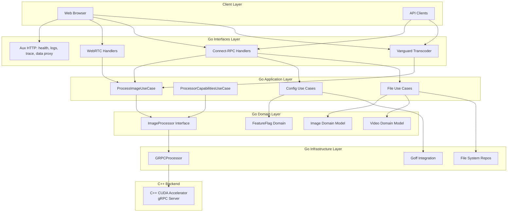

### Directory Structure

```
webserver/
├── cmd/server/          # Main entry point (main.go)
├── pkg/
│   ├── application/     # Use cases (business logic)
│   │   ├── process_image_use_case.go
│   │   ├── processor_capabilities_use_case.go
│   │   ├── evaluate_feature_flag_use_case.go
│   │   ├── get_system_info_use_case.go
│   │   ├── list_available_images_use_case.go
│   │   ├── upload_image_use_case.go
│   │   ├── list_videos_use_case.go
│   │   ├── upload_video_use_case.go
│   │   ├── stream_video_use_case.go
│   │   ├── video_playback_use_case.go
│   │   └── list_inputs_use_case.go
│   ├── domain/          # Domain models and interfaces
│   │   ├── image.go
│   │   ├── processor.go
│   │   ├── video.go
│   │   ├── video_player.go
│   │   ├── feature_flag.go
│   │   ├── system_info.go
│   │   ├── device_status.go
│   │   ├── processing_options.go
│   │   └── interfaces/
│   ├── infrastructure/  # External integrations
│   │   ├── processor/   # C++/CUDA integration
│   │   │   ├── grpc_processor.go
│   │   │   ├── grpc_client.go
│   │   │   └── grpc_repository.go
│   │   ├── featureflags/# Goff integration (YAML-based)
│   │   ├── filesystem/  # File repositories
│   │   ├── video/       # Video repositories
│   │   ├── webrtc/      # WebRTC peer management
│   │   ├── mqtt/        # MQTT device monitoring
│   │   ├── http/        # HTTP utilities
│   │   ├── image/       # Image codec
│   │   ├── logger/      # Structured logging
│   │   ├── config/      # Config repository
│   │   ├── version/     # Version info
│   │   └── build/       # Build info
│   ├── interfaces/      # HTTP/Connect-RPC handlers
│   │   ├── connectrpc/  # Connect-RPC handlers
│   │   │   ├── handler.go
│   │   │   ├── config_handler.go
│   │   │   ├── file_handler.go
│   │   │   ├── webrtc_handler.go
│   │   │   ├── remote_management_handler.go
│   │   │   └── vanguard.go
│   │   ├── http/        # HTTP handlers
│   │   │   ├── health_handler.go
│   │   │   ├── logs_proxy.go
│   │   │   └── trace_proxy.go
│   │   └── adapters/   # Protocol adapters
│   ├── config/          # Configuration management
│   ├── container/       # Dependency injection
│   ├── app/             # Application setup
│   └── telemetry/       # OpenTelemetry integration
```

Frontend source: `../front-end/` (Vite in development, embedded static assets in production).

## Key Components

### Interfaces Layer

**Connect-RPC Handlers** (`pkg/interfaces/connectrpc/`):
- `handler.go`: Main image processor handler implementing Connect-RPC service interface
- `config_handler.go`: Configuration and system info handler
- `file_handler.go`: File upload and listing handler
- `webrtc_handler.go`: WebRTC signaling handler
- `remote_management_handler.go`: Remote device management (Jetson Nano)
- `vanguard.go`: REST API transcoder using Vanguard for google.api.http annotations

**HTTP Handlers** (`pkg/interfaces/http/`):
- `health_handler.go`: Health check endpoints
- `logs_proxy.go`: Loki logs proxy
- `trace_proxy.go`: Jaeger trace proxy

Static `/data/` assets are served by the Go server in both development and production.

### Application Layer

**Use Cases** (`pkg/application/`):
- `ProcessImageUseCase`: Orchestrates image processing business logic
- `ProcessorCapabilitiesUseCase`: Queries available filters and accelerators
- `EvaluateFeatureFlagUseCase`: Evaluates feature flags from Goff YAML configuration
- `GetSystemInfoUseCase`: Retrieves system information and build details
- `ListAvailableImagesUseCase`: Lists available static images
- `UploadImageUseCase`: Handles image uploads
- `ListVideosUseCase` / `UploadVideoUseCase`: Video management
- `StreamVideoUseCase`: Streams video frames via WebRTC for real-time processing
- `VideoPlaybackUseCase`: Manages video playback sessions
- `ListInputsUseCase`: Lists available input sources

All use cases follow the same pattern: they receive domain models, orchestrate business logic, and return domain models or errors.

### Domain Layer

**Domain Models** (`pkg/domain/`):
- `Image`: Core image domain model with data, dimensions, format
- `Processor`: ImageProcessor interface defining processing contract
- `Video`: Video domain model and repository interface
- `VideoPlayer`: Video player interface for playback management
- `FeatureFlag`: Feature flag domain model
- `SystemInfo`: System information and build details
- `DeviceStatus`: Device monitoring status
- `ProcessingOptions`: Image/video processing configuration options

**Repository Interfaces** (`pkg/domain/interfaces/`):
- Define contracts for data access without implementation details
- Enable dependency inversion (domain depends on abstractions, not implementations)

### Infrastructure Layer

**Processor Integration** (`pkg/infrastructure/processor/`):
- `GRPCProcessor`: Integrates with C++ library via gRPC
- `grpc_client.go`: gRPC client implementation for remote processing
- Implements `domain.ImageProcessor` interface

**Feature Flags** (`pkg/infrastructure/featureflags/`):
- Goff client integration for feature flag management (YAML-based)
- Repository pattern for feature flag evaluation
- Local YAML file configuration (not Flipt server)

**File System** (`pkg/infrastructure/filesystem/`):
- Static image repository implementation
- File-based storage for uploaded images

**Video** (`pkg/infrastructure/video/`):
- Video repository implementation
- FFmpeg integration for video processing
- Preview generation for video files

### Dependency Injection

**Container** (`pkg/container/`):
- Centralized dependency injection
- Creates and wires all components
- Manages lifecycle of use cases, repositories, and connectors

**App** (`pkg/app/`):
- Application setup and HTTP server configuration
- Registers all handlers and middleware
- Configures routing (Connect-RPC, REST via Vanguard, WebRTC signaling, static files)

## Features

- **CUDA Acceleration**: GPU-powered image processing via gRPC remote service
- **Connect-RPC**: Type-safe RPC with HTTP/JSON and gRPC support
- **Vanguard**: RESTful API transcoding using google.api.http annotations
- **Protocol Buffers**: Multiple proto services (config_service, file_service, image_processor_service, webrtc_signal)
- **Hot Reload**: Frontend development with Vite, Go hot reload for templates
- **Clean Architecture**: Domain → Application → Infrastructure → Interfaces layers
- **WebRTC**: Real-time video/image streaming with WebRTC signaling
- **OpenTelemetry**: Distributed tracing integration

### Initialization Flow

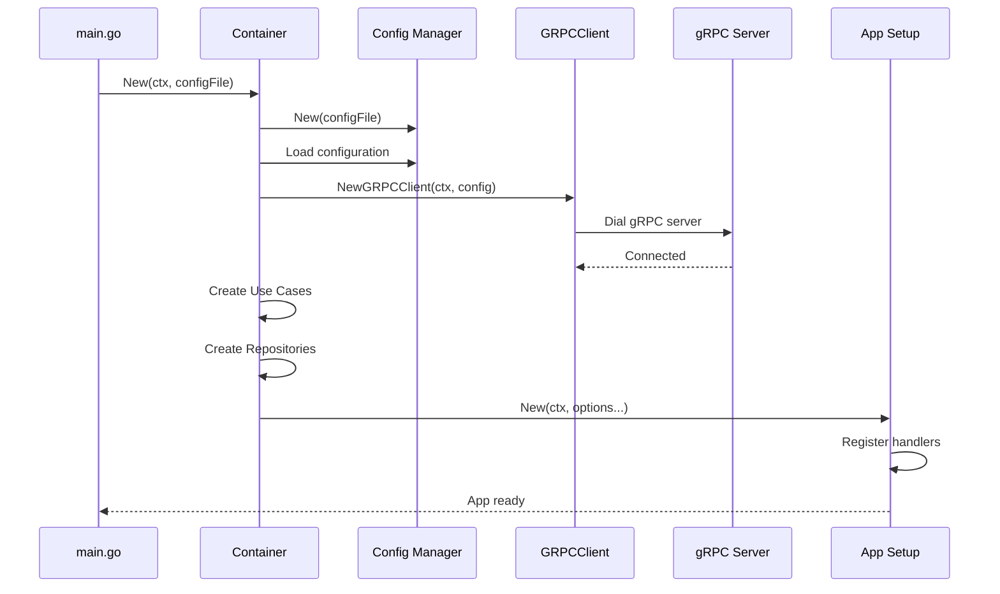

### Processing Flows

#### gRPC Processing Flow

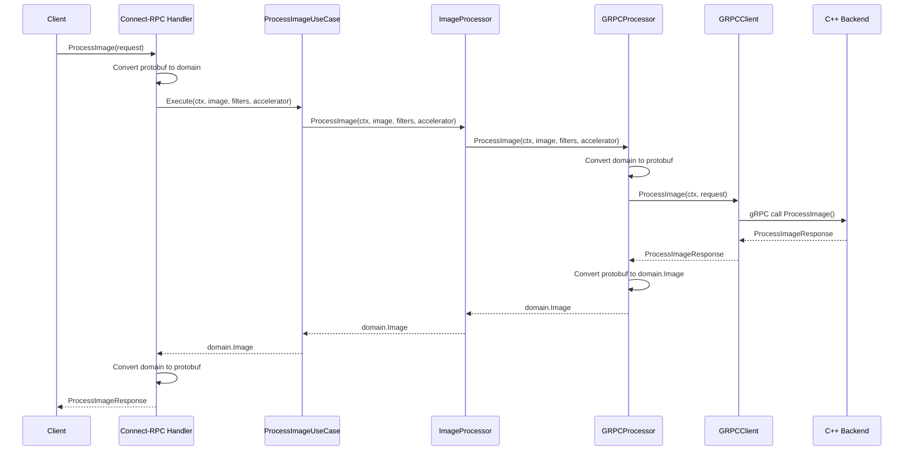

### Endpoint Sequence Diagrams

#### ListFilters

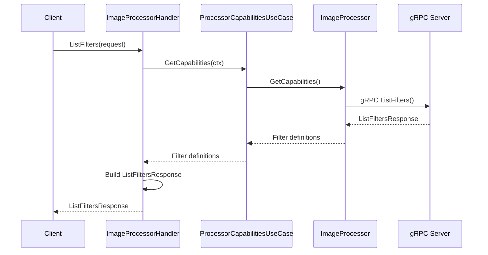

#### GetStreamConfig

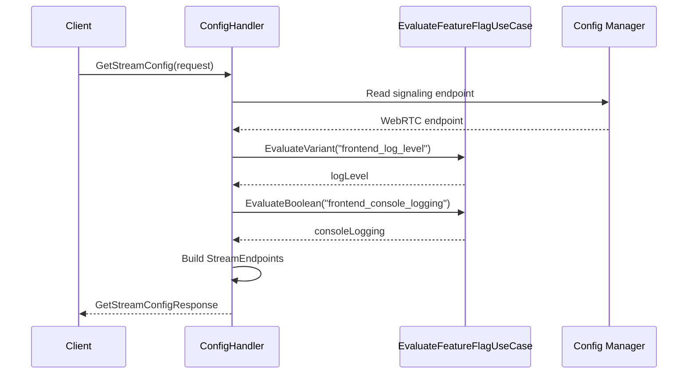

#### EvaluateFeatureFlag

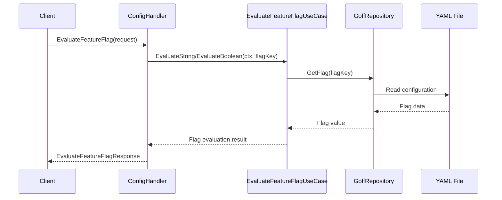

#### GetSystemInfo

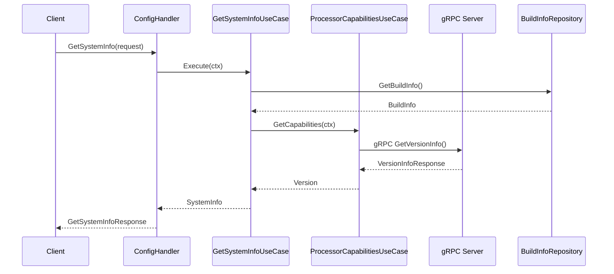

#### ListAvailableImages

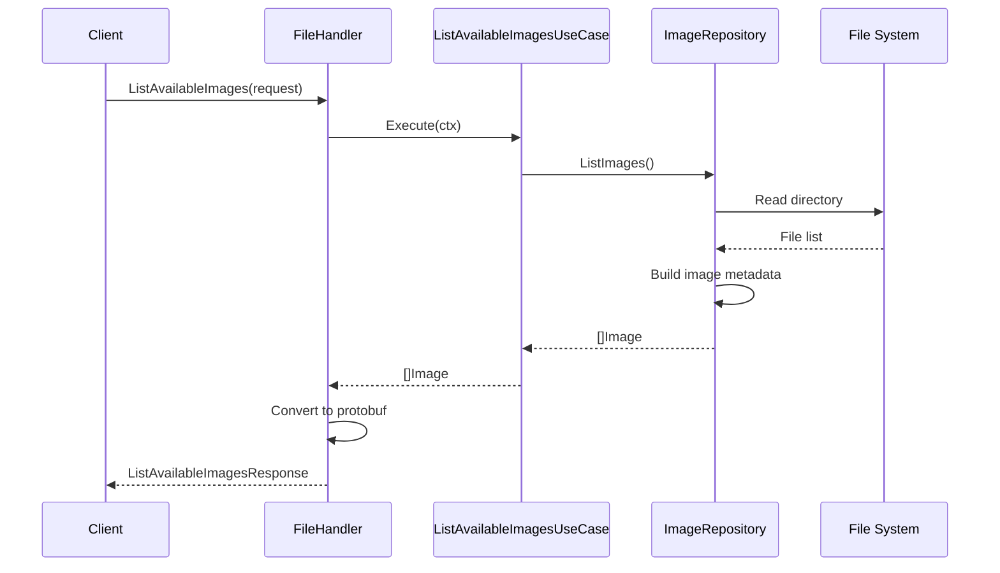

#### UploadImage

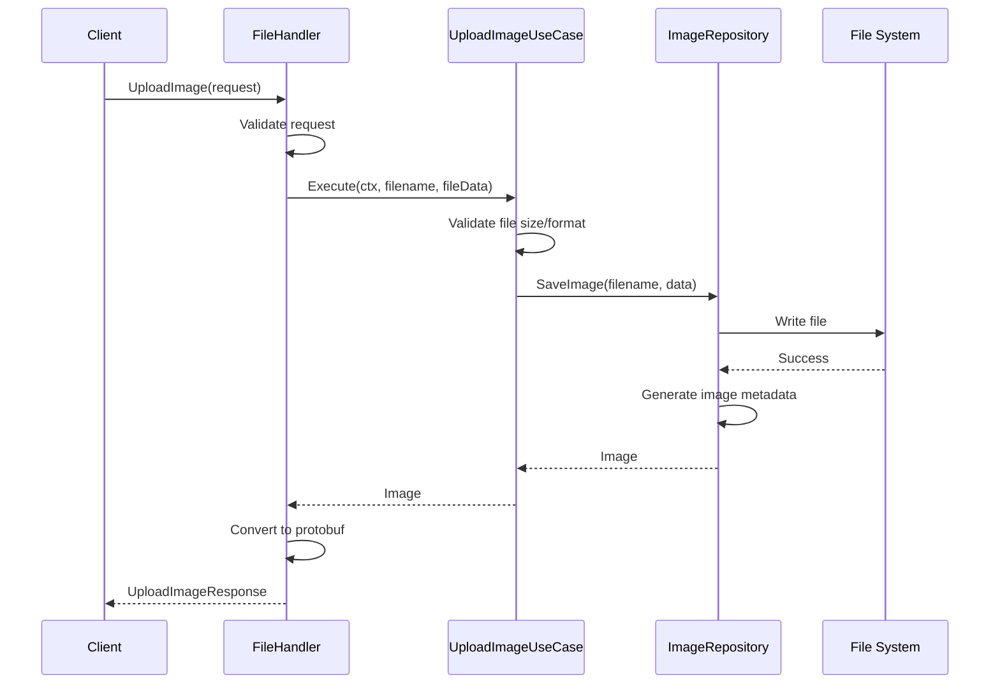

#### ListVideos

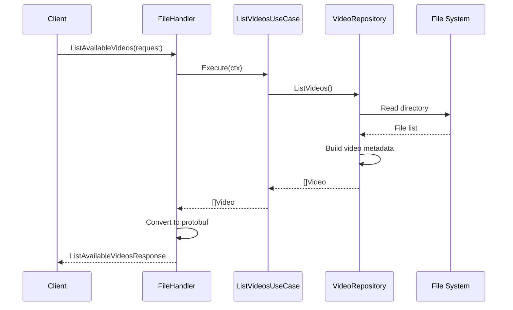

#### UploadVideo

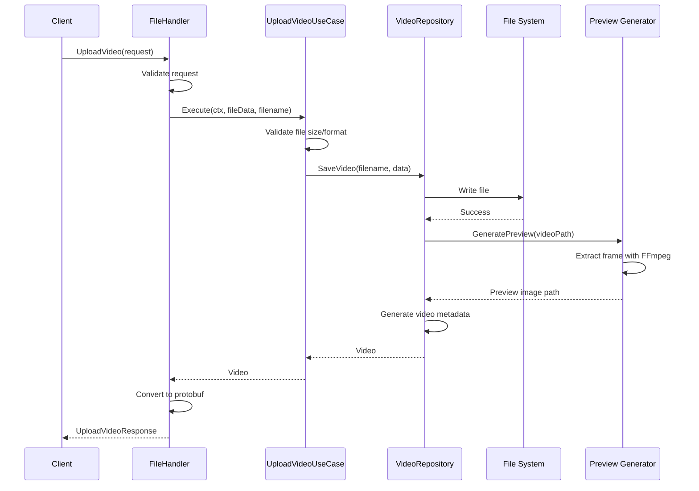

## Protocol Buffers

The project uses multiple proto service definitions:

- `proto/config_service.proto` - Configuration and system info (with REST annotations)
- `proto/file_service.proto` - File upload and listing (with REST annotations)
- `proto/image_processor_service.proto` - Image processing operations (with REST annotations)
- `proto/webrtc_signal.proto` - WebRTC signaling service
- `proto/remote_management_service.proto` - Remote device management
- `proto/common.proto` - Shared message types

All services include `google.api.http` annotations for RESTful routing via Vanguard transcoder.

Generate code:
```bash
./scripts/build/protos.sh
# Or manually:
docker run --rm -v $(pwd):/workspace -u $(id -u):$(id -g) cuda-learning-bufgen:latest generate
```

## Frontend

The frontend uses:
- **Lit Web Components** - Native web components
- **TypeScript** - Type-safe JavaScript
- **Vite** - Build tool and dev server
- **Vitest** - Unit testing
- **Playwright** - E2E testing

**Development:**
```bash
cd ../front-end
npm install
npm run dev  # Vite dev server (full stack: ../scripts/dev/start.sh)
```

**Production:**
In production, the frontend is built with Vite and embedded as static assets in the Go binary. No separate Nginx server is needed.

```bash
cd ../front-end && npm run build
```

## See Also

- [Main README](../README.md) - Project overview and setup
- [Testing Documentation](../docs/testing-and-coverage.md) - Test execution guide
