# CUDA Image Processor - Web Server

GPU-accelerated image processing web application using CUDA, Go, C++, and Protocol Buffers.

## Development Mode

For local development with hot reload:

### Quick Start

From project root:
```bash
./scripts/dev/start.sh --build  # First time or after code changes
./scripts/dev/start.sh           # Subsequent runs
```

This will:
1. Build the server and frontend
2. Start services (Flipt, Jaeger, etc.)
3. Enable hot reload for frontend (Vite dev server)
4. Start the Go server with hot reload support

**Access:** https://localhost:8443

### Manual Build

Build the Go server:
```bash
cd webserver
make build
```

Or from project root:
```bash
cd webserver && make build
```

Run the server:
```bash
cd webserver
make run
```

Or with config file:
```bash
./bin/server -config=config/config.yaml
```

### Development Mode

Run server with hot reload:
```bash
cd webserver
make dev
```

## Production Mode

For production (embedded files, single binary):

```bash
cd webserver
make build
./bin/server -config=config/config.production.yaml
```

The frontend is built with Vite and embedded as static assets. Templates and static files are served from the binary.

## Architecture

The web server implements Clean Architecture with clear separation of concerns across four main layers: Interfaces, Application, Domain, and Infrastructure.

### Component Overview

The web server follows Clean Architecture principles with clear separation between interfaces, application logic, domain models, and infrastructure. It integrates with the C++ CUDA accelerator library via gRPC.

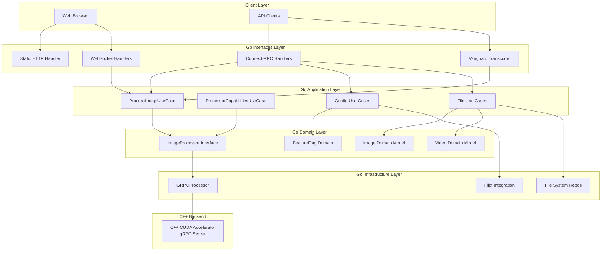

### Directory Structure

```
webserver/
├── cmd/server/          # Main entry point (main.go)
├── pkg/
│   ├── application/     # Use cases (business logic)
│   │   ├── process_image_use_case.go
│   │   ├── processor_capabilities_use_case.go
│   │   ├── get_stream_config_use_case.go
│   │   ├── sync_feature_flags_use_case.go
│   │   ├── list_available_images_use_case.go
│   │   └── upload_image_use_case.go
│   ├── domain/          # Domain models and interfaces
│   │   ├── image.go
│   │   ├── processor.go
│   │   ├── video.go
│   │   ├── feature_flag.go
│   │   └── interfaces/
│   ├── infrastructure/  # External integrations
│   │   ├── processor/   # C++/CUDA integration
│   │   │   ├── grpc_processor.go
│   │   │   └── grpc_client.go
│   │   ├── featureflags/# Flipt integration
│   │   ├── filesystem/  # File repositories
│   │   ├── video/       # Video repositories
│   │   └── build/       # Build info repository
│   ├── interfaces/      # HTTP/WebSocket/Connect-RPC handlers
│   │   ├── connectrpc/  # Connect-RPC handlers
│   │   ├── websocket/   # WebSocket handlers
│   │   ├── statichttp/  # Static file serving
│   │   └── adapters/   # Protocol adapters
│   ├── config/          # Configuration management
│   ├── container/       # Dependency injection
│   ├── app/             # Application setup
│   └── telemetry/       # OpenTelemetry integration
└── web/
    ├── src/             # TypeScript source (Lit Web Components)
    ├── templates/       # HTML templates
    └── static/          # Static assets (CSS, images)
```

## Key Components

### Interfaces Layer

**Connect-RPC Handlers** (`pkg/interfaces/connectrpc/`):
- `handler.go`: Main image processor handler implementing Connect-RPC service interface
- `config_handler.go`: Configuration and system info handler
- `file_handler.go`: File upload and listing handler
- `vanguard.go`: REST API transcoder using Vanguard for google.api.http annotations

**WebSocket Handler** (`pkg/interfaces/websocket/`):
- Real-time bidirectional communication for video/image processing
- Session management for multiple concurrent connections
- Streams processing results back to clients

**Static HTTP Handler** (`pkg/interfaces/statichttp/`):
- Serves frontend SPA (Single Page Application)
- Handles development mode (Vite proxy) and production mode (embedded assets)
- Template rendering and static asset serving

### Application Layer

**Use Cases** (`pkg/application/`):
- `ProcessImageUseCase`: Orchestrates image processing business logic
- `ProcessorCapabilitiesUseCase`: Queries available filters and accelerators
- `GetStreamConfigUseCase`: Retrieves streaming configuration
- `SyncFeatureFlagsUseCase`: Synchronizes feature flags from Flipt
- `ListAvailableImagesUseCase`: Lists available static images
- `UploadImageUseCase`: Handles image uploads
- `ListVideosUseCase` / `UploadVideoUseCase`: Video management

All use cases follow the same pattern: they receive domain models, orchestrate business logic, and return domain models or errors.

### Domain Layer

**Domain Models** (`pkg/domain/`):
- `Image`: Core image domain model with data, dimensions, format
- `Processor`: ImageProcessor interface defining processing contract
- `Video`: Video domain model and repository interface
- `FeatureFlag`: Feature flag domain model

**Repository Interfaces** (`pkg/domain/interfaces/`):
- Define contracts for data access without implementation details
- Enable dependency inversion (domain depends on abstractions, not implementations)

### Infrastructure Layer

**Processor Integration** (`pkg/infrastructure/processor/`):
- `GRPCProcessor`: Integrates with C++ library via gRPC
- `grpc_client.go`: gRPC client implementation for remote processing
- Implements `domain.ImageProcessor` interface

**Feature Flags** (`pkg/infrastructure/featureflags/`):
- Flipt client integration for feature flag management
- Repository pattern for feature flag persistence
- HTTP API client for Flipt server communication

**File System** (`pkg/infrastructure/filesystem/`):
- Static image repository implementation
- File-based storage for uploaded images

**Video** (`pkg/infrastructure/video/`):
- Video repository implementation
- FFmpeg integration for video processing
- Preview generation for video files

### Dependency Injection

**Container** (`pkg/container/`):
- Centralized dependency injection
- Creates and wires all components
- Manages lifecycle of use cases, repositories, and connectors

**App** (`pkg/app/`):
- Application setup and HTTP server configuration
- Registers all handlers and middleware
- Configures routing (Connect-RPC, REST via Vanguard, WebSocket, static files)

## Features

- **CUDA Acceleration**: GPU-powered image processing via gRPC remote service
- **Connect-RPC**: Type-safe RPC with HTTP/JSON and gRPC support
- **Vanguard**: RESTful API transcoding using google.api.http annotations
- **Protocol Buffers**: Multiple proto services (config_service, file_service, image_processor_service)
- **Hot Reload**: Frontend development with Vite, Go hot reload for templates
- **Clean Architecture**: Domain → Application → Infrastructure → Interfaces layers
- **WebSocket**: Real-time video/image processing
- **OpenTelemetry**: Distributed tracing integration

### Initialization Flow

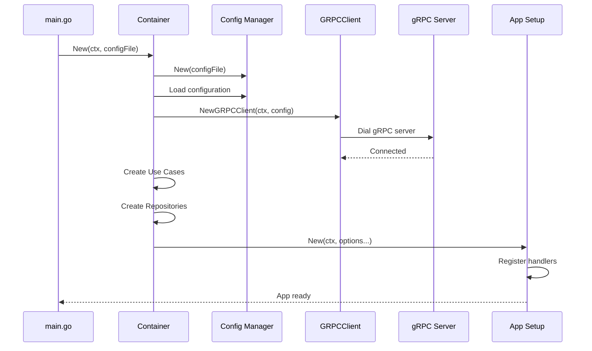

### Processing Flows

#### gRPC Processing Flow

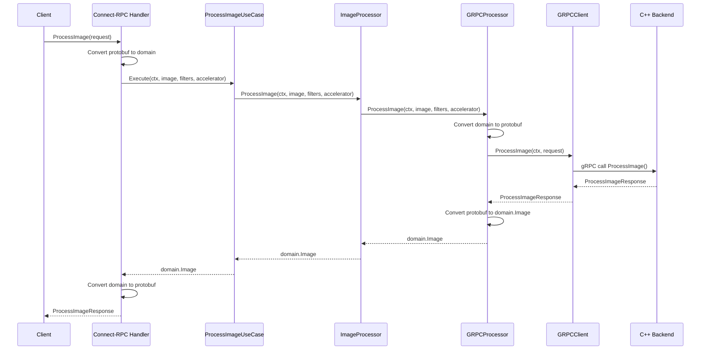

### Endpoint Sequence Diagrams

#### ListFilters

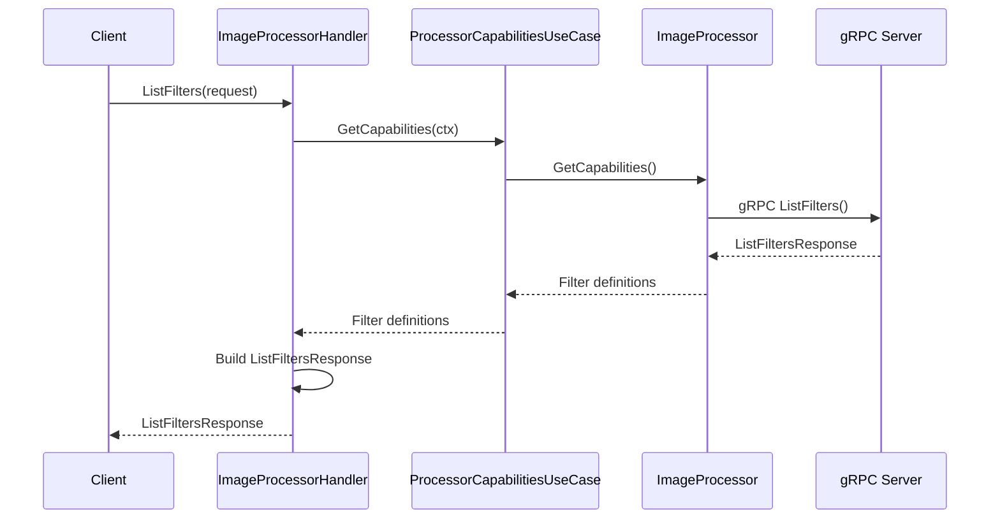

#### GetStreamConfig

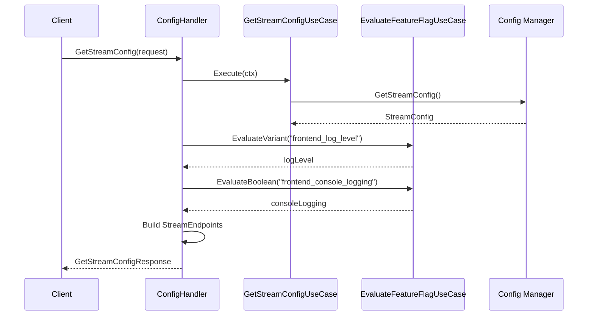

#### SyncFeatureFlags

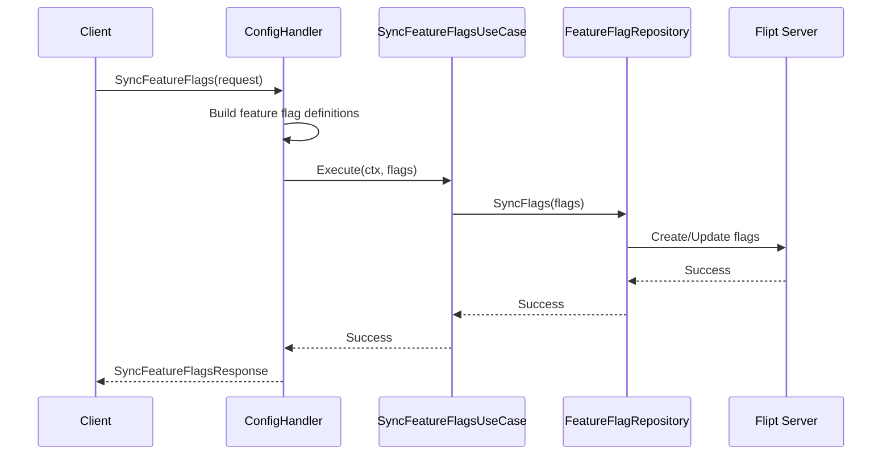

#### GetSystemInfo

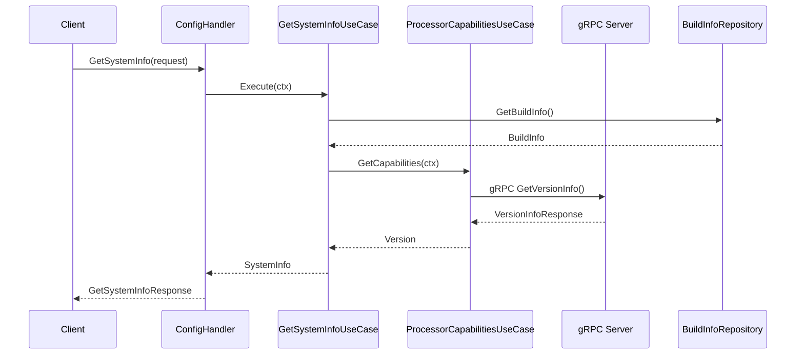

#### ListAvailableImages

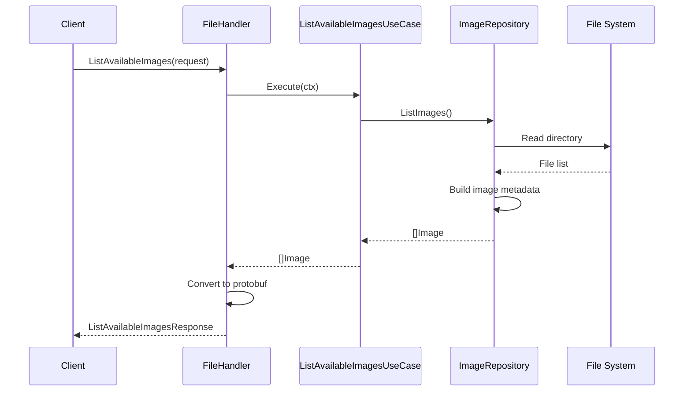

#### UploadImage

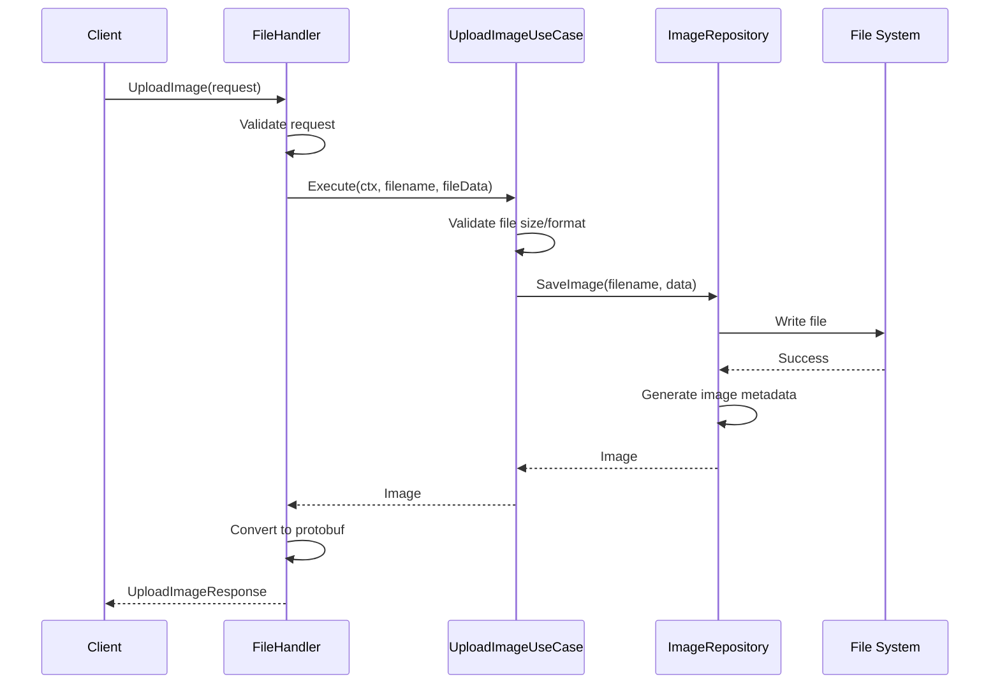

#### ListVideos

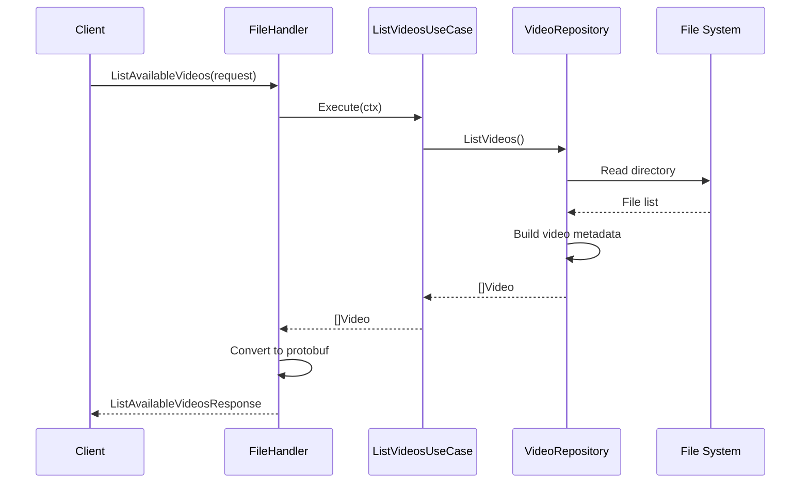

#### UploadVideo

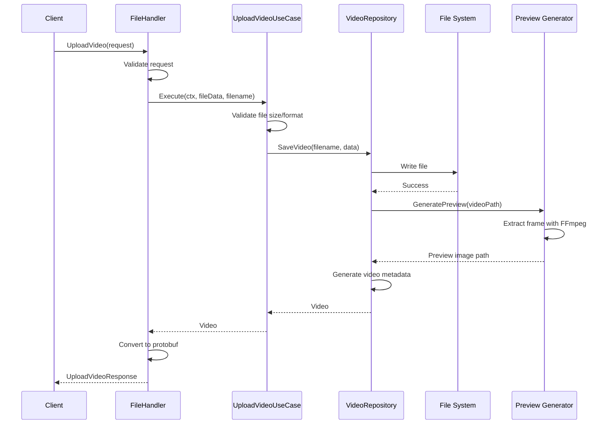

## Protocol Buffers

The project uses multiple proto service definitions:

- `proto/config_service.proto` - Configuration and system info (with REST annotations)
- `proto/file_service.proto` - File upload and listing (with REST annotations)
- `proto/image_processor_service.proto` - Image processing operations (with REST annotations)
- `proto/common.proto` - Shared message types

All services include `google.api.http` annotations for RESTful routing via Vanguard transcoder.

Generate code:
```bash
./scripts/build/protos.sh
# Or manually:
docker run --rm -v $(pwd):/workspace -u $(id -u):$(id -g) cuda-learning-bufgen:latest generate
```

## Frontend

The frontend uses:
- **Lit Web Components** - Native web components
- **TypeScript** - Type-safe JavaScript
- **Vite** - Build tool and dev server
- **Vitest** - Unit testing
- **Playwright** - E2E testing

**Development:**
```bash
cd webserver/web
npm install
npm run dev  # Vite dev server
```

**Build:**
```bash
npm run build
```

## See Also

- [Main README](../README.md) - Project overview and setup
- [Testing Documentation](../docs/testing-and-coverage.md) - Test execution guide
