# CUDA Image Processor - Frontend

TypeScript frontend application built with Lit Web Components, implementing Clean Architecture principles for maintainable and testable code.

## Overview

The frontend is a single-page application (SPA) that provides real-time image and video processing through a web interface. It communicates with the Go backend via WebSocket, Connect-RPC (gRPC-Web), and supports future WebRTC integration for low-latency frame streaming.

**Key Features:**
- Real-time webcam processing with GPU/CPU filter selection
- Static image and video file upload and processing
- Dynamic filter discovery from backend capabilities
- Drag-and-drop filter reordering
- Real-time performance metrics (FPS, processing time)
- Feature flag integration for gradual rollouts
- Comprehensive observability with OpenTelemetry

## Architecture

The frontend follows Clean Architecture principles with clear separation between domain interfaces, application services, infrastructure implementations, and UI components.

```mermaid
graph TB
    subgraph "UI Components Layer"
        AppRoot[app-root]
        FilterPanel[filter-panel]
        VideoGrid[video-grid]
        CameraPreview[camera-preview]
        StatsPanel[stats-panel]
        SourceDrawer[source-drawer]
        ToolsDropdown[tools-dropdown]
    end
    
    subgraph "Application Services Layer"
        ConfigService[ConfigService]
        ProcessorCaps[ProcessorCapabilitiesService]
        UIService[UIService]
    end
    
    subgraph "Infrastructure Layer"
        subgraph "Transport"
            FrameTransport[FrameTransportService]
            WSTransport[WebSocketFrameTransport]
            GRPCTransport[GRPCFrameTransport]
            WebRTCTransport[WebRTCFrameTransport]
        end
        
        subgraph "Data Services"
            VideoService[VideoService]
            FileService[FileService]
            InputSourceService[InputSourceService]
        end
        
        subgraph "External Services"
            FeatureFlags[FeatureFlagsService]
            SystemInfo[SystemInfoService]
            ToolsService[ToolsService]
        end
        
        subgraph "Observability"
            TelemetryService[TelemetryService]
            Logger[Logger]
        end
    end
    
    subgraph "Domain Layer"
        Interfaces[Domain Interfaces]
        ValueObjects[Value Objects]
    end
    
    subgraph "Backend"
        GoServer[Go Web Server]
        GRPCServer[gRPC Server]
    end
    
    AppRoot --> FilterPanel
    AppRoot --> VideoGrid
    AppRoot --> CameraPreview
    AppRoot --> StatsPanel
    AppRoot --> SourceDrawer
    
    FilterPanel --> ProcessorCaps
    CameraPreview --> FrameTransport
    VideoGrid --> VideoService
    
    ProcessorCaps --> GRPCServer
    FrameTransport --> WSTransport
    FrameTransport --> GRPCTransport
    FrameTransport --> WebRTCTransport
    
    WSTransport --> GoServer
    GRPCTransport --> GRPCServer
    WebRTCTransport --> GRPCServer
    
    VideoService --> GoServer
    FileService --> GoServer
    InputSourceService --> GoServer
    
    ConfigService --> GoServer
    FeatureFlags --> GoServer
    SystemInfo --> GoServer
    ToolsService --> GoServer
    
    UIService --> FrameTransport
    UIService --> ProcessorCaps
    
    ConfigService --> Interfaces
    ProcessorCaps --> Interfaces
    FrameTransport --> Interfaces
    VideoService --> Interfaces
    FileService --> Interfaces
    
    TelemetryService --> Logger
    Logger --> GoServer
```



## Component Structure

### Core Application Components

**`app-root`** (`components/app/app-root.ts`):
- Main application container component
- Manages global state and component lifecycle
- Coordinates between UI components and services
- Handles application initialization

**`filter-panel`** (`components/app/filter-panel.ts`):
- Displays available filters from backend capabilities
- Allows drag-and-drop filter reordering
- Provides parameter controls (select, range, number, checkbox, text)
- Updates filter configuration in real-time

**`video-grid`** (`components/video/video-grid.ts`):
- Displays video sources in a grid layout
- Handles video selection and playback
- Manages video source cards

**`camera-preview`** (`components/video/camera-preview.ts`):
- Captures frames from webcam using MediaDevices API
- Sends frames to backend via transport layer
- Displays processed frames in real-time
- Shows connection status and performance metrics

**`stats-panel`** (`components/app/stats-panel.ts`):
- Displays real-time processing statistics
- Shows FPS, processing time, frame count
- Toggleable visibility with state persistence

**`source-drawer`** (`components/app/source-drawer.ts`):
- Side drawer for selecting input sources
- Tabs for Images and Videos
- Integrates with ImageSelectorModal and VideoSelector

### Supporting Components

**`toast-container`** (`components/app/toast-container.ts`):
- Global toast notification system
- Success, error, warning, and info messages
- Auto-dismiss with configurable duration

**`app-tour`** (`components/app/app-tour.ts`):
- Guided tour for first-time users
- Highlights key features and UI elements
- Uses Shepherd.js for tour management

**`connection-status-card`** (`components/app/connection-status-card.ts`):
- Displays current connection status
- Shows transport type (WebSocket, gRPC, WebRTC)
- Connection quality indicators

**`tools-dropdown`** (`components/ui/tools-dropdown.ts`):
- Dynamic tools menu based on configuration
- Links to observability tools (Jaeger, Grafana)
- Feature flag management (Flipt)
- Test reports and coverage

## Service Architecture

### Application Services (`application/services/`)

**`config-service.ts`**:
- Manages stream configuration from backend
- Handles log level and console logging settings
- Provides configuration to other services

**`processor-capabilities-service.ts`**:
- Fetches available filters and their parameters
- Maps generic filter definitions to UI types
- Notifies listeners when capabilities change
- Caches filter definitions for performance

**`ui-service.ts`**:
- Coordinates UI interactions
- Manages stats, camera, and filter state
- Bridges components and transport layer

### Infrastructure Services

#### Transport Layer (`infrastructure/transport/`)

**`frame-transport-service.ts`**:
- Main transport abstraction implementing `IFrameTransportService`
- Selects appropriate transport based on feature flags
- Aggregates WebSocket, gRPC, and WebRTC transports
- Provides unified interface for frame transmission

**`websocket-frame-transport.ts`**:
- WebSocket implementation for frame transmission
- Real-time bidirectional communication
- Handles connection lifecycle and reconnection

**`grpc-frame-transport.ts`**:
- gRPC bidirectional streaming for frame transmission
- Uses Connect-RPC for browser compatibility
- Lower latency than WebSocket for high-throughput scenarios

**`webrtc-frame-transport.ts`**:
- WebRTC implementation (stub, not yet implemented)
- Planned for peer-to-peer low-latency streaming
- Will enable direct browser-to-gRPC server communication

#### Data Services (`infrastructure/data/`)

**`video-service.ts`**:
- Video file management (list, upload)
- Video metadata handling
- Preview image generation

**`file-service.ts`**:
- Static image file management
- Image upload and listing
- File validation

**`input-source-service.ts`**:
- Manages available input sources
- Coordinates between images, videos, and webcam
- Source selection and switching

#### External Services (`infrastructure/external/`)

**`feature-flags-service.ts`**:
- Fetches and caches feature flags from Flipt
- Evaluates boolean and variant flags
- Supports gradual rollouts

**`system-info-service.ts`**:
- Retrieves system information from backend
- Version information and build details
- Backend capabilities

**`tools-service.ts`**:
- Dynamic tools configuration
- Observability tool links
- Test report access

#### Observability (`infrastructure/observability/`)

**`telemetry-service.ts`**:
- OpenTelemetry integration
- Distributed tracing support
- Span creation and management

**`otel-logger.ts`**:
- Structured logging with OpenTelemetry
- Log level management
- Console and remote logging

## Domain Layer

### Interfaces (`domain/interfaces/`)

Domain interfaces define contracts without implementation details:

- **`IFrameTransportService`**: Frame transmission abstraction
- **`IConfigService`**: Configuration management
- **`IProcessorCapabilitiesService`**: Filter capabilities
- **`IVideoService`**: Video operations
- **`IFileService`**: File operations
- **`IInputSourceService`**: Input source management
- **`ITelemetryService`**: Observability
- **`ILogger`**: Logging interface

### Value Objects (`domain/value-objects/`)

Type-safe domain models:

- **`ImageData`**: Image data with dimensions and format
- **`FilterData`**: Filter configuration and parameters
- **`AcceleratorConfig`**: GPU/CPU accelerator selection
- **`GrayscaleAlgorithm`**: Grayscale algorithm types
- **`ConnectionStatus`**: Connection state and metadata
- **`WebRTCSession`**: WebRTC session information

## Dependency Injection

**`application/di/Container.ts`**:
- Centralized dependency injection container
- Singleton pattern for service instances
- Factory methods for component-specific services
- Provides type-safe service access

**Service Resolution:**
- Application services: Singleton instances
- Transport services: Factory methods with component dependencies
- Infrastructure services: Singleton instances with lazy initialization

## Transport Selection

The `FrameTransportService` selects the appropriate transport based on feature flags:

1. **WebSocket** (default): Traditional bidirectional communication
2. **gRPC**: Bidirectional streaming via Connect-RPC (default and only method)
3. **WebRTC** (future): Peer-to-peer low-latency streaming

The selection is transparent to components—they use the unified `IFrameTransportService` interface.

## Development

### Quick Start

From project root:
```bash
./scripts/dev/start.sh --build  # First time or after code changes
./scripts/dev/start.sh           # Subsequent runs (hot reload)
```

**Access:** https://localhost:8443

### Manual Development

```bash
cd webserver/web
npm install
npm run dev  # Vite dev server with hot reload
```

### Build

```bash
npm run build  # Production build
```

The build output is embedded in the Go server binary as static assets.

## Testing

### Unit Tests

```bash
npm run test  # Vitest unit tests
npm run test:watch  # Watch mode
```

### E2E Tests

```bash
npm run test:e2e  # Playwright E2E tests
npm run test:e2e:ui  # Playwright UI mode
```

### Test Coverage

```bash
npm run test:coverage  # Generate coverage report
```

## Tech Stack

- **LitElement**: Native web components framework
- **TypeScript**: Type-safe JavaScript
- **Vite**: Build tool and dev server
- **Vitest**: Unit testing framework
- **Playwright**: E2E testing
- **Connect-RPC**: gRPC-Web client library
- **OpenTelemetry**: Distributed tracing
- **Shepherd.js**: Guided tour library

## Directory Structure

```
webserver/web/
├── src/
│   ├── components/          # LitElement components
│   │   ├── app/            # Core application components
│   │   ├── video/          # Video-related components
│   │   ├── image/          # Image-related components
│   │   ├── flags/          # Feature flag components
│   │   └── ui/             # UI utility components
│   ├── application/         # Application layer
│   │   ├── services/       # Application services
│   │   └── di/            # Dependency injection
│   ├── infrastructure/      # Infrastructure layer
│   │   ├── transport/      # Frame transport implementations
│   │   ├── data/           # Data services
│   │   ├── external/       # External service integrations
│   │   ├── connection/     # Connection management
│   │   └── observability/  # Telemetry and logging
│   ├── domain/              # Domain layer
│   │   ├── interfaces/     # Domain interfaces
│   │   └── value-objects/ # Value objects
│   └── main.ts             # Application entry point
├── tests/
│   ├── e2e/                # E2E tests (Playwright)
│   └── unit/               # Unit tests (Vitest)
├── static/                 # Static assets (CSS, images)
├── templates/              # HTML templates
└── package.json
```

## Design Principles

1. **Clean Architecture**: Clear separation between domain, application, and infrastructure
2. **Dependency Inversion**: Components depend on interfaces, not implementations
3. **Single Responsibility**: Each component and service has one clear purpose
4. **Interface Segregation**: Small, focused interfaces
5. **Composition over Inheritance**: Services aggregate functionality
6. **Type Safety**: TypeScript for compile-time error detection

## See Also

- [Main README](../../README.md) - Project overview
- [Web Server README](../README.md) - Backend architecture
- [Testing Documentation](../../docs/testing-and-coverage.md) - Test execution guide
